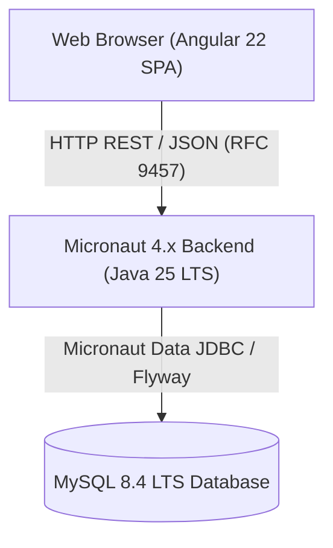

# AI Agent & Technical Developer Guidelines (Bulletin Board Application)

Evaluation and playground project for the `swe-workflow` plugin, demonstrating Spec-Driven Development (SDD) using Micronaut (Java 25 LTS), MySQL 8.4 LTS, and Angular 22 (Angular Material).

This document serves as the authoritative, self-contained single source of truth for technical architecture, execution protocols, testing commands, interface contracts, and development conventions for both AI agents and human engineers.

---

## 1. Documentation Architecture & Single-Source Policy

To maintain pristine documentation integrity and avoid drift across disparate documents, this repository strictly adheres to the following documentation architecture:

1. **Separation of Concerns**:
   - High-level project overviews, evaluation summaries, and human navigational entry points exist exclusively in designated human entry points.
   - All concrete technical specifications, prerequisites, run commands, testing procedures, component contracts, and architectural rules are consolidated inside this document.
2. **Single Source of Truth (DRY Principle)**:
   - Technical commands and contracts must never be duplicated across multiple markdown files. When operational steps or constraints evolve, update them exclusively in this document.
3. **Strict Unidirectional Reference Rule**:
   - Human entry points reference sections of this document via anchor links.
   - **This document must remain strictly self-contained and standalone**. This document never contains reverse references, links, or mentions pointing back to human entry points.
4. **Language Architecture**:
   - Technical standards, agent instructions, and codebase contracts are authored canonically in English. Human entry points provide separate native translations where applicable.

---

## 2. System Architecture & Component Inventory

### 2.1 Architecture Diagram



### 2.2 Technology Stack
- **Backend Service**:
  - Java 25 LTS (Amazon Corretto 25)
  - Micronaut Framework 4.10.x (Ahead-of-Time compilation, Netty runtime)
  - Micronaut Data JDBC & HikariCP
  - Flyway Database Migrations (MySQL dialect)
  - RFC 9457 Problem Details error handling
  - Gradle 9.x (Kotlin DSL)
- **Frontend SPA**:
  - Angular 22 (Standalone Component architecture, Signals)
  - Angular Material & CDK 22
  - Viewport-anchored persistent bottom submission form (`COMP-005`)
  - 50-item paginated feed with auto-scrolling viewport constraints (`COMP-004`)
  - Vitest test runner & Playwright E2E automation
- **Persistence Store**:
  - MySQL 8.4 LTS
  - Dedicated descending index on `created_at` (`idx_posts_created_at_desc`)

### 2.3 Component Inventory & Boundaries

| Component ID | Class / Module | Boundary | Description |
| :--- | :--- | :--- | :--- |
| **COMP-001** | `PostController` | Backend REST API | Exposes `GET /api/posts` and `POST /api/posts` with RFC 9457 error contracts. |
| **COMP-002** | `PostService` | Backend Domain Core | Business logic, input whitespace normalization, and entity mapping. |
| **COMP-003** | `PostRepository` | Backend Data Adapter | Micronaut Data JDBC persistence interface against MySQL 8.4. |
| **COMP-004** | `PostFeedComponent` | Frontend Feed View | Reverse-chronological card list, 50-item `MatPaginator`, and empty-feed placeholder. |
| **COMP-005** | `PostFormComponent` | Frontend Form View | Viewport-bottom fixed form with Reactive Forms validation and toast notification. |

---

## 3. Prerequisites & Environment Setup

- **Java**: OpenJDK / Amazon Corretto 25 LTS
- **Node.js**: Node.js 22.x+ and npm 10.9+
- **Docker**: Docker Engine / Colima for containerized MySQL 8.4
- **Browsers**: Chromium for Playwright E2E automation

---

## 4. Quick Start & Service Execution Guide

### Step 1: Start MySQL 8.4 Database Container
```bash
docker run -d \
  --name bulletin-board-mysql \
  -e MYSQL_ROOT_PASSWORD=rootpassword \
  -e MYSQL_DATABASE=bulletin_board \
  -e MYSQL_USER=bbuser \
  -e MYSQL_PASSWORD=bbpassword \
  -p 3306:3306 \
  mysql:8.4
```
Database credentials defaulted in backend configuration:
- Host: `localhost:3306`
- Database: `bulletin_board`
- User: `user` or `bbuser` (both configured with full permissions)
- Password: `password` or `bbpassword`

### Step 2: Run Micronaut Backend Service
Flyway automatically executes database migrations upon bootstrap (`V1__create_posts_table.sql`):
```bash
cd backend
./gradlew run
```
- REST API Base URL: `http://localhost:8080/api/posts`
- Application Entry Class: `com.example.bulletinboard.Application`

### Step 3: Run Angular Frontend SPA
```bash
cd frontend
npm start
```
- Web Application URL: `http://localhost:4200/`
- Development Server Reverse Proxy: `proxy.conf.json` automatically forwards `/api/*` to `http://localhost:8080`

---

## 5. Verification & Testing Protocol

All changes must pass automated verification suites cleanly across both backend and frontend layers before submission.

### 5.1 Backend Test Suite (JUnit 5 & Testcontainers)
Executes 65 unit and integration tests (including Testcontainers MySQL integration, repository queries, service logic, and RFC 9457 contract verifications):
```bash
cd backend
./gradlew test
```

### 5.2 Frontend Unit Test Suite (Vitest)
Executes 40 unit and component integration tests verifying form states, feed rendering, pagination triggers, and API client interactions:
```bash
cd frontend
npm test -- --watch=false
```

### 5.3 End-to-End (E2E) Test Suite (Playwright)
Executes browser-driven tests verifying live API integration, feed scrollability (`scrollHeight > clientHeight`), paginator non-occlusion, and post creation flows:
```bash
cd frontend
npm run e2e
```

### 5.4 Production Bundle Build
Verifies Ahead-of-Time compilation, CSS bundling, and production asset budget limits:
```bash
cd frontend
npm run build
```

---

## 6. Specifications & Contracts (Design by Contract)

All components must adhere strictly to the formal contracts defined in the specification documentation:
- Requirements Specification: [requirements.md](docs/specs/bulletin-board/requirements.md)
- Design & Contract Specification: [design.md](docs/specs/bulletin-board/design.md)
- Implementation Task Plan: [tasks.md](docs/specs/bulletin-board/tasks.md)

### 6.1 Data Model Constraints
- **`CreatePostRequest`**:
  - `name`: Required, 1–50 characters, non-whitespace pattern `^(?!\s*$).+`
  - `email`: Optional, max 254 characters, well-formed email format
  - `title`: Required, 1–100 characters, non-whitespace pattern `^(?!\s*$).+`
  - `message`: Required, 1–4,000 characters, non-whitespace pattern `^(?!\s*$).+`
- **`PostResponse`**:
  - `id`: Non-null int64
  - `name`, `title`, `message`: Non-null trimmed strings
  - `email`: Nullable string
  - `created_at`: Non-null ISO 8601 UTC timestamp format (e.g. `2026-09-11T12:00:00Z`)
- **`PagedPostResponse`**:
  - `items`: **Guaranteed non-null empty array `[]` when 0 records exist (never `null` or omitted)**
  - `page`: Zero-based integer index
  - `size`: Fixed default of 50 items
  - `total_items`: Non-null int64 total recorded posts count
  - `total_pages`: Non-null integer calculated page count

### 6.2 Error Handling Contract (RFC 9457)
All validation errors and unhandled exceptions must return HTTP Problem Details (`application/problem+json`):
```json
{
  "type": "https://example.com/errors/validation-failed",
  "title": "Validation Failed",
  "status": 400,
  "detail": "Input payload failed validation constraints.",
  "instance": "/api/posts",
  "invalid_params": [
    {
      "name": "name",
      "reason": "Name must not be blank"
    }
  ]
}
```

---

## 7. Coding & Linguistic Standards

- **English Consistency for Code & Tests**:
  - All source code comments, TSDoc, Javadoc, and test case descriptions (`describe`, `it`, `test`, `@DisplayName`) must be written strictly in **English**.
  - Assertion diagnostic messages in automated tests must be written in English.
  - End-user facing UI strings (e.g. form field labels, snackbar notifications, application header titles) remain in Japanese per application domain specifications.
- **Comment Discipline**:
  - Avoid restating the obvious code mechanics.
  - Detail the "Why" and non-obvious architectural rationale only.
  - Maintain comprehensive Javadoc/TSDoc on public interfaces and DTO records.
- **Defensive Layout Constraints**:
  - Custom Angular elements in Flexbox chains (`app-post-feed`) must define `flex: 1; min-height: 0;` to prevent unbounded height growth.
  - Fixed-position elements (bottom form) must pair with explicit parent padding (`padding-bottom: 220px`) to prevent control occlusion.

---

## 8. Version Control & Release Workflow

- **Branch Safety**:
  - Never commit directly to `main`. Always develop on dedicated task branches (`feat/...`, `fix/...`, `refactor/...`, `chore/...`).
- **Conventional Commits 1.0.0**:
  - Format: `{type}({scope}): {imperative subject}`
  - Allowed types: `feat`, `fix`, `chore`, `docs`, `style`, `refactor`, `perf`, `test`, `build`, `ci`.
  - Scopes: `backend`, `frontend`, `app`, `specs`, `e2e`.
- **Co-Author Attribution**:
  - Append model-specific trailer to commits: `Co-Authored-By: "Antigravity Gemini 3.8 Flash (High)" <gemini@google.com>`
- **Pull Request Protocol**:
  - Pull requests should be submitted in Draft state targeting `main` or intermediate feature branches for Stacked PR workflows.
