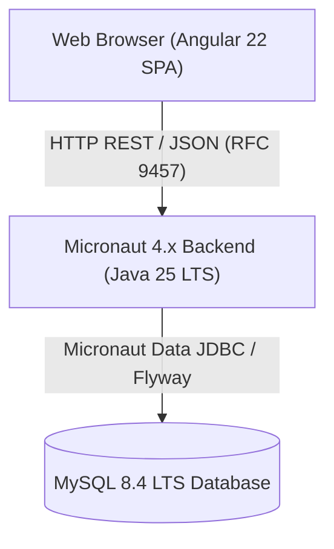

# swe-workflow-playground: 掲示板アプリケーション (Bulletin Board Application)

[](https://github.com/green-tea-stalk/swe-workflow-playground/releases)
[](https://github.com/green-tea-stalk/swe-workflow-playground/actions/workflows/ci.yml)
[](https://github.com/green-tea-stalk/swe-workflow-playground/actions/workflows/release-please.yml)
[](https://github.com/green-tea-stalk/swe-workflow-playground/network/updates)
[](LICENSE)

[](https://openjdk.org/projects/jdk/25/)
[](https://micronaut.io/)
[](https://angular.dev/)
[](https://www.mysql.com/)
[](https://www.docker.com/)

> [!NOTE]
> 🇺🇸 **English Documentation**: Please see the [English README (README.md)](README.md).

`swe-workflow` プラグインの検証用プロジェクトです。仕様駆動開発（Spec-Driven Development: SDD）に従い、Micronaut（Java 25 LTS）、MySQL 8.4 LTS、および Angular 22（Angular Material）で構築された掲示板アプリケーションを提供します。

---

## 目次

- [1. 概要 & アーキテクチャ](#1-概要--アーキテクチャ)
- [2. 主な特徴と機能](#2-主な特徴と機能)
- [3. リポジトリ構成](#3-リポジトリ構成)
- [4. クイックスタート](#4-クイックスタート)
- [5. 開発者ガイド & 技術リファレンス](#5-開発者ガイド--技術リファレンス)
- [6. 仕様ドキュメント](#6-仕様ドキュメント)

---

## 1. 概要 & アーキテクチャ

本プロジェクトは、自動化された仕様駆動開発ワークフローを検証するために構築されたフルスタック掲示板アプリケーションです。Angular 22 の Single Page Application（SPA）と Micronaut 4.x バックエンドが疎結合に設計されており、RFC 9457 Problem Details エラーハンドリングを備えた厳密な REST API 契約に基づいて通信します。



---

## 2. 主な特徴と機能

### 🌐 アプリケーション機能

- **モダンでレスポンシブな UI**: Angular 22 のスタンドアロンコンポーネントおよび Angular Material を採用し、デスクトップおよびモバイル環境に最適化。
- **画面下部固定の投稿フォーム**: ビューポート最下部に常駐し、リアルタイムバリデーションと即時フィードバックを提供。
- **ページネーション付きフィード表示**: スクロール制約（`scrollHeight > clientHeight`）を考慮した、1 ページあたり 50 件の降順フィード。
- **標準化されたエラー通知**: RFC 9457 Problem Details に準拠し、フォームフィールド上のインラインエラーやスナックバーによる明確なエラー通知を実現。
- **多言語対応 UI**: 英語（`/en/`）および日本語（`/ja/`）の Ahead-of-Time（AOT）ビルドを提供し、自動言語判別に対応。

### 🛠️ 設計 & アーキテクチャの特徴

- **仕様駆動開発 (SDD)**: 要件定義、詳細設計、タスク計画に基づく一貫したエンドツーエンド実装。
- **契約プログラミング (Design by Contract: DbC)**: リクエスト / レスポンスの DTO 検証と空コレクションの防御的ハンドリング（`null` 不許可）。
- **多層的な自動テストスイート**: JUnit 5、Vitest、Testcontainers による MySQL 結合テスト、Playwright による実ブラウザ E2E 自動テスト。
- **自動コードフォーマット & 品質管理**: Gradle Version Catalog（`libs.versions.toml`）による依存元の一元化、Spotless（Palantir Java Format 4 spaces、ktlint）、および Prettier によるスタイルゲート。

---

## 3. リポジトリ構成

```text
swe-workflow-playground/
├── backend/            # Micronaut 4.x バックエンドサービス (Java 25 LTS, Gradle)
│   ├── src/main/java/  # REST コントローラー、ドメインサービス、永続化エンティティ
│   └── src/test/java/  # JUnit 5 & Testcontainers MySQL 結合テスト
├── frontend/           # Angular 22 スタンドアロン SPA (Angular Material)
│   ├── src/app/        # フィード・フォームコンポーネント、サービス、モデル
│   └── tests/          # Playwright E2E ブラウザ自動テストスイート
├── docs/specs/         # 仕様ドキュメント群 (要件定義書、詳細設計書、タスク計画書)
├── docker-compose.yml  # ローカル開発用 MySQL 8.4 LTS コンテナ定義
└── AGENTS.md           # 技術仕様およびエージェント向け規約の単一の真実の情報源 (SSOT)
```

---

## 4. クイックスタート

ルートディレクトリから以下のコマンドを実行することで、フルスタック環境（MySQL 8.4 データベース、Micronaut バックエンド、Angular フロントエンド）を一括起動できます。

```bash
npm install
npm run dev
```

- **フロントエンド Web アプリケーション**: [http://localhost:4200/](http://localhost:4200/)（デフォルト: 日本語ロケール）
- **バックエンド REST API**: [http://localhost:8080/api/posts](http://localhost:8080/api/posts)
- **言語別起動コマンド**:
  - 英語版開発サーバー: `npm run dev:en`
  - 日本語版開発サーバー: `npm run dev:ja`

> [!TIP]
> 手動での個別サービス起動手順、Docker コンテナの接続情報、トラブルシューティングについては [AGENTS.md#4-quick-start--service-execution-guide](AGENTS.md#4-quick-start--service-execution-guide) を参照してください。

---

## 5. 開発者ガイド & 技術リファレンス

情報の重複やドリフトを防止するため、すべての詳細な技術仕様、起動・テストコマンド、アーキテクチャ規約は [AGENTS.md](AGENTS.md) に集約されています。

| 分類                       | 概要                                                                           | 参照リンク                                                                                                           |
| :------------------------- | :----------------------------------------------------------------------------- | :------------------------------------------------------------------------------------------------------------------- |
| **システムアーキテクチャ** | アーキテクチャ図、技術スタック、コンポーネント境界（`COMP-001` 〜 `COMP-008`） | [AGENTS.md#2-system-architecture--component-inventory](AGENTS.md#2-system-architecture--component-inventory)         |
| **前提条件 & 環境構築**    | JDK 25 LTS、Node.js、Docker Engine / Colima の要件                             | [AGENTS.md#3-prerequisites--environment-setup](AGENTS.md#3-prerequisites--environment-setup)                         |
| **実行コマンド一覧**       | 開発オーケストレーター、単体サービス起動、データベースの起動・停止             | [AGENTS.md#4-quick-start--service-execution-guide](AGENTS.md#4-quick-start--service-execution-guide)                 |
| **検証 & テスト手順**      | Spotless、Prettier、JUnit 5、Vitest、Playwright E2E テストの実行方法           | [AGENTS.md#5-verification--testing-protocol](AGENTS.md#5-verification--testing-protocol)                             |
| **契約 & データモデル**    | REST API DTO 契約、フィールド制約、RFC 9457 エラーレスポンス仕様               | [AGENTS.md#6-specifications--contracts-design-by-contract](AGENTS.md#6-specifications--contracts-design-by-contract) |
| **コーディング規約**       | 言語規約（英語 / 日本語）、Doc コメント基準、レイアウト制約                    | [AGENTS.md#7-coding--linguistic-standards](AGENTS.md#7-coding--linguistic-standards)                                 |
| **リリース & Git 運用**    | ブランチ保護、Conventional Commits、コードレビュー運用                         | [AGENTS.md#8-version-control--release-workflow](AGENTS.md#8-version-control--release-workflow)                       |

---

## 6. 仕様ドキュメント

仕様駆動開発（SDD）の基準となる公式仕様ドキュメント：

| ドキュメント         | 日本語版 (Japanese)                                                | 正本・英語版 (Canonical English)                             |
| :------------------- | :----------------------------------------------------------------- | :----------------------------------------------------------- |
| **要件定義書**       | [requirements.ja.md](docs/specs/bulletin-board/requirements.ja.md) | [requirements.md](docs/specs/bulletin-board/requirements.md) |
| **詳細設計書**       | [design.ja.md](docs/specs/bulletin-board/design.ja.md)             | [design.md](docs/specs/bulletin-board/design.md)             |
| **タスク実装計画書** | [tasks.ja.md](docs/specs/bulletin-board/tasks.ja.md)               | [tasks.md](docs/specs/bulletin-board/tasks.md)               |
