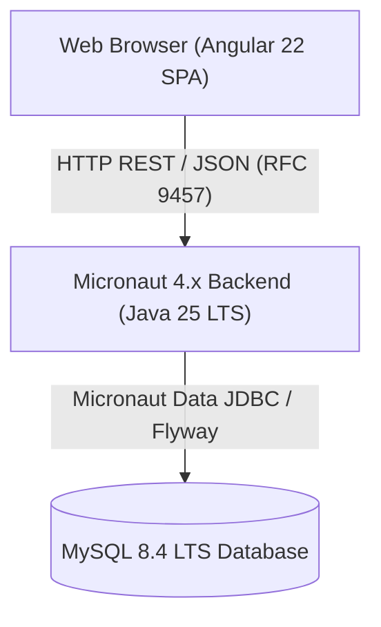

# swe-workflow-playground: Bulletin Board Application

[](https://github.com/green-tea-stalk/swe-workflow-playground/releases)
[](https://github.com/green-tea-stalk/swe-workflow-playground/actions/workflows/ci.yml)
[](https://github.com/green-tea-stalk/swe-workflow-playground/actions/workflows/release-please.yml)
[](https://github.com/green-tea-stalk/swe-workflow-playground/network/updates)
[](LICENSE)

[](https://openjdk.org/projects/jdk/25/)
[](https://micronaut.io/)
[](https://angular.dev/)
[](https://www.mysql.com/)
[](https://www.docker.com/)

> [!NOTE]
> 🇯🇵 **日本語ドキュメント**: [日本語版 README (README.ja.md)](README.ja.md) をご覧ください。

Evaluation and playground project for the `swe-workflow` plugin, demonstrating Spec-Driven Development (SDD) using Micronaut (Java 25 LTS), MySQL 8.4 LTS, and Angular 22 (Angular Material).

---

## Table of Contents

- [1. Overview & Architecture](#1-overview--architecture)
- [2. Key Features](#2-key-features)
- [3. Repository Structure](#3-repository-structure)
- [4. Quick Start](#4-quick-start)
- [5. Developer Guides & Technical References](#5-developer-guides--technical-references)
- [6. Specification Documentation](#6-specification-documentation)

---

## 1. Overview & Architecture

This project provides a full-stack bulletin board application built to validate automated Spec-Driven Development (SDD) workflows. It decouples an Angular 22 Single Page Application (SPA) from a Micronaut 4.x backend, communicating over strict REST API contracts with RFC 9457 Problem Details error handling.



---

## 2. Key Features

### 🌐 Application Capabilities

- **Modern Responsive UI**: Built with Angular 22 Standalone Components and Angular Material, optimized for desktop and mobile viewports.
- **Persistent Submission Form**: Viewport-anchored bottom form with reactive validation and instant feedback.
- **Paginated Feed View**: 50-item reverse-chronological feed with defensive scroll constraints (`scrollHeight > clientHeight`).
- **Standardized Error Feedback**: RFC 9457 Problem Details error messages displayed inline on form fields and via toast notifications.
- **Multi-Locale UI**: Native English (`/en/`) and Japanese (`/ja/`) distributions with automatic language negotiation.

### 🛠️ Engineering & Architecture

- **Spec-Driven Development (SDD)**: Complete end-to-end implementation driven by formal requirements, design, and task contracts.
- **Design by Contract (DbC)**: Strict request/response DTO validations with non-empty collection guarantees.
- **Multi-Layer Automated Testing**: JUnit 5, Vitest, Testcontainers MySQL integration tests, and Playwright E2E browser automation.
- **Automated Code Quality & Formatting**: Centralized Gradle Version Catalog (`libs.versions.toml`), Spotless (Palantir Java Format 4 spaces, ktlint), and Prettier format gates.

---

## 3. Repository Structure

```text
swe-workflow-playground/
├── backend/            # Micronaut 4.x backend service (Java 25 LTS, Gradle)
│   ├── src/main/java/  # REST controllers, domain services, persistence entities
│   └── src/test/java/  # JUnit 5 & Testcontainers MySQL integration tests
├── frontend/           # Angular 22 standalone SPA (Angular Material)
│   ├── src/app/        # Feed & form components, services, models
│   └── tests/          # Playwright E2E browser automation suite
├── docs/specs/         # Formal specifications (Requirements, Design, Tasks)
├── docker-compose.yml  # MySQL 8.4 LTS persistence container configuration
└── AGENTS.md           # Single Source of Truth for technical specs & agent instructions
```

---

## 4. Quick Start

Run the entire full-stack application (MySQL 8.4 database, Micronaut backend, and Angular frontend) with a single command from the root directory:

```bash
npm install
npm run dev
```

- **Frontend Application**: [http://localhost:4200/](http://localhost:4200/) (default: Japanese locale)
- **Backend REST API**: [http://localhost:8080/api/posts](http://localhost:8080/api/posts)
- **Locale-Specific Launch**:
  - English dev server: `npm run dev:en`
  - Japanese dev server: `npm run dev:ja`

> [!TIP]
> For individual service execution commands, Docker container credentials, and manual steps, see [AGENTS.md#4-quick-start--service-execution-guide](AGENTS.md#4-quick-start--service-execution-guide).

---

## 5. Developer Guides & Technical References

To maintain single-source integrity and prevent instruction drift, all comprehensive technical specifications, execution commands, and architectural rules are consolidated in [AGENTS.md](AGENTS.md).

| Topic                       | Description                                                                          | Documentation Anchor                                                                                                 |
| :-------------------------- | :----------------------------------------------------------------------------------- | :------------------------------------------------------------------------------------------------------------------- |
| **System Architecture**     | System diagram, technology stack, and component boundaries (`COMP-001` - `COMP-008`) | [AGENTS.md#2-system-architecture--component-inventory](AGENTS.md#2-system-architecture--component-inventory)         |
| **Prerequisites & Setup**   | JDK 25 LTS, Node.js, and Docker Engine / Colima requirements                         | [AGENTS.md#3-prerequisites--environment-setup](AGENTS.md#3-prerequisites--environment-setup)                         |
| **Execution Commands**      | Consolidated dev orchestrator, standalone service runs, and database lifecycle       | [AGENTS.md#4-quick-start--service-execution-guide](AGENTS.md#4-quick-start--service-execution-guide)                 |
| **Verification & Testing**  | Spotless & Prettier formatting, JUnit 5, Vitest, and Playwright E2E suites           | [AGENTS.md#5-verification--testing-protocol](AGENTS.md#5-verification--testing-protocol)                             |
| **Contracts & Data Models** | REST API DTO contracts, field constraints, and RFC 9457 error details                | [AGENTS.md#6-specifications--contracts-design-by-contract](AGENTS.md#6-specifications--contracts-design-by-contract) |
| **Coding Standards**        | Linguistic conventions, Doc comment discipline, and layout constraints               | [AGENTS.md#7-coding--linguistic-standards](AGENTS.md#7-coding--linguistic-standards)                                 |
| **Release & Git Workflow**  | Branch safety, Conventional Commits, and code review governance                      | [AGENTS.md#8-version-control--release-workflow](AGENTS.md#8-version-control--release-workflow)                       |

---

## 6. Specification Documentation

Formal specifications guiding Spec-Driven Development (SDD) for the bulletin board application:

| Document                       | Canonical (English)                                          | Japanese Translation (日本語)                                      |
| :----------------------------- | :----------------------------------------------------------- | :----------------------------------------------------------------- |
| **Requirements Specification** | [requirements.md](docs/specs/bulletin-board/requirements.md) | [requirements.ja.md](docs/specs/bulletin-board/requirements.ja.md) |
| **Design Specification**       | [design.md](docs/specs/bulletin-board/design.md)             | [design.ja.md](docs/specs/bulletin-board/design.ja.md)             |
| **Task Implementation Plan**   | [tasks.md](docs/specs/bulletin-board/tasks.md)               | [tasks.ja.md](docs/specs/bulletin-board/tasks.ja.md)               |
