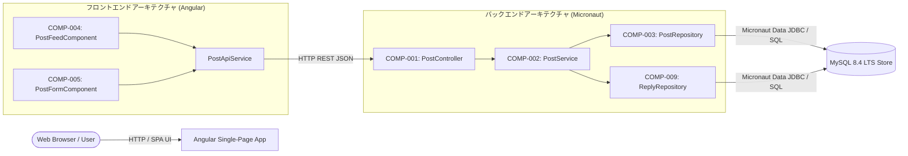
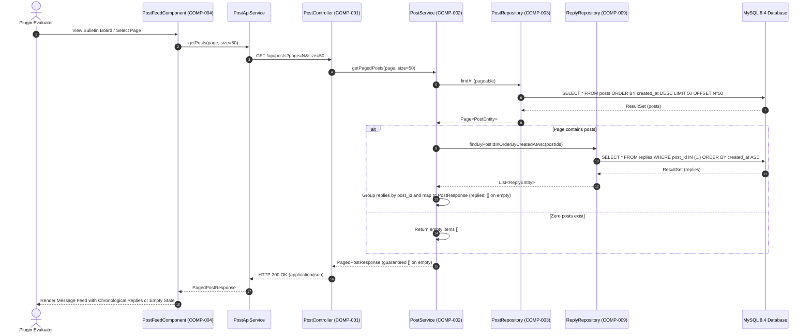
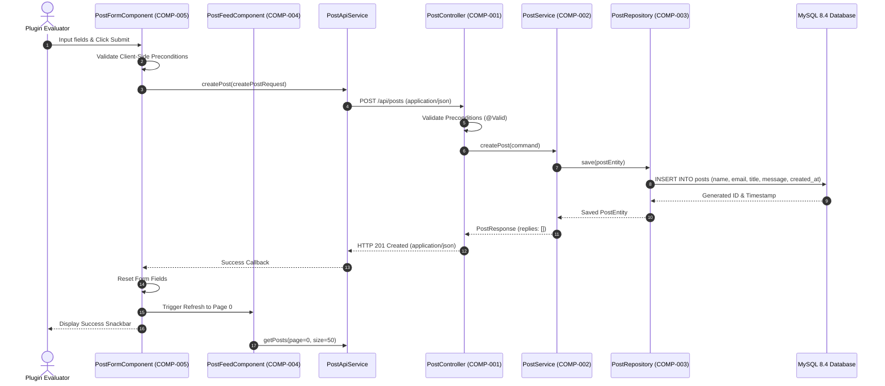
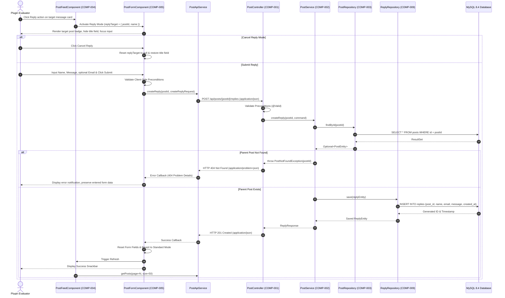

# アーキテクチャおよびコンポーネント設計書: 掲示板アプリケーション（Bulletin Board Application）

## 1. コンポーネント境界とスコープ概要（Component Boundaries & Scope Overview）

### 1.1 アーキテクチャおよびコンポーネントマップ（Architecture & Component Map）

掲示板アプリケーションは、HTTP REST API経由で通信を行う Angular シングルページフロントエンドと Micronaut バックエンドサービスからなる疎結合なフルスタックアーキテクチャとして構成されています。



### 1.2 コンポーネント一覧（Component Inventory）

| コンポーネント ID | コンポーネント / クラス名 | スコープ / 境界 | 関連要件 |
| :--- | :--- | :--- | :--- |
| **COMP-001** | `PostController` | バックエンド外部公開 REST インターフェース | `REQ-002`, `REQ-003`, `REQ-007`, `REQ-008`, `REQ-009`, `REQ-010`, `REQ-011`, `REQ-014`, `REQ-015` |
| **COMP-002** | `PostService` | バックエンドドメインコアサービス | `REQ-002`, `REQ-003`, `REQ-007`, `REQ-008`, `REQ-009`, `REQ-011`, `REQ-014`, `REQ-015` |
| **COMP-003** | `PostRepository` | 親投稿用バックエンド永続化アダプター (Micronaut Data JDBC) | `REQ-002`, `REQ-003`, `REQ-007` |
| **COMP-004** | `PostFeedComponent` | フロントエンド UI 描画およびページネーション (Angular Material) | `REQ-002`, `REQ-003`, `REQ-004`, `REQ-005`, `REQ-006`, `REQ-010`, `REQ-011`, `REQ-012` |
| **COMP-005** | `PostFormComponent` | フロントエンド下部固定フォーム (Angular Reactive Forms) | `REQ-001`, `REQ-007`, `REQ-008`, `REQ-009`, `REQ-010`, `REQ-012`, `REQ-013`, `REQ-014`, `REQ-015` |
| **COMP-009** | `ReplyRepository` | 返信用バックエンド永続化アダプター (Micronaut Data JDBC) | `REQ-011`, `REQ-014`, `REQ-015` |

---

## 2. 相互作用モデリング（Interaction Modeling）

### 2.1 ページネーション付きメッセージフィードおよび返信の取得（Browse）



### 2.2 新規メッセージの投稿（Submitting a New Message）



### 2.3 既存メッセージへの返信投稿（Submitting a Reply to an Existing Message）



---

## 3. データモデルとスキーマ制約（Data Models & Schema Constraints）

すべてのペイロードおよびモデルは、JSON Schema および SQL 2016 制約定義に準拠しています。

### 3.1 `CreatePostRequest`（入力ペイロード / DTO）
- **形式**: JSON Schema / Java Record DTO

| フィールド名 | 型 | 必須 / 任意 | 制約条件 | 説明 |
| :--- | :--- | :--- | :--- | :--- |
| `name` | `string` | 必須 | `minLength: 1`, `maxLength: 50`, `pattern: "^(?!\\s*$).+"` | 投稿者表示名（空白文字のみ不可） |
| `email` | `string` | 任意 | `maxLength: 254`, `format: "email"` | 公開表示用の任意メールアドレス |
| `title` | `string` | 必須 | `minLength: 1`, `maxLength: 100`, `pattern: "^(?!\\s*$).+"` | 投稿タイトル（空白文字のみ不可） |
| `message` | `string` | 必須 | `minLength: 1`, `maxLength: 4000`, `pattern: "^(?!\\s*$).+"` | メッセージ本文（空白文字のみ不可） |

### 3.2 `CreateReplyRequest`（入力ペイロード / DTO）
- **形式**: JSON Schema / Java Record DTO

| フィールド名 | 型 | 必須 / 任意 | 制約条件 | 説明 |
| :--- | :--- | :--- | :--- | :--- |
| `name` | `string` | 必須 | `minLength: 1`, `maxLength: 50`, `pattern: "^(?!\\s*$).+"` | 投稿者表示名（空白文字のみ不可） |
| `email` | `string` | 任意 | `maxLength: 254`, `format: "email"` | 公開表示用の任意メールアドレス |
| `message` | `string` | 必須 | `minLength: 1`, `maxLength: 4000`, `pattern: "^(?!\\s*$).+"` | 返信本文（空白文字のみ不可） |

### 3.3 `ReplyResponse`（出力ペイロード / DTO）
- **形式**: JSON Schema / Java Record DTO

| フィールド名 | 型 | 必須 / 任意 | 制約条件 | 説明 |
| :--- | :--- | :--- | :--- | :--- |
| `id` | `integer` (int64) | 必須 | `minimum: 1` | 返信レコードの一意識別子 |
| `post_id` | `integer` (int64) | 必須 | `minimum: 1` | 親投稿の一意識別子 |
| `name` | `string` | 必須 | `minLength: 1`, `maxLength: 50` | 投稿者表示名 |
| `email` | `string` | 任意 (nullable) | `maxLength: 254` | 投稿者公開メールアドレス（未入力時は `null`） |
| `message` | `string` | 必須 | `minLength: 1`, `maxLength: 4000` | 返信本文 |
| `created_at` | `string` | 必須 | `format: "date-time"` (ISO 8601 UTC) | 投稿日時 |

### 3.4 `PostResponse`（出力ペイロード / DTO）
- **形式**: JSON Schema / Java Record DTO

| フィールド名 | 型 | 必須 / 任意 | 制約条件 | 説明 |
| :--- | :--- | :--- | :--- | :--- |
| `id` | `integer` (int64) | 必須 | `minimum: 1` | 投稿レコードの一意識別子 |
| `name` | `string` | 必須 | `minLength: 1`, `maxLength: 50` | 投稿者表示名 |
| `email` | `string` | 任意 (nullable) | `maxLength: 254` | 投稿者公開メールアドレス（未入力時は `null`） |
| `title` | `string` | 必須 | `minLength: 1`, `maxLength: 100` | 投稿タイトル |
| `message` | `string` | 必須 | `minLength: 1`, `maxLength: 4000` | メッセージ本文 |
| `created_at` | `string` | 必須 | `format: "date-time"` (ISO 8601 UTC) | 投稿日時 |
| `replies` | `array<ReplyResponse>` | 必須 | `minItems: 0 (guaranteed [] on empty)` | 紐づく返信一覧（古い順、空の場合は `[]` を保証） |

### 3.5 `PagedPostResponse`（出力ペイロード / DTO）
- **形式**: JSON Schema / Java Record DTO

| フィールド名 | 型 | 必須 / 任意 | 制約条件 | 説明 |
| :--- | :--- | :--- | :--- | :--- |
| `items` | `array<PostResponse>` | 必須 | `minItems: 0 (guaranteed [] on empty)` | 投稿アイテム配列（0件時も空配列 `[]` を保証） |
| `page` | `integer` | 必須 | `minimum: 0` | 0始まりの現在ページインデックス |
| `size` | `integer` | 必須 | `minimum: 1`, `maximum: 50`, `default: 50` | 1ページあたりの件数上限 |
| `total_items` | `integer` (int64) | 必須 | `minimum: 0` | 登録済み総投稿件数 |
| `total_pages` | `integer` | 必須 | `minimum: 0` | 利用可能な総ページ数 |

### 3.6 `posts` テーブル（データベースエンティティモデル）
- **永続化ターゲット**: MySQL 8.4 LTS
- **照合順序（Collation）**: `utf8mb4_unicode_ci`

| カラム名 | データ型 | NULL許容 | キー / デフォルト | インデックス | 説明 |
| :--- | :--- | :--- | :--- | :--- | :--- |
| `id` | `BIGINT` | No | PK, `AUTO_INCREMENT` | Primary | 投稿レコードシーケンス番号 |
| `name` | `VARCHAR(50)` | No | None | None | 投稿者名 |
| `email` | `VARCHAR(254)` | Yes | `DEFAULT NULL` | None | 公開メールアドレス |
| `title` | `VARCHAR(100)` | No | None | None | 投稿タイトル |
| `message` | `TEXT` | No | None | None | メッセージ本文 |
| `created_at` | `DATETIME(6)` | No | `DEFAULT CURRENT_TIMESTAMP(6)` | `idx_posts_created_at_desc (created_at DESC)` | マイクロ秒精度の作成日時 |

### 3.7 `replies` テーブル（データベースエンティティモデル）
- **永続化ターゲット**: MySQL 8.4 LTS
- **照合順序（Collation）**: `utf8mb4_unicode_ci`

| カラム名 | データ型 | NULL許容 | キー / デフォルト | インデックス | 説明 |
| :--- | :--- | :--- | :--- | :--- | :--- |
| `id` | `BIGINT` | No | PK, `AUTO_INCREMENT` | Primary | 返信レコードシーケンス番号 |
| `post_id` | `BIGINT` | No | FK `posts(id)` ON DELETE CASCADE | `idx_replies_post_id (post_id)` | 親投稿への外部キー |
| `name` | `VARCHAR(50)` | No | None | None | 投稿者名 |
| `email` | `VARCHAR(254)` | Yes | `DEFAULT NULL` | None | 公開メールアドレス |
| `message` | `TEXT` | No | None | None | 返信本文 |
| `created_at` | `DATETIME(6)` | No | `DEFAULT CURRENT_TIMESTAMP(6)` | `idx_replies_created_at_asc (created_at ASC)` | マイクロ秒精度の作成日時 |

---

## 4. 入出力プロトコル（Input / Output Protocols）

### 4.1 ネットワークおよび API プロトコル
- **トランスポート層**: TCP 上の HTTP/1.1 または HTTP/2。
- **コンテンツネゴシエーション**:
  - リクエスト: `Content-Type: application/json; charset=UTF-8`, `Accept: application/json`
  - レスポンス: 正常時 `Content-Type: application/json; charset=UTF-8`、エラー時 `Content-Type: application/problem+json; charset=UTF-8`。
- **エンドポイント**:
  1. `GET /api/posts`
     - クエリパラメータ: `page`（integer、デフォルト 0、最小 0）、`size`（integer、デフォルト 50、最小 1、最大 50）。
     - レスポンス: `200 OK`（`PagedPostResponse` を返却、各要素に `replies: []` を埋め込み）。
  2. `POST /api/posts`
     - リクエストボディ: `CreatePostRequest`。
     - レスポンス: `201 Created`（`PostResponse` および `Location: /api/posts/{id}` ヘッダーを返却）。
  3. `POST /api/posts/{postId}/replies`
     - パスパラメータ: `postId`（int64、最小 1）。
     - リクエストボディ: `CreateReplyRequest`。
     - レスポンス: `201 Created`（`ReplyResponse` および `Location: /api/posts/{postId}/replies/{id}` ヘッダーを返却）。
     - エラーレスポンス:
       - `400 Bad Request`: `CreateReplyRequest` のバリデーション失敗（RFC 9457 `invalid_params` 付与）。
       - `404 Not Found`: 指定された `postId` の親投稿が存在しない。
       - `500 Internal Server Error`: サーバー内部エラー。
- **タイムアウト**: クライアント接続タイムアウト: 5,000ms、読み取りタイムアウト: 10,000ms。

---

## 5. コンポーネント契約（Design by Contract - RFC 2119 / RFC 8174）

### 5.1 COMP-001: `PostController`
- **責務**: REST API 境界を公開・防護し、HTTP ペイロードをドメインリクエストにバインドしてレスポンスを整形する。
- **公開シグネチャ**:
  - `HttpResponse<PagedPostResponse> listPosts(@QueryValue(defaultValue = "0") int page, @QueryValue(defaultValue = "50") int size)`
  - `HttpResponse<PostResponse> createPost(@Body @Valid CreatePostRequest request)`
  - `HttpResponse<ReplyResponse> createReply(@PathVariable("postId") Long postId, @Body @Valid CreateReplyRequest request)`
- **事前条件（呼び出し側の義務）**:
  - 呼び出し側は、リクエストボディが存在する場合、`Content-Type: application/json` を持つ正しい HTTP リクエストを送信しなければならない（MUST）。
  - 呼び出し側は、`CreatePostRequest` または `CreateReplyRequest` に定義された検証制約を満たさなければならない（MUST）。
  - 呼び出し側は、返信作成時に正の int64 識別子（`postId >= 1`）を指定しなければならない（MUST）。
  - 呼び出し側は、`page >= 0` および `1 <= size <= 50` を満たさなければならない（MUST）。
- **事後条件（呼び出し先の保証）**:
  - `listPosts` において、呼び出し先は `200 OK` とともに `PagedPostResponse` を返却しなければならない（MUST）。一致件数が0件の場合、呼び出し先は `items` が空配列 `[]` であることを保証しなければならない（MUST、`null` やフィールド省略は不可）。各投稿内の `replies` も非Nullな配列（0件時は `[]`）を保証しなければならない（MUST）。
  - `createPost` において、呼び出し先は永続化された `PostResponse`（サーバー生成の `id`、`created_at`、および空の `replies: []` を含む）とともに `201 Created` を返却しなければならない（MUST）。
  - `createReply` において、呼び出し先は永続化された `ReplyResponse`（サーバー生成の `id`、`post_id`、および `created_at` を含む）とともに `201 Created` を返却しなければならない（MUST）。
  - バリデーションエラー時、呼び出し先は詳細な `invalid_params` を含む RFC 9457 準拠の `400 Bad Request` を返却しなければならない（MUST）。
  - `createReply` において親 `postId` が存在しない場合、呼び出し先は RFC 9457 準拠の `404 Not Found` を返却しなければならない（MUST）。
  - 予期せぬ内部障害時、呼び出し先はスタックトレースを秘匿した RFC 9457 準拠の `500 Internal Server Error` を返却しなければならない（MUST）。
- **不変条件（Invariants）**:
  - コントローラーはステートレスかつスレッドセーフでなければならない（MUST）。

### 5.2 COMP-002: `PostService`
- **責務**: ビジネスバリデーション、エンティティ生成、タイムスタンプ付与、返信集約、およびリポジトリ連携を統括する。
- **公開シグネチャ**:
  - `PagedPostResponse getPagedPosts(int page, int size)`
  - `PostResponse createPost(CreatePostRequest command)`
  - `ReplyResponse createReply(Long postId, CreateReplyRequest command)`
- **事前条件（呼び出し側の義務）**:
  - 呼び出し側は、スキーマ制約を満たす非Nullのコマンドオブジェクトを渡さなければならない（MUST）。
  - 呼び出し側は、返信作成時に正の非Nullな `postId` を渡さなければならない（MUST）。
  - 呼び出し側は、`page >= 0` および `1 <= size <= 50` を満たさなければならない（MUST）。
- **事後条件（呼び出し先の保証）**:
  - 呼び出し先は、レコードが存在しない場合でも `items` が非Nullな空配列 `[]` である `PagedPostResponse` を返却しなければならない（MUST）。
  - `getPagedPosts` において、呼び出し先は取得された全親投稿 ID に対する返信を一括バッチクエリ（`COMP-009`）で取得し、各投稿に対して投稿日時の昇順で返信を結合し、返信が存在しない場合は `replies: []` を保証しなければならない（MUST）。
  - 呼び出し先は、新規作成される投稿および返信に対して、永続化前に現在の UTC タイムスタンプを割り当てなければならない（MUST）。
  - `createReply` において親 `postId` が存在しない場合、呼び出し先は `PostNotFoundException` を送出しなければならない（MUST）。
  - 呼び出し先は、検査例外を適切に伝播するか、未処理の永続化エラーを安全にラップしなければならない（MUST）。
- **不変条件（Invariants）**:
  - 読み取りメソッド（`getPagedPosts`）においてデータを変更してはならない（MUST NOT）。

### 5.3 COMP-003: `PostRepository`
- **責務**: MySQL 8.4 に対する Micronaut Data JDBC を用いた親投稿のデータアクセスを実行する。
- **公開シグネチャ**:
  - `Page<PostEntity> findAll(Pageable pageable)`
  - `Optional<PostEntity> findById(Long id)`
  - `PostEntity save(PostEntity entity)`
- **事前条件（呼び出し側の義務）**:
  - 呼び出し側は、`created_at DESC` でソートされた有効な `Pageable` インスタンスを渡さなければならない（MUST）。
  - 呼び出し側は、非Nullの `PostEntity` を渡さなければならない（MUST）。
- **事後条件（呼び出し先の保証）**:
  - 呼び出し先は、一致するレコードが存在しない場合でもコンテンツが空リスト `[]` である `Page<PostEntity>` を返却しなければならない（MUST、`null` 不可）。
  - 呼び出し先は、新規レコードを永続化し、自動採番された `id` を設定しなければならない（MUST）。
- **不変条件（Invariants）**:
  - データベーストランザクション境界を維持し、失敗時はクリーンにロールバックしなければならない（MUST）。

### 5.4 COMP-004: `PostFeedComponent`（Angular）
- **責務**: 投稿メッセージ一覧、時系列順の返信一覧、空状態プレースホルダー、およびページネーションを描画する。
- **公開シグネチャ**:
  - `loadPage(pageIndex: number): void`
  - `refresh(): void`
  - `onReplyClick(post: PostResponse): void`
- **事前条件（呼び出し側の義務）**:
  - 呼び出し側（Angular ランタイム / ユーザー）は、バックエンドとの有効なネットワーク接続状態でライフサイクルフックをトリガーしなければならない（MUST）。
- **事後条件（呼び出し先の保証）**:
  - 呼び出し先は、`PagedPostResponse` から受信したアイテムを描画しなければならない（MUST）。
  - 呼び出し先は、各親投稿カードの下部に紐づく返信を投稿日時昇順で描画し、投稿者名、投稿日時、本文、メールアドレスを表示しなければならない（MUST）。
  - 呼び出し先は、各投稿カードに「返信」アクションボタンを描画し、クリック時に `onReplyClick(post)` を呼び出して `PostFormComponent` へ通知しなければならない（MUST）。
  - 呼び出し先は、`items.length === 0` の場合に空状態通知テンプレートを描画しなければならない（MUST）。
  - 呼び出し先は、`items` が空配列 `[]` の場合や、投稿の `replies` が空配列 `[]` の場合でもクラッシュしてはならない（MUST NOT）。
- **不変条件（Invariants）**:
  - フィードコンポーネントは、`PostFormComponent` の未送信入力状態を変更または消去してはならない（MUST NOT）。

### 5.5 COMP-005: `PostFormComponent`（Angular）
- **責務**: ビューポート下部固定フォームを描画し、標準モードと返信モードのリアクティブ状態を管理し、バリデーションと送信処理を行う。
- **公開シグネチャ**:
  - `onSubmit(): void`
  - `resetForm(): void`
  - `setReplyTarget(target: PostResponse | null): void`
  - `cancelReply(): void`
- **事前条件（呼び出し側の義務）**:
  - ユーザーは、フォームコントロールに入力を行い、送信操作を実行しなければならない（MUST）。
- **事後条件（呼び出し先の保証）**:
  - 呼び出し先は、固定配置（`position: fixed; bottom: 0`）を用いてフォームコンテナを画面下部に常時固定しなければならない（MUST）。
  - `replyTarget` が非Null（返信モード）である間、呼び出し先は対象投稿識別子と投稿者名を示すインジケーターバッジを表示し、タイトル入力欄を非表示にし、タイトルバリデーションを無効化しなければならない（MUST）。
  - 呼び出し先は、返信モード時にキャンセルボタンを提供し、押下時に `cancelReply()` を呼び出して `replyTarget` を解除し、標準モードへ復帰させなければならない（MUST）。
  - いずれのモードにおいても、送信成功時に `resetForm()` を呼び出して標準モードへ復帰し、フィードの再読み込みを通知し、Angular Material Snackbar 通知を表示しなければならない（MUST）。
  - バリデーションエラーまたは送信失敗時、呼び出し先は入力値を保持し、コントロールを touched 状態にして項目ごとの検証エラーを表示しなければならない（MUST）。
- **不変条件（Invariants）**:
  - フォームコンポーネントは、フィードのスクロール位置に関わらず常に操作可能かつ可視でなければならない（MUST）。

### 5.6 COMP-009: `ReplyRepository`
- **責務**: MySQL 8.4 に対する Micronaut Data JDBC を用いた返信データのアクセスを実行する。
- **公開シグネチャ**:
  - `List<ReplyEntity> findByPostIdOrderByCreatedAtAsc(Long postId)`
  - `List<ReplyEntity> findByPostIdInOrderByCreatedAtAsc(List<Long> postIds)`
  - `ReplyEntity save(ReplyEntity entity)`
- **事前条件（呼び出し側の義務）**:
  - 呼び出し側は、非Nullな `postId` または空でない `postIds` コレクションを渡さなければならない（MUST）。
  - 呼び出し側は、非Nullの `ReplyEntity` を渡さなければならない（MUST）。
- **事後条件（呼び出し先の保証）**:
  - 呼び出し先は、一致レコードが存在しない場合でも非Nullな `List<ReplyEntity>`（空リスト `[]`）を返却しなければならない（MUST、`null` 不可）。
  - 呼び出し先は、返信を投稿日時昇順（`created_at ASC`）で返却しなければならない（MUST）。
  - 呼び出し先は、新規返信レコードを永続化し、自動採番された `id` を設定しなければならない（MUST）。
- **不変条件（Invariants）**:
  - データベース外部キー制約（`ON DELETE CASCADE`）を遵守しなければならない（MUST）。

---

## 6. エラーおよび例外処理（RFC 9457 & Exception Hierarchy）

### 6.1 標準エラーエンベロープ（RFC 9457）
外部エンドポイントは、`application/problem+json` に準拠したエラー詳細を返却します：

```json
{
  "type": "https://example.com/errors/validation-failed",
  "title": "Validation Failed",
  "status": 400,
  "detail": "Input payload failed validation constraints.",
  "instance": "/api/posts/1/replies",
  "invalid_params": [
    {
      "name": "message",
      "reason": "Message must not be blank and must be between 1 and 4000 characters."
    }
  ]
}
```

返信送信時に存在しない親投稿を参照した場合：
```json
{
  "type": "https://example.com/errors/post-not-found",
  "title": "Post Not Found",
  "status": 404,
  "detail": "Parent post with ID 999 was not found.",
  "instance": "/api/posts/999/replies"
}
```

### 6.2 ドメイン内部例外階層
- `BulletinBoardException`（抽象基底例外）
  - `PostValidationException`: ビジネスバリデーション違反時に送出。
  - `PostStorageException`: リレーショナルデータベース操作失敗時に送出。
  - `PostNotFoundException`: 返信作成時に指定された親投稿が存在しない場合に送出。

---

## 7. 主な設計判断とアーキテクチャのトレードオフ（Key Design Decisions & Architectural Trade-offs）

- **フレームワークおよび実行基盤（Framework & Runtime Platform）**:
  - **採用したアプローチ**: Micronaut 4.x + Java 25 LTS（Corretto）+ Gradle（Kotlin DSL）。
  - **検討した代替案**: Spring Boot 3.x + Maven。
  - **選定理由とトレードオフ**: Micronaut の Ahead-of-Time（AOT）コンパイルによる極小のメモリ使用量（約50MB vs 約250MB RSS）と1秒未満の高速起動により、自動テストやエージェント実行のフィードバックループを大幅に短縮できる。Java 25 LTS による長期サポートと最新言語機能を活用。Spring Boot と比較してコミュニティスターターが少ないというトレードオフを受容。

- **永続化アーキテクチャおよびクエリ実行方式（Persistence Architecture & Query Execution）**:
  - **採用したアプローチ**: Micronaut Data JDBC + MySQL 8.4 LTS + Flyway データベースマイグレーション。
  - **検討した代替案**: Hibernate / JPA ORM、またはリアクティブ R2DBC。
  - **選定理由とトレードオフ**: Micronaut Data JDBC はコンパイル時に SQL クエリを事前生成し、リフレクションなしで高速に動作するため、エンティティのライフサイクル管理やキャッシュ、意図しない N+1 Lazy Loading などの複雑性を完全に排除できる。重厚な ORM による過剰な抽象化を避け、シンプルなマイグレーションスクリプトによる確実なスキーマ管理を選択。

- **フロントエンドアーキテクチャおよびビューポートレイアウト（Frontend Architecture & Viewport Layout Strategy）**:
  - **採用したアプローチ**: Angular SPA + Angular Material によるビューポート最下部固定フォーム（`position: fixed; bottom: 0`）と動的計算によるスクロール可能フィードコンテナ（`height: calc(100vh - formHeight); overflow-y: auto`）。
  - **検討した代替案**: 画面上部のインラインフォーム、または複数ページに分かれた投稿画面（`/new`）。
  - **選定理由とトレードオフ**: `REQ-001` の要件を直接満たし、フィードを閲覧しながらいつでも即座に入力できる優れた操作性を実現。固定フォームとスクロール領域の干渉を防ぐための CSS 制御が必要となるトレードオフを受容。

- **ページネーション方式とインデックス設計（Pagination Mechanism & Indexing Strategy）**:
  - **採用したアプローチ**: `created_at DESC` の専用降順インデックスに裏打ちされたオフセットベースの番号指定ページネーション（`page`, `size=50`）。
  - **検討した代替案**: タイムスタンプや ID によるキーストローク / カーソルベースのページネーション。
  - **選定理由とトレードオフ**: `REQ-003` の明示的な50件ごとのページネーション要件に合致し、標準の `MatPaginator` とシームレスに連携。評価目的の規模において `idx_posts_created_at_desc` による走査は十分高速。ページめくり時のわずかなデータズレの可能性というトレードオフを受容。

- **API エラー契約の標準化（API Error Contract Standardization）**:
  - **採用したアプローチ**: RFC 9457（Problem Details for HTTP APIs: `application/problem+json`）および構造化された `invalid_params` 配列。
  - **検討した代替案**: 独自形式の JSON エラーラッパー（`{ "error": "...", "status": 400 }`）やフレームワーク標準エラー画面。
  - **選定理由とトレードオフ**: 業界標準のエラー契約により、フロントエンドのエラー表示と自動テストのアサーションを統一。内部スタックトレースの漏洩を防ぎつつ、フィールドごとの検証結果を明確に伝達可能。

- **返信データのリレーショナルモデリングと階層構造（Relational Schema & Hierarchy Modeling for Replies）**:
  - **採用したアプローチ**: 独立した `replies` リレーショナルテーブル（`id`, `post_id` 外部キー, `name`, `email`, `message`, `created_at`）を新設し、複合インデックス `idx_replies_post_id_created_at_asc (post_id, created_at ASC)` と外部キー制約（参照整合性）を付与。
  - **検討した代替案**: `posts` テーブルに自己参照外部キー `parent_id`（NULL 許容）を追加し、単一テーブルで親投稿と返信を混在管理する隣接リスト方式。
  - **選定理由とトレードオフ**: 親投稿では `title` が必須（`NOT NULL`、1〜100文字）である一方、返信ではタイトルが明示的に不要（`REQ-013`）。単一テーブルでは `title` の NULL 制約を緩和する必要があり、親投稿に対する DB レベルのデータ整合性保証が損なわれる。また、親投稿フィードは 50 件単位の降順ページネーション（`created_at DESC`）を行うため、単一テーブルに返信が混在すると `WHERE parent_id IS NULL` フィルタが常時必須となり、インデックスが返信レコードで汚染されオフセット走査の効率が低下する。独立テーブルにすることで、DB 制約レベルで返信に対するさらなる返信を物理的に抑止でき、循環参照や再帰クエリのバグを排除できる。独立したテーブル定義、Flyway マイグレーション（`V2__create_replies_table.sql`）、専用エンティティ（`ReplyEntity`）およびリポジトリ（`ReplyRepository`）の保守が必要になるトレードオフを受容。

- **返信データの取得とクエリ実行戦略（Reply Data Fetching & Query Execution Strategy）**:
  - **採用したアプローチ**: バックエンドでの一括取得（バッチフェッチ）によるフィード内インライン埋め込み。親投稿の取得（`GET /api/posts`）時に、ページ内 50 件の親投稿 ID を抽出し、`findByPostIdInOrderByCreatedAtAsc(List<Long> postIds)` を用いた単一の SQL `IN` クエリで全返信を取得。メモリ上で `post_id` ごとにグルーピングして `PostResponse.replies()` に結合し、1 回の HTTP 通信で完全な階層フィードを返却。
  - **検討した代替案**: クライアント側でのオンデマンド／遅延ロード（カードのビューポート進入時や「返信を表示」操作時に `GET /api/posts/{id}/replies` を個別発行）、またはバックエンド側での親投稿ごとの N+1 クエリ実行。
  - **選定理由とトレードオフ**: クライアント遅延ロードでは 50 件の投稿に対して最大 50 回の HTTP 通信が発生し、ブラウザ接続プールの逼迫やレイアウトシフト（ガタつき）を招く。単一の `IN` クエリ（O(1) クエリ複雑度）により、2 回の DB アクセス（親投稿 1 回、返信一括 1 回）で完結。`REQ-011` では返信を持つ投稿の描画時に古い順で直接表示することが規定されており、各カードごとの非同期スピナーや追加操作なしで一覧を閲覧できる UX を提供。1 ページ最大 50 件かつフラットなテキスト返信に限定されているため、全体のレスポンスサイズ増加は軽微（500KB 未満）であり、HTTP 転送負荷として十分に許容可能。ファーストビューの下部に隠れている親投稿の返信も含めて先行取得するため、`GET /api/posts` のペイロードがわずかに増加するトレードオフを受容。

- **フロントエンドフォームの設計とモード遷移（Frontend Form Architecture & Mode Transition）**:
  - **採用したアプローチ**: 画面下部固定フォーム（`PostFormComponent`）の状態駆動型モード再利用。リアクティブな返信対象状態（`replyTarget: { postId: number, author: string } | null`）を保持し、「返信モード」時は対象投稿バッジと解除ボタンを表示、`title` 入力欄を無効化・非表示とし、送信先エンドポイントを `/api/posts/{postId}/replies` へ切り替え。送信成功またはキャンセル時に標準モードへ復帰（`REQ-012`, `REQ-013`, `REQ-014`）。
  - **検討した代替案**: 各投稿カード内部にアコーディオン形式で展開するインラインフォーム、またはモーダルダイアログ（`MatDialog`）の表示。
  - **選定理由とトレードオフ**: `REQ-001` で規定された「投稿フォームを常にビューポート下部に固定表示する」契約を完全に維持。モーダルダイアログは画面背景を覆い隠してフィードの閲覧を阻害し、インラインフォームは複数フォームの多重オープン管理を複雑化させる。また、カード内インラインフォームの展開はフィードの縦幅を急激に変動させ、ユーザーの閲覧スクロール位置を狂わせる。下部固定のまま内部ステートを切り替えることで、フィードスクロールに一切影響を与えない。入力バリデーション、エラー表示（`REQ-009`）、スナックバー通知などの UI 処理を単一の `PostFormComponent` に集約・再利用できる。フィード（`PostFeedComponent`）とフォーム（`PostFormComponent`）間で返信対象を伝達するためのコンポーネント間連携（シグナルやイベントサービス）が必要となり、フォームのバリデーションルールを動的に制御する複雑さが増すトレードオフを受容。

- **返信タイトルの扱いと API 契約の設計（Reply Title Handling & API Contract Design）**:
  - **採用したアプローチ**: API スキーマおよび永続化層において返信のタイトルを明示的に除外。返信専用の DTO（`CreateReplyRequest`: `name`, `email`, `message`、および `ReplyResponse`）を新設し、UI 上でタイトル入力欄を非表示とする契約（`REQ-013`）と厳密に合致させる。
  - **検討した代替案**: クライアント側またはサーバー側で `Re: <親投稿タイトル>` などの合成タイトルを自動付与してタイトル必須制約を維持する案、または親投稿と共通の単一 DTO で `title` を任意（nullable）とする案。
  - **選定理由とトレードオフ**: 返信はスレッド内の文脈的コメントであり、独立したタイトルを持つ記事ではない。合成文字列（`Re: ...`）の永続化はデータの冗長性を生み、表示上の関心事を永続化層に漏洩させる。`REQ-013` に従い UI 上に存在しないタイトルに対してバリデーションエラーが発生した場合、ユーザーが修正不能な phantom エラー（不可視フィールドのエラー）となり混乱を招く。返信専用 DTO により、UI で入力可能な項目のみを厳密にバリデーション可能。親投稿ではタイトル必須（1〜100文字）、返信ではタイトル不要という異なる事前条件・不変条件をコンパイル時およびバリデーション時に明確に分離できる。親投稿と返信で別々の DTO クラス（`CreatePostRequest` / `CreateReplyRequest`）およびエンドポイント（`POST /api/posts` / `POST /api/posts/{id}/replies`）を保守する必要があり、単一の汎用投稿エンドポイントへの集約ができないトレードオフを受容。
