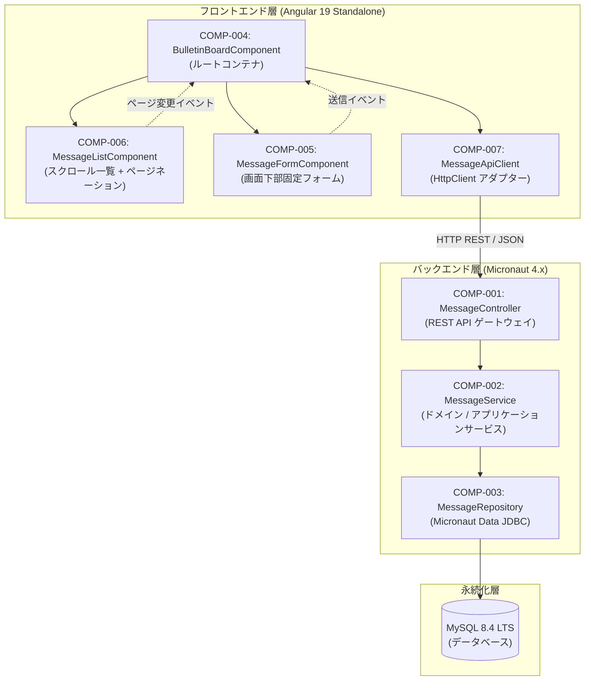
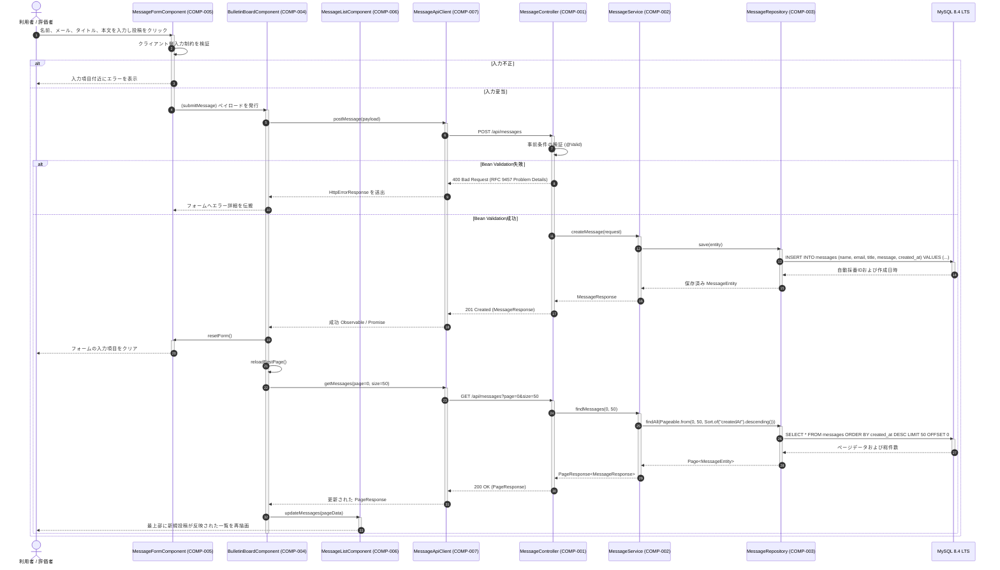

# 基本設計書: 掲示板アプリケーション（Bulletin Board Application）

## 1. コンポーネント境界およびスコープ概要（Component Boundaries & Scope Overview）

### 1.1 アーキテクチャおよびコンポーネントマップ
本アプリケーションは、ブラウザベースのSPA（Single Page Application: シングルページアプリケーション）と、コンテナ化されたバックエンドおよびリレーショナル永続化層を分離したクリーンな階層化アーキテクチャを採用します。



### 1.2 コンポーネント一覧（Component Inventory）
| コンポーネントID | コンポーネント / クラス名 | スコープ / 境界 | 関連要件 |
| :--- | :--- | :--- | :--- |
| **COMP-001** | `MessageController` | 外部公開RESTインターフェース | `REQ-003`, `REQ-004`, `REQ-006`, `REQ-007`, `REQ-009` |
| **COMP-002** | `MessageService` | 内部コアアプリケーションサービス | `REQ-002`, `REQ-003`, `REQ-004`, `REQ-009` |
| **COMP-003** | `MessageRepository` | 内部永続化境界 (JDBC) | `REQ-002`, `REQ-003`, `REQ-004` |
| **COMP-004** | `BulletinBoardComponent` | フロントエンドルートビュー & 状態コンテナ | `REQ-001`, `REQ-002`, `REQ-005` |
| **COMP-005** | `MessageFormComponent` | フロントエンド画面下部固定入力フォーム | `REQ-001`, `REQ-004`, `REQ-005`, `REQ-006`, `REQ-007` |
| **COMP-006** | `MessageListComponent` | フロントエンド一覧描画 & ページネーション | `REQ-002`, `REQ-003`, `REQ-008` |
| **COMP-007** | `MessageApiClient` | フロントエンドHTTP通信サービス | `REQ-003`, `REQ-004`, `REQ-009` |

---

## 2. 相互作用モデリング（Interaction Modeling）



---

## 3. データモデルおよびスキーマ制約（Data Models & Schema Constraints）

### 3.1 `MessageCreateRequest` (入力ペイロード)
- **形式**: JSON Schema / Java レコード
- **フィールド定義**:
  - `name` (string, 必須): `minLength: 1`, `maxLength: 50`, `pattern: ".*\\S.*"` - 投稿者表示名。空白文字のみで構成されてはならない。
  - `email` (string, 任意, nullable): `maxLength: 100`, `format: "email"` - 任意の連絡用メールアドレス。RFC 5322に準拠したメールアドレス形式。
  - `title` (string, 必須): `minLength: 1`, `maxLength: 100`, `pattern: ".*\\S.*"` - メッセージ件名。空白文字のみで構成されてはならない。
  - `message` (string, 必須): `minLength: 1`, `maxLength: 1000`, `pattern: ".*\\S.*"` - 掲示板投稿の本文。空白文字のみで構成されてはならない。

### 3.2 `MessageResponse` (出力リソース)
- **形式**: JSON Schema / Java レコード
- **フィールド定義**:
  - `id` (integer, 必須): `minimum: 1`, 形式 `int64` - 自動採番された一意識別子。
  - `name` (string, 必須): 投稿者表示名。
  - `email` (string, 任意, nullable): 入力された場合は投稿者のメールアドレス、未入力の場合は `null`。
  - `title` (string, 必須): メッセージ件名。
  - `message` (string, 必須): メッセージ本文。
  - `createdAt` (string, 必須): ISO 8601 UTC形式の日時文字列 `date-time`（例: `2026-09-05T14:30:00Z`）。

### 3.3 `PageResponse<T>` (ページネーション封筒モデル)
- **形式**: JSON Schema / Java 汎用レコード
- **フィールド定義**:
  - `content` (Tの配列, 必須): 現在ページのメッセージ一覧アイテム。
  - `page` (integer, 必須): `minimum: 0` - 0開始の現在ページ番号。
  - `size` (integer, 必須): `minimum: 1`, `default: 50` - 1ページあたりの要求件数。
  - `totalElements` (integer, 必須): `minimum: 0`, 形式 `int64` - 全ページにまたがるメッセージの総件数。
  - `totalPages` (integer, 必須): `minimum: 0` - 計算された総ページ数（`ceil(totalElements / size)`）。

### 3.4 `MessageEntity` (リレーショナルテーブルモデル: `messages`)
- **形式**: MySQLテーブル定義 (`messages`) / Java エンティティクラス
- **カラム構成**:
  - `id` BIGINT AUTO_INCREMENT PRIMARY KEY
  - `name` VARCHAR(50) NOT NULL
  - `email` VARCHAR(100) NULL
  - `title` VARCHAR(100) NOT NULL
  - `message` VARCHAR(1000) NOT NULL
  - `created_at` TIMESTAMP NOT NULL DEFAULT CURRENT_TIMESTAMP
- **インデックス**:
  - `idx_messages_created_at_desc` (`created_at` DESC) - 逆時系列ページネーションの高速化用インデックス。

---

## 4. 入出力プロトコル（Input / Output Protocols）

### 4.1 REST API プロトコル
- **トランスポート**: TCP上の `HTTP/1.1`（本番環境ではTLS、ローカル検証環境ではプレーンHTTP）。
- **ベースパス**: `/api/messages`
- **エンドポイント定義**:
  - `GET /api/messages?page={page}&size={size}`
    - クエリパラメータ: `page` (int, 任意, デフォルト: 0), `size` (int, 任意, デフォルト: 50)。
    - 成功応答: `200 OK`, Content-Type: `application/json`, ボディ: `PageResponse<MessageResponse>`.
  - `POST /api/messages`
    - リクエストボディ: Content-Type: `application/json`, ボディ: `MessageCreateRequest`.
    - 成功応答: `201 Created`, Content-Type: `application/json`, ボディ: `MessageResponse`.
    - エラー応答: `400 Bad Request` または `500 Internal Server Error`, Content-Type: `application/problem+json`.
- **CORS設定**:
  - 許可オリジン: `http://localhost:4200`
  - 許可メソッド: `GET`, `POST`, `OPTIONS`
  - 許可ヘッダー: `Content-Type`, `Accept`, `Origin`
- **タイムアウト設定**: 接続タイムアウト: 5,000ms, 読み取りタイムアウト: 10,000ms。

---

## 5. コンポーネント契約（DbC: 契約による設計 - RFC 2119 / RFC 8174 準拠）

### 5.1 COMP-001: `MessageController`
- **責務**: HTTPリクエストのエントリポイント。トランスポート検証およびステータスコードマッピングを担う。
- **公開シグネチャ**:
  - `HttpResponse<PageResponse<MessageResponse>> getMessages(@QueryValue(defaultValue = "0") int page, @QueryValue(defaultValue = "50") int size)`
  - `HttpResponse<MessageResponse> createMessage(@Body @Valid MessageCreateRequest request)`
- **事前条件 (呼び出し元の義務)**:
  - 呼び出し元は、非負の整数 `page` >= 0 および正の整数 `size` >= 1 を指定しなければならない（MUST）。
  - 呼び出し元は、`MessageCreateRequest` のバリデーション規則に厳密に準拠したリクエストペイロードを提供しなければならない（MUST）。
- **事後条件 (提供側の保証)**:
  - `getMessages` は、`createdAt DESC` でソートされた最大 `size` 件のメッセージを含む `PageResponse` とともに `200 OK` を返却しなければならない（MUST）。
  - `createMessage` は、永続化された非nullの `id` および `createdAt` を含む新規 `MessageResponse` とともに `201 Created` を返却しなければならない（MUST）。
  - 入力検証に失敗した場合、コントローラーはRFC 9457 Problem Detailsに準拠した `400 Bad Request` を返却しなければならない（MUST）。
  - 予期せぬ内部障害が発生した場合、コントローラーはスタックトレースを漏洩させることなく `500 Internal Server Error` を返却しなければならない（MUST）。
- **不変条件 (状態の一貫性)**:
  - コントローラーはステートレスであり、並行マルチスレッド実行においてスレッドセーフでなければならない（MUST）。

### 5.2 COMP-002: `MessageService`
- **責務**: ビジネスロジックの調整、ページネーション組み立て、エンティティマッピング、およびトランザクション境界の管理を担う。
- **公開シグネチャ**:
  - `PageResponse<MessageResponse> findMessages(int page, int size)`
  - `MessageResponse createMessage(MessageCreateRequest request)`
- **事前条件 (呼び出し元の義務)**:
  - 呼び出し元は、検証済みの `page` >= 0 および `size` >= 1 を指定しなければならない（MUST）。
  - 呼び出し元は、ドメインの文字長および形式制約を満たす非nullの `request` を指定しなければならない（MUST）。
- **事後条件 (提供側の保証)**:
  - `createMessage` はトランザクション境界内で実行され、`createdAt` にサーバーのUTC時刻を割り当てなければならない（MUST）。
  - データベース書き込み障害が発生した場合、サービスはトランザクションをロールバックし、構造化された `DatabaseAccessException` を伝搬しなければならない（MUST）。
- **不変条件 (状態の一貫性)**:
  - MySQL内の永続化状態は、nullまたは空白のみの `name`, `title`, `message` を含むレコードを保持してはならない（MUST NOT）。

### 5.3 COMP-003: `MessageRepository`
- **責務**: MySQLに対するSQLクエリの事前コンパイルおよび実行を担うMicronaut Data JDBCリポジトリ。
- **公開シグネチャ**:
  - `Page<MessageEntity> findAll(Pageable pageable)`
  - `MessageEntity save(MessageEntity entity)`
- **事前条件 (呼び出し元の義務)**:
  - `save` に渡されるエンティティは、非nullの `name`, `title`, `message`, `createdAt` を保持していなければならない（MUST）。
- **事後条件 (提供側の保証)**:
  - `findAll` は、`ORDER BY created_at DESC LIMIT :size OFFSET :offset` を含むSQLを構築・実行しなければならない（MUST）。
  - `save` は、データベースで自動採番された主キー `id` が設定された管理対象 `MessageEntity` を返却しなければならない（MUST）。
- **不変条件 (状態の一貫性)**:
  - リレーショナルテーブルの制約（NOT NULL、VARCHAR上限等）は、エンティティ制約と常に同期を維持しなければならない（MUST）。

### 5.4 COMP-004: `BulletinBoardComponent`
- **責務**: ルートコンテナコンポーネント。一覧フィード、ページネーションUI、および投稿フォーム間の状態連携を統括する。
- **公開シグネチャ**:
  - `loadMessages(pageIndex: number): void`
  - `handleMessageSubmitted(newMsg: MessageCreateRequest): void`
- **事前条件 (呼び出し元の義務)**:
  - コンポーネントはAngularのブラウザ実行コンテキスト内で初期化されなければならない（MUST）。
- **事後条件 (提供側の保証)**:
  - 初期化時、コンポーネントは `loadMessages(0)` をトリガーしなければならない（MUST）。
  - メッセージの投稿成功時、コンポーネントはフォームのリセットを実行し、新規投稿を最上部に反映させるために `loadMessages(0)` を再実行しなければならない（MUST）。
- **不変条件 (状態の一貫性)**:
  - ビューポートレイアウトは、`MessageFormComponent` (COMP-005) を画面最下部に固定配置する一方で、`MessageListComponent` (COMP-006) が独立してスクロール可能となるよう構造を維持しなければならない（MUST）。

### 5.5 COMP-005: `MessageFormComponent`
- **責務**: 画面下部固定フォームコンポーネント。Angular Reactive Formsによるリアルタイム入力バリデーションを伴うユーザー入力を受け付ける。
- **公開シグネチャ**:
  - `@Output() submitMessage: EventEmitter<MessageCreateRequest>`
  - `resetForm(): void`
- **事前条件 (呼び出し元の義務)**:
  - 呼び出し元は、`submitMessage` 出力イベントをバインドしなければならない（MUST）。
- **事後条件 (提供側の保証)**:
  - コンポーネントは、名前、タイトル、メッセージの各入力項目が空白、空白文字のみ、または文字数制約に違反している場合、`submitMessage` イベントを発行してはならない（MUST NOT）。
  - `submitMessage` は、前後の空白を除去した名前、タイトル、メッセージを排出し、空のメールアドレスについてはnullを排出しなければならない（MUST）。
- **不変条件 (状態の一貫性)**:
  - フォームコンポーネントのDOMスタイルは、ビューポート最下部への固定配置（`position: sticky` または `position: fixed`, `bottom: 0`, `z-index: 100`）を指定しなければならない（MUST）。

### 5.6 COMP-006: `MessageListComponent`
- **責務**: メッセージフィードを逆時系列順で表示し、ページネーション操作UIを描画する。
- **公開シグネチャ**:
  - `@Input() messages: Signal<MessageResponse[]>`
  - `@Input() pagination: Signal<PageResponse<MessageResponse>>`
  - `@Output() pageChange: EventEmitter<number>`
- **事前条件 (呼び出し元の義務)**:
  - 入力プロパティ `messages` および `pagination` は、親コンテナによってバインドされていなければならない（MUST）。
- **事後条件 (提供側の保証)**:
  - `email` が存在する場合、コンポーネントは投稿者への連絡リンクとして描画しなければならず（MUST）、nullの場合はメール要素を完全に省略しなければならない（MUST）。
  - ページネーションUIは、`totalElements`、`pageSize = 50`、および0開始の現在ページインデックスを反映しなければならない（MUST）。
- **不変条件 (状態の一貫性)**:
  - コンポーネントは純粋な表示用としてステートレスを維持し、すべてのページ状態変更は `pageChange` イベントを通じて上位へ委譲しなければならない（MUST）。
  - コンポーネントは、`messages` 入力シグナルから提供された順序通りにメッセージアイテムを厳密に描画し、ローカルでの並べ替えを行ってはならない（MUST NOT）。
  - コンポーネントは、XSS（Cross-Site Scripting）を防止するため、利用者が入力したすべてのテキスト（名前、タイトル、本文、メール）をAngularテンプレート補間構文を用いて安全に描画しなければならない（MUST）。

### 5.7 COMP-007: `MessageApiClient`
- **責務**: MicronautバックエンドへのAPI呼び出しをカプセル化するAngular HTTP通信サービス。
- **公開シグネチャ**:
  - `getMessages(page: number, size: number): Observable<PageResponse<MessageResponse>>`
  - `postMessage(request: MessageCreateRequest): Observable<MessageResponse>`
- **事前条件 (呼び出し元の義務)**:
  - 呼び出し元は、有効な非負のパラメータを指定しなければならない（MUST）。
- **事後条件 (提供側の保証)**:
  - HTTPエラー（4xx / 5xx）が発生した場合、クライアントは未処理の例外を生じさせることなく、レスポンスを型付きObservableエラーへ変換しなければならない（MUST）。
- **不変条件 (状態の一貫性)**:
  - サービスインスタンスはHTTP呼び出し間でステートレスかつシングルトンを維持し、並行リクエストによって内部状態が変更されてはならない（MUST NOT）。
  - 送信されるすべてのリクエストURLおよびクエリパラメータは、一度構築された後は不変でなければならない（MUST）。

---

## 6. エラーおよび例外処理（RFC 9457 & ドメイン例外階層）

### 6.1 RFC 9457 Problem Details エラー封筒
外部HTTPエラー応答は、Content-Type `application/problem+json` に準拠した形式で返却されます：

```json
{
  "type": "https://api.bulletin-board.local/errors/invalid-request",
  "title": "Bad Request",
  "status": 400,
  "detail": "Input validation failed for 2 fields.",
  "instance": "/api/messages",
  "invalid_params": [
    {
      "name": "name",
      "reason": "Name is mandatory and cannot be blank."
    },
    {
      "name": "email",
      "reason": "Email must be a valid email address conforming to RFC 5322."
    }
  ]
}
```

### 6.2 内部ドメイン例外階層
- `BulletinBoardException` (基底となる実行時例外クラス)
  - `ValidationException` (HTTP 400: ドメイン検証ルール違反時に送出)
  - `DatabaseAccessException` (HTTP 500: SQL実行エラーやDB接続障害時に基礎JDBC例外をラップして送出)

### 6.3 例外ハンドラー
- `ConstraintViolationExceptionHandler`: Micronaut / Bean Validationの違反を捕捉し、RFC 9457 Problem Details応答へ変換。
- `GlobalThrowableHandler`: 予期せぬ実行時例外を捕捉し、根本原因を内部ログに記録した上で、スタックトレースを秘匿した汎用のHTTP 500 Problem Details応答を返却。

---

## 7. 主要な設計判断およびアーキテクチャ上のトレードオフ

- **データアクセス層 (Micronaut Data JDBC vs Hibernate ORM / JPA)**:
  - **採用されたアプローチ**: アノテーションプロセッサによる事前コンパイル時（AOT）クエリ生成、`@JdbcRepository` による直接JDBCエンティティマッピング、およびHikariCPコネクションプールを採用したMicronaut Data JDBC。
  - **検討された代替案**: 動的リフレクション、エンティティプロキシ生成、1次/2次セッションキャッシュ、および実行時JPQL / Criteriaクエリ変換に依存するHibernate ORM / JPA。
  - **根拠とトレードオフ**: Micronaut Data JDBCはリポジトリのクエリとSQL文をコンパイル時に確定させるため、実行時リフレクション、動的エンティティプロキシ、肥大化するメタデータのオーバーヘッドを完全に排除できる。これによりヒープメモリ消費量の大幅な削減、高速な起動・コールドスタート、生成SQLの完全な決定性と監査容易性を実現する。引き換えとして、透過的なダーティチェック、エンティティグラフ走査、コレクションの遅延ロード、自動カスケード永続化といった高度なORM機能の欠如を許容する。掲示板（BBS）ドメイン（単一エンティティ、単純CRUD、逆時系列ページネーション）においては、これらORM機能は不必要な複雑性とN+1問題のリスクを招くだけであり、軽量かつ決定論的なJDBCアプローチが最適である。

- **フロントエンドリアクティブ設計 (Angular Standalone Components & Signals vs NgModule & RxJS)**:
  - **採用されたアプローチ**: コンポーネント単位で明示的な依存解決を行うStandalone Componentsと、コンポーネントレベルの状態管理のための細粒度Angular Signals (`signal()`, `computed()`, `input()`, `output()`) の組み合わせ。
  - **検討された代替案**: 従来のNgModuleベースのモジュール構成と、RxJS Subject、手動購読ライフサイクル管理（`takeUntilDestroyed` / `unsubscribe`）、およびZone.js依存の変更検知。
  - **根拠とトレードオフ**: Standalone ComponentsによりNgModuleの定型コードを排除し、コンポーネント単位での依存性明示とTree-shaking効率を向上させ、単体テストを簡素化できる。Signalsの採用により、購読解除漏れのリスクやZone.jsの不要な全体検知オーバーヘッドなしに、同期的で細粒度なリアクティビティと予測可能な変更検知を実現できる。トレードオフとして、HTTPクライアント等の非同期RxJSストリームとSignalsの相互運用（`toSignal`や`rxResource`の適用）が必要となること、および従来のRxJSベースの作法からのパラダイムシフトが求められる点を受け入れている。

- **UIレイアウトとUX設計 (常時表示の画面下部固定フォーム vs モーダルダイアログ / 画面遷移)**:
  - **採用されたアプローチ**: ビューポート最下部に固定表示される常時投稿フォーム（Sticky Footer）と、その上部スクロール領域に配置されるメッセージ一覧。
  - **検討された代替案**: `MatDialog` 等によるモーダルダイアログ形式の投稿フォーム、または別ルート（`/messages/new` 等）への画面遷移を伴う独立投稿画面。
  - **根拠とトレードオフ**: 投稿フォームを画面下部に常時固定することで、チャットや最新の掲示板システムのような摩擦のない即時投稿UXを提供する。ユーザーは過去のメッセージの流れを閲覧・参照しながら投稿を作成でき、画面遷移やモーダル表示に伴うコンテキストスイッチが発生しない。投稿成功時も一覧の最上部が即座にリロードされ、シームレスに更新される。トレードオフとして、メッセージ一覧の表示領域（縦幅）がフォーム分だけ常時圧迫されるため、特にモバイル端末での表示領域制限や、独立スクロール（`overflow-y: auto`）および仮想キーボード表示へのCSS配慮が必要となる。

- **データベーススキーマ管理 (Flywayバージョン管理マイグレーション vs Hibernate DDL自動生成 / 手動DDL実行)**:
  - **採用されたアプローチ**: バックエンド起動時に自動適用されるFlywayによるバージョン管理マイグレーションスクリプト（`V1__create_messages_table.sql`）。
  - **検討された代替案**: Hibernateの `hbm2ddl.auto`（または `jpa.generate-ddl`）によるエンティティからの自動DDL生成、またはコンテナ起動時の手動SQLスクリプト実行。
  - **根拠とトレードオフ**: Gitリポジトリ内でソースコードと同一管理される不変で決定論的なマイグレーション履歴（`flyway_schema_history`）を保持し、ローカル開発環境、CI/CDパイプライン、ステージング環境間でのスキーマ乖離（Schema Drift）を完全に防止できる。トレードオフとして、スキーマ変更のたびに開発者が手動で前方互換性のあるSQL DDLを作成・レビューする必要があり、エンティティの変更からの自動DDL同期と比較して手動運用のコストおよび起動時のチェックサム検証オーバーヘッドが発生する。

- **APIエラー表現規格 (RFC 9457 Problem Details vs 独自JSONエラー形式)**:
  - **採用されたアプローチ**: IETF標準規格であるRFC 9457 Problem Details for HTTP APIs (`application/problem+json`) に準拠し、標準フィールド（`type`, `title`, `status`, `detail`, `instance`）に加え、フィールドバリデーションエラー用の `invalid_params` 拡張配列を採用。
  - **検討された代替案**: プロプライエタリな独自JSON構造（例: `{ "success": false, "errorCode": "VAL_001", "message": "...", "errors": [...] }`）。
  - **根拠とトレードオフ**: RFC 9457はAPIゲートウェイ、HTTPクライアント、フロントエンドインターセプターで広くサポートされている業界標準であり、HTTPステータスコードと意味論的に整合した機械可読なエラー詳細を提供できる。独自フォーマットの乱立を防ぎ、統一的なエラー契約を確立できる。トレードオフとして、最小限の独自JSONペイロードに比べてレスポンス構造が若干冗長になること、およびBean Validationエラーや例外をRFC 9457構造にマッピングするためのカスタム `ExceptionHandler` をバックエンド側に明示的に実装する必要がある。
