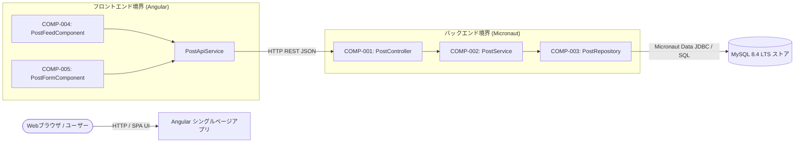
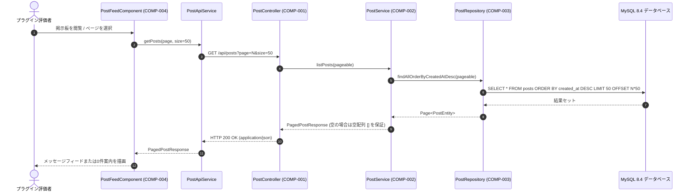
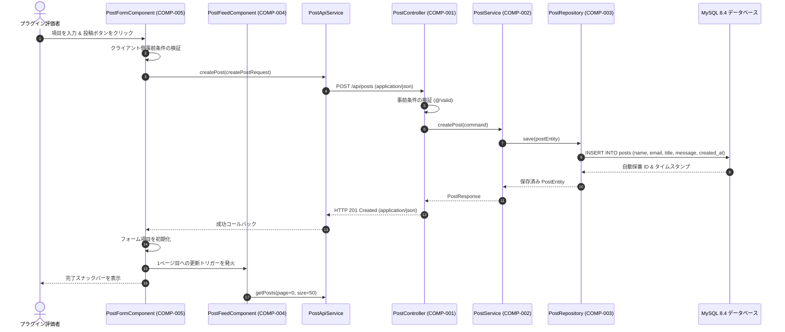

# アーキテクチャおよびコンポーネント設計書: 掲示板アプリケーション（Bulletin Board Application）

## 1. コンポーネント境界とスコープ概要（Component Boundaries & Scope Overview）

### 1.1 アーキテクチャ構成図（Architecture & Component Map）

掲示板アプリケーションは、HTTP REST API を介して通信する Angular シングルページフロントエンドと Micronaut バックエンドサービスからなる疎結合なフルスタックアーキテクチャとして構成されています。



### 1.2 コンポーネント一覧（Component Inventory）

| コンポーネント ID | コンポーネント / クラス名 | スコープ / 境界 | 関連要件 |
| :--- | :--- | :--- | :--- |
| **COMP-001** | `PostController` | バックエンド外部公開 REST インターフェース | `REQ-002`, `REQ-003`, `REQ-007`, `REQ-008`, `REQ-009`, `REQ-010` |
| **COMP-002** | `PostService` | バックエンドドメインコアサービス | `REQ-002`, `REQ-003`, `REQ-007`, `REQ-008`, `REQ-009` |
| **COMP-003** | `PostRepository` | バックエンド永続化アダプター (Micronaut Data JDBC) | `REQ-002`, `REQ-003`, `REQ-007` |
| **COMP-004** | `PostFeedComponent` | フロントエンド UI 描画およびページネーション (Angular Material) | `REQ-002`, `REQ-003`, `REQ-004`, `REQ-005`, `REQ-006`, `REQ-010` |
| **COMP-005** | `PostFormComponent` | フロントエンド下部固定フォーム (Angular Reactive Forms) | `REQ-001`, `REQ-007`, `REQ-008`, `REQ-009`, `REQ-010` |

---

## 2. インタラクションモデリング（Interaction Modeling）

### 2.1 ページ分割されたメッセージフィードの取得（一覧閲覧）



### 2.2 新規メッセージの投稿



---

## 3. データモデルとスキーマ制約（Data Models & Schema Constraints）

すべてのペイロードおよびモデルは JSON Schema および SQL 2016 制約定義に準拠しています。

### 3.1 `CreatePostRequest` (入力ペイロード / DTO)
- **形式**: JSON Schema / Java Record DTO

| フィールド名 | 型 | 必須 / 任意 | 制約条件 | 説明 |
| :--- | :--- | :--- | :--- | :--- |
| `name` | `string` | 必須 | `minLength: 1`, `maxLength: 50`, `pattern: "^(?!\\s*$).+"` | 投稿者表示名（空白文字のみ不可） |
| `email` | `string` | 任意 | `maxLength: 254`, `format: "email"` | 公開表示用の任意メールアドレス |
| `title` | `string` | 必須 | `minLength: 1`, `maxLength: 100`, `pattern: "^(?!\\s*$).+"` | メッセージタイトル（空白文字のみ不可） |
| `message` | `string` | 必須 | `minLength: 1`, `maxLength: 4000`, `pattern: "^(?!\\s*$).+"` | メッセージ本文（空白文字のみ不可） |

### 3.2 `PostResponse` (出力ペイロード / DTO)
- **形式**: JSON Schema / Java Record DTO

| フィールド名 | 型 | 必須 / 任意 | 制約条件 | 説明 |
| :--- | :--- | :--- | :--- | :--- |
| `id` | `integer` (int64) | 必須 | `minimum: 1` | 一意なデータベース識別子 |
| `name` | `string` | 必須 | `minLength: 1`, `maxLength: 50` | 投稿者表示名 |
| `email` | `string` | 任意 (nullable) | `maxLength: 254` | 投稿者公開メールアドレス（省略時は `null`） |
| `title` | `string` | 必須 | `minLength: 1`, `maxLength: 100` | メッセージタイトル |
| `message` | `string` | 必須 | `minLength: 1`, `maxLength: 4000` | メッセージ本文 |
| `created_at` | `string` | 必須 | `format: "date-time"` (ISO 8601 UTC) | 投稿タイムスタンプ |

### 3.3 `PagedPostResponse` (出力ペイロード / DTO)
- **形式**: JSON Schema / Java Record DTO

| フィールド名 | 型 | 必須 / 任意 | 制約条件 | 説明 |
| :--- | :--- | :--- | :--- | :--- |
| `items` | `array<PostResponse>` | 必須 | `minItems: 0 (guaranteed [] on empty)` | 投稿一覧（0件時も空配列 `[]` を保証し null や省略不可） |
| `page` | `integer` | 必須 | `minimum: 0` | 0始まりの現在ページ番号 |
| `size` | `integer` | 必須 | `minimum: 1`, `maximum: 50`, `default: 50` | ページサイズ上限 |
| `total_items` | `integer` (int64) | 必須 | `minimum: 0` | 記録されている全投稿数 |
| `total_pages` | `integer` | 必須 | `minimum: 0` | 総ページ数 |

### 3.4 `posts` テーブル (データベースエンティティモデル)
- **保存先**: MySQL 8.4 LTS
- **照合順序**: `utf8mb4_unicode_ci`

| カラム名 | データ型 | Null許容 | キー / デフォルト値 | インデックス | 説明 |
| :--- | :--- | :--- | :--- | :--- | :--- |
| `id` | `BIGINT` | No | PK, `AUTO_INCREMENT` | Primary | 一意な投稿レコード連番 |
| `name` | `VARCHAR(50)` | No | なし | なし | 投稿者名 |
| `email` | `VARCHAR(254)` | Yes | `DEFAULT NULL` | なし | 公開メールアドレス |
| `title` | `VARCHAR(100)` | No | なし | なし | 投稿タイトル |
| `message` | `TEXT` | No | なし | なし | 投稿メッセージ本文 |
| `created_at` | `DATETIME(6)` | No | `DEFAULT CURRENT_TIMESTAMP(6)` | `idx_posts_created_at_desc (created_at DESC)` | マイクロ秒精度の作成日時 |

---

## 4. 入出力プロトコル（Input / Output Protocols）

### 4.1 ネットワークおよび API プロトコル
- **トランスポート**: TCP 上の HTTP/1.1 または HTTP/2。
- **コンテンツネゴシエーション**:
  - リクエスト: `Content-Type: application/json; charset=UTF-8`, `Accept: application/json`
  - レスポンス: 正常時 `Content-Type: application/json; charset=UTF-8`, エラー時 `Content-Type: application/problem+json; charset=UTF-8`
- **エンドポイント**:
  1. `GET /api/posts`
     - クエリパラメータ: `page` (整数、デフォルト 0、最小 0)、`size` (整数、デフォルト 50、最小 1、最大 50)。
     - レスポンス: `200 OK`（`PagedPostResponse` を返却）。
  2. `POST /api/posts`
     - リクエストボディ: `CreatePostRequest`。
     - レスポンス: `201 Created`（`PostResponse` および `Location: /api/posts/{id}` ヘッダーを返却）。
- **タイムアウト**: クライアント接続タイムアウト: 5,000ms、読み込みタイムアウト: 10,000ms。

---

## 5. コンポーネント契約（契約による設計: DbC）

### 5.1 COMP-001: `PostController`
- **役割**: REST API 境界を公開・保護し、HTTP ペイロードをドメインリクエストにバインドしてレスポンスを生成する。
- **公開シグネチャ**:
  - `HttpResponse<PagedPostResponse> listPosts(@QueryValue(defaultValue = "0") int page, @QueryValue(defaultValue = "50") int size)`
  - `HttpResponse<PostResponse> createPost(@Body @Valid CreatePostRequest request)`
- **事前条件（呼び出し側の義務）**:
  - 呼び出し側は、ボディが存在する場合、`Content-Type: application/json` を伴う正しい形式の HTTP リクエストを送信しなければならない。
  - 呼び出し側は、`CreatePostRequest` に定義されたバリデーション制約を満たさなければならない。
  - 呼び出し側は、`page` に0以上の整数、`size` に1〜50の整数を指定しなければならない。
- **事後条件（呼び出し先が保証する結果）**:
  - `listPosts` において、呼び出し先は `PagedPostResponse` とともに `200 OK` を返さなければならない。該当レコードが0件の場合、`items` が空の配列 `[]` であることを保証しなければならない（決して `null` や省略にしてはならない）。
  - `createPost` において、呼び出し先はサーバーが生成した `id` と `created_at` を含む永続化済み `PostResponse` とともに `201 Created` を返さなければならない。
  - バリデーションエラー時、呼び出し先は詳細な `invalid_params` を含む RFC 9457 準拠の `400 Bad Request` を返さなければならない。
  - 予期しないシステム障害時、呼び出し先は内部スタックトレースを露出することなく RFC 9457 準拠の `500 Internal Server Error` を返さなければならない。
- **不変条件**:
  - コントローラーはステートレスかつスレッドセーフを維持しなければならない。

### 5.2 COMP-002: `PostService`
- **役割**: ビジネスバリデーション、エンティティ生成、タイムスタンプ付与、およびリポジトリ連携を統括する。
- **公開シグネチャ**:
  - `PagedPostResponse getPagedPosts(int page, int size)`
  - `PostResponse createPost(CreatePostRequest command)`
- **事前条件（呼び出し側の義務）**:
  - 呼び出し側は、スキーマ制約を満たす null でないコマンドオブジェクトを渡さなければならない。
  - 呼び出し側は、`page >= 0` かつ `1 <= size <= 50` であることを保証しなければならない。
- **事後条件（呼び出し先が保証する結果）**:
  - 呼び出し先は、レコードが存在しない場合に `items` が確実に null でない空配列 `[]` である `PagedPostResponse` を返さなければならない。
  - 呼び出し先は、永続化前に新規作成された投稿に現在の UTC タイムスタンプを割り当てなければならない。
  - 呼び出し先は、チェックされたビジネス例外を伝播するか、未処理のストレージエラーを安全にラップしなければならない。
- **不変条件**:
  - サービスは、読み取り専用メソッド（`getPagedPosts`）においてデータを変更してはならない。

### 5.3 COMP-003: `PostRepository`
- **役割**: MySQL 8.4 に対する Micronaut Data JDBC によるデータベースクエリを実行する。
- **公開シグネチャ**:
  - `Page<PostEntity> findAll(Pageable pageable)`
  - `PostEntity save(PostEntity entity)`
- **事前条件（呼び出し側の義務）**:
  - 呼び出し側は、`created_at` の降順ソートが指定された有効な `Pageable` インスタンスを渡さなければならない。
  - 呼び出し側は、null でない `PostEntity` インスタンスを提供しなければならない。
- **事後条件（呼び出し先が保証する結果）**:
  - 呼び出し先は、該当レコードが存在しない場合、コンテンツリストが空配列 `[]` である（決して null でない）`Page<PostEntity>` を返さなければならない。
  - 呼び出し先は、新規レコードを永続化し、自動採番された `id` を設定しなければならない。
- **不変条件**:
  - データベースのトランザクション境界は維持されなければならず、失敗したトランザクションは安全にロールバックされなければならない。

### 5.4 COMP-004: `PostFeedComponent` (Angular)
- **役割**: 投稿の時系列逆順一覧、0件時のプレースホルダー、およびページネーションコントロールを描画する。
- **公開シグネチャ**:
  - `loadPage(pageIndex: number): void`
  - `refresh(): void`
- **事前条件（呼び出し側の義務）**:
  - 呼び出し側（Angular ランタイムまたはユーザー）は、バックエンドへの有効なネットワーク接続がある状態でライフサイクルフックを発火させなければならない。
- **事後条件（呼び出し先が保証する結果）**:
  - 呼び出し先は、`PagedPostResponse` から受信した項目を描画しなければならない。
  - 呼び出し先は、`items.length === 0` の場合に0件案内テンプレートを描画しなければならない。
  - 呼び出し先は、投稿者名、フォーマットされた投稿日時、タイトル、メッセージ本文、およびメールアドレス（存在する場合）を描画しなければならない。
  - 呼び出し先は、`items` が空配列 `[]` であってもクラッシュしてはならない。
- **不変条件**:
  - フィードコンポーネントは、`PostFormComponent` の状態を変更または消去してはならない。

### 5.5 COMP-005: `PostFormComponent` (Angular)
- **役割**: 画面下部に固定された入力フォームを描画し、リアクティブフォームの状態を管理し、クライアント側バリデーションを実行して送信を発火する。
- **公開シグネチャ**:
  - `onSubmit(): void`
  - `resetForm(): void`
- **事前条件（呼び出し側の義務）**:
  - ユーザーは、フォームコントロールに入力を行い、送信操作を発火させなければならない。
- **事後条件（呼び出し先が保証する結果）**:
  - 呼び出し先は、固定配置（`position: fixed; bottom: 0`）を用いてフォームコンテナをビューポートの最下部に固定しなければならない。
  - 送信成功時、呼び出し先は `resetForm()` を呼び出し、`PostFeedComponent` のフィード更新を発火させ、Angular Material の Snackbar 通知を表示しなければならない。
  - バリデーションエラーまたは送信失敗時、呼び出し先は入力された値を維持し、コントロールを touched 状態にして項目レベルの検証エラーを表示しなければならない。
- **不変条件**:
  - フォームコンポーネントは、`PostFeedComponent` のスクロール位置に関わらず、常にアクセス可能かつ可視状態を維持しなければならない。

---

## 6. エラーおよび例外処理（RFC 9457 および例外階層）

### 6.1 標準エラーエンベロープ（RFC 9457）
外部エンドポイントは `application/problem+json` に準拠したエラー詳細を返却します。

```json
{
  "type": "https://example.com/errors/validation-failed",
  "title": "Validation Failed",
  "status": 400,
  "detail": "Input payload failed validation constraints.",
  "instance": "/api/posts",
  "invalid_params": [
    {
      "name": "name",
      "reason": "Name must not be blank and must be between 1 and 50 characters."
    }
  ]
}
```

### 6.2 内部ドメイン例外階層
- `BulletinBoardException`（抽象チェック実行時例外）
  - `PostValidationException`: 入力ビジネスバリデーション失敗時にスローされる。
  - `PostStorageException`: リレーショナルデータベース操作失敗時にスローされる。
  - `PostNotFoundException`: 将来の拡張用（ID によるリソース取得時等に利用）。

---

## 7. 主要な設計決定事項とアーキテクチャ上のトレードオフ（Key Design Decisions & Architectural Trade-offs）

- **フレームワークおよび実行ランタイムの選定**:
  - **採用したアプローチ**: Java 25 LTS (Corretto) 上の Micronaut 4.x および Gradle (Kotlin DSL)。
  - **検討した代替案**: Spring Boot 3.x および Maven。
  - **選定理由とトレードオフ**: Micronaut の AOT（事前コンパイル）による低メモリ消費（約50MB vs 約250MB RSS）とサブ秒の高速起動により、テストスイートやエージェント実行環境での迅速なフィードバックを実現。Java 25 LTS により長期的な安定性と最新の言語機能を提供。Spring Boot に比べコミュニティスターターが少なめであるものの、単一ドメインの評価用アプリケーションとしては十分に扱いやすく、起動速度とリソース効率のメリットが上回る。

- **永続化技術とデータアクセス方式**:
  - **採用したアプローチ**: MySQL 8.4 LTS、Flyway マイグレーション、および Micronaut Data JDBC。
  - **検討した代替案**: Hibernate / Jakarta Persistence (JPA) 等のフルスタック ORM、またはリアクティブ R2DBC。
  - **選定理由とトレードオフ**: コンパイル時に SQL クエリを事前生成・検証することで、実行時リフレクションの排除、エンティティライフサイクル管理の複雑さ、セッションキャッシュオーバーヘッド、N+1 や LazyLoading 問題を完全に回避。単一の主要エンティティ（`PostEntity`）に対して重量級 ORM は過剰な複雑性をもたらすため JDBC アダプターが最適。明示的な Flyway マイグレーションスクリプトの作成が必要になるトレードオフを受容。

- **フロントエンド設計とビューポート配置戦略**:
  - **採用したアプローチ**: Angular + Angular Material を採用し、画面下部に固定された投稿フォーム（`position: fixed; bottom: 0`）と計算されたスクロール領域（`height: calc(100vh - formHeight); overflow-y: auto`）を構成。
  - **検討した代替案**: 画面上部にインライン配置された従来のフォーム、または別ルート（`/new`）への画面遷移。
  - **選定理由とトレードオフ**: `REQ-001` で規定された「常に画面下部に投稿フォームを維持し、閲覧文脈を損なわずに即時投稿・更新できる」ユーザー体験を直接実現。下部固定フォームが最新投稿やページネーターを覆い隠さないよう、厳密なビューポート計算と CSS パディング設計が必須となるトレードオフを受容。

- **ページネーションとソート戦略**:
  - **採用したアプローチ**: 1ページあたり50件のオフセットベース（`page`, `size=50`）ページネーションと、`created_at DESC` の専用降順インデックス付与。
  - **検討した代替案**: Keyset / カーソルベース（タイムスタンプまたは ID トークン）ページネーション。
  - **選定理由とトレードオフ**: 要件で明示された「50件ごとのページネーション」UI（`MatPaginator` 等）との親和性が高く、実装の決定性を担保。`idx_posts_created_at_desc` インデックスにより評価データ規模でのオフセット性能劣化は無視できる。ページ移動中に新規投稿があった場合のわずかなページドリフト（重複やスキップ）の可能性をトレードオフとして許容。

- **エラーレスポンス契約の標準化**:
  - **採用したアプローチ**: RFC 9457 Problem Details (`application/problem+json`) および構造化された `invalid_params` 配列。
  - **検討した代替案**: 独自形式の JSON エラーラッパー（例: `{ "error": "...", "status": 400 }`）やフレームワーク標準のエラーページ。
  - **選定理由とトレードオフ**: クライアント UI および自動統合テストに対して、業界標準の機械可読なバリデーションエラー構造を提供し、内部スタックトレースの露出を防止。Micronaut 側で Bean Validation 例外を RFC 9457 に変換する明示的な例外ハンドラーの実装が必要になるトレードオフを受容。
