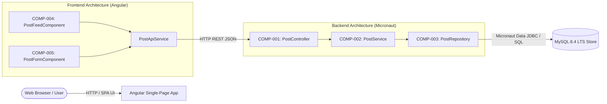
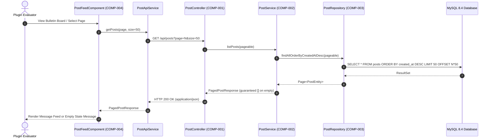
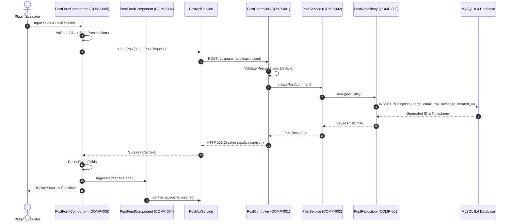

# Architecture & Component Design: Bulletin Board Application

## 1. Component Boundaries & Scope Overview

### 1.1 Architecture & Component Map

The bulletin board application is structured as a decoupled full-stack architecture comprising an Angular single-page frontend and a Micronaut backend service communicating via HTTP REST APIs.



### 1.2 Component Inventory

| Component ID | Component / Class Name | Scope / Boundary | Linked Requirements |
| :--- | :--- | :--- | :--- |
| **COMP-001** | `PostController` | Backend External REST Interface | `REQ-002`, `REQ-003`, `REQ-007`, `REQ-008`, `REQ-009`, `REQ-010` |
| **COMP-002** | `PostService` | Backend Domain Core Service | `REQ-002`, `REQ-003`, `REQ-007`, `REQ-008`, `REQ-009` |
| **COMP-003** | `PostRepository` | Backend Persistence Adapter (Micronaut Data JDBC) | `REQ-002`, `REQ-003`, `REQ-007` |
| **COMP-004** | `PostFeedComponent` | Frontend UI View & Pagination (Angular Material) | `REQ-002`, `REQ-003`, `REQ-004`, `REQ-005`, `REQ-006`, `REQ-010` |
| **COMP-005** | `PostFormComponent` | Frontend Persistent Form (Angular Reactive Forms) | `REQ-001`, `REQ-007`, `REQ-008`, `REQ-009`, `REQ-010` |

---

## 2. Interaction Modeling

### 2.1 Fetching Paged Message Feed (Browse)



### 2.2 Submitting a New Message



---

## 3. Data Models & Schema Constraints

All payloads and models conform to JSON Schema and SQL 2016 constraint definitions.

### 3.1 `CreatePostRequest` (Input Payload / DTO)
- **Format**: JSON Schema / Java Record DTO

| Field Name | Type | Required / Optional | Constraints | Description |
| :--- | :--- | :--- | :--- | :--- |
| `name` | `string` | Required | `minLength: 1`, `maxLength: 50`, `pattern: "^(?!\\s*$).+"` | Contributor display name (non-whitespace) |
| `email` | `string` | Optional | `maxLength: 254`, `format: "email"` | Optional contributor email for public display |
| `title` | `string` | Required | `minLength: 1`, `maxLength: 100`, `pattern: "^(?!\\s*$).+"` | Message title (non-whitespace) |
| `message` | `string` | Required | `minLength: 1`, `maxLength: 4000`, `pattern: "^(?!\\s*$).+"` | Message body content (non-whitespace) |

### 3.2 `PostResponse` (Output Payload / DTO)
- **Format**: JSON Schema / Java Record DTO

| Field Name | Type | Required / Optional | Constraints | Description |
| :--- | :--- | :--- | :--- | :--- |
| `id` | `integer` (int64) | Required | `minimum: 1` | Unique database identifier |
| `name` | `string` | Required | `minLength: 1`, `maxLength: 50` | Contributor display name |
| `email` | `string` | Optional (nullable) | `maxLength: 254` | Contributor public email, or `null` if omitted |
| `title` | `string` | Required | `minLength: 1`, `maxLength: 100` | Message title |
| `message` | `string` | Required | `minLength: 1`, `maxLength: 4000` | Message body content |
| `created_at` | `string` | Required | `format: "date-time"` (ISO 8601 UTC) | Submission timestamp |

### 3.3 `PagedPostResponse` (Output Payload / DTO)
- **Format**: JSON Schema / Java Record DTO

| Field Name | Type | Required / Optional | Constraints | Description |
| :--- | :--- | :--- | :--- | :--- |
| `items` | `array<PostResponse>` | Required | `minItems: 0 (guaranteed [] on empty)` | List of post items (never omitted or null) |
| `page` | `integer` | Required | `minimum: 0` | Zero-based current page index |
| `size` | `integer` | Required | `minimum: 1`, `maximum: 50`, `default: 50` | Page size limit |
| `total_items` | `integer` (int64) | Required | `minimum: 0` | Total number of recorded posts |
| `total_pages` | `integer` | Required | `minimum: 0` | Total number of available pages |

### 3.4 `posts` Table (Database Entity Model)
- **Storage Target**: MySQL 8.4 LTS
- **Collation**: `utf8mb4_unicode_ci`

| Column Name | Data Type | Nullable | Key / Default | Indexes | Description |
| :--- | :--- | :--- | :--- | :--- | :--- |
| `id` | `BIGINT` | No | PK, `AUTO_INCREMENT` | Primary | Unique post record sequence |
| `name` | `VARCHAR(50)` | No | None | None | Contributor name |
| `email` | `VARCHAR(254)` | Yes | `DEFAULT NULL` | None | Public email address |
| `title` | `VARCHAR(100)` | No | None | None | Post title |
| `message` | `TEXT` | No | None | None | Post message content |
| `created_at` | `DATETIME(6)` | No | `DEFAULT CURRENT_TIMESTAMP(6)` | `idx_posts_created_at_desc (created_at DESC)` | Creation timestamp with microsecond resolution |

---

## 4. Input / Output Protocols

### 4.1 Network & API Protocols
- **Transport**: HTTP/1.1 or HTTP/2 over TCP.
- **Content Negotiation**:
  - Request: `Content-Type: application/json; charset=UTF-8`, `Accept: application/json`
  - Response: `Content-Type: application/json; charset=UTF-8` on success, `Content-Type: application/problem+json; charset=UTF-8` on error.
- **Endpoints**:
  1. `GET /api/posts`
     - Query Parameters: `page` (integer, default 0, min 0), `size` (integer, default 50, min 1, max 50).
     - Response: `200 OK` with `PagedPostResponse`.
  2. `POST /api/posts`
     - Request Body: `CreatePostRequest`.
     - Response: `201 Created` with `PostResponse` and `Location: /api/posts/{id}`.
- **Timeouts**: Client connect timeout: 5,000ms; read timeout: 10,000ms.

---

## 5. Component Contracts (Design by Contract - RFC 2119 / RFC 8174)

### 5.1 COMP-001: `PostController`
- **Role**: Exposes and guards the REST API boundary, binding HTTP payloads to domain requests and formatting responses.
- **Public Signatures**:
  - `HttpResponse<PagedPostResponse> listPosts(@QueryValue(defaultValue = "0") int page, @QueryValue(defaultValue = "50") int size)`
  - `HttpResponse<PostResponse> createPost(@Body @Valid CreatePostRequest request)`
- **Preconditions (Caller Obligations)**:
  - Caller MUST send well-formed HTTP requests with `Content-Type: application/json` where a body is present.
  - Caller MUST satisfy validation constraints defined in `CreatePostRequest`.
  - Caller MUST provide non-negative integer for `page` and an integer between 1 and 50 for `size`.
- **Postconditions (Callee Guarantees)**:
  - For `listPosts`, callee MUST return `200 OK` with `PagedPostResponse`. When 0 records match, callee MUST guarantee `items` is an empty array `[]` (never `null` or omitted).
  - For `createPost`, callee MUST return `201 Created` with the persisted `PostResponse` including server-generated `id` and `created_at`.
  - On validation error, callee MUST return `400 Bad Request` conforming to RFC 9457 with detailed `invalid_params`.
  - On unexpected system failure, callee MUST return `500 Internal Server Error` conforming to RFC 9457 without leaking internal stack traces.
- **Invariants**:
  - The controller MUST remain stateless and thread-safe.

### 5.2 COMP-002: `PostService`
- **Role**: Coordinates business validation, entity creation, timestamp generation, and repository interaction.
- **Public Signatures**:
  - `PagedPostResponse getPagedPosts(int page, int size)`
  - `PostResponse createPost(CreatePostRequest command)`
- **Preconditions (Caller Obligations)**:
  - Caller MUST pass non-null command objects satisfying schema constraints.
  - Caller MUST ensure `page >= 0` and `1 <= size <= 50`.
- **Postconditions (Callee Guarantees)**:
  - Callee MUST return a non-null `PagedPostResponse` with `items` guaranteed to be non-null and empty `[]` when no records exist.
  - Callee MUST assign the current UTC timestamp to newly created posts before persisting.
  - Callee MUST propagate checked business exceptions or wrap unhandled storage errors safely.
- **Invariants**:
  - The service MUST NOT mutate data in read-only methods (`getPagedPosts`).

### 5.3 COMP-003: `PostRepository`
- **Role**: Executes database queries using Micronaut Data JDBC against MySQL 8.4.
- **Public Signatures**:
  - `Page<PostEntity> findAll(Pageable pageable)`
  - `PostEntity save(PostEntity entity)`
- **Preconditions (Caller Obligations)**:
  - Caller MUST pass valid `Pageable` instances with sorting descending by `created_at`.
  - Caller MUST supply non-null `PostEntity` instances.
- **Postconditions (Callee Guarantees)**:
  - Callee MUST return `Page<PostEntity>` whose content list is empty `[]` (never `null`) when no records match.
  - Callee MUST persist new records and populate the generated sequence `id`.
- **Invariants**:
  - Database transactional boundaries MUST be preserved; failed transactions MUST be rolled back cleanly.

### 5.4 COMP-004: `PostFeedComponent` (Angular)
- **Role**: Renders the reverse-chronological list of posts, empty placeholder, and pagination controls.
- **Public Signatures**:
  - `loadPage(pageIndex: number): void`
  - `refresh(): void`
- **Preconditions (Caller Obligations)**:
  - Caller (Angular runtime/user) MUST trigger lifecycle hooks with a valid network connection to the backend.
- **Postconditions (Callee Guarantees)**:
  - Callee MUST render items received from `PagedPostResponse`.
  - Callee MUST render the empty notification template when `items.length === 0`.
  - Callee MUST render contributor name, formatted submission timestamp, title, message body, and email (when present).
  - Callee MUST NOT crash if `items` is empty `[]`.
- **Invariants**:
  - The feed component MUST NOT clear or alter the state of `PostFormComponent`.

### 5.5 COMP-005: `PostFormComponent` (Angular)
- **Role**: Renders the persistent bottom-anchored form, manages reactive form state, performs client validation, and triggers submission.
- **Public Signatures**:
  - `onSubmit(): void`
  - `resetForm(): void`
- **Preconditions (Caller Obligations)**:
  - User MUST provide input into form controls and trigger submission.
- **Postconditions (Callee Guarantees)**:
  - Callee MUST anchor the form container to the bottom of the viewport using fixed positioning (`position: fixed; bottom: 0`).
  - On submission success, callee MUST invoke `resetForm()`, trigger feed refresh on `PostFeedComponent`, and display an Angular Material Snackbar notification.
  - On validation or submission failure, callee MUST retain entered values, mark controls as touched, and display field-level validation errors.
- **Invariants**:
  - The form component MUST remain accessible and visible regardless of scroll position in `PostFeedComponent`.

---

## 6. Error & Exception Handling (RFC 9457 & Exception Hierarchy)

### 6.1 Standard Error Envelope (RFC 9457)
External endpoints return error details conforming to `application/problem+json`:

```json
{
  "type": "https://example.com/errors/validation-failed",
  "title": "Validation Failed",
  "status": 400,
  "detail": "Input payload failed validation constraints.",
  "instance": "/api/posts",
  "invalid_params": [
    {
      "name": "name",
      "reason": "Name must not be blank and must be between 1 and 50 characters."
    }
  ]
}
```

### 6.2 Internal Domain Exceptions Hierarchy
- `BulletinBoardException` (abstract checked runtime exception)
  - `PostValidationException`: Thrown when input business validation fails.
  - `PostStorageException`: Thrown when relational database operations fail.
  - `PostNotFoundException`: Reserved for resource retrieval by ID (future extensibility).

---

## 7. Key Design Decisions & Architectural Trade-offs

- **Framework & Runtime Platform**:
  - **Selected Approach**: Micronaut 4.x with Java 25 LTS (Corretto) and Gradle (Kotlin DSL).
  - **Alternative Considered**: Spring Boot 3.x with Maven.
  - **Rationale & Trade-off**: Micronaut provides ahead-of-time (AOT) compilation with minimal memory footprint (~50MB vs ~250MB RSS) and sub-second startup times, ensuring rapid feedback cycles during automated testing and agent execution. Java 25 LTS delivers long-term stability and modern language features. The accepted trade-off is a slightly smaller ecosystem and fewer community starters compared to Spring Boot, which is easily managed for a focused bulletin board domain.

- **Persistence Architecture & Query Execution**:
  - **Selected Approach**: Micronaut Data JDBC with MySQL 8.4 LTS and Flyway database migrations.
  - **Alternative Considered**: Hibernate / Jakarta Persistence (JPA) ORM or reactive R2DBC.
  - **Rationale & Trade-off**: Micronaut Data JDBC pre-computes SQL queries at compile time with zero runtime reflection, avoiding the complexity of entity lifecycle management, session-level caching, detached entity synchronization, and N+1 lazy loading issues. For a bulletin board domain model with a single primary entity (`PostEntity`), a heavy ORM introduces unnecessary overhead. The accepted trade-off is the absence of automatic schema generation, requiring explicit Flyway migration scripts and manual DTO mapping for complex projections.

- **Frontend Architecture & Viewport Layout Strategy**:
  - **Selected Approach**: Decoupled Angular SPA with Angular Material, featuring a viewport-anchored fixed bottom submission form (`position: fixed; bottom: 0`) and dynamically calculated scrollable feed container (`height: calc(100vh - formHeight); overflow-y: auto`).
  - **Alternative Considered**: Traditional top-flow inline form, or a multi-page routed submission flow (`/new`).
  - **Rationale & Trade-off**: Directly fulfills `REQ-001` by keeping the submission form persistently accessible without disorienting evaluators from the current message stream. Submissions immediately refresh page 0 while preserving input context. The accepted trade-off is requiring rigid CSS viewport layout calculations to prevent form elements from occluding the latest feed items or paginator controls.

- **Pagination Mechanism & Indexing Strategy**:
  - **Selected Approach**: Offset-based numbered pagination (`page`, `size=50`) supported by a dedicated descending index on `created_at DESC`.
  - **Alternative Considered**: Keyset / cursor-based pagination tokenized by timestamp or ID.
  - **Rationale & Trade-off**: Offset pagination directly satisfies the explicit 50-item numbered pagination requirement (`REQ-003`) and seamlessly binds to standard UI paginator components (`MatPaginator`). Given the evaluation scope, the performance overhead of `OFFSET` is negligible when accelerated by `idx_posts_created_at_desc`. The accepted trade-off is the potential for minor page drift (duplicate or skipped items) if new posts are submitted concurrently while an evaluator navigates between pages.

- **API Error Contract Standardization**:
  - **Selected Approach**: RFC 9457 Problem Details for HTTP APIs (`application/problem+json`) with structured `invalid_params` arrays.
  - **Alternative Considered**: Ad-hoc custom JSON error wrappers (e.g. `{ "error": "...", "status": 400 }`) or default framework error pages.
  - **Rationale & Trade-off**: RFC 9457 provides an industry-standard, machine-readable format for both client UI error rendering and automated integration test assertions, preventing internal stack trace leakage while conveying precise field-level validation errors. The accepted trade-off is authoring custom Micronaut exception handlers to map Bean Validation errors into compliant RFC 9457 envelopes.
