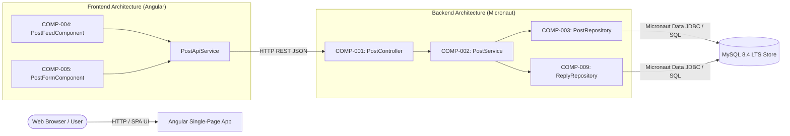
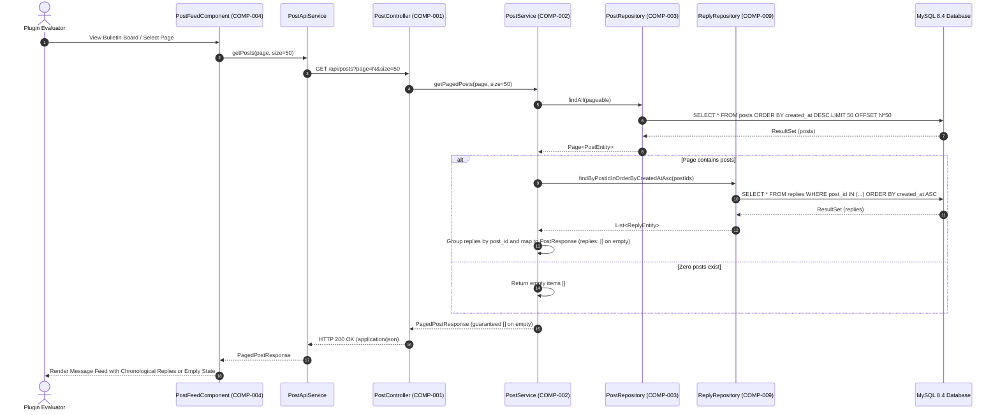
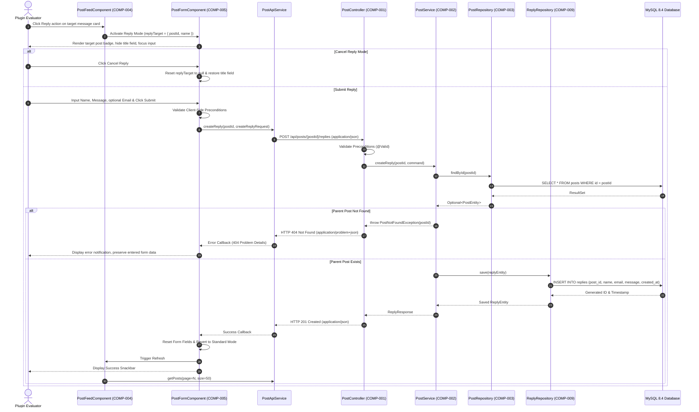

# Architecture & Component Design: Bulletin Board Application

## 1. Component Boundaries & Scope Overview

### 1.1 Architecture & Component Map

The bulletin board application is structured as a decoupled full-stack architecture comprising an Angular single-page frontend and a Micronaut backend service communicating via HTTP REST APIs.



### 1.2 Component Inventory

| Component ID | Component / Class Name | Scope / Boundary | Linked Requirements |
| :--- | :--- | :--- | :--- |
| **COMP-001** | `PostController` | Backend External REST Interface | `REQ-002`, `REQ-003`, `REQ-007`, `REQ-008`, `REQ-009`, `REQ-010`, `REQ-011`, `REQ-014`, `REQ-015` |
| **COMP-002** | `PostService` | Backend Domain Core Service | `REQ-002`, `REQ-003`, `REQ-007`, `REQ-008`, `REQ-009`, `REQ-011`, `REQ-014`, `REQ-015` |
| **COMP-003** | `PostRepository` | Backend Persistence Adapter for Posts (Micronaut Data JDBC) | `REQ-002`, `REQ-003`, `REQ-007` |
| **COMP-004** | `PostFeedComponent` | Frontend UI View & Pagination (Angular Material) | `REQ-002`, `REQ-003`, `REQ-004`, `REQ-005`, `REQ-006`, `REQ-010`, `REQ-011`, `REQ-012` |
| **COMP-005** | `PostFormComponent` | Frontend Persistent Form (Angular Reactive Forms) | `REQ-001`, `REQ-007`, `REQ-008`, `REQ-009`, `REQ-010`, `REQ-012`, `REQ-013`, `REQ-014`, `REQ-015` |
| **COMP-009** | `ReplyRepository` | Backend Persistence Adapter for Replies (Micronaut Data JDBC) | `REQ-011`, `REQ-014`, `REQ-015` |

---

## 2. Interaction Modeling

### 2.1 Fetching Paged Message Feed & Replies (Browse)



### 2.2 Submitting a New Message


### 2.3 Submitting a Reply to an Existing Message



---

## 3. Data Models & Schema Constraints

All payloads and models conform to JSON Schema and SQL 2016 constraint definitions.

### 3.1 `CreatePostRequest` (Input Payload / DTO)
- **Format**: JSON Schema / Java Record DTO

| Field Name | Type | Required / Optional | Constraints | Description |
| :--- | :--- | :--- | :--- | :--- |
| `name` | `string` | Required | `minLength: 1`, `maxLength: 50`, `pattern: "^(?!\\s*$).+"` | Contributor display name (non-whitespace) |
| `email` | `string` | Optional | `maxLength: 254`, `format: "email"` | Optional contributor email for public display |
| `title` | `string` | Required | `minLength: 1`, `maxLength: 100`, `pattern: "^(?!\\s*$).+"` | Message title (non-whitespace) |
| `message` | `string` | Required | `minLength: 1`, `maxLength: 4000`, `pattern: "^(?!\\s*$).+"` | Message body content (non-whitespace) |

### 3.2 `CreateReplyRequest` (Input Payload / DTO)
- **Format**: JSON Schema / Java Record DTO

| Field Name | Type | Required / Optional | Constraints | Description |
| :--- | :--- | :--- | :--- | :--- |
| `name` | `string` | Required | `minLength: 1`, `maxLength: 50`, `pattern: "^(?!\\s*$).+"` | Contributor display name (non-whitespace) |
| `email` | `string` | Optional | `maxLength: 254`, `format: "email"` | Optional contributor email for public display |
| `message` | `string` | Required | `minLength: 1`, `maxLength: 4000`, `pattern: "^(?!\\s*$).+"` | Reply body content (non-whitespace) |

### 3.3 `ReplyResponse` (Output Payload / DTO)
- **Format**: JSON Schema / Java Record DTO

| Field Name | Type | Required / Optional | Constraints | Description |
| :--- | :--- | :--- | :--- | :--- |
| `id` | `integer` (int64) | Required | `minimum: 1` | Unique reply database identifier |
| `post_id` | `integer` (int64) | Required | `minimum: 1` | Identifier of the parent post |
| `name` | `string` | Required | `minLength: 1`, `maxLength: 50` | Contributor display name |
| `email` | `string` | Optional (nullable) | `maxLength: 254` | Contributor public email, or `null` if omitted |
| `message` | `string` | Required | `minLength: 1`, `maxLength: 4000` | Reply body content |
| `created_at` | `string` | Required | `format: "date-time"` (ISO 8601 UTC) | Submission timestamp |

### 3.4 `PostResponse` (Output Payload / DTO)
- **Format**: JSON Schema / Java Record DTO

| Field Name | Type | Required / Optional | Constraints | Description |
| :--- | :--- | :--- | :--- | :--- |
| `id` | `integer` (int64) | Required | `minimum: 1` | Unique database identifier |
| `name` | `string` | Required | `minLength: 1`, `maxLength: 50` | Contributor display name |
| `email` | `string` | Optional (nullable) | `maxLength: 254` | Contributor public email, or `null` if omitted |
| `title` | `string` | Required | `minLength: 1`, `maxLength: 100` | Message title |
| `message` | `string` | Required | `minLength: 1`, `maxLength: 4000` | Message body content |
| `created_at` | `string` | Required | `format: "date-time"` (ISO 8601 UTC) | Submission timestamp |
| `replies` | `array<ReplyResponse>` | Required | `minItems: 0 (guaranteed [] on empty)` | List of associated replies ordered oldest first (never omitted or null) |

### 3.5 `PagedPostResponse` (Output Payload / DTO)
- **Format**: JSON Schema / Java Record DTO

| Field Name | Type | Required / Optional | Constraints | Description |
| :--- | :--- | :--- | :--- | :--- |
| `items` | `array<PostResponse>` | Required | `minItems: 0 (guaranteed [] on empty)` | List of post items (never omitted or null) |
| `page` | `integer` | Required | `minimum: 0` | Zero-based current page index |
| `size` | `integer` | Required | `minimum: 1`, `maximum: 50`, `default: 50` | Page size limit |
| `total_items` | `integer` (int64) | Required | `minimum: 0` | Total number of recorded posts |
| `total_pages` | `integer` | Required | `minimum: 0` | Total number of available pages |

### 3.6 `posts` Table (Database Entity Model)
- **Storage Target**: MySQL 8.4 LTS
- **Collation**: `utf8mb4_unicode_ci`

| Column Name | Data Type | Nullable | Key / Default | Indexes | Description |
| :--- | :--- | :--- | :--- | :--- | :--- |
| `id` | `BIGINT` | No | PK, `AUTO_INCREMENT` | Primary | Unique post record sequence |
| `name` | `VARCHAR(50)` | No | None | None | Contributor name |
| `email` | `VARCHAR(254)` | Yes | `DEFAULT NULL` | None | Public email address |
| `title` | `VARCHAR(100)` | No | None | None | Post title |
| `message` | `TEXT` | No | None | None | Post message content |
| `created_at` | `DATETIME(6)` | No | `DEFAULT CURRENT_TIMESTAMP(6)` | `idx_posts_created_at_desc (created_at DESC)` | Creation timestamp with microsecond resolution |

### 3.7 `replies` Table (Database Entity Model)
- **Storage Target**: MySQL 8.4 LTS
- **Collation**: `utf8mb4_unicode_ci`

| Column Name | Data Type | Nullable | Key / Default | Indexes | Description |
| :--- | :--- | :--- | :--- | :--- | :--- |
| `id` | `BIGINT` | No | PK, `AUTO_INCREMENT` | Primary | Unique reply record sequence |
| `post_id` | `BIGINT` | No | FK `posts(id)` ON DELETE CASCADE | `idx_replies_post_id (post_id)` | Foreign key referencing parent post |
| `name` | `VARCHAR(50)` | No | None | None | Contributor name |
| `email` | `VARCHAR(254)` | Yes | `DEFAULT NULL` | None | Public email address |
| `message` | `TEXT` | No | None | None | Reply message content |
| `created_at` | `DATETIME(6)` | No | `DEFAULT CURRENT_TIMESTAMP(6)` | `idx_replies_created_at_asc (created_at ASC)` | Creation timestamp with microsecond resolution |

---

## 4. Input / Output Protocols

### 4.1 Network & API Protocols
- **Transport**: HTTP/1.1 or HTTP/2 over TCP.
- **Content Negotiation**:
  - Request: `Content-Type: application/json; charset=UTF-8`, `Accept: application/json`
  - Response: `Content-Type: application/json; charset=UTF-8` on success, `Content-Type: application/problem+json; charset=UTF-8` on error.
- **Endpoints**:
  1. `GET /api/posts`
     - Query Parameters: `page` (integer, default 0, min 0), `size` (integer, default 50, min 1, max 50).
     - Response: `200 OK` with `PagedPostResponse` (each item contains embedded `replies: []`).
  2. `POST /api/posts`
     - Request Body: `CreatePostRequest`.
     - Response: `201 Created` with `PostResponse` and `Location: /api/posts/{id}`.
  3. `POST /api/posts/{postId}/replies`
     - Path Parameters: `postId` (int64, minimum 1).
     - Request Body: `CreateReplyRequest`.
     - Response: `201 Created` with `ReplyResponse` and `Location: /api/posts/{postId}/replies/{id}`.
     - Error Responses:
       - `400 Bad Request`: Validation failure on `CreateReplyRequest` with RFC 9457 `invalid_params`.
       - `404 Not Found`: Parent post with `postId` does not exist.
       - `500 Internal Server Error`: Unhandled persistence or server error.
- **Timeouts**: Client connect timeout: 5,000ms; read timeout: 10,000ms.

---

## 5. Component Contracts (Design by Contract - RFC 2119 / RFC 8174)

### 5.1 COMP-001: `PostController`
- **Role**: Exposes and guards the REST API boundary, binding HTTP payloads to domain requests and formatting responses.
- **Public Signatures**:
  - `HttpResponse<PagedPostResponse> listPosts(@QueryValue(defaultValue = "0") int page, @QueryValue(defaultValue = "50") int size)`
  - `HttpResponse<PostResponse> createPost(@Body @Valid CreatePostRequest request)`
  - `HttpResponse<ReplyResponse> createReply(@PathVariable("postId") Long postId, @Body @Valid CreateReplyRequest request)`
- **Preconditions (Caller Obligations)**:
  - Caller MUST send well-formed HTTP requests with `Content-Type: application/json` where a body is present.
  - Caller MUST satisfy validation constraints defined in `CreatePostRequest` or `CreateReplyRequest`.
  - Caller MUST provide a positive int64 identifier (`postId >= 1`) for reply creation.
  - Caller MUST provide non-negative integer for `page` and an integer between 1 and 50 for `size`.
- **Postconditions (Callee Guarantees)**:
  - For `listPosts`, callee MUST return `200 OK` with `PagedPostResponse`. When 0 records match, callee MUST guarantee `items` is an empty array `[]` (never `null` or omitted). Each item in `items` MUST guarantee `replies` is a non-null array (empty `[]` when no replies exist).
  - For `createPost`, callee MUST return `201 Created` with the persisted `PostResponse` including server-generated `id`, `created_at`, and empty `replies: []`.
  - For `createReply`, callee MUST return `201 Created` with the persisted `ReplyResponse` including server-generated `id`, `post_id`, and `created_at`.
  - On validation error, callee MUST return `400 Bad Request` conforming to RFC 9457 with detailed `invalid_params`.
  - When target `postId` does not exist on `createReply`, callee MUST return `404 Not Found` conforming to RFC 9457.
  - On unexpected system failure, callee MUST return `500 Internal Server Error` conforming to RFC 9457 without leaking internal stack traces.
- **Invariants**:
  - The controller MUST remain stateless and thread-safe.

### 5.2 COMP-002: `PostService`
- **Role**: Coordinates business validation, entity creation, timestamp generation, reply aggregation, and repository interaction.
- **Public Signatures**:
  - `PagedPostResponse getPagedPosts(int page, int size)`
  - `PostResponse createPost(CreatePostRequest command)`
  - `ReplyResponse createReply(Long postId, CreateReplyRequest command)`
- **Preconditions (Caller Obligations)**:
  - Caller MUST pass non-null command objects satisfying schema constraints.
  - Caller MUST pass non-null, positive `postId` for reply creation.
  - Caller MUST ensure `page >= 0` and `1 <= size <= 50`.
- **Postconditions (Callee Guarantees)**:
  - Callee MUST return a non-null `PagedPostResponse` with `items` guaranteed to be non-null and empty `[]` when no records exist.
  - In `getPagedPosts`, callee MUST execute a single batch query for replies across all retrieved post IDs (`COMP-009`) and associate replies in ascending order of `created_at` for each post, guaranteeing `replies: []` when no replies exist.
  - Callee MUST assign the current UTC timestamp to newly created posts and replies before persisting.
  - Callee MUST throw `PostNotFoundException` when `createReply` is invoked with a non-existent `postId`.
  - Callee MUST propagate checked business exceptions or wrap unhandled storage errors safely.
- **Invariants**:
  - The service MUST NOT mutate data in read-only methods (`getPagedPosts`).

### 5.3 COMP-003: `PostRepository`
- **Role**: Executes database queries for posts using Micronaut Data JDBC against MySQL 8.4.
- **Public Signatures**:
  - `Page<PostEntity> findAll(Pageable pageable)`
  - `Optional<PostEntity> findById(Long id)`
  - `PostEntity save(PostEntity entity)`
- **Preconditions (Caller Obligations)**:
  - Caller MUST pass valid `Pageable` instances with sorting descending by `created_at`.
  - Caller MUST supply non-null `PostEntity` instances.
- **Postconditions (Callee Guarantees)**:
  - Callee MUST return `Page<PostEntity>` whose content list is empty `[]` (never `null`) when no records match.
  - Callee MUST persist new records and populate the generated sequence `id`.
- **Invariants**:
  - Database transactional boundaries MUST be preserved; failed transactions MUST be rolled back cleanly.

### 5.4 COMP-004: `PostFeedComponent` (Angular)
- **Role**: Renders the reverse-chronological list of posts, associated chronological replies, empty placeholder, and pagination controls.
- **Public Signatures**:
  - `loadPage(pageIndex: number): void`
  - `refresh(): void`
  - `onReplyClick(post: PostResponse): void`
- **Preconditions (Caller Obligations)**:
  - Caller (Angular runtime/user) MUST trigger lifecycle hooks with a valid network connection to the backend.
- **Postconditions (Callee Guarantees)**:
  - Callee MUST render items received from `PagedPostResponse`.
  - Callee MUST render associated replies under each post in ascending order of `created_at`, displaying contributor name, submission timestamp, message content, and email (when present).
  - Callee MUST render a dedicated reply action on each post card that invokes `onReplyClick(post)` and signals `PostFormComponent`.
  - Callee MUST render the empty notification template when `items.length === 0`.
  - Callee MUST NOT crash if `items` is empty `[]` or if a post's `replies` array is empty `[]`.
- **Invariants**:
  - The feed component MUST NOT clear or alter the uncommitted input state of `PostFormComponent`.

### 5.5 COMP-005: `PostFormComponent` (Angular)
- **Role**: Renders the persistent bottom-anchored form, manages reactive form state across standard and reply modes, performs client validation, and triggers submission.
- **Public Signatures**:
  - `onSubmit(): void`
  - `resetForm(): void`
  - `setReplyTarget(target: PostResponse | null): void`
  - `cancelReply(): void`
- **Preconditions (Caller Obligations)**:
  - User MUST provide input into form controls and trigger submission.
- **Postconditions (Callee Guarantees)**:
  - Callee MUST anchor the form container to the bottom of the viewport using fixed positioning (`position: fixed; bottom: 0`).
  - While `replyTarget` is non-null ("Reply Mode"), callee MUST render a target indicator badge displaying the target post identifier and author, MUST hide or omit the title input field, and MUST disable title validation constraints.
  - Callee MUST provide a cancel button during Reply Mode that invokes `cancelReply()`, clears `replyTarget`, and restores the title field in standard mode.
  - On submission success in either mode, callee MUST invoke `resetForm()`, restore standard mode, trigger feed refresh on `PostFeedComponent`, and display an Angular Material Snackbar notification.
  - On validation or submission failure, callee MUST retain entered values, mark controls as touched, and display field-level validation errors without discarding input.
- **Invariants**:
  - The form component MUST remain accessible and visible regardless of scroll position in `PostFeedComponent`.

### 5.6 COMP-009: `ReplyRepository`
- **Role**: Executes database queries for replies using Micronaut Data JDBC against MySQL 8.4.
- **Public Signatures**:
  - `List<ReplyEntity> findByPostIdOrderByCreatedAtAsc(Long postId)`
  - `List<ReplyEntity> findByPostIdInOrderByCreatedAtAsc(List<Long> postIds)`
  - `ReplyEntity save(ReplyEntity entity)`
- **Preconditions (Caller Obligations)**:
  - Caller MUST pass non-null `postId` or non-empty collection of `postIds`.
  - Caller MUST supply non-null `ReplyEntity` instances.
- **Postconditions (Callee Guarantees)**:
  - Callee MUST return a non-null `List<ReplyEntity>` (empty `[]` when no records match, never `null`).
  - Callee MUST return replies ordered chronologically (`created_at ASC`).
  - Callee MUST persist new reply records and populate the generated sequence `id`.
- **Invariants**:
  - Database foreign key constraints (`ON DELETE CASCADE`) MUST be respected.

---

## 6. Error & Exception Handling (RFC 9457 & Exception Hierarchy)

### 6.1 Standard Error Envelope (RFC 9457)
External endpoints return error details conforming to `application/problem+json`:

```json
{
  "type": "https://example.com/errors/validation-failed",
  "title": "Validation Failed",
  "status": 400,
  "detail": "Input payload failed validation constraints.",
  "instance": "/api/posts/1/replies",
  "invalid_params": [
    {
      "name": "message",
      "reason": "Message must not be blank and must be between 1 and 4000 characters."
    }
  ]
}
```

When referencing a non-existent parent post during reply submission:
```json
{
  "type": "https://example.com/errors/post-not-found",
  "title": "Post Not Found",
  "status": 404,
  "detail": "Parent post with ID 999 was not found.",
  "instance": "/api/posts/999/replies"
}
```

### 6.2 Internal Domain Exceptions Hierarchy
- `BulletinBoardException` (abstract checked runtime exception)
  - `PostValidationException`: Thrown when input business validation fails.
  - `PostStorageException`: Thrown when relational database operations fail.
  - `PostNotFoundException`: Thrown when target parent post does not exist during reply creation.

---

## 7. Key Design Decisions & Architectural Trade-offs

- **Framework & Runtime Platform**:
  - **Selected Approach**: Micronaut 4.x with Java 25 LTS (Corretto) and Gradle (Kotlin DSL).
  - **Alternative Considered**: Spring Boot 3.x with Maven.
  - **Rationale & Trade-off**: Micronaut provides ahead-of-time (AOT) compilation with minimal memory footprint (~50MB vs ~250MB RSS) and sub-second startup times, ensuring rapid feedback cycles during automated testing and agent execution. Java 25 LTS delivers long-term stability and modern language features. The accepted trade-off is a slightly smaller ecosystem and fewer community starters compared to Spring Boot, which is easily managed for a focused bulletin board domain.

- **Persistence Architecture & Query Execution**:
  - **Selected Approach**: Micronaut Data JDBC with MySQL 8.4 LTS and Flyway database migrations.
  - **Alternative Considered**: Hibernate / Jakarta Persistence (JPA) ORM or reactive R2DBC.
  - **Rationale & Trade-off**: Micronaut Data JDBC pre-computes SQL queries at compile time with zero runtime reflection, avoiding the complexity of entity lifecycle management, session-level caching, detached entity synchronization, and N+1 lazy loading issues. For a bulletin board domain model, a heavy ORM introduces unnecessary overhead. The accepted trade-off is the absence of automatic schema generation, requiring explicit Flyway migration scripts and manual DTO mapping for complex projections.

- **Frontend Architecture & Viewport Layout Strategy**:
  - **Selected Approach**: Decoupled Angular SPA with Angular Material, featuring a viewport-anchored fixed bottom submission form (`position: fixed; bottom: 0`) and dynamically calculated scrollable feed container (`height: calc(100vh - formHeight); overflow-y: auto`).
  - **Alternative Considered**: Traditional top-flow inline form, or a multi-page routed submission flow (`/new`).
  - **Rationale & Trade-off**: Directly fulfills `REQ-001` by keeping the submission form persistently accessible without disorienting evaluators from the current message stream. Submissions immediately refresh page 0 while preserving input context. The accepted trade-off is requiring rigid CSS viewport layout calculations to prevent form elements from occluding the latest feed items or paginator controls.

- **Pagination Mechanism & Indexing Strategy**:
  - **Selected Approach**: Offset-based numbered pagination (`page`, `size=50`) supported by a dedicated descending index on `created_at DESC`.
  - **Alternative Considered**: Keyset / cursor-based pagination tokenized by timestamp or ID.
  - **Rationale & Trade-off**: Offset pagination directly satisfies the explicit 50-item numbered pagination requirement (`REQ-003`) and seamlessly binds to standard UI paginator components (`MatPaginator`). Given the evaluation scope, the performance overhead of `OFFSET` is negligible when accelerated by `idx_posts_created_at_desc`. The accepted trade-off is the potential for minor page drift (duplicate or skipped items) if new posts are submitted concurrently while an evaluator navigates between pages.

- **API Error Contract Standardization**:
  - **Selected Approach**: RFC 9457 Problem Details for HTTP APIs (`application/problem+json`) with structured `invalid_params` arrays.
  - **Alternative Considered**: Ad-hoc custom JSON error wrappers (e.g. `{ "error": "...", "status": 400 }`) or default framework error pages.
  - **Rationale & Trade-off**: RFC 9457 provides an industry-standard, machine-readable format for both client UI error rendering and automated integration test assertions, preventing internal stack trace leakage while conveying precise field-level validation errors. The accepted trade-off is authoring custom Micronaut exception handlers to map Bean Validation errors into compliant RFC 9457 envelopes.

- **Relational Schema & Hierarchy Modeling for Replies**:
  - **Selected Approach**: Dedicated `replies` relational table (`id`, `post_id` foreign key, `name`, `email`, `message`, `created_at`) with composite index `idx_replies_post_id_created_at_asc` (`post_id`, `created_at ASC`) and foreign key reference integrity.
  - **Alternative Considered**: Self-referencing adjacency list on the existing `posts` table via a nullable `parent_id` foreign key column (storing posts and replies in a single table).
  - **Rationale & Trade-off**: Posts require a mandatory non-blank `title` (`REQ-007`), whereas replies explicitly omit titles (`REQ-013`). A unified table would force relaxing the `NOT NULL` constraint on `title`, sacrificing schema-level invariants for root posts or requiring meaningless dummy values. Furthermore, mixing replies into `posts` would require `WHERE parent_id IS NULL` filtering on every feed read, polluting the index with reply rows. Finally, the specification explicitly excludes multi-level reply trees (depth > 1); a dedicated `replies` table physically enforces 1-level depth at the relational engine level. The accepted trade-off is managing a separate table schema, an additional Flyway migration script (`V2__create_replies_table.sql`), distinct domain entity (`ReplyEntity`), and repository (`ReplyRepository`).

- **Reply Data Fetching & Query Execution Strategy**:
  - **Selected Approach**: In-feed embedded replies via backend batch querying (`findByPostIdInOrderByCreatedAtAsc(List<Long> postIds)`). During feed retrieval (`GET /api/posts`), the backend extracts post IDs from the current 50-post page, executes a single SQL `IN` query, groups replies in memory by `post_id`, and embeds them into `PostResponse.replies()`.
  - **Alternative Considered**: Client-side on-demand/lazy loading (firing separate `GET /api/posts/{id}/replies` requests per card as they scroll into view or on manual click expansion), or backend per-post N+1 queries.
  - **Rationale & Trade-off**: Client lazy loading across a 50-post page could trigger up to 50 concurrent HTTP requests, congesting browser connection pools and causing jarring layout shifts. Batch querying retrieves all necessary data in exactly two predictable database queries (1 for posts, 1 for replies), preserving O(1) query complexity. Moreover, `REQ-011` mandates that posts with replies render them directly in chronological order. Because pages are capped at 50 items and replies are flat text, the aggregate response payload remains small (< 500 KB). The accepted trade-off is eagerly loading replies for posts scrolled below the initial viewport fold, slightly increasing the payload size of `GET /api/posts`.

- **Frontend Form Architecture & Mode Transition**:
  - **Selected Approach**: State-driven mode reuse of the persistent bottom-anchored form (`PostFormComponent`). The component maintains a reactive reply state (`replyTarget: { postId: number, author: string } | null`). In "Reply Mode", it renders a dismissible target badge, disables and hides the `title` form control, changes the submit action to target `/api/posts/{postId}/replies`, and restores standard mode upon submission or cancellation (`REQ-012`, `REQ-013`, `REQ-014`).
  - **Alternative Considered**: Expandable inline forms embedded inside each individual post card in `PostFeedComponent`, or floating modal dialogs (`MatDialog`).
  - **Rationale & Trade-off**: `REQ-001` mandates that the submission form remains anchored and visible at the bottom of the viewport at all times. Modal dialogs or multiple open inline forms violate this layout contract, occluding feed context. Expanding inline forms within feed cards also alters card dimensions, shifting the scroll offset and disorienting evaluators reading message threads. Reusing `PostFormComponent` consolidates input controls, Reactive Form validation, error indicators (`REQ-009`), submission lifecycle, and snackbar feedback within a single component. The accepted trade-off is coordinating state transitions between `PostFeedComponent` and `PostFormComponent` and dynamically managing form control validators.

- **Reply Title Handling & API Contract Design**:
  - **Selected Approach**: Strict omission of titles for replies across API contracts and persistence layers. Replies are defined with dedicated DTOs (`CreateReplyRequest` with `name`, `email`, `message`, and `ReplyResponse`) that do not contain a `title` attribute, matching the UI contract where the title field is omitted (`REQ-013`).
  - **Alternative Considered**: Requiring a title on replies with automatic client-side or server-side synthetic prefixing (e.g., `Re: <parent_title>`), or maintaining a single unified submission DTO with an optional `title` field.
  - **Rationale & Trade-off**: Replies are contextual comments within an existing post thread, not independent titled articles. Persisting artificial `Re: ` prefixes creates redundant data and pollutes storage. Furthermore, `REQ-013` explicitly dictates that the title field is absent in reply mode; if the backend required a title, validation errors on `title` would produce confusing RFC 9457 `invalid_params` referencing a field that does not exist in the evaluator's UI. Dedicated DTOs guarantee compile-time validation accuracy. The accepted trade-off is introducing separate DTO classes (`CreateReplyRequest`, `ReplyResponse`) and distinct endpoint routing (`POST /api/posts/{id}/replies`).
