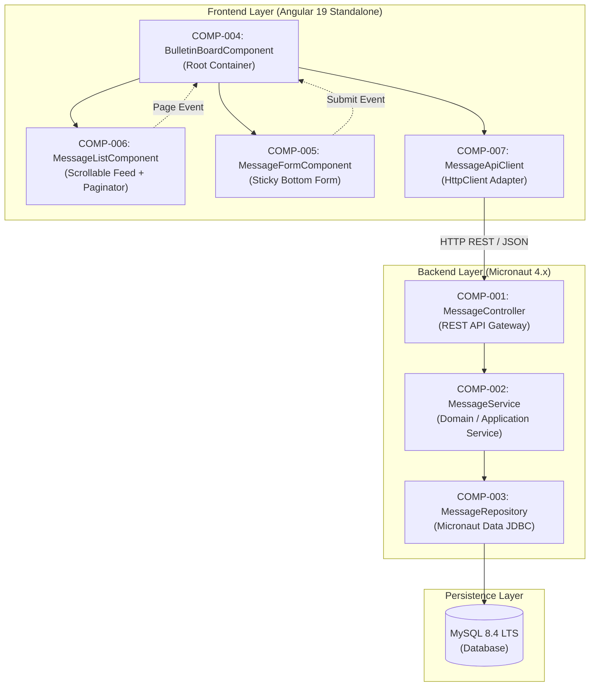
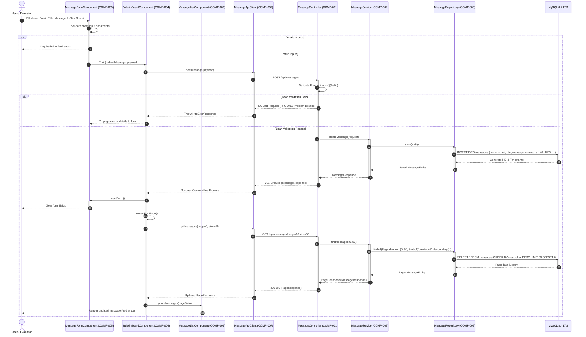

# Architecture & Component Design: Bulletin Board Application

## 1. Component Boundaries & Scope Overview

### 1.1 Architecture & Component Map
The application follows a clean layered architecture separating the browser-based Single Page Application (SPA) from the containerized backend and relational persistence layer:



### 1.2 Component Inventory
| Component ID | Component / Class Name | Scope / Boundary | Linked Requirements |
| :--- | :--- | :--- | :--- |
| **COMP-001** | `MessageController` | External Exposed REST Interface | `REQ-003`, `REQ-004`, `REQ-006`, `REQ-007`, `REQ-009` |
| **COMP-002** | `MessageService` | Internal Core Application Service | `REQ-002`, `REQ-003`, `REQ-004`, `REQ-009` |
| **COMP-003** | `MessageRepository` | Internal Persistence Boundary (JDBC) | `REQ-002`, `REQ-003`, `REQ-004` |
| **COMP-004** | `BulletinBoardComponent` | Frontend Root View & State Container | `REQ-001`, `REQ-002`, `REQ-005` |
| **COMP-005** | `MessageFormComponent` | Frontend Sticky Bottom Input Form | `REQ-001`, `REQ-004`, `REQ-005`, `REQ-006`, `REQ-007` |
| **COMP-006** | `MessageListComponent` | Frontend Feed Display & Paginator | `REQ-002`, `REQ-003`, `REQ-008` |
| **COMP-007** | `MessageApiClient` | Frontend HTTP Communication Service | `REQ-003`, `REQ-004`, `REQ-009` |

---

## 2. Interaction Modeling



---

## 3. Data Models & Schema Constraints

### 3.1 `MessageCreateRequest` (Input Payload)
- **Format**: JSON Schema / Java Record
- **Fields**:
  - `name` (string, required): `minLength: 1`, `maxLength: 50`, `pattern: ".*\\S.*"` - Author's display name, cannot consist solely of whitespace.
  - `email` (string, optional, nullable): `maxLength: 100`, `format: "email"` - Optional contact email address conforming to RFC 5322.
  - `title` (string, required): `minLength: 1`, `maxLength: 100`, `pattern: ".*\\S.*"` - Message subject line, cannot consist solely of whitespace.
  - `message` (string, required): `minLength: 1`, `maxLength: 1000`, `pattern: ".*\\S.*"` - Body text of the bulletin board post, cannot consist solely of whitespace.

### 3.2 `MessageResponse` (Output Resource)
- **Format**: JSON Schema / Java Record
- **Fields**:
  - `id` (integer, required): `minimum: 1`, format: `int64` - Auto-generated unique identifier.
  - `name` (string, required): Author's display name.
  - `email` (string, optional, nullable): Author's email address if provided, otherwise `null`.
  - `title` (string, required): Message title.
  - `message` (string, required): Body content.
  - `createdAt` (string, required): ISO 8601 UTC timestamp format `date-time` (e.g. `2026-09-05T14:30:00Z`).

### 3.3 `PageResponse<T>` (Paginated Envelope)
- **Format**: JSON Schema / Java Generic Record
- **Fields**:
  - `content` (array of T, required): List of message items for the current page.
  - `page` (integer, required): `minimum: 0` - Zero-based current page index.
  - `size` (integer, required): `minimum: 1`, `default: 50` - Requested page capacity.
  - `totalElements` (integer, required): `minimum: 0`, format: `int64` - Total number of messages available across all pages.
  - `totalPages` (integer, required): `minimum: 0` - Computed total page count (`ceil(totalElements / size)`).

### 3.4 `MessageEntity` (Relational Table Model: `messages`)
- **Format**: MySQL Table Definition (`messages`) / Java Entity Class
- **Columns**:
  - `id` BIGINT AUTO_INCREMENT PRIMARY KEY
  - `name` VARCHAR(50) NOT NULL
  - `email` VARCHAR(100) NULL
  - `title` VARCHAR(100) NOT NULL
  - `message` VARCHAR(1000) NOT NULL
  - `created_at` TIMESTAMP NOT NULL DEFAULT CURRENT_TIMESTAMP
- **Indexes**:
  - `idx_messages_created_at_desc` (`created_at` DESC) for high-performance reverse-chronological pagination.

---

## 4. Input / Output Protocols

### 4.1 REST API Protocol
- **Transport**: `HTTP/1.1` over TCP (TLS in production, plain HTTP for local testbed).
- **Base Path**: `/api/messages`
- **Endpoints**:
  - `GET /api/messages?page={page}&size={size}`
    - Query Parameters: `page` (int, optional, default: 0), `size` (int, optional, default: 50).
    - Success Response: `200 OK`, Content-Type: `application/json`, Body: `PageResponse<MessageResponse>`.
  - `POST /api/messages`
    - Request Body: Content-Type: `application/json`, Body: `MessageCreateRequest`.
    - Success Response: `201 Created`, Content-Type: `application/json`, Body: `MessageResponse`.
    - Error Responses: `400 Bad Request` or `500 Internal Server Error`, Content-Type: `application/problem+json`.
- **CORS Configuration**:
  - Allowed Origins: `http://localhost:4200`
  - Allowed Methods: `GET`, `POST`, `OPTIONS`
  - Allowed Headers: `Content-Type`, `Accept`, `Origin`
- **Timeouts**: Connect timeout: 5000ms, Read timeout: 10000ms.

---

## 5. Component Contracts (Design by Contract - RFC 2119 / RFC 8174)

### 5.1 COMP-001: `MessageController`
- **Role**: Entry point for HTTP requests; enforces transport validation and status code mapping.
- **Public Signatures**:
  - `HttpResponse<PageResponse<MessageResponse>> getMessages(@QueryValue(defaultValue = "0") int page, @QueryValue(defaultValue = "50") int size)`
  - `HttpResponse<MessageResponse> createMessage(@Body @Valid MessageCreateRequest request)`
- **Preconditions (Caller Obligations)**:
  - Caller MUST provide non-negative integer `page` >= 0 and positive integer `size` >= 1.
  - Caller MUST provide request payload adhering strictly to `MessageCreateRequest` validation rules.
- **Postconditions (Callee Guarantees)**:
  - `getMessages` MUST return `200 OK` with `PageResponse` containing up to `size` messages ordered by `createdAt DESC`.
  - `createMessage` MUST return `201 Created` containing the newly persisted `MessageResponse` with a populated non-null `id` and `createdAt`.
  - On validation failure, the controller MUST return `400 Bad Request` conforming to RFC 9457 Problem Details.
  - On unhandled internal failure, the controller MUST return `500 Internal Server Error` without leaking stack traces.
- **Invariants (State Consistency)**:
  - The controller MUST remain stateless and safe for concurrent multi-threaded execution.

### 5.2 COMP-002: `MessageService`
- **Role**: Coordinates business rules, pagination assembly, entity mapping, and transactional boundaries.
- **Public Signatures**:
  - `PageResponse<MessageResponse> findMessages(int page, int size)`
  - `MessageResponse createMessage(MessageCreateRequest request)`
- **Preconditions (Caller Obligations)**:
  - Caller MUST supply verified `page` >= 0 and `size` >= 1.
  - Caller MUST supply a non-null `request` whose fields meet domain length and formatting constraints.
- **Postconditions (Callee Guarantees)**:
  - `createMessage` MUST execute within a transactional boundary and assign server UTC time to `createdAt`.
  - On database write failure, the service MUST rollback the transaction and propagate a structured `DatabaseAccessException`.
- **Invariants (State Consistency)**:
  - Persistent state in MySQL MUST NOT contain records with null or whitespace-only `name`, `title`, or `message`.

### 5.3 COMP-003: `MessageRepository`
- **Role**: Micronaut Data JDBC repository handling SQL query compilation and execution against MySQL.
- **Public Signatures**:
  - `Page<MessageEntity> findAll(Pageable pageable)`
  - `MessageEntity save(MessageEntity entity)`
- **Preconditions (Caller Obligations)**:
  - Entity passed to `save` MUST have non-null `name`, `title`, `message`, and `createdAt`.
- **Postconditions (Callee Guarantees)**:
  - `findAll` MUST construct and execute SQL with `ORDER BY created_at DESC LIMIT :size OFFSET :offset`.
  - `save` MUST return a managed `MessageEntity` populated with the database-generated primary key `id`.
- **Invariants (State Consistency)**:
  - Relational table constraints (NOT NULL, VARCHAR limits) MUST remain synchronized with entity constraints.

### 5.4 COMP-004: `BulletinBoardComponent`
- **Role**: Root container component; coordinates state between list feed, paginator, and input form.
- **Public Signatures**:
  - `loadMessages(pageIndex: number): void`
  - `handleMessageSubmitted(newMsg: MessageCreateRequest): void`
- **Preconditions (Caller Obligations)**:
  - Component MUST be initialized in the Angular browser execution context.
- **Postconditions (Callee Guarantees)**:
  - On initialization, the component MUST trigger `loadMessages(0)`.
  - On successful message submission, the component MUST trigger form reset and re-invoke `loadMessages(0)` to surface the new message at the top.
- **Invariants (State Consistency)**:
  - Viewport layout MUST strictly anchor `MessageFormComponent` (COMP-005) at the bottom while allowing `MessageListComponent` (COMP-006) to scroll independently.

### 5.5 COMP-005: `MessageFormComponent`
- **Role**: Sticky footer form component capturing user input with real-time Angular Reactive Forms validation.
- **Public Signatures**:
  - `@Output() submitMessage: EventEmitter<MessageCreateRequest>`
  - `resetForm(): void`
- **Preconditions (Caller Obligations)**:
  - Caller MUST bind to the `submitMessage` output event.
- **Postconditions (Callee Guarantees)**:
  - The component MUST NOT emit the `submitMessage` event if Name, Title, or Message form fields are blank, whitespace-only, or violate length constraints.
  - `submitMessage` MUST emit trimmed string values for Name, Title, and Message, and null for empty Email.
- **Invariants (State Consistency)**:
  - Form component DOM styles MUST specify fixed viewport positioning (`position: sticky` or `position: fixed`, `bottom: 0`, `z-index: 100`).

### 5.6 COMP-006: `MessageListComponent`
- **Role**: Displays message feed in reverse-chronological order and renders pagination controls.
- **Public Signatures**:
  - `@Input() messages: Signal<MessageResponse[]>`
  - `@Input() pagination: Signal<PageResponse<MessageResponse>>`
  - `@Output() pageChange: EventEmitter<number>`
- **Preconditions (Caller Obligations)**:
  - Inputs `messages` and `pagination` MUST be bound by the parent container.
- **Postconditions (Callee Guarantees)**:
  - If `email` is present, the component MUST render it as an author contact link; if null, it MUST omit the email element.
  - Paginator UI MUST reflect `totalElements`, `pageSize = 50`, and current zero-based page index.
- **Invariants (State Consistency)**:
  - The component MUST remain purely presentational and stateless, delegating all pagination state changes upstream via the `pageChange` event.
  - The component MUST render message items strictly in the sequence provided by the `messages` input signal without local reordering.
  - The component MUST ensure all user-provided text content (name, title, message, email) is rendered securely using Angular template interpolation to prevent Cross-Site Scripting (XSS).

### 5.7 COMP-007: `MessageApiClient`
- **Role**: Angular HTTP client service encapsulating API calls to the Micronaut backend.
- **Public Signatures**:
  - `getMessages(page: number, size: number): Observable<PageResponse<MessageResponse>>`
  - `postMessage(request: MessageCreateRequest): Observable<MessageResponse>`
- **Preconditions (Caller Obligations)**:
  - Caller MUST supply valid non-negative parameters.
- **Postconditions (Callee Guarantees)**:
  - On HTTP error (4xx / 5xx), the client MUST transform responses into typed observable errors without unhandled exceptions.
- **Invariants (State Consistency)**:
  - The service instance MUST remain stateless and singleton across HTTP invocations, ensuring that concurrent requests do not mutate internal client state.
  - All outgoing request URLs and query parameters MUST be immutable once constructed.

---

## 6. Error & Exception Handling (RFC 9457 & Domain Exceptions)

### 6.1 RFC 9457 Problem Details Envelope
External HTTP error responses return Content-Type `application/problem+json`:

```json
{
  "type": "https://api.bulletin-board.local/errors/invalid-request",
  "title": "Bad Request",
  "status": 400,
  "detail": "Input validation failed for 2 fields.",
  "instance": "/api/messages",
  "invalid_params": [
    {
      "name": "name",
      "reason": "Name is mandatory and cannot be blank."
    },
    {
      "name": "email",
      "reason": "Email must be a valid email address conforming to RFC 5322."
    }
  ]
}
```

### 6.2 Internal Domain Exception Hierarchy
- `BulletinBoardException` (abstract checked or unchecked base runtime exception)
  - `ValidationException` (HTTP 400: thrown when service-level domain rules are violated)
  - `DatabaseAccessException` (HTTP 500: thrown when SQL or connection failure occurs, wrapping underlying JDBC exceptions)

### 6.3 Exception Handlers
- `ConstraintViolationExceptionHandler`: Catches Micronaut / Bean Validation violations and formats RFC 9457 problem response.
- `GlobalThrowableHandler`: Catches unhandled runtime exceptions, logs full root cause internally, and returns generic RFC 9457 problem response with status 500 without leaking stack traces.

---

## 7. Key Design Decisions & Architectural Trade-offs

- **Data Access Layer (Micronaut Data JDBC vs Hibernate ORM / JPA)**:
  - **Selected Approach**: Micronaut Data JDBC utilizing ahead-of-time (AOT) compile-time query precomputation, direct JDBC entity mapping via `@JdbcRepository`, and HikariCP connection pooling.
  - **Alternative Considered**: Hibernate ORM / JPA relying on dynamic runtime reflection, entity proxy generation, first/second-level session caching, and runtime JPQL / Criteria query translation.
  - **Rationale & Trade-off**: Micronaut Data JDBC computes repository queries and SQL statements at compile time using annotation processors, eliminating runtime reflection, dynamic entity proxies, and substantial class metadata overhead. This dramatically reduces heap memory consumption, accelerates application startup/cold start times, and makes all generated SQL fully deterministic and auditable. In exchange, this approach consciously accepts the loss of advanced ORM features such as transparent dirty checking, entity graph navigation, lazy collection loading, and automatic cascade persistence. For the BBS domain (flat data structure, simple CRUD, and reverse-chronological pagination), these complex ORM abstractions introduce unnecessary overhead, non-deterministic performance traps, and N+1 query risks rather than architectural value.

- **Frontend Reactive State Architecture (Angular Standalone Components & Signals vs NgModule-based Architecture & RxJS)**:
  - **Selected Approach**: Angular Standalone Components combined with fine-grained Angular Signals (`signal()`, `computed()`, `input()`, `output()`) for component-level reactive state management.
  - **Alternative Considered**: Legacy NgModule-based modular architecture utilizing RxJS Subjects, manual subscription lifecycle management (`takeUntilDestroyed` / `unsubscribe`), and Zone.js-driven change detection.
  - **Rationale & Trade-off**: Standalone Components eliminate NgModule boilerplate, enable explicit and fine-grained dependency imports at the component level, enhance tree-shaking efficiency, and simplify isolated component testing. Signals provide synchronous, fine-grained reactivity with predictable change detection without the verbosity of explicit subscription lifecycle management or unexpected Zone.js change detection sweeps. The trade-off is the necessity of managing interop boundaries between asynchronous RxJS HTTP streams (via `toSignal` or `rxResource`) and component Signals, as well as adapting to Angular's newer reactive paradigm.

- **Message Creation UX & Layout (Persistent Sticky Bottom Form vs Modal Dialog or Dedicated Route)**:
  - **Selected Approach**: A persistent message submission form anchored to the bottom of the viewport (sticky footer), keeping the message feed visible and independently scrollable in the upper viewport area.
  - **Alternative Considered**: A modal dialog window (e.g., `MatDialog`) or navigation to an independent route (`/messages/new` or `/post`) for composing and submitting messages.
  - **Rationale & Trade-off**: Anchoring the submission form permanently to the bottom creates an immediate, zero-friction bulletin board user experience reminiscent of modern chat and message boards. Users can read ongoing discussions while composing their thoughts without modal context-switching or navigating away from the feed. Furthermore, submitting a post seamlessly refreshes the list in-place and clears inputs without transition animations or page reloads. The accepted trade-off is permanent consumption of vertical screen real estate, which restricts the visible height of the message list (especially on mobile viewports) and requires robust CSS layout management (flexbox/grid with independent `overflow-y: auto`) to avoid viewport clipping or virtual keyboard obstruction.

- **Database Schema Evolution Strategy (Flyway Versioned Migrations vs Automated ORM DDL / Manual SQL Scripts)**:
  - **Selected Approach**: Version-controlled database migrations managed through Flyway (`V1__create_messages_table.sql`) executed automatically upon backend application bootstrap.
  - **Alternative Considered**: Automated runtime DDL generation via Hibernate `hbm2ddl.auto` (or `jpa.generate-ddl`), or unversioned manual SQL script execution during container initialization.
  - **Rationale & Trade-off**: Flyway provides deterministic, immutable, and strictly ordered schema migrations tracked directly in Git alongside application source code. This guarantees exact schema parity across local Docker containers, automated CI/CD test pipelines, and staging environments, while maintaining an immutable audit log (`flyway_schema_history`). The accepted trade-off is the operational requirement for developers to manually author and review forward-compatible SQL DDL migration scripts for all schema changes, foregoing automatic entity-to-schema synchronization, and introducing a minor startup delay for migration checksum validation.

- **HTTP Error Protocol & Payload Standard (RFC 9457 Problem Details vs Proprietary Custom JSON Schema)**:
  - **Selected Approach**: Adoption of IETF RFC 9457 Problem Details for HTTP APIs (`application/problem+json`) utilizing standard fields (`type`, `title`, `status`, `detail`, `instance`) and an `invalid_params` extension array for field-level validation errors.
  - **Alternative Considered**: A proprietary, ad-hoc JSON error envelope format (e.g., `{ "success": false, "errorCode": "VAL_001", "message": "...", "errors": [...] }`).
  - **Rationale & Trade-off**: RFC 9457 is an established industry standard recognized by API gateways, HTTP client libraries, and modern web frameworks, ensuring standard HTTP status alignment and predictable error parsing across frontend and backend boundaries. Standardizing on RFC 9457 eliminates arbitrary error schema proliferation and establishes a uniform contract for both client-side validation failures and server-side runtime exceptions. The accepted trade-off is a slightly more verbose JSON payload and the necessity of writing explicit Micronaut exception handlers to translate Bean Validation failures and runtime exceptions into the RFC 9457 schema.

