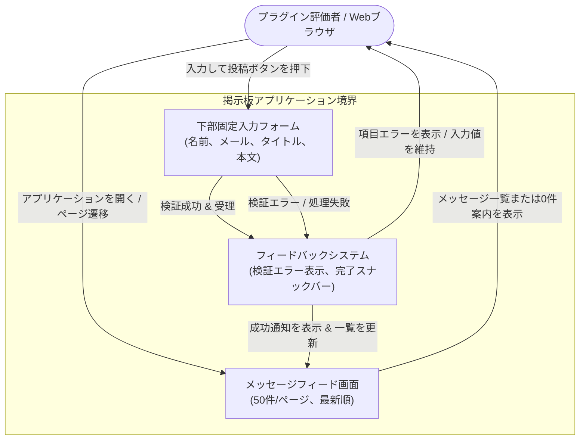

# 要件定義書: 掲示板アプリケーション（Bulletin Board Application）

## 1. 背景と動機（Context & Motivation）

### 1.1 課題の説明（Problem Statement）
`swe-workflow` プラグインは、自律的な仕様駆動開発（SDD: Spec-Driven Development）機能を評価・検証するための標準化されたエンドツーエンドの検証プロジェクトを必要としています。軽量で明快な掲示板アプリケーションは、不要なドメインの複雑さを排除しつつ、仕様策定、契約による設計（DbC: Design by Contract）モデリング、テスト駆動開発（TDD: Test-Driven Development）、複数段階のサブエージェントレビュー、アトミックな進捗コミット、およびプルリクエスト生成のライフサイクル全体を検証するための理想的なドメインを提供します。

### 1.2 ビジネス目標および技術目標（Business & Technical Goals）
- **目標 1**: 評価者が投稿日時降順（最新順）で50件ごとのページネーション表示されるメッセージを閲覧できる直感的なWebインターフェースを提供する。
- **目標 2**: 画面下部に常時固定表示された入力フォームから、投稿者名、任意入力の公開メールアドレス、タイトル、メッセージ本文を入力して新規投稿できるようにする。
- **目標 3**: 堅牢な入力バリデーションと即時フィードバック（フォーム初期化、1ページ目の再表示、スナックバー通知、項目ごとの検証エラー表示）を保証する。
- **目標 4**: バックエンドとフロントエンドの両レイヤーにおいて、`swe-workflow` プラグインツールチェーンを評価するための検証可能なベンチマークアプリケーションとして機能させる。

### 1.3 対象者・アクター（Target Personas & Stakeholders）
- **プラグイン評価者（ユーザー）**: ワークフロープラグインの動作を検証・評価するために標準的なWebブラウザ経由でアプリケーションを操作する開発者またはQAエンジニア。
- **自動テストハーネス**: アプリケーション境界を横断して要件の適合性を検証する統合テストおよびエンドツーエンドテストスイート。

---

## 2. ユーザーシナリオとユースケース（User Scenarios & Use Cases）

### 2.1 ユースケース 1: 掲示板メッセージの一覧閲覧（Browse Bulletin Board Messages）
- **アクター**: プラグイン評価者
- **事前条件**: 掲示板アプリケーションが稼働し、Webブラウザからアクセス可能であること。
- **トリガー**: 評価者がアプリケーションURLにアクセスするか、ページ遷移を要求する。
- **基本フロー（Basic Flow）**:
  1. システムは、投稿日時の降順（最新順）で並べ替えられた投稿メッセージを表示する。
  2. システムは、1ページあたり50件のメッセージに表示件数を制限する。
  3. 各メッセージについて、システムは投稿日時、投稿者名、タイトル、メッセージ本文、および公開メールアドレス（入力されている場合）を表示する。
  4. 総メッセージ数が50件を超える場合、システムはページ間を移動するためのページネーションコントロールを提供する。
- **代替フロー（Alternative Flows）**:
  - **投稿が存在しない場合**: まだ1件もメッセージが投稿されていない場合、システムは投稿が存在しない旨を示す明確な案内メッセージを表示する。
- **例外フロー（Exception Flows）**:
  - **データ取得失敗**: ネットワーク接続障害や処理エラーによりメッセージを取得できない場合、システムは分かりやすいエラーメッセージを表示し、再試行の選択肢を提供する。
- **事後条件**: 評価者に最新のメッセージフィードおよびページネーション状態が表示される。

### 2.2 ユースケース 2: 新規メッセージの投稿（Submit a New Message）
- **アクター**: プラグイン評価者
- **事前条件**: 評価者が掲示板画面を表示しており、画面下部に入力フォームが常時固定表示されていること。
- **トリガー**: 評価者がメッセージ内容を入力し、投稿ボタンをクリックする。
- **基本フロー（Basic Flow）**:
  1. 評価者は、名前（必須、1〜50文字）、メールアドレス（任意、0〜254文字）、タイトル（必須、1〜100文字）、およびメッセージ本文（必須、1〜4,000文字）を入力する。
  2. 評価者は、投稿操作を実行する。
  3. システムは、すべての制約条件に照らして入力を検証し、投稿を受理する。
  4. システムは、正確な投稿日時を記録して新規メッセージを永続化する。
  5. システムは、入力フォームの各項目を初期化し、先頭に新規投稿が反映された1ページ目のメッセージ一覧を再読み込みし、一時的な完了通知（スナックバー）を表示する。
- **代替フロー（Alternative Flows）**:
  - **任意メールアドレスの省略**: メールアドレス欄が空欄の場合、システムは投稿を受理し、メールアドレスなしで投稿を表示する。
- **例外フロー（Exception Flows）**:
  - **バリデーション失敗**: 必須項目が未入力または空白のみの場合、最大文字数を超過している場合、またはメールアドレス形式が不正な場合、システムは投稿を拒否し、該当項目に明確な検証エラーメッセージを表示し、かつ評価者が入力済みのフォーム内容を保持しなければならない。
  - **投稿処理の失敗**: 投稿処理中に通信障害やシステム障害が発生した場合、システムはエラーメッセージを表示し、入力済みフォームデータをそのまま保持し、評価者が再送信できるようにする。
- **事後条件**: 新規投稿が永続化されてフィード最上部に表示されるか、失敗時に入力内容とエラー案内が画面上に維持される。

---

## 3. ビジュアルモデリング（Visual Modeling）

---

## 4. 機能要件（Functional Requirements）

すべての機能要件は、標準的な EARS パターンおよび RFC 2119 / RFC 8174 の大文字キーワードの日本語標準対応（MUST: 「〜しなければならない」、MUST NOT: 「〜してはならない」）を用いて定義されています。

| 要件 ID | EARS パターン種別 | 仕様記述ステートメント | 検証手法 |
| :--- | :--- | :--- | :--- |
| **REQ-001** | 常時（Ubiquitous） | システムは、アプリケーション画面がアクティブである間、常にビューポートの最下部に投稿フォームを固定表示し続けなければならない。 | 自動 UI テスト |
| **REQ-002** | イベント駆動（Event-driven） | ユーザーがアプリケーションを閲覧した際、システムは投稿日時の降順（最新順）で投稿メッセージを表示しなければならない。 | 統合テスト |
| **REQ-003** | 常時（Ubiquitous） | システムは、1ページあたり最大50件のメッセージで一覧をページネーション分割しなければならない。 | 統合テスト |
| **REQ-004** | 状態駆動（State-driven） | 投稿メッセージの総数が0件である間、システムは投稿が存在しない旨を示す明確なプレースホルダーメッセージを表示しなければならない。 | 自動 UI テスト |
| **REQ-005** | イベント駆動（Event-driven） | メッセージを表示する際、システムは投稿者名、投稿日時、タイトル、およびメッセージ本文を描画しなければならない。 | 自動 UI テスト |
| **REQ-006** | オプション機能（Optional Feature） | 投稿時に投稿者が任意のメールアドレスを指定した場合、システムは投稿と併せてメールアドレスを公開表示しなければならない。 | 統合テスト |
| **REQ-007** | イベント駆動（Event-driven） | 空白のみでない名前（1〜50文字）、空白のみでないタイトル（1〜100文字）、空白のみでないメッセージ本文（1〜4,000文字）、および任意の有効なメールアドレス（最大254文字）からなる有効な入力をユーザーが送信した際、システムは投稿を記録しなければならない。 | 統合テスト |
| **REQ-008** | イベント駆動（Event-driven） | 投稿の送信が成功した際、システムはすべての入力フォーム項目を空に初期化し、メッセージフィードを1ページ目の表示に更新し、かつ一時的な完了通知を表示しなければならない。 | 自動 UI テスト |
| **REQ-009** | 望ましくない動作（Unwanted Behavior） | 投稿に必須項目の欠落、必須項目の空白のみの値、制限文字数の超過、または不正なメールアドレス形式が含まれる場合、システムは送信を拒否しなければならず、項目固有の検証エラーメッセージを表示しなければならず、かつユーザーが入力したフォームデータを消去してはならない。 | 統合テスト |
| **REQ-010** | 望ましくない動作（Unwanted Behavior） | メッセージの取得中または送信中にシステムまたは通信の障害が発生した場合、システムは分かりやすいエラー通知を表示しなければならず、かつアプリケーション画面を応答不能またはクラッシュさせてはならない。 | 障害注入テスト |

---

## 5. 非機能要件（Non-Functional Requirements）

- **NFR-PERF-001 (性能)**: システムは、通常稼働条件下において、メッセージ一覧ページの描画および投稿処理を1,000ミリ秒以内に完了しなければならない。
- **NFR-SEC-001 (セキュリティ)**: システムは、描画前にユーザーから提供されたすべての文字列をサニタイズまたはエスケープし、クロスサイトスクリプティング（XSS: Cross-Site Scripting）攻撃を防止しなければならない。
- **NFR-COMP-001 (ブラウザ互換性)**: システムは、モダンな主要Webブラウザ（Google Chrome、Mozilla Firefox、Apple Safari、Microsoft Edge）においてレイアウト崩れや動作不全を起こさずに機能しなければならない。
- **NFR-REL-001 (信頼性・堅牢性)**: システムは、予期しない例外が発生した場合に安全に障害停止（Fail-Closed）し、保留中のユーザー入力を保護し、明確な回復手段を提供しなければならない。

---

## 6. スコープ外（Out of Scope）

以下の機能は、本仕様の対象から意図的に除外されています。
- 既存投稿の編集機能または削除機能。
- 返信（スレッド）機能または階層的なコメント機能。
- 画像、ドキュメント、またはメディアファイルの添付機能。
- ユーザー登録、認証、またはロールベースのアクセス制御。
- 全文検索、絞り込み、またはカスタム並べ替え順序の変更機能。
