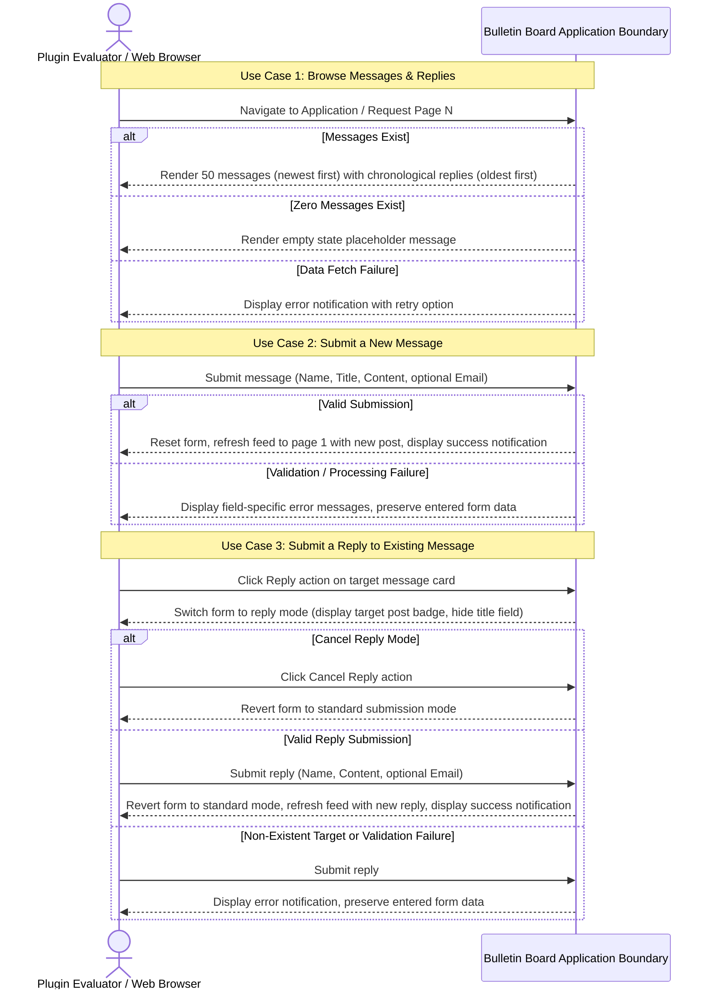

# 要件定義書: 掲示板アプリケーション（Bulletin Board Application）

## 1. 背景と動機（Context & Motivation）

### 1.1 課題の説明（Problem Statement）
`swe-workflow` プラグインは、自律的な仕様駆動開発（SDD: Spec-Driven Development）機能を評価・検証するための標準化されたエンドツーエンドの検証プロジェクトを必要としています。軽量で明快な掲示板アプリケーションは、不要なドメインの複雑さを排除しつつ、仕様策定、契約による設計（DbC: Design by Contract）モデリング、テスト駆動開発（TDD: Test-Driven Development）、複数段階のサブエージェントレビュー、アトミックな進捗コミット、およびプルリクエスト生成のライフサイクル全体を検証するための理想的なドメインを提供します。

### 1.2 ビジネス目標および技術目標（Business & Technical Goals）
- **目標 1**: 評価者が投稿日時降順（最新順）で50件ごとのページネーション表示されるメッセージと、それに紐づく時系列（昇順）の返信を閲覧できる直感的なWebインターフェースを提供する。
- **目標 2**: 画面下部に常時固定表示された入力フォームから、投稿者名、任意入力の公開メールアドレス、タイトル（新規投稿時のみ）、メッセージ本文を入力して、新規投稿および既存メッセージへの返信を行えるようにする。
- **目標 3**: 堅牢な入力バリデーションと即時フィードバック（フォーム初期化、1ページ目の再表示、スナックバー通知、項目ごとの検証エラー表示）を保証する。
- **目標 4**: バックエンドとフロントエンドの両レイヤーにおいて、`swe-workflow` プラグインツールチェーンを評価するための検証可能なベンチマークアプリケーションとして機能させる。

### 1.3 対象者・アクター（Target Personas & Stakeholders）
- **プラグイン評価者（ユーザー）**: ワークフロープラグインの動作を検証・評価するために標準的なWebブラウザ経由でアプリケーションを操作する開発者またはQAエンジニア。
- **自動テストハーネス**: アプリケーション境界を横断して要件の適合性を検証する統合テストおよびエンドツーエンドテストスイート。

---

## 2. ユーザーシナリオとユースケース（User Scenarios & Use Cases）

### 2.1 ユースケース 1: 掲示板メッセージおよび返信の一覧閲覧（Browse Bulletin Board Messages & Replies）
- **アクター**: プラグイン評価者
- **事前条件**: 掲示板アプリケーションが稼働し、Webブラウザからアクセス可能であること。
- **トリガー**: 評価者がアプリケーションURLにアクセスするか、ページ遷移を要求する。
- **基本フロー（Basic Flow）**:
  1. システムは、投稿日時の降順（最新順）で並べ替えられた投稿メッセージを表示する。
  2. システムは、1ページあたり50件のメッセージに表示件数を制限する。
  3. 各メッセージについて、システムは投稿日時、投稿者名、タイトル、メッセージ本文、公開メールアドレス（入力されている場合）、および紐づく返信一覧を投稿日時の昇順（古い順）で表示する。
  4. 総メッセージ数が50件を超える場合、システムはページ間を移動するためのページネーションコントロールを提供する。
- **代替フロー（Alternative Flows）**:
  - **投稿が存在しない場合**: まだ1件もメッセージが投稿されていない場合、システムは投稿が存在しない旨を示す明確な案内メッセージを表示する。
  - **返信が存在しない場合**: メッセージに返信が1件も存在しない場合、システムは返信一覧を表示せずに親メッセージのみを表示する。
- **例外フロー（Exception Flows）**:
  - **データ取得失敗**: ネットワーク接続障害や処理エラーによりメッセージを取得できない場合、システムは分かりやすいエラーメッセージを表示し、再試行の選択肢を提供する。
- **事後条件**: 評価者に最新のメッセージフィード、ページネーション状態、および返信が表示される。

### 2.2 ユースケース 2: 新規メッセージの投稿（Submit a New Message）
- **アクター**: プラグイン評価者
- **事前条件**: 評価者が掲示板画面を表示しており、画面下部に入力フォームが標準モードで常時固定表示されていること。
- **トリガー**: 評価者がメッセージ内容を入力し、投稿ボタンをクリックする。
- **基本フロー（Basic Flow）**:
  1. 評価者は、名前（必須、1〜50文字）、メールアドレス（任意、0〜254文字）、タイトル（必須、1〜100文字）、およびメッセージ本文（必須、1〜4,000文字）を入力する。
  2. 評価者は、投稿操作を実行する。
  3. システムは、すべての制約条件に照らして入力を検証し、投稿を受理する。
  4. システムは、正確な投稿日時を記録して新規メッセージを永続化する。
  5. システムは、入力フォームの各項目を初期化し、先頭に新規投稿が反映された1ページ目のメッセージ一覧を再読み込みし、一時的な完了通知（スナックバー）を表示する。
- **代替フロー（Alternative Flows）**:
  - **任意メールアドレスの省略**: メールアドレス欄が空欄の場合、システムは投稿を受理し、メールアドレスなしで投稿を表示する。
- **例外フロー（Exception Flows）**:
  - **バリデーション失敗**: 必須項目が未入力または空白のみの場合、最大文字数を超過している場合、またはメールアドレス形式が不正な場合、システムは投稿を拒否し、該当項目に明確な検証エラーメッセージを表示し、かつ評価者が入力済みのフォーム内容を保持しなければならない。
  - **投稿処理の失敗**: 投稿処理中に通信障害やシステム障害が発生した場合、システムはエラーメッセージを表示し、入力済みフォームデータをそのまま保持し、評価者が再送信できるようにする。
- **事後条件**: 新規投稿が永続化されてフィード最上部に表示されるか、失敗時に入力内容とエラー案内が画面上に維持される。

### 2.3 ユースケース 3: 既存メッセージへの返信投稿（Submit a Reply to an Existing Message）
- **アクター**: プラグイン評価者
- **事前条件**: 評価者が掲示板に表示されている既存の投稿メッセージを閲覧していること。
- **トリガー**: 評価者が既存メッセージカード上の「返信」アクションボタンをクリックする。
- **基本フロー（Basic Flow）**:
  1. 評価者は、特定のメッセージカード上の「返信」ボタンをクリックする。
  2. システムは、画面下部の固定フォームを「返信モード」に切り替え、返信対象のメッセージ識別子と投稿者名を示すインジケーターバッジを表示し、タイトル入力欄を非表示にする。
  3. 評価者は、名前（必須、1〜50文字）、メールアドレス（任意、0〜254文字）、およびメッセージ本文（必須、1〜4,000文字）を入力する。
  4. 評価者は、送信操作を実行する。
  5. システムは、すべての制約条件に照らして入力を検証し、返信を受理する。
  6. システムは、正確な投稿日時を記録して指定メッセージに紐づく返信を永続化する。
  7. システムは、入力フォームを初期化して標準モードに自動復帰させ、新規返信が反映されたフィードを再読み込みし、一時的な完了通知（スナックバー）を表示する。
- **代替フロー（Alternative Flows）**:
  - **返信モードのキャンセル**: 評価者が返信モードインジケーター上のキャンセルボタンをクリックした場合、システムは返信対象を解除し、標準の新規投稿モードへ復帰させる。
- **例外フロー（Exception Flows）**:
  - **返信対象メッセージの不存在**: 返信対象の親メッセージが削除されたか存在しない場合、システムは返信を拒否し、分かりやすいエラーメッセージを表示し、かつ入力済みフォームデータを保持する。
  - **バリデーション失敗**: 必須項目が未入力または空白のみの場合、あるいは制限文字数を超過している場合、システムは検証エラーを表示し、入力済みフォームデータを保持する。
- **事後条件**: 新規返信が永続化されて親投稿の配下に表示され、フォームは標準モードに復帰する。

---

## 3. 視覚的モデリング（Visual Modeling）

---

## 4. 機能要件（Functional Requirements）

すべての機能要件は、標準的な EARS パターンおよび大文字の RFC 2119 / RFC 8174 キーワード（日本語訳: `MUST` = 〜しなければならない、`MUST NOT` = 〜してはならない、`SHOULD` = 〜することが推奨される、`MAY` = 〜してもよい）を用いて定義されています。

| 要件 ID | EARS パターン種別 | 仕様記述（RFC 2119 / 8174 準拠） | 検証方法 |
| :--- | :--- | :--- | :--- |
| **REQ-001** | Ubiquitous（普遍的） | システムは、アプリケーション画面が表示されている間、入力フォームを常にビューポート最下部に固定して可視状態を維持しなければならない（MUST）。 | 自動 UI テスト |
| **REQ-002** | Event-driven（イベント駆動） | ユーザーがアプリケーションを表示した際、システムは投稿日時の降順（最新順）で投稿メッセージを表示しなければならない（MUST）。 | 統合テスト |
| **REQ-003** | Ubiquitous（普遍的） | システムは、メッセージ一覧を1ページあたり最大50件に制限してページネーションしなければならない（MUST）。 | 統合テスト |
| **REQ-004** | State-driven（状態駆動） | 総投稿件数が0件である間、システムは投稿が存在しない旨を示す明確なプレースホルダーメッセージを表示しなければならない（MUST）。 | 自動 UI テスト |
| **REQ-005** | Event-driven（イベント駆動） | メッセージを表示する際、システムは投稿者名、投稿日時、タイトル、およびメッセージ本文を描画しなければならない（MUST）。 | 自動 UI テスト |
| **REQ-006** | Optional Feature（任意機能） | 投稿者が投稿時に任意のメールアドレスを入力した場合、システムは投稿または返信に付随してメールアドレスを公開表示しなければならない（MUST）。 | 統合テスト |
| **REQ-007** | Event-driven（イベント駆動） | ユーザーが空白以外の名前（1〜50文字）、空白以外のタイトル（1〜100文字）、空白以外のメッセージ本文（1〜4,000文字）、および任意の有効なメールアドレス（最大254文字）からなる有効な入力を送信した際、システムは投稿を記録しなければならない（MUST）。 | 統合テスト |
| **REQ-008** | Event-driven（イベント駆動） | 投稿の送信が成功した際、システムは入力フォームのすべてのフィールドを空に初期化し、メッセージフィードを再読み込みして1ページ目を表示し、一時的な完了通知を表示しなければならない（MUST）。 | 自動 UI テスト |
| **REQ-009** | Unwanted Behavior（異常系振る舞い） | 送信内容に必須項目の欠落、必須項目における空白文字のみの入力、制限を超える文字数、または不正なメールアドレス形式が含まれる場合、システムは送信を拒否しなければならず（MUST）、項目ごとの検証エラーメッセージを表示しなければならず（MUST）、かつユーザーが入力したフォームデータを消去してはならない（MUST NOT）。 | 統合テスト |
| **REQ-010** | Unwanted Behavior（異常系振る舞い） | メッセージ取得中または送信中にシステム障害や通信エラーが発生した場合、システムは分かりやすいエラー通知を表示しなければならず（MUST）、かつアプリケーション画面のフリーズやクラッシュを引き起こしてはならない（MUST NOT）。 | 障害注入テスト |
| **REQ-011** | Event-driven（イベント駆動） | 返信が紐づくメッセージを表示する際、システムは各返信を投稿日時の昇順（古い順）で描画し、投稿者名、投稿日時、メッセージ本文、および任意のメールアドレスを表示しなければならない（MUST）。 | 自動 UI テスト |
| **REQ-012** | Ubiquitous（普遍的） | システムは、各メッセージカード上に対象投稿の識別子と投稿者名を表示した上で画面下部固定フォームの返信モードを起動する返信アクションを提供しなければならない（MUST）。 | 自動 UI テスト |
| **REQ-013** | State-driven（状態駆動） | 入力フォームが返信モードである間、システムはタイトル入力フィールドを除外（非表示化）しなければならず（MUST）、かつ送信を行わずに標準の投稿モードへ復帰させるキャンセルアクションを提供しなければならない（MUST）。 | 自動 UI テスト |
| **REQ-014** | Event-driven（イベント駆動） | ユーザーが既存メッセージに対して空白以外の名前（1〜50文字）、空白以外のメッセージ本文（1〜4,000文字）、および任意の有効なメールアドレス（最大254文字）からなる有効な返信入力を送信した際、システムは返信を記録し、入力フォームを標準モードへ復帰させ、フィードを再読み込みし、一時的な完了通知を表示しなければならない（MUST）。 | 統合テスト |
| **REQ-015** | Unwanted Behavior（異常系振る舞い） | 返信送信が存在しないメッセージを参照している場合、または必須項目の欠落や不正な値を含む場合、システムは送信を拒否しなければならず（MUST）、詳細なエラー情報を表示しなければならず（MUST）、かつユーザーが入力したフォームデータを破棄してはならない（MUST NOT）。 | 統合テスト |

---

## 5. 非機能要件（Non-Functional Requirements）

- **NFR-PERF-001 (性能)**: システムは、通常の運用条件下においてメッセージ一覧画面の描画および投稿・返信処理を1,000ミリ秒以内に処理しなければならない（MUST）。
- **NFR-SEC-001 (セキュリティ)**: システムは、クロスサイトスクリプティング（XSS: Cross-Site Scripting）攻撃を防止するため、描画前にユーザーが入力したすべての文字列をサニタイズおよびエスケープしなければならない（MUST）。
- **NFR-COMP-001 (ブラウザ互換性)**: システムは、モダンな主要Webブラウザ（Google Chrome、Mozilla Firefox、Apple Safari、Microsoft Edge）においてレイアウト崩れや動作不全を起こさずに機能しなければならない（MUST）。
- **NFR-REL-001 (信頼性・堅牢性)**: システムは、予期せぬ例外が発生した場合でもフェイルクローズ（安全側に倒す設計）で処理を中断し、未送信の入力データを保護した上で明確なリカバリー手順を提供しなければならない（MUST）。

---

## 6. スコープ外事項（Out of Scope）

以下の機能および要件は、本仕様の対象外として明示的に除外されています：
- 投稿および返信の編集・削除機能。
- 2階層以上（深さ &gt; 1）の入れ子返信または任意のツリー階層構造（返信は親メッセージ配下の1階層フラット構造に限定）。
- 画像、ドキュメント、その他のメディア添付機能。
- ユーザー登録、認証、またはロールベースのアクセス制御。
- 全文検索、フィルタリング、またはカスタムソート順序の変更機能。
- リアルタイムプッシュ通知または WebSocket による自動更新機能。
