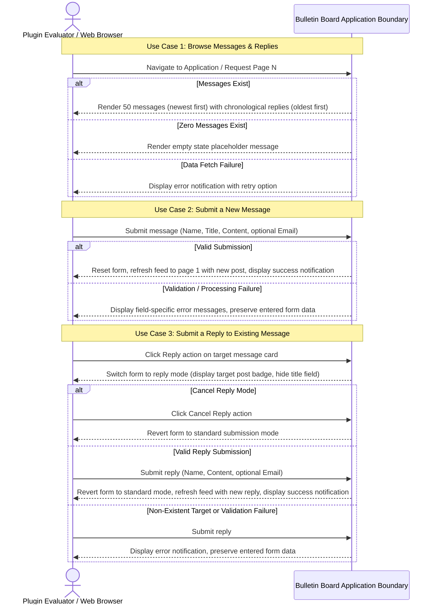

# Requirements Specification: Bulletin Board Application

## 1. Context & Motivation

### 1.1 Problem Statement
The `swe-workflow` plugin requires a standardized, end-to-end evaluation project to assess and validate its autonomous Spec-Driven Development (SDD) capabilities. A lightweight, clean bulletin board application provides an ideal domain to exercise specification authoring, Design by Contract (DbC) modeling, Test-Driven Development (TDD), multi-stage subagent reviews, atomic progress commits, and pull request generation without unnecessary domain complexity.

### 1.2 Business & Technical Goals
- **Goal 1**: Deliver an intuitive web interface where evaluators can view posted messages in reverse chronological order with 50-item pagination, alongside associated chronological replies.
- **Goal 2**: Enable evaluators to submit new messages and targeted replies to existing messages via a persistent bottom-anchored form containing contributor name, optional public email address, title (for new posts), and message content.
- **Goal 3**: Ensure robust input validation and immediate user feedback (form reset, first-page refresh, snackbar notifications, and field validation indicators).
- **Goal 4**: Serve as a verifiable benchmark application for evaluating the `swe-workflow` plugin toolchain across both backend and frontend layers.

### 1.3 Target Personas & Stakeholders
- **Plugin Evaluator (User)**: A developer or QA engineer interacting with the application via a standard web browser to test and evaluate the workflow plugin.
- **Automated Test Harness**: Integration and end-to-end testing suites verifying requirement compliance across the application boundary.

---

## 2. User Scenarios & Use Cases

### 2.1 Use Case 1: Browse Bulletin Board Messages & Replies
- **Actor**: Plugin Evaluator
- **Preconditions**: The bulletin board application is running and accessible via browser.
- **Trigger**: The evaluator navigates to the application URL or requests a page update.
- **Basic Flow**:
  1. The system displays submitted messages ordered by submission timestamp in descending order (newest first).
  2. The system limits the display to 50 messages per page.
  3. For each message, the system presents the submission timestamp, contributor name, title, message body, public email address (if supplied), and any associated replies in ascending order of submission timestamp (oldest first).
  4. If the total message count exceeds 50, the system provides pagination controls to navigate across pages.
- **Alternative Flows**:
  - **No Messages Exist**: If no posts have been submitted yet, the system displays a clear message stating that no posts are available.
  - **Post Has No Replies**: If a post has no replies, the system displays the post without a reply list.
- **Exception Flows**:
  - **Data Fetch Failure**: If the system cannot retrieve messages due to connectivity or processing failure, the system presents an informative error message and provides a retry option.
- **Postconditions**: The evaluator observes the current message feed, pagination state, and replies.

### 2.2 Use Case 2: Submit a New Message
- **Actor**: Plugin Evaluator
- **Preconditions**: The evaluator is viewing the bulletin board interface, and the submission form is visible and fixed at the bottom of the screen in standard mode.
- **Trigger**: The evaluator inputs message details and clicks the submit button.
- **Basic Flow**:
  1. The evaluator enters name (required, 1–50 characters), optional email address (0–254 characters), title (required, 1–100 characters), and message body (required, 1–4,000 characters).
  2. The evaluator activates the submission action.
  3. The system validates the inputs against all constraints and accepts the submission.
  4. The system stores the new message with an accurate submission timestamp.
  5. The system clears the input form fields, refreshes the message list to the first page displaying the newly created post at the top, and displays a transient success notification (snackbar).
- **Alternative Flows**:
  - **Optional Email Omitted**: If the email field is left blank, the system accepts the post and displays it without an email address.
- **Exception Flows**:
  - **Validation Failure**: If required fields are blank or contain only whitespace, field lengths exceed maximum limits, or the email address format is invalid, the system rejects the submission, highlights the erroneous fields with clear validation messages, and preserves the evaluator's entered text.
  - **Submission Processing Failure**: If a communication or system failure occurs during submission, the system displays an error message, leaves the entered form data intact, and allows the evaluator to reattempt submission.
- **Postconditions**: The new post is persisted and displayed at the top of the feed, or the form remains populated with explanatory errors upon failure.

### 2.3 Use Case 3: Submit a Reply to an Existing Message
- **Actor**: Plugin Evaluator
- **Preconditions**: The evaluator is viewing a posted message on the bulletin board.
- **Trigger**: The evaluator clicks the reply button on an existing message card.
- **Basic Flow**:
  1. The evaluator clicks the reply action on a specific message card.
  2. The system switches the persistent bottom form to reply mode, presenting a badge indicating the target message identifier and author, and hiding the title field.
  3. The evaluator enters name (required, 1–50 characters), optional email address (0–254 characters), and message content (required, 1–4,000 characters).
  4. The evaluator activates the submission action.
  5. The system validates the inputs against all constraints and accepts the reply.
  6. The system records the reply linked to the specified message with an accurate submission timestamp.
  7. The system resets the form, switches it back to standard mode, refreshes the feed to display the new reply, and presents a transient success notification.
- **Alternative Flows**:
  - **Cancel Reply**: The evaluator clicks the cancel button on the reply mode indicator. The system clears the reply target and restores standard submission mode.
- **Exception Flows**:
  - **Target Post Not Found**: If the target post was deleted or does not exist, the system rejects the reply, displays an informative error message, and retains the entered text.
  - **Validation Failure**: If required fields are blank or exceed constraints, the system displays validation errors and preserves the entered text.
- **Postconditions**: The new reply is stored and displayed under the parent post, and the form returns to standard mode.

---

## 3. Visual Modeling

---

## 4. Functional Requirements

All functional requirements are defined using standard EARS patterns and uppercase RFC 2119 / RFC 8174 keywords.

| Requirement ID | EARS Pattern Type | Specification Statement (RFC 2119 / 8174) | Verification Method |
| :--- | :--- | :--- | :--- |
| **REQ-001** | Ubiquitous | The system MUST keep the submission form anchored and visible at the bottom of the viewport at all times while the application view is active. | Automated UI Test |
| **REQ-002** | Event-driven | When a user views the application, the system MUST display posted messages in descending order of submission timestamp (newest first). | Integration Test |
| **REQ-003** | Ubiquitous | The system MUST paginate the message list with a maximum limit of 50 messages per page. | Integration Test |
| **REQ-004** | State-driven | While the total number of submitted messages is zero, the system MUST display a clear placeholder message indicating that no posts are available. | Automated UI Test |
| **REQ-005** | Event-driven | When displaying a message, the system MUST render the contributor name, submission timestamp, title, and message content. | Automated UI Test |
| **REQ-006** | Optional Feature | Where a contributor provided an optional email address upon submission, the system MUST display the email address publicly alongside the post or reply. | Integration Test |
| **REQ-007** | Event-driven | When the user submits valid input consisting of a non-blank name (1–50 characters), a non-blank title (1–100 characters), non-blank message content (1–4,000 characters), and an optional valid email address (up to 254 characters), the system MUST record the post. | Integration Test |
| **REQ-008** | Event-driven | When a post submission succeeds, the system MUST reset all input form fields to empty, refresh the message feed to display page 1, and present a transient success notification. | Automated UI Test |
| **REQ-009** | Unwanted Behavior | If a submission contains missing required fields, whitespace-only values for required fields, string lengths exceeding limits, or an invalid email address format, then the system MUST reject the submission, MUST display field-specific validation error messages, and MUST NOT clear the user's entered form data. | Integration Test |
| **REQ-010** | Unwanted Behavior | If a system or communication failure occurs during message retrieval or submission, then the system MUST display an informative error notification and MUST NOT cause the application interface to freeze or crash. | Fault Injection Test |
| **REQ-011** | Event-driven | When displaying a message that has associated replies, the system MUST render each reply in ascending order of submission timestamp (oldest first) showing the contributor name, submission timestamp, message content, and optional email address. | Automated UI Test |
| **REQ-012** | Ubiquitous | The system MUST provide a reply action on each message card that triggers reply mode in the persistent bottom submission form, displaying the target post identifier and contributor name. | Automated UI Test |
| **REQ-013** | State-driven | While the submission form is in reply mode, the system MUST omit the title input field and MUST provide a cancellation action that restores standard post submission mode without submitting. | Automated UI Test |
| **REQ-014** | Event-driven | When the user submits valid reply input consisting of a non-blank name (1–50 characters), non-blank message content (1–4,000 characters), and an optional valid email address (up to 254 characters) targeting an existing message, the system MUST record the reply, revert the submission form to standard mode, refresh the feed, and present a transient success notification. | Integration Test |
| **REQ-015** | Unwanted Behavior | If a reply submission references a non-existent message or contains missing or invalid required fields, then the system MUST reject the submission, MUST display informative error details, and MUST NOT discard the user's entered form data. | Integration Test |

---

## 5. Non-Functional Requirements

- **NFR-PERF-001 (Performance)**: The system MUST render message list pages and process post or reply submissions within 1,000 milliseconds under normal operating conditions.
- **NFR-SEC-001 (Security)**: The system MUST sanitize and escape all user-provided strings prior to rendering to prevent Cross-Site Scripting (XSS) attacks.
- **NFR-COMP-001 (Browser Compatibility)**: The system MUST function without layout or behavioral breakage on modern evergreen web browsers (Google Chrome, Mozilla Firefox, Apple Safari, Microsoft Edge).
- **NFR-REL-001 (Reliability & Robustness)**: The system MUST fail safely (Fail-Closed) in the event of unexpected exceptions, preserving pending user inputs and providing clear recovery options.

---

## 6. Out of Scope

The following capabilities are deliberately excluded from this specification:
- Post or reply modification or deletion functionality.
- Multi-level (depth > 1) nested replies or arbitrary tree hierarchy (replies are strictly 1-level flat under parent messages).
- Image, document, or media attachments.
- User registration, authentication, or role-based access control.
- Full-text search, filtering, or customizable sorting orders.
- Real-time push notifications or WebSocket updates.
