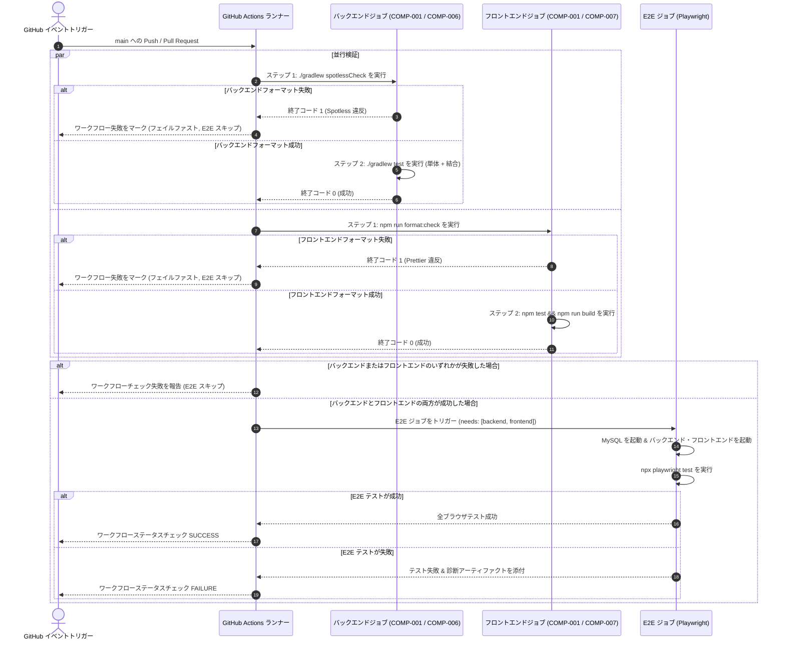
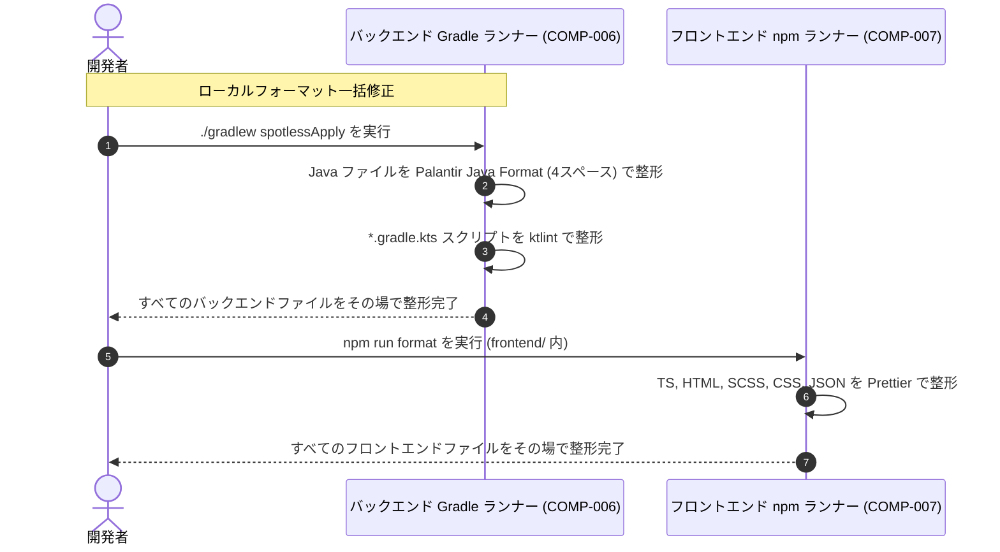

# アーキテクチャおよびコンポーネント設計書: CI およびリポジトリ自動化（CI & Repository Automation）

## 1. コンポーネント境界とスコープ概要（Component Boundaries & Scope Overview）

### 1.1 アーキテクチャとコンポーネントマップ（Architecture & Component Map）
CI & リポジトリ自動化機能は、継続的インテグレーション、コードスタイルの自動強制、依存関係の自動健全性維持、セマンティックリリースのライフサイクル、中央集権的な Gradle 依存関係管理、一括ローカル開発、リポジトリガバナンス、およびドキュメントの整合性を、8つの個別アーキテクチャコンポーネントにわたって統括します。

```mermaid
graph TD
    subgraph GitHub_Actions["GitHub プラットフォーム & 自動化"]
        CI["COMP-001: CI ワークフローエンジン<br>(.github/workflows/ci.yml)"]
        Dependabot["COMP-002: Dependabot 構成<br>(.github/dependabot.yml)"]
        ReleasePlease["COMP-003: Release Please 自動化<br>(.github/workflows/release-please.yml)"]
        Codeowners["COMP-008: コードオーナーシップガバナンス<br>(.github/CODEOWNERS)"]
    end

    subgraph Local_Dev["ローカル開発環境"]
        DevOrchestrator["COMP-004: ルート開発オーケストレーター<br>(package.json)"]
        BackendSpotless["COMP-006: バックエンドフォーマット & バージョンカタログ<br>(build.gradle.kts, libs.versions.toml)"]
        FrontendPrettier["COMP-007: フロントエンド Prettier フォーマッタ<br>(.prettierrc, .prettierignore, package.json)"]
        BackendSvc["バックエンドサービス (Java 25)"]
        FrontendSvc["フロントエンド SPA サーバー (Node 22)"]
        MySQLContainer["MySQL 8.4 コンテナ"]
    end

    subgraph Repo_Docs["リポジトリ公開 & ガバナンス"]
        DocBadges["COMP-005: ドキュメント & バッジ<br>(README.md, README.ja.md, LICENSE, AGENTS.md)"]
    end

    DevOrchestrator -->|docker compose up -d| MySQLContainer
    DevOrchestrator -->|concurrently| BackendSvc
    DevOrchestrator -->|concurrently| FrontendSvc
    BackendSpotless -->|スタイル強制| BackendSvc
    FrontendPrettier -->|スタイル強制| FrontendSvc
    CI -->|フォーマット検証 & テスト| BackendSvc
    CI -->|フォーマット検証 & テスト| FrontendSvc
    Codeowners -.->|@green-tea-stalk にレビューを割り当て| GitHub_Actions
    DocBadges -.->|ステータスを反映| CI
    DocBadges -.->|ステータスを反映| ReleasePlease
    DocBadges -.->|ステータスを反映| Dependabot
```

### 1.2 コンポーネント一覧（Component Inventory）
| コンポーネント ID | コンポーネント / ファイル境界 | スコープ / 境界 | 関連要件 |
| :--- | :--- | :--- | :--- |
| **COMP-001** | `.github/workflows/ci.yml` | GitHub Actions CI ワークフロー | `REQ-001`, `REQ-002`, `REQ-003`, `REQ-016` |
| **COMP-002** | `.github/dependabot.yml` | Dependabot 自動化マニフェスト | `REQ-004` |
| **COMP-003** | `.github/workflows/release-please.yml`, `.github/release-please-config.json`, `.release-please-manifest.json` | セマンティックリリースエンジン | `REQ-005`, `REQ-006` |
| **COMP-004** | `package.json` (リポジトリルート) | ローカル開発オーケストレーター | `REQ-007`, `REQ-008`, `REQ-009` |
| **COMP-005** | `README.md`, `README.ja.md`, `LICENSE`, `AGENTS.md` | リポジトリドキュメントおよびバッジ表示 | `REQ-010`, `REQ-011` |
| **COMP-006** | `backend/build.gradle.kts`, `backend/gradle/libs.versions.toml` | バックエンドコードフォーマッタ & バージョンカタログ | `REQ-012`, `REQ-015`, `REQ-016` |
| **COMP-007** | `frontend/.prettierrc`, `frontend/.prettierignore`, `frontend/package.json` | フロントエンドコードフォーマッタ & スクリプト | `REQ-013`, `REQ-016` |
| **COMP-008** | `.github/CODEOWNERS` | リポジトリコードオーナーシップガバナンス | `REQ-014` |

---

## 2. インタラクションモデリング（Interaction Modeling）

### 2.1 フォーマット品質ゲートを含む継続的インテグレーションワークフローパイプライン


### 2.2 ローカルコードフォーマット実行フロー


---

## 3. データモデルとスキーマ制約（Data Models & Schema Constraints）

すべての構成構造、ワークフロー定義、バージョンカタログ、およびマニフェストは、標準的な制約用語に準拠した構造化 Markdown テーブルを使用して定義されています。

### 3.1 CI ワークフロースキーマ (`.github/workflows/ci.yml`)

#### 3.1.1 `CiWorkflowSchema`
- **形式**: GitHub Actions Workflow Schema

| フィールド名（Field Name） | 型（Type） | 必須 / 任意 | 制約（Constraints） | 説明（Description） |
| :--- | :--- | :--- | :--- | :--- |
| `name` | `string` | 必須 | `const: "CI"` | ワークフロー名 |
| `on.push.branches` | `array<string>` | 必須 | `minItems: 1, non-nullable; exact elements: ["main"]` | プッシュを監視する対象ブランチ |
| `on.pull_request.branches` | `array<string>` | 必須 | `minItems: 1, non-nullable; exact elements: ["main"]` | PR を監視する対象ブランチ |
| `permissions.contents` | `string` | 必須 | `const: "read"` | 最小権限のチェックアウト権限 |
| `concurrency.group` | `string` | 必須 | フォーマット: `${{ github.workflow }}-${{ github.ref }}` | 並行実行制御ロックキー |
| `concurrency.cancel-in-progress` | `boolean` | 必須 | 値: `true` | 冗長なアクティブ実行を中断 |
| `jobs.backend` | `object` | 必須 | - | バックエンド並行検証ジョブ |
| `jobs.backend.steps` | `array<object>` | 必須 | `minItems: 5, non-nullable` | ステップシーケンス: checkout, java setup, mysql start, spotless check, test |
| `jobs.frontend` | `object` | 必須 | - | フロントエンド並行検証ジョブ |
| `jobs.frontend.steps` | `array<object>` | 必須 | `minItems: 6, non-nullable` | ステップシーケンス: checkout, node setup, npm ci, format check, unit test, build |
| `jobs.e2e` | `object` | 必須 | `needs: ["backend", "frontend"]` | 下流のブラウザテストゲート |

### 3.2 Dependabot モデルとスキーマ制約 (`.github/dependabot.yml`)

#### 3.2.1 `DependabotConfigSchema`
- **形式**: Dependabot v2 Configuration Schema

| フィールド名（Field Name） | 型（Type） | 必須 / 任意 | 制約（Constraints） | 説明（Description） |
| :--- | :--- | :--- | :--- | :--- |
| `version` | `integer` | 必須 | 値: `2` | Dependabot スキーマバージョン |
| `updates` | `array<DependabotUpdateRule>` | 必須 | `minItems: 4, maxItems: 4, non-nullable (guaranteed [] on empty)` | パッケージエコシステムの更新構成 |

#### 3.2.2 `DependabotUpdateRule` (サブモデル)
| フィールド名（Field Name） | 型（Type） | 必須 / 任意 | 制約（Constraints） | 説明（Description） |
| :--- | :--- | :--- | :--- | :--- |
| `package-ecosystem` | `string` (enum) | 必須 | `enum: ["gradle", "npm", "github-actions", "docker"]` | 対象パッケージマネージャー |
| `directory` | `string` | 必須 | `enum: ["/backend", "/frontend", "/"]` | 対象ファイルシステムディレクトリ |
| `schedule.interval` | `string` (enum) | 必須 | `enum: ["weekly"]` | チェック間隔 |
| `schedule.day` | `string` (enum) | 必須 | `enum: ["monday"]` | 実行曜日 |

### 3.3 Release Please モデル (`.github/workflows/release-please.yml`, `.github/release-please-config.json`, `.release-please-manifest.json`)

#### 3.3.1 `ReleasePleaseWorkflowSchema` (`.github/workflows/release-please.yml`)
- **形式**: GitHub Actions Workflow Schema

| フィールド名（Field Name） | 型（Type） | 必須 / 任意 | 制約（Constraints） | 説明（Description） |
| :--- | :--- | :--- | :--- | :--- |
| `name` | `string` | 必須 | `const: "release-please"` | ワークフロー識別子 |
| `on.push.branches` | `array<string>` | 必須 | `minItems: 1, maxItems: 1, non-nullable; exact elements: ["main"]` | 監視対象トリガーブランチ |
| `permissions.contents` | `string` | 必須 | `const: "write"` | タグ付けおよびリリースアセットに必要なスコープ |
| `permissions.pull-requests` | `string` | 必須 | `const: "write"` | リリース PR 管理に必要なスコープ |
| `jobs.release-please.runs-on` | `string` | 必須 | `const: "ubuntu-latest"` | ランナー環境 |
| `jobs.release-please.steps[].uses` | `string` | 必須 | `const: "googleapis/release-please-action@v4"` | Google release-please アクション参照 |

#### 3.3.2 `ReleasePleaseConfigSchema` (`.github/release-please-config.json`)
- **形式**: Release Please Configuration JSON Schema

| フィールド名（Field Name） | 型（Type） | 必須 / 任意 | 制約（Constraints） | 説明（Description） |
| :--- | :--- | :--- | :--- | :--- |
| `release-type` | `string` | 必須 | `const: "simple"` | 汎用セマンティックバージョニングエンジン |
| `packages` | `object` | 必須 | ルートパッケージキー `"."` を含む | 管理対象パッケージマッピング |

#### 3.3.3 `ReleasePleaseManifestSchema` (`.release-please-manifest.json`)
- **形式**: Release Please Manifest JSON Schema

| フィールド名（Field Name） | 型（Type） | 必須 / 任意 | 制約（Constraints） | 説明（Description） |
| :--- | :--- | :--- | :--- | :--- |
| `.` | `string` | 必須 | SemVer パターン `^[0-9]+\.[0-9]+\.[0-9]+$` | 現在のリポジトリバージョンマイルストーン |

### 3.4 ルート開発パッケージモデル (`package.json`)
- **形式**: Standard npm `package.json` Schema

| フィールド名（Field Name） | 型（Type） | 必須 / 任意 | 制約（Constraints） | 説明（Description） |
| :--- | :--- | :--- | :--- | :--- |
| `name` | `string` | 必須 | 値: `"swe-workflow-playground"` | ルートパッケージ識別子 |
| `private` | `boolean` | 必須 | 値: `true` | npm レジストリへの偶発的な公開を防止 |
| `scripts` | `object` | 必須 | 開発およびテストのタスクコマンドを含む | タスク実行スクリプト |
| `scripts.dev` | `string` | 必須 | MySQL, バックエンド, フロントエンドを起動 (`ja` デフォルト) | プライマリ開発者起動コマンド |
| `scripts.dev:ja` | `string` | 必須 | 明示的な日本語開発起動 | 日本語 dev サーバーターゲット |
| `scripts.dev:en` | `string` | 必須 | 明示的な英語開発起動 | 英語 dev サーバーターゲット |
| `scripts.db:up` | `string` | 必須 | 値: `"docker compose up -d"` | データベースコンテナ起動 |
| `scripts.db:down` | `string` | 必須 | 値: `"docker compose down"` | データベースコンテナ破棄 |
| `devDependencies` | `object` | 必須 | `concurrently`, `wait-on`, `yaml` を含む | ツール依存関係 |

### 3.5 バッジ表示モデル (`README.md` & `README.ja.md`)

#### 3.5.1 `BadgesBlockModel`
- **形式**: Markdown Header Badge Group

| フィールド名（Field Name） | 型（Type） | 必須 / 任意 | 制約（Constraints） | 説明（Description） |
| :--- | :--- | :--- | :--- | :--- |
| `badges` | `array<BadgeItemModel>` | 必須 | `minItems: 5, maxItems: 5, non-nullable (厳密な順序 1〜5)` | リポジトリ表示バッジの順序付きリスト |

#### 3.5.2 `BadgeItemModel` (サブモデル)
- **形式**: Markdown Badge Element

| フィールド名（Field Name） | 型（Type） | 必須 / 任意 | 制約（Constraints） | 説明（Description） |
| :--- | :--- | :--- | :--- | :--- |
| `position` | `integer` | 必須 | `minimum: 1`, `maximum: 5`, 一意 | 表示順序インデックス |
| `badge_type` | `string` (enum) | 必須 | `enum: ["release", "ci", "release-please", "dependabot", "license"]` | バッジ識別子 |
| `badge_url` | `string` | 必須 | `format: "uri"` | 画像レンダリング元 URL |
| `target_url` | `string` | 必須 | `format: "uri"` または相対ファイルパス | クリック先 URL または相対リンク |

### 3.6 Gradle Version Catalog モデル (`backend/gradle/libs.versions.toml`)
- **形式**: Gradle 9.x Version Catalog に準拠した TOML スキーマ

| フィールド名（Field Name） | 型（Type） | 必須 / 任意 | 制約（Constraints） | 説明（Description） |
| :--- | :--- | :--- | :--- | :--- |
| `versions` | `table` | 必須 | 文字列キーと SemVer 文字列値を含む | 共通バージョン変数 |
| `versions.micronaut` | `string` | 必須 | `pattern: "^[0-9]+\.[0-9]+\.[0-9]+$"` | Micronaut フレームワークバージョン |
| `versions.shadow` | `string` | 必須 | `pattern: "^[0-9]+\.[0-9]+\.[0-9]+$"` | Shadow プラグインバージョン |
| `versions.spotless` | `string` | 必須 | `pattern: "^[0-9]+\.[0-9]+\.[0-9]+$"` | Spotless フォーマットプラグインバージョン |
| `libraries` | `table` | 必須 | キー形式 `lowercase-kebab-case` | 外部ライブラリ定義 |
| `libraries.*.module` | `string` | 必須 | 形式: `"group:artifact"` | Maven グループおよびアーティファクト ID |
| `libraries.*.version.ref` | `string` | 任意 | `[versions]` 内のキーを参照 | バージョン参照 |
| `libraries.*.version` | `string` | 任意 | 固定バージョン文字列 | 固定バージョン指定 |
| `plugins` | `table` | 必須 | キー形式 `lowercase-kebab-case` | Gradle プラグイン定義 |
| `plugins.*.id` | `string` | 必須 | 有効な Gradle プラグイン ID | プラグイン座標 |
| `plugins.*.version.ref` | `string` | 必須 | `[versions]` 内のキーを参照 | バージョン参照 |

### 3.7 フロントエンド Prettier 構成モデル (`frontend/.prettierrc`, `frontend/package.json`)

#### 3.7.1 `PrettierConfigModel` (`frontend/.prettierrc`)
- **形式**: JSON Schema / Prettier Configuration

| フィールド名（Field Name） | 型（Type） | 必須 / 任意 | 制約（Constraints） | 説明（Description） |
| :--- | :--- | :--- | :--- | :--- |
| `tabWidth` | `integer` | 必須 | 値: `2` | インデントレベルごとのスペース数 |
| `useTabs` | `boolean` | 必須 | 値: `false` | タブではなくスペースでインデント |
| `singleQuote` | `boolean` | 必須 | 値: `true` | JS/TS 文字列にシングルクォートを使用 |
| `semi` | `boolean` | 必須 | 値: `true` | 文末にセミコロンを付与 |
| `trailingComma` | `string` (enum) | 必須 | 値: `"all"` | 複数行で可能な限り末尾カンマを付与 |
| `printWidth` | `integer` | 必須 | 値: `100` | プリンターが折り返す行の長さを指定 |
| `bracketSpacing` | `boolean` | 必須 | 値: `true` | オブジェクトリテラルの括弧間にスペースを付与 |
| `arrowParens` | `string` (enum) | 必須 | 値: `"always"` | アロー関数の単一パラメータを括弧で囲む |

#### 3.7.2 `PrettierScriptsModel` (`frontend/package.json`)
- **形式**: Standard npm `package.json` Schema (Scripts Block)

| フィールド名（Field Name） | 型（Type） | 必須 / 任意 | 制約（Constraints） | 説明（Description） |
| :--- | :--- | :--- | :--- | :--- |
| `scripts.format:check` | `string` | 必須 | `Value: "prettier --check ."` | ファイル全体のフォーマットを検証。不一致時に終了コード 1 で終了 |
| `scripts.format` | `string` | 必須 | `Value: "prettier --write ."` | 対象ファイル全体をその場で自動整形 |

### 3.8 コードオーナーシップガバナンスモデル (`.github/CODEOWNERS`)
- **形式**: Standard GitHub CODEOWNERS Pattern Syntax

| パターン | オーナー / 割り当て先 | 説明 |
| :--- | :--- | :--- |
| `*` | `@green-tea-stalk` | リポジトリ全体のレビュー責任をリードメンテナーに割り当て |

---

## 4. 入出力プロトコルと実行規約（Input / Output Protocols & Execution Contracts）

### 4.1 CLI プロトコル (ローカルフォーマットおよび開発オーケストレーション - COMP-004, COMP-006, COMP-007)
- **フォーマット検証コマンド**:
  - バックエンド: `cd backend && ./gradlew spotlessCheck`（準拠時 `0`、スタイル違反時 `1` で終了）。
  - フロントエンド: `cd frontend && npm run format:check`（準拠時 `0`、スタイル違反時 `1` で終了）。
- **その場フォーマット修正コマンド**:
  - バックエンド: `cd backend && ./gradlew spotlessApply`（Java ソースおよび Kotlin Gradle スクリプトを整形）。
  - フロントエンド: `cd frontend && npm run format`（TS, HTML, SCSS, CSS, JSON を整形）。
- **終了コード**:
  - `0`: フォーマットがルールに適合している、または正常に修正された。
  - `1`: チェックモードでフォーマット違反が検出された、または構文エラーが発生した。

### 4.2 GitHub Actions 実行プロトコル (COMP-001 & COMP-003)
- **バックエンドジョブにおけるフェイルファスト実行順序**:
  1. `actions/checkout@v7`
  2. `actions/setup-java@v6`（Corretto 25, Gradle キャッシュ）
  3. `docker compose up -d --wait` による MySQL コンテナ起動
  4. Spotless フォーマット検証: `cd backend && ./gradlew spotlessCheck`
  5. Gradle テスト: `cd backend && ./gradlew test`
- **フロントエンドジョブにおけるフェイルファスト実行順序**:
  1. `actions/checkout@v7`
  2. `actions/setup-node@v7`（Node 22, npm キャッシュ）
  3. `cd frontend && npm ci`
  4. Prettier フォーマット検証: `cd frontend && npm run format:check`
  5. 単体テスト: `cd frontend && npm test -- --watch=false`
  6. 本番ビルド: `cd frontend && npm run build`
- **アーティファクトの保持**:
  - E2E テスト失敗時、ワークフローは Playwright のトレースおよび失敗スクリーンショットを 14 日間の保持期限で GitHub Actions アーティファクトとしてアップロードしなければならない（MUST）。

---

## 5. コンポーネント契約（Design by Contract - RFC 2119 / RFC 8174 対訳）

### 5.1 COMP-001: CI ワークフローエンジン (`.github/workflows/ci.yml`)
- **役割**: プルリクエストおよび `main` ブランチの自動品質検証ゲート。
- **公開シグネチャ**: GitHub Actions ワークフローイベントハンドラー（`push`, `pull_request`）。
- **事前条件（呼び出し側の義務）**:
  - 呼び出し側は、`main` を対象とする有効な Git 参照またはプルリクエストでワークフローをトリガーしなければならない（MUST）。
  - リポジトリランナーは Docker 仮想化が有効化されていなければならない（MUST）。
- **事後条件（被呼び出し側の保証）**:
  - ワークフローは、`backend` および `frontend` ジョブを並行して実行しなければならない（MUST）。
  - `backend` ジョブにおいて、ワークフローは `./gradlew test` の実行に先立って `./gradlew spotlessCheck` を実行しなければならない（MUST）。
  - `frontend` ジョブにおいて、ワークフローは単体テストおよびビルドに先立って `npm run format:check` を実行しなければならない（MUST）。
  - いずれかのジョブでフォーマット検証が失敗した場合、ワークフローは直ちにジョブを失敗として終了させなければならず（MUST）、下流の E2E 実行を許可してはならない（MUST NOT）。
  - `backend` と `frontend` の両ジョブが成功した場合、ワークフローは `e2e` ジョブを実行しなければならない（MUST）。
  - いずれかのジョブが失敗した場合、ワークフローは非ゼロの終了ステータスを返し、GitHub に失敗ステータスチェックを報告しなければならない（MUST）。
- **不変条件（状態整合性）**:
  - 同一ブランチまたは同一プルリクエストに対する冗長な実行中のワークフロー実行は、並行実行グループによってキャンセルされなければならない（MUST）。

### 5.2 COMP-002: Dependabot 構成 (`.github/dependabot.yml`)
- **役割**: 複数エコシステムにわたる自動依存関係監視およびアップグレード PR 提出。
- **公開シグネチャ**: Dependabot v2 構成パーサー。
- **事前条件（呼び出し側の義務）**:
  - マニフェストディレクトリ（`/backend`, `/frontend`, `/`）には、有効なエコシステムロック/ビルドファイル（`build.gradle.kts`, `gradle/libs.versions.toml`, `package.json`, ワークフロー YAML, `docker-compose.yml`）が含まれていなければならない（MUST）。
- **事後条件（被呼び出し側の保証）**:
  - エンジンは、毎週月曜日に依存関係の状態を評価しなければならない（MUST）。
  - 検出された古くなったパッケージまたは安全でないパッケージについて、エンジンは標準の Conventional Commits プレフィックスを付与した個別のプルリクエストを開かなければならない（MUST）。
  - 古くなったパッケージや脆弱なパッケージがゼロ（0）件の場合、エンジンはいかなるプルリクエストも開いてはならず（MUST NOT）、クリーンな状態でスケジュール評価を完了しなければならない（SHALL）。
- **不変条件（状態整合性）**:
  - Dependabot は構成されたディレクトリ外のパッケージを更新してはならない（MUST NOT）。

### 5.3 COMP-003: Release Please 自動化 (`.github/workflows/release-please.yml`)
- **役割**: 自動変更履歴作成、セマンティックバージョニング、および GitHub リリース公開。
- **公開シグネチャ**: GitHub Actions ワークフローイベントハンドラー（`main` への `push`）。
- **事前条件（呼び出し側の義務）**:
  - 対象ブランチは `main` でなければならない（MUST）。
  - マージされるコミットは Conventional Commits 1.0.0 形式（`feat`, `fix` 等）に準拠していなければならない（MUST）。
- **事後条件（被呼び出し側の保証）**:
  - `main` へのプッシュ時、ワークフローは `.release-please-manifest.json` に対してコミット履歴を評価しなければならない（MUST）。
  - バージョンインクリメントをトリガーするコミットが存在する場合、ワークフローはバージョン更新と変更履歴エントリを含むオープンなリリースプルリクエストを維持しなければならない（MUST）。
  - リリースプルリクエストがマージされた場合、ワークフローは新しい SemVer タグでコミットにタグ付けし、GitHub Release アセットを公開しなければならない（MUST）。
  - バージョンをトリガーする Conventional Commits がゼロ（0）件の場合、ワークフローはいかなるリリースプルリクエストも作成・変更してはならず（MUST NOT）、エラーなしで正常に終了しなければならない（SHALL）。
- **不変条件（状態整合性）**:
  - `.release-please-manifest.json` 内のバージョン番号は単調増加を維持し、厳格に SemVer に従わなければならない（MUST）。

### 5.4 COMP-004: ルート開発オーケストレーター (`package.json`)
- **役割**: ローカルフルスタック実行およびライフサイクル管理のための統合開発者 CLI。
- **公開シグネチャ**: `npm run dev` / `npm run dev:ja` / `npm run dev:en`。
- **事前条件（呼び出し側の義務）**:
  - 開発者ホスト上で Docker Engine が稼働し、Java 25 および Node.js 22 がインストールされていなければならない（MUST）。
- **事後条件（被呼び出し側の保証）**:
  - 実行時に、`docker compose up -d` により MySQL コンテナが起動していることを保証しなければならない（MUST）。
  - ポート `8080` でバックエンドを、ポート `4200` でフロントエンドを並行して起動しなければならない（MUST）。
  - 両プロセスの stdout/stderr を識別可能なプレフィックス付きでターミナルに転送しなければならない（MUST）。
  - `SIGINT` 受信時、孤立した Java または Node プロセスを残すことなく、5 秒以内にすべての子プロセスを終了しなければならない（MUST）。
- **不変条件（状態整合性）**:
  - ホストのポートバインディング（`3306`, `8080`, `4200`）は、並行スクリプト呼び出し間で競合してはならない（MUST NOT）。

### 5.5 COMP-005: ドキュメントおよびバッジ表示 (`README.md`, `README.ja.md`, `LICENSE`, `AGENTS.md`)
- **役割**: 公開プロジェクトガバナンス、ビルド健全性の可視化、ライセンス開示、および統一開発者ガイドの維持。
- **公開シグネチャ**: Markdown ドキュメント表示。
- **事前条件（呼び出し側の義務）**:
  - アップストリームリポジトリおよびワークフローは公開されているか、アクセス可能なステータスバッジを持っていなければならない（MUST）。
- **事後条件（被呼び出し側の保証）**:
  - `README.md` および `README.ja.md` は、厳密に指定された順序（1. 最新リリース, 2. CI ステータス, 3. release-please ステータス, 4. Dependabot ステータス, 5. ライセンスバッジ）でバッジを表示しなければならない（MUST）。
  - `LICENSE` ファイルは、2026 年付の標準 MIT ライセンス本文を含まなければならない（MUST）。
  - `AGENTS.md` は、単一情報源ポリシーおよび一方向参照の整合性を厳格に保持しながら、一括 `npm run dev` ワークフローおよびフォーマットコマンドを文書化しなければならない（MUST）。
- **不変条件（状態整合性）**:
  - 英語版と日本語版の README ドキュメントは、同一のバッジ構成およびリンク先を維持しなければならない（MUST）。

### 5.6 COMP-006: バックエンドコードフォーマッタ & バージョンカタログ (`backend/build.gradle.kts`, `backend/gradle/libs.versions.toml`)
- **役割**: バックエンドコードスタイルフォーマットガバナンス（Java & Kotlin DSL）および中央集権的依存関係管理。
- **公開シグネチャ**: Gradle タスク `./gradlew spotlessCheck`, `./gradlew spotlessApply`, および Version Catalog アクセサ `libs.*`。
- **事前条件（呼び出し側の義務）**:
  - Java ソースファイルは `backend/src/` 配下に配置され、Kotlin DSL ビルドスクリプトは `.gradle.kts` で終わらなければならない（MUST）。
  - `backend/gradle/libs.versions.toml` のバージョンカタログは、整形式の TOML 構文でなければならない（MUST）。
- **事後条件（被呼び出し側の保証）**:
  - Java および Kotlin ビルドファイル全体でフォーマット違反がゼロ（0）件の場合、`./gradlew spotlessCheck` は終了コード `0` で完了しなければならない（MUST）。
  - いずれかの Java ファイルが Palantir Java Format（4スペース）から逸脱しているか、Kotlin Gradle スクリプトが ktlint 基準から逸脱している場合、`spotlessCheck` は終了コード `1` で失敗しなければならない（MUST）。
  - `spotlessApply` は、準拠を達成するために非準拠ファイルをその場で再フォーマットしなければならない（MUST）。
  - `backend/build.gradle.kts` は、インラインのバージョン座標ではなく型安全な `libs` アクセサを介して依存関係およびプラグインを参照しなければならない（MUST）。
- **不変条件（状態整合性）**:
  - バージョンカタログには、プラットフォーム環境バージョン（Java 25, MySQL 8.4, Docker）を含めてはならない（MUST NOT）。

### 5.7 COMP-007: フロントエンド Prettier フォーマッタ & スクリプト (`frontend/.prettierrc`, `frontend/.prettierignore`, `frontend/package.json`)
- **役割**: TypeScript、HTML、スタイル、および構成ファイルにわたるフロントエンドコードスタイルフォーマットガバナンス。
- **公開シグネチャ**: npm スクリプト `npm run format:check` および `npm run format`。
- **事前条件（呼び出し側の義務）**:
  - `frontend/` に Node.js 22 LTS ランタイムおよび npm 依存関係がインストールされていなければならない（MUST）。
- **事後条件（被呼び出し側の保証）**:
  - すべての対象ファイル（`.ts`, `.html`, `.scss`, `.css`, `.json`）が `.prettierrc` ルールに適合している場合、`npm run format:check` は終了コード `0` で終了しなければならず、いずれかのファイルで整形が必要な場合は終了コード `1` で終了しなければならない（MUST）。
  - `npm run format` は、無視されていないすべての対象ファイル全体にフォーマット後の内容をその場で書き込まなければならない（MUST）。
  - `.prettierignore` 内の除外パターン（`dist/`, `.angular/`, `node_modules/`, `coverage/`）を遵守しなければならない（MUST）。
- **不変条件（状態整合性）**:
  - フォーマット結果は、開発者ワークステーションと CI ランナー間で決定論的でなければならない（MUST）。

### 5.8 COMP-008: リポジトリコードオーナーシップガバナンス (`.github/CODEOWNERS`)
- **役割**: GitHub 上での自動コードレビュー割り当ておよびガバナンスルーティング。
- **公開シグネチャ**: GitHub CODEOWNERS 構文エンジン。
- **事前条件（呼び出し側の義務）**:
  - ファイルはデフォルトブランチの `.github/CODEOWNERS` に配置されなければならない（MUST）。
  - 宣言されたオーナー `@green-tea-stalk` は、リポジトリアクセス権を持つ有効な GitHub ユーザーでなければならない（MUST）。
- **事後条件（被呼び出し側の保証）**:
  - GitHub は、リポジトリ内の任意のファイルを変更するすべての受信プルリクエスト（`*`）に対して、`@green-tea-stalk` を必須レビュアーとして自動的に割り当てなければならない（MUST）。
- **不変条件（状態整合性）**:
  - ワイルドカードパターン `*` により、リポジトリ内のオーナー不在（孤立パス）がゼロであることを保証しなければならない（MUST）。

---

## 6. エラーと例外処理（Error & Exception Handling）

### 6.1 CI ワークフロー障害モード (COMP-001)
- **コンパイルまたは単体テストの失敗**:
  - 影響を受けたジョブ（`backend` または `frontend`）は、直ちに非ゼロの終了コードで停止する。
  - 下流の `e2e` ジョブのステータスは `skipped` とマークされる（`needs: [backend, frontend]` の条件未充足のため）。
  - プルリクエストに対する GitHub ステータスチェックは `failure` と報告される。
- **E2E 起動タイムアウト**:
  - `e2e` ジョブにおいて、バックエンドの準備完了チェック（`curl --fail --retry 30 --retry-delay 2 http://localhost:8080/api/posts`）およびフロントエンドの準備完了チェック（`curl --fail --retry 30 --retry-delay 2 http://localhost:4200/`）は、60 秒間の無応答後にフェイルクローズする。
  - ワークフローはバックエンドの stdout/stderr ログをランナーコンソールにダンプし、サービスを終了してコード `1` で終了する。
- **Playwright テストのアサーション失敗**:
  - Playwright は自動的に失敗スクリーンショットと実行トレース（`trace: 'on-first-retry'`）を取得する。
  - GitHub Actions ステップは、`actions/upload-artifact@v4` を介して `./frontend/test-results` および `./frontend/playwright-report` をアップロードする。

### 6.2 ローカル開発オーケストレーターの障害モード (COMP-004)
- **Docker デーモン非アクティブ**:
  - `npm run db:up` は終了コード `1` で失敗し、明確な診断メッセージ（`Cannot connect to the Docker daemon`）を出力する。
  - ルートコマンドはバックエンドやフロントエンドのプロセスを起動する前に直ちに停止する。
- **ポートの競合 (3306, 8080, または 4200 が既に使用中)**:
  - Micronaut バックエンドまたは Angular dev サーバーが `EADDRINUSE` / `BindException` を出力する。
  - `concurrently --kill-others` は子プロセスのコード `1` による終了を検出し、残りの子プロセスを直ちに終了する。

### 6.3 Dependabot の障害モード (COMP-002)
- **エコシステムマニフェスト構文またはロックファイルの解析エラー**:
  - パッケージエコシステムのマニフェストまたはロックファイルに無効な構文が含まれている場合、Dependabot は解析エラーをリポジトリの GitHub Security / Dependabot updates タブに記録する。
  - Dependabot は残りのエコシステムの評価をクラッシュさせたり妨げたりすることなく、影響を受けるエコシステムのみの評価を停止する。
- **アップストリームレジストリのレート制限またはネットワークの中断**:
  - ネットワークタイムアウトまたはパッケージレジストリの 429/503 応答が発生した場合、Dependabot はフェイルクローズし、次回のスケジュール間隔で再試行する。
  - 不完全または破損したプルリクエストは作成されない。

### 6.4 Release Please 自動化の障害モード (COMP-003)
- **不十分な GITHUB_TOKEN 権限**:
  - ワークフローの実行に `contents: write` または `pull-requests: write` が不足している場合、release-please は終了コード `1` で失敗し、`Resource not accessible by integration` を出力する。
  - ワークフローはフェイルクローズし、GitHub Actions の失敗通知を介してメンテナーに警告する。
- **SemVer タグの衝突**:
  - 計算された次のセマンティックバージョンと一致する Git タグがリモートに既に存在する場合、release-please は既存のタグを上書きすることなく停止し、衝突警告を出力する。
- **非標準または不正な形式のコミットメッセージ**:
  - Conventional Commits 形式（`feat:`, `fix:` 等）に一致しないコミットは、ワークフローのクラッシュを引き起こすことなくバージョンパーサーによって無視される。

### 6.5 ドキュメントおよびバッジ表示の障害モード (COMP-005)
- **外部バッジサービスの中断**:
  - Shields.io または GitHub Actions バッジエンドポイントでアップストリームネットワークの中断が発生した場合、Markdown レンダラーはドキュメントレイアウトを変更したりリンクを壊したりすることなく、バッジの代替テキスト（alt-text）を表示するようにフォールバックする。
- **ドキュメントの乖離またはアンカー参照切れ**:
  - `README.md` および `README.ja.md` の人間向けエントリポイントリンクを更新せずに `AGENTS.md` のセクションアンカーが変更された場合、リンクチェッカーの監査が自動チェックでフェイルクローズし、マージ前に貢献者に警告する。

### 6.6 バックエンドフォーマット障害 (COMP-006)
- **Spotless 検証の不一致**:
  - いずれかの Java ファイルまたは `.gradle.kts` ファイルが Palantir Java Format または ktlint のルールから逸脱している場合、`./gradlew spotlessCheck` は実行を停止し、違反の差分を stderr に出力して終了コード `1` で終了する。
  - CI においては、Gradle テストの実行や Testcontainers の起動前に `backend` ジョブが直ちに失敗する。
  - 是正手順: 貢献者がローカルで `./gradlew spotlessApply` を実行し、生成されたフォーマット変更をコミットする。

### 6.7 フロントエンドフォーマット障害 (COMP-007)
- **Prettier 検証の不一致**:
  - いずれかのフロントエンドファイル（`.ts`, `.html`, `.scss`, `.css`, `.json`）が `.prettierrc` のルールから逸脱している場合、`npm run format:check` は非準拠のファイル名を stderr に出力して終了コード `1` で終了する。
  - CI においては、Vitest テストの実行や本番バンドルのビルド前に `frontend` ジョブが直ちに失敗する。
  - 是正手順: 貢献者が `frontend/` で `npm run format` を実行し、生成されたフォーマット変更をコミットする。

### 6.8 バージョンカタログの解析または解決障害 (COMP-006)
- **不正な TOML 構文または欠落したアクセサ**:
  - `backend/gradle/libs.versions.toml` に構文エラーや無効なバージョン参照が含まれている場合、Gradle のビルド初期化は設定時（configuration time）にわかりやすい解析エラーとともに直ちに失敗する。
  - 是正手順: `libs.versions.toml` の TOML 構文エラーを修正し、`./gradlew buildEnvironment` を再実行する。

### 6.9 CODEOWNERS の構文およびメンション解決障害 (COMP-008)
- **無効なハンドルまたはパターン構文**:
  - `.github/CODEOWNERS` が存在しない GitHub ハンドルや不正な形式のパスパターンを参照している場合、GitHub はレビューリクエストの送信を省略するか、リポジトリ設定画面で構文エラーを警告する。
  - 検証: パターン `* @green-tea-stalk` を確認する自動チェックにより静的に検証される。

---

## 7. 主な設計判断とアーキテクチャ上のトレードオフ（Key Design Decisions & Architectural Trade-offs）

- **CI パイプライン実行トポロジーと下流ゲート**:
  - **採用アプローチ**: 継続的インテグレーションを、バックエンド検証（Java 25 LTS、Gradle コンパイル、単体テスト、および Testcontainers MySQL 結合テスト）とフロントエンド検証（Node.js 22 LTS、Vitest 単体テスト、および本番 AOT ビルド）の 2 つの独立した並行ランナージョブに分岐し、`needs: [backend, frontend]` を介して下流のブラウザ E2E ジョブをゲートすることで、両方の先行スイートがクリーンに成功した場合にのみ E2E テストを実行する（`COMP-001`, `REQ-001`, `REQ-002`, `REQ-003`）。
  - **検討した代替案**: 1 台のランナー上でバックエンド、フロントエンド、E2E を直列に実行する単一のシーケンシャルモノリシックジョブ、またはゲートを設けず 3 つのジョブすべてを並行して実行するマトリックス構成。
  - **選定理由とトレードオフ**: ランナーの並列性を最大化して所要時間を最小化し、貢献者に迅速なフィードバックを提供する（`NFR-PERF-001`）。リソースを多く消費する E2E スイートを先行検証の後方にゲートすることで、単体テストやコンパイルが失敗した際に MySQL コンテナのプロビジョニングやブラウザ自動化の実行を防止するフェイルクローズ品質ゲートを強制する（`NFR-REL-001`）。受け入れたトレードオフは、GitHub Actions YAML でのジョブ間依存関係の管理と、複数のランナー仮想マシン起動オーバーヘッドが発生する点である。

- **ローカル開発オーケストレーションとプロセスライフサイクル**:
  - **採用アプローチ**: `concurrently` と `wait-on` を使用したルート npm オーケストレーターにより、コンテナ化されたデータベース永続化（`docker compose up -d` による MySQL 8.4）と、ネイティブホストで実行されるバックエンド（`./gradlew run`）およびフロントエンド（`npm run start:ja` / `start:en`）を組み合わせたハイブリッド実行トポロジーを管理し、ライブホットリロードおよび孤立プロセスのない `SIGINT` シグナル伝播による正常終了を実現する（`COMP-004`, `REQ-007`, `REQ-008`, `REQ-009`）。
  - **検討した代替案**: MySQL、Micronaut バックエンド、Angular フロントエンドサービスをすべて Docker コンテナ内でのみ実行する完全コンテナ化 Docker Compose スタック。
  - **選定理由とトレードオフ**: アプリケーションサーバーを開発者ホスト上で直接実行することで、Angular における瞬間的なホットモジュール置換（HMR）、Micronaut の高速な再コンパイル/再起動サイクル、Docker のボリューム/バインドマウント I/O 性能ペナルティ（特に macOS 上）の完全回避、および IDE デバッガ/プロファイラの直接アタッチを実現する。受け入れたトレードオフは、開発者がコンテナランタイムだけでなくホストランタイム（Java 25 LTS および Node.js 22 LTS）をマシンにインストールする必要がある点である。

- **モノレポのセマンティックリリースとバージョニング戦略**:
  - **採用アプローチ**: Google `release-please-action`（ルート `.` を対象とする `.github/release-please-config.json` および `.release-please-manifest.json`）を介して `release-type: simple` を設定したリポジトリ全体の一元的なセマンティックバージョニングを採用し、`main` 上のすべての Conventional Commits が単一の正規バージョンをインクリメントして一元化された `CHANGELOG.md` に集約する（`COMP-003`, `REQ-005`, `REQ-006`）。
  - **検討した代替案**: バックエンドとフロントエンドのサブディレクトリごとに個別のバージョン番号、Git タグ（例: `backend-v1.0.0`、`frontend-v1.0.0`）、および分割された変更履歴を追跡する独立したマルチパッケージリリース構成。
  - **選定理由とトレードオフ**: リポジトリは、バックエンド REST 契約（`RFC 9457`, `GET/POST /api/posts`）とフロントエンドクライアントが一体として作成、テスト、デプロイされる統合フルスタックアプリケーションとして機能する。統一された SemVer マイルストーンは、利用者に明確なリリースの透明性を提供し、バージョンの非互換性を防ぐ。受け入れたトレードオフは、一方のサブシステム（CSS やロギングなど）にのみ影響するコミットでも、リポジトリ全体のバージョンが増加する点である。

- **複数エコシステムにわたる依存関係自動化と更新頻度**:
  - **採用アプローチ**: `.github/dependabot.yml` において、4 つのすべてのパッケージエコシステム（バックエンドの `gradle`、フロントエンドの `npm`、CI ワークフローの `github-actions`、コンテナベースの `docker`）にわたり、毎週月曜日に統一したスケジュール（`schedule: interval: weekly, day: monday`）を設定する（`COMP-002`, `REQ-004`）。
  - **検討した代替案**: 毎日の更新チェック、またはエコシステムごとに個別のスケジュール（例: フロントエンドは毎日、バックエンドは隔週、アクションは毎月）。
  - **選定理由とトレードオフ**: すべてのパッケージマネージャーを単一の月曜日スケジュールに同期させることで、依存関係 PR を予測可能なレビュー期間に集約し、レビュー疲労を防ぎ、活発なスプリント中の冗長な CI ワークフロー実行を削減する。受け入れたトレードオフは、週半ばに公開された非クリティカルな更新が翌週の月曜日まで保留される点である（重大な CVE は GitHub Security Advisories によってプロアクティブに処理される）。

- **ドキュメントアーキテクチャと視覚的ステータスバッジ階層**:
  - **採用アプローチ**: `README.md` と `README.ja.md` の両方にわたり、運用の重要度順に整列された厳格な 5 バッジ構成（1. 最新リリース, 2. CI ステータス, 3. release-please ステータス, 4. Dependabot ステータス, 5. MIT ライセンス）を採用し、`AGENTS.md` をすべての CLI コマンド（`npm run dev`）の信頼できる唯一の情報源（SSOT）として確立しつつ、一方向参照ルール（人間向けエントリポイントから `AGENTS.md` へのみリンクし、逆方向は禁止）を厳格に維持する（`COMP-005`, `REQ-010`, `REQ-011`, `NFR-MAINT-001`）。
  - **検討した代替案**: コマンド手順が重複し、双方向のクロスリンクを許容するアドホックまたはアルファベット順のバッジ配置。
  - **選定理由とトレードオフ**: 多言語ドキュメント間での記述の乖離を排除し、単一の信頼できる操作手順を提供するとともに、訪問者にリリースの安定性、パイプラインの健全性、セキュリティ体制、および法的ライセンス条項を即座に一覧できる構成を提供する。受け入れたトレードオフは、人間向けドキュメントで CLI スニペットを重複させないための厳格な規律が必要となる点である。

- **バックエンドコードスタイル検証とフォーマットエンジン（Java & Kotlin DSL）**:
  - **採用アプローチ**: Spotless Gradle プラグイン（`com.diffplug.spotless`）を採用し、Java ソースコード（`src/**/*.java`）には 4 スペースインデント準拠の Palantir Java Format（`palantirJavaFormat()`）を、Kotlin Gradle ビルドスクリプト（`*.gradle.kts`）には `ktlint()` を適用。自動検証タスク（`./gradlew spotlessCheck`）および一括自動修正タスク（`./gradlew spotlessApply`）を整備（`COMP-006`, `REQ-012`, `REQ-016`, `NFR-STYLE-001`）。
  - **検討した代替案**: デフォルトで 2 スペースインデントを強制する Google Java Format（`googleJavaFormat()`）の採用、4 スペースインデントを採用するもののラムダ式やビルダーチェーンで特異な改行規則を持つ AOSP（Android Open Source Project）フォーマット、または Spotless によるビルド連動を行わない IDE 依存の手動フォーマット運用。
  - **選定理由とトレードオフ**: Palantir Java Format は、エンタープライズ Java および Micronaut エコシステムで広く定着している標準的な 4 スペースインデントを厳格に順守し、コードレビューにおける不毛なインデント・スタイル議論を完全に排除する決定論的フォーマッタである。さらに ktlint を併用することで Kotlin ビルドスクリプトの品質ガバナンスも担保できる。受け入れたトレードオフは、開発者独自の手動改行やメソッドチェーンの配置が画一的に再フォーマットされる点と、コミット前に `./gradlew spotlessApply` の実行が必須となる点である。

- **フロントエンドコードフォーマッタと静的解析の責務分離（TypeScript, HTML, スタイル, JSON）**:
  - **採用アプローチ**: ルートの `.prettierrc` および `.prettierignore` による Prettier 構成を導入し、npm スクリプト（`npm run format:check` および `npm run format`）経由で TypeScript（`.ts`）、Angular HTML テンプレート（`.html`）、スタイルシート（`.scss`/`.css`）、設定ファイル（`.json`）に対する決定論的フォーマットを強制（`COMP-007`, `REQ-013`, `REQ-016`, `NFR-STYLE-001`）。
  - **検討した代替案**: ESLint のフォーマットルール（`@typescript-eslint` のスタイリングルールや Prettier 代替プラグイン）のみへの依存、または Prettier を導入せず Angular CLI の標準出力や IDE 設定に委ねる構成。
  - **選定理由とトレードオフ**: Prettier は AST（抽象構文木）を解釈してコードを再構築するデファクトスタンダードのフォーマッタであり、TypeScript のみならず HTML テンプレート、SCSS、JSON を含むフロントエンドの多言語スタック全体を単一の設定で高速かつ一貫して整形できる。フォーマット（Prettier）と静的意味解析・リント（ESLint）の責務を分離することで、ルール衝突や修正ループの発生を未然に防止できる。受け入れたトレードオフは、`frontend/` 配下に設定ファイルやスクリプトが追加される点と、Prettier 特有の折り返し長や引用符規約が強制される点である。

- **CI フォーマット品質ゲート統合と実行トポロジー**:
  - **採用アプローチ**: `.github/workflows/ci.yml` において、コードフォーマット検証（`./gradlew spotlessCheck` および `npm run format:check`）を、既存の並行 `backend` および `frontend` ジョブ内の最初のステップとして組み込み、コンパイルや単体テスト・結合テストの実行に先立ってフェイルファスト検証を実施（`COMP-001`, `REQ-001`, `REQ-016`, `NFR-PERF-001`, `NFR-REL-001`）。
  - **検討した代替案**: フォーマット検証専用の独立した GitHub Actions ランナージョブ（`backend-lint`、`frontend-lint` 等）を新設する構成、またはバックエンド/フロントエンドジョブの起動前にリポジトリルートで直列に事前チェックを実行する構成。
  - **選定理由とトレードオフ**: 既存の並行ランナージョブ内でフォーマット検証を行うことで、すでにチェックアウトされたソースコードやキャッシュ済みランタイム環境（Java 25 LTS、Gradle キャッシュ、Node.js 22 LTS、npm キャッシュ）をそのまま再利用でき、追加ランナーの仮想マシン起動オーバーヘッドや課金実行時間をゼロに抑えられる。また、各ジョブの最序盤で実行することにより、スタイル違反時に数秒で即座に失敗させ、高負荷なコンパイルや Testcontainers、単体テストの無駄な実行を防止できる。受け入れたトレードオフは、フォーマット違反が発生した際に該当サブシステムのテスト実行が中断され、修正するまでテスト結果が得られない点である。

- **リポジトリコードオーナーシップガバナンスとレビュー自動ルーティング**:
  - **採用アプローチ**: `.github/CODEOWNERS` を新設し、リポジトリ全体を網羅するワイルドカード規則（`* @green-tea-stalk`）を定義して、全ディレクトリ・全ブランチの変更に対するデフォルトのレビュー・承認責任をリードメンテナーに一元集約（`COMP-008`, `REQ-014`）。
  - **検討した代替案**: ディレクトリごとの詳細なパス分割マッピング（`/backend/`、`/frontend/`、`/.github/`、`/docs/` 等を別々に定義）の採用、またはバージョン管理された `CODEOWNERS` を作成せず GitHub のブランチ保護ルールや手動のアサインのみに依存する構成。
  - **選定理由とトレードオフ**: リードメンテナーが統括するフルスタックリポジトリにおいて、ワイルドカード指定（`*`）により、将来のディレクトリ追加時にもパスの記述漏れ（孤立パス）を完全に排除し、外部コントリビューターに対するレビュー責任体制の透明性を担保できる。受け入れたトレードオフは、ドキュメントや CI 設定を含む全領域の PR で `@green-tea-stalk` へのレビュー要求が自動生成される点であり、将来チームが拡大して担当領域が分散した際にはパスごとの個別定義へのリファクタリングが必要となる点である。

- **Gradle Version Catalog による中央集権的依存関係管理**:
  - **採用アプローチ**: `backend/gradle/libs.versions.toml` に標準の Gradle Version Catalog を導入し、バックエンドのビルドプラグイン ID、バージョン、および外部ライブラリ依存関係の座標を一元管理。一方で、実行プラットフォーム環境のランタイム（Java 25 LTS、MySQL 8.4 LTS、Docker 等）は意図的にカタログ管理対象から除外（`COMP-006`, `REQ-015`）。
  - **検討した代替案**: `backend/build.gradle.kts` 内にインライン文字列リテラルで依存関係を直接ハードコードし続ける構成、リポジトリルートに `/gradle/libs.versions.toml` を配置して非 Gradle ツールも含めた統合カタログとする構成、または JDK や MySQL コンテナのバージョンまでもカタログ内に記述する構成。
  - **選定理由とトレードオフ**: 標準の Version Catalog を採用することで、Kotlin DSL における型安全なアクセサ生成（`libs.micronaut...`）が利用可能になり、複数箇所に散らばる依存関係の更新を単一ファイルで完結させ、Dependabot の Gradle エコシステム解析と完全連動させることができる。また、プラットフォームランタイムのバージョンを除外することで、インフラ・実行環境（CI ワークフローや Docker Compose）とビルド依存ライブラリの責務分離を保つことができる。受け入れたトレードオフは、`build.gradle.kts` 内の既存のインライン記述をカタログアクセサに移行する初期工数が発生する点と、ビルドスクリプトに加えてカタログファイルのメンテナンスが必要になる点である。
