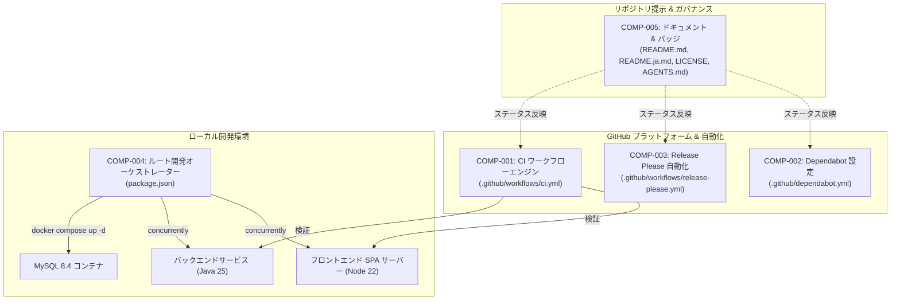
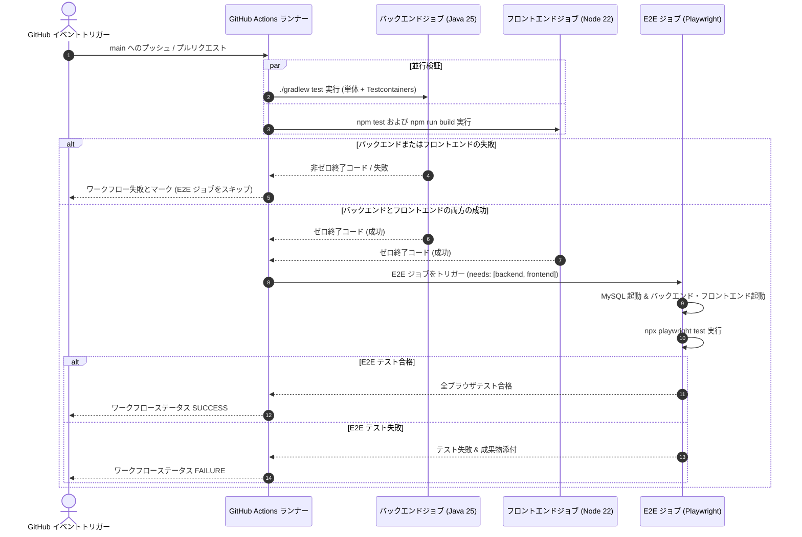
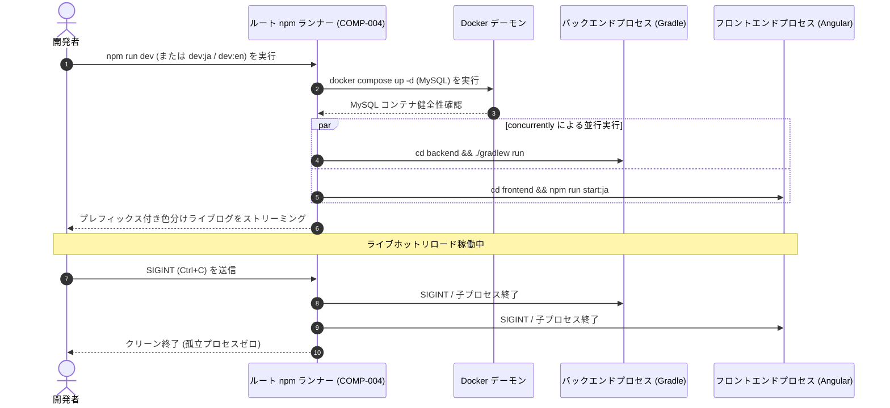

# アーキテクチャおよびコンポーネント設計書: CI およびリポジトリ自動化（CI & Repository Automation）

## 1. コンポーネント境界とスコープ概要（Component Boundaries & Scope Overview）

### 1.1 アーキテクチャおよびコンポーネントマップ
CI およびリポジトリ自動化機能は、継続的インテグレーション、依存関係の健全性自動管理、セマンティックリリースのライフサイクル、ローカル開発の一括起動、およびリポジトリドキュメントの整合性を統括する 5 つの主要な運用・インフラコンポーネントを導入します。

### 1.2 コンポーネント一覧（Component Inventory）
| コンポーネント ID | コンポーネント / ファイル境界 | スコープ / 境界 | 関連要件 |
| :--- | :--- | :--- | :--- |
| **COMP-001** | `.github/workflows/ci.yml` | GitHub Actions CI ワークフロー | `REQ-001`, `REQ-002`, `REQ-003` |
| **COMP-002** | `.github/dependabot.yml` | Dependabot 自動化マニフェスト | `REQ-004` |
| **COMP-003** | `.github/workflows/release-please.yml`, `.github/release-please-config.json`, `.release-please-manifest.json` | セマンティックリリースエンジン | `REQ-005`, `REQ-006` |
| **COMP-004** | `package.json`（リポジトリルート） | ローカル開発オーケストレーター | `REQ-007`, `REQ-008`, `REQ-009` |
| **COMP-005** | `README.md`, `README.ja.md`, `LICENSE`, `AGENTS.md` | リポジトリドキュメントおよびバッジ | `REQ-010`, `REQ-011` |

---

## 2. 相互作用モデリング（Interaction Modeling）

### 2.1 継続的インテグレーションワークフローパイプライン

### 2.2 ローカル一括開発ライフサイクル

---

## 3. データモデルとスキーマ制約（Data Models & Schema Constraints）

### 3.1 `CIWorkflowModel` (`.github/workflows/ci.yml`)
- **形式**: GitHub Actions ワークフロー YAML スキーマ

| フィールド名 | 型 | 必須 / 任意 | 制約 | 説明 |
| :--- | :--- | :--- | :--- | :--- |
| `name` | `string` | 必須 | 値: `"CI"` | ワークフロー表示名 |
| `on` | `object` | 必須 | `push` および `pull_request` を定義 | トリガー定義 |
| `on.push.branches` | `array<string>` | 必須 | `minItems: 1, non-nullable, 省略不可; 完全一致要素: ["main"]` | 監視対象プッシュブランチ |
| `on.pull_request.branches` | `array<string>` | 必須 | `minItems: 1, non-nullable, 省略不可; 完全一致要素: ["main"]` | 監視対象 PR ターゲットブランチ |
| `concurrency` | `object` | 必須 | ワークフローおよび ref/PR によるグループ化, `cancel-in-progress: true` | 重複実行の自動キャンセル |
| `jobs` | `object` | 必須 | キー: `backend`, `frontend`, `e2e` | 個別パイプライン実行ジョブ |
| `jobs.backend.runs-on` | `string` | 必須 | `"ubuntu-latest"` | バックエンド実行環境 |
| `jobs.frontend.runs-on` | `string` | 必須 | `"ubuntu-latest"` | フロントエンド実行環境 |
| `jobs.e2e.runs-on` | `string` | 必須 | `"ubuntu-latest"` | E2E 実行環境 |
| `jobs.e2e.needs` | `array<string>` | 必須 | `minItems: 2, maxItems: 2, non-nullable; 完全一致要素: ["backend", "frontend"]` | 先行ジョブ依存関係 |

### 3.2 `DependabotConfigModel` (`.github/dependabot.yml`)
- **形式**: Dependabot 設定 v2 スキーマ

| フィールド名 | 型 | 必須 / 任意 | 制約 | 説明 |
| :--- | :--- | :--- | :--- | :--- |
| `version` | `integer` | 必須 | 値: `2` | Dependabot スキーマバージョン |
| `updates` | `array<object>` | 必須 | `minItems: 4, maxItems: 4, non-nullable (正確に4つの構成エコシステム; 省略または空配列不可)` | 監視対象パッケージエコシステム |
| `updates[].package-ecosystem` | `string` (enum) | 必須 | `enum: ["gradle", "npm", "github-actions", "docker"]` | 対象パッケージマネージャー |
| `updates[].directory` | `string` | 必須 | `pattern: "^/.*"` | リポジトリ内パス |
| `updates[].schedule.interval` | `string` (enum) | 必須 | `enum: ["weekly"]` | チェック間隔 |
| `updates[].schedule.day` | `string` (enum) | 必須 | `enum: ["monday"]` | 実行曜日 |

### 3.3 Release Please モデルおよびスキーマ制約

#### 3.3.1 `ReleasePleaseWorkflowSchema` (`.github/workflows/release-please.yml`)
- **形式**: GitHub Actions ワークフロースキーマ

| フィールド名 | 型 | 必須 / 任意 | 制約 | 説明 |
| :--- | :--- | :--- | :--- | :--- |
| `name` | `string` | 必須 | `const: "release-please"` | ワークフロー識別子 |
| `on.push.branches` | `array<string>` | 必須 | `minItems: 1, non-nullable; 完全一致要素: ["main"]` | 監視対象トリガーブランチ |
| `permissions.contents` | `string` | 必須 | `const: "write"` | タグ作成およびリリースアセット公開に必要な権限 |
| `permissions.pull-requests` | `string` | 必須 | `const: "write"` | リリース PR 管理に必要な権限 |
| `jobs.release-please.runs-on` | `string` | 必須 | `const: "ubuntu-latest"` | ランナー環境 |
| `jobs.release-please.steps[].uses` | `string` | 必須 | `const: "googleapis/release-please-action@v4"` | Google release-please アクション参照 |

#### 3.3.2 `ReleasePleaseConfigSchema` (`.github/release-please-config.json`)
- **形式**: Release Please 設定 JSON スキーマ

| フィールド名 | 型 | 必須 / 任意 | 制約 | 説明 |
| :--- | :--- | :--- | :--- | :--- |
| `release-type` | `string` | 必須 | `const: "simple"` | 汎用セマンティックバージョニングエンジン |
| `packages` | `object` | 必須 | ルートパッケージキー `"."` を含む | 管理対象パッケージマッピング |

#### 3.3.3 `ReleasePleaseManifestSchema` (`.release-please-manifest.json`)
- **形式**: Release Please マニフェスト JSON スキーマ

| フィールド名 | 型 | 必須 / 任意 | 制約 | 説明 |
| :--- | :--- | :--- | :--- | :--- |
| `.` | `string` | 必須 | SemVer パターン `^[0-9]+\.[0-9]+\.[0-9]+$` | 現在のリポジトリバージョンマイルストーン |

### 3.4 `RootDevPackageModel` (`package.json`)
- **形式**: 標準 npm `package.json` スキーマ

| フィールド名 | 型 | 必須 / 任意 | 制約 | 説明 |
| :--- | :--- | :--- | :--- | :--- |
| `name` | `string` | 必須 | 値: `"swe-workflow-playground"` | ルートパッケージ識別子 |
| `private` | `boolean` | 必須 | 値: `true` | 誤った npm レジストリ公開を防止 |
| `scripts` | `object` | 必須 | 開発およびテストのタスクコマンドを含む | タスク実行スクリプト |
| `scripts.dev` | `string` | 必須 | MySQL、バックエンド、およびフロントエンド（`ja` デフォルト）を起動 | 主要開発者起動コマンド |
| `scripts.dev:ja` | `string` | 必須 | 明示的な日本語開発環境起動 | 日本語 dev サーバーターゲット |
| `scripts.dev:en` | `string` | 必須 | 明示的な英語開発環境起動 | 英語 dev サーバーターゲット |
| `scripts.db:up` | `string` | 必須 | 値: `"docker compose up -d"` | データベースコンテナ起動 |
| `scripts.db:down` | `string` | 必須 | 値: `"docker compose down"` | データベースコンテナ破棄 |
| `devDependencies` | `object` | 必須 | `concurrently` および `wait-on` を含む | ツール依存関係 |

### 3.5 バッジ表示モデル（`README.md` & `README.ja.md`）

#### 3.5.1 `BadgesBlockModel`
- **形式**: Markdown ヘッダーバッジグループ

| フィールド名 | 型 | 必須 / 任意 | 制約 | 説明 |
| :--- | :--- | :--- | :--- | :--- |
| `badges` | `array<BadgeItemModel>` | 必須 | `minItems: 5, maxItems: 5, non-nullable (厳格な順序1から5)` | リポジトリ提示バッジの整列リスト |

#### 3.5.2 `BadgeItemModel`（サブモデル）
- **形式**: Markdown バッジ要素

| フィールド名 | 型 | 必須 / 任意 | 制約 | 説明 |
| :--- | :--- | :--- | :--- | :--- |
| `position` | `integer` | 必須 | `minimum: 1`, `maximum: 5`, 一意 | 表示順序インデックス |
| `badge_type` | `string` (enum) | 必須 | `enum: ["release", "ci", "release-please", "dependabot", "license"]` | バッジ種別の識別子 |
| `badge_url` | `string` | 必須 | `format: "uri"` | 画像レンダリング元 URL |
| `target_url` | `string` | 必須 | `format: "uri"` または相対ファイルパス | クリック先 URL または相対リンク |

---

## 4. 入出力プロトコルおよび実行契約（Protocols & Execution Contracts）

### 4.1 CLI プロトコル（ローカル開発オーケストレーション - COMP-004）
- **標準ストリーム**:
  - `stdout`: `concurrently` によってインターリーブされた色分けプレフィックス付きストリーム（例: 青色の `[backend]`、緑色の `[frontend]`）。
  - `stderr`: バッファリング抑制のない子プロセスからのエラー出力。
- **終了コード**:
  - `0`: 終了シグナル（`SIGINT`）の受信または正常終了。
  - `1`: 子プロセス実行の失敗（Docker 起動失敗やコンパイル失敗など）。
- **シグナルハンドリング**:
  - `SIGINT`（Ctrl+C）受信時、`concurrently` は `backend` および `frontend` の両方の子プロセスに `SIGINT` を**発行しなければならず（MUST）**、5 秒以内に終了しない場合は `SIGKILL` に昇格させなければならない。

### 4.2 GitHub Actions 実行プロトコル（COMP-001 & COMP-003）
- **環境とキャッシュ**:
  - バックエンドランナーは `actions/setup-java@v4`（`distribution: 'corretto'`, `java-version: '25'`）を使用し、Gradle ビルドキャッシュを活用しなければならない（MUST）。
  - フロントエンドランナーは `actions/setup-node@v4`（`node-version: 22`）を使用し、`frontend/` をルートとする npm キャッシュを活用しなければならない（MUST）。
  - E2E ランナーは `docker compose up -d` で MySQL を起動し、バックグラウンドでバックエンドとフロントエンドを起動し、`curl` リトライループで健全性を確認し、`npx playwright install --with-deps chromium` でブラウザを導入した上で `npx playwright test` を**実行しなければならない（MUST）**。
- **成果物の保持**:
  - E2E テスト失敗時、ワークフローは Playwright トレースおよび失敗スクリーンショットを 14 日間の保持制限付きで GitHub Actions 成果物として**アップロードしなければならない（MUST）**。

---

## 5. コンポーネント契約（Design by Contract - RFC 2119 / RFC 8174）

### 5.1 COMP-001: CI ワークフローエンジン (`.github/workflows/ci.yml`)
- **役割**: 自動化されたプルリクエストおよび main ブランチ品質検証ゲート。
- **公開シグネチャ**: GitHub Actions ワークフローイベントハンドラー（`push`, `pull_request`）。
- **事前条件（呼出側の責務）**:
  - 呼出側は、`main` を対象とする有効な Git 参照またはプルリクエストでワークフローを**起動しなければならない（MUST）**。
  - リポジトリランナーは Docker 仮想化が有効化されていなければならない（`ubuntu-latest` ではデフォルト有効）。
- **事後条件（被呼出側の保証）**:
  - ワークフローは、`backend` および `frontend` ジョブを**並行して実行しなければならない（MUST）**。
  - `backend` と `frontend` の両ジョブが成功した場合、ワークフローは `e2e` ジョブを**実行しなければならない（MUST）**。
  - いずれかのジョブが失敗した場合、ワークフローは `e2e` ジョブを**実行してはならず（MUST NOT）**、ワークフロー実行を**失敗させなければならない（MUST）**。
  - いずれかのジョブが失敗した場合、ワークフローは非ゼロの終了ステータスを返し、GitHub に失敗ステータスチェックを**報告しなければならない（MUST）**。
- **不変条件（状態整合性）**:
  - 同一ブランチまたは PR に対する重複した実行中ワークフローは、concurrency グループによって**キャンセルされなければならない（MUST）**。

### 5.2 COMP-002: Dependabot 設定 (`.github/dependabot.yml`)
- **役割**: 自動化されたマルチエコシステムの依存関係監視およびアップグレード PR 提出。
- **公開シグネチャ**: Dependabot v2 設定パーサー。
- **事前条件（呼出側の責務）**:
  - マニフェストディレクトリ（`/backend`, `/frontend`, `/`）は、有効なビルド/ロックファイル（`build.gradle.kts`, `package.json`, ワークフロー YAML, `docker-compose.yml`）を**含んでいなければならない（MUST）**。
- **事後条件（被呼出側の保証）**:
  - エンジンは、毎週月曜日に依存関係の状態を**評価しなければならない（MUST）**。
  - 検出された古いまたは安全でないパッケージに対して、エンジンは標準の Conventional Commits プレフィックスを付与した個別のプルリクエストを**作成しなければならない（MUST）**。
  - 古いパッケージまたは脆弱なパッケージが 0 件検出された場合、エンジンはプルリクエストを**開いてはならず（MUST NOT）**、定期評価をクリーンな状態で**完了しなければならない（SHALL）**。
- **不変条件（状態整合性）**:
  - Dependabot は、設定されたディレクトリ外のパッケージを**更新してはならない（MUST NOT）**。

### 5.3 COMP-003: Release Please 自動化 (`.github/workflows/release-please.yml`)
- **役割**: 変更履歴の自動集約、セマンティックバージョニング、および GitHub リリース公開。
- **公開シグネチャ**: GitHub Actions ワークフローイベントハンドラー（`main` への `push`）。
- **事前条件（呼出側の責務）**:
  - ターゲットブランチは `main` で**なければならない（MUST）**。
  - マージされたコミットは、Conventional Commits 1.0.0 形式（`feat`, `fix` 等）に**準拠していなければならない（MUST）**。
- **事後条件（被呼出側の保証）**:
  - `main` へのプッシュ時、ワークフローは `.release-please-manifest.json` に対してコミット履歴を**評価しなければならない（MUST）**。
  - バージョン変更を伴うコミットが存在する場合、ワークフローはバージョン更新と変更履歴エントリを含む未処理のリリースプルリクエストを**維持しなければならない（MUST）**。
  - リリースプルリクエストがマージされた時、ワークフローはコミットに新しい SemVer タグを付与し、GitHub Release アセットを**公開しなければならない（MUST）**。
  - `main` 上でバージョン更新をトリガーする Conventional Commits が 0 件検出された場合、ワークフローはリリースプルリクエストを作成または変更**してはならず（MUST NOT）**、エラーなしでクリーンに**終了しなければならない（SHALL）**。
- **不変条件（状態整合性）**:
  - `.release-please-manifest.json` 内のバージョン番号は単調増加し、厳格に SemVer に**従わなければならない（MUST）**。

### 5.4 COMP-004: ルート開発オーケストレーター (`package.json`)
- **役割**: ローカルフルスタック実行およびライフサイクル管理のための統合開発者 CLI。
- **公開シグネチャ**: `npm run dev` / `npm run dev:ja` / `npm run dev:en`。
- **事前条件（呼出側の責務）**:
  - 開発者ホストは、Docker Engine が稼働し、Java 25 および Node.js 22 がインストールされて**いなければならない（MUST）**。
- **事後条件（被呼出側の保証）**:
  - 実行は、`docker compose up -d` を介して MySQL コンテナが起動されていることを**保証しなければならない（MUST）**。
  - 実行は、ポート `8080` でバックエンド、ポート `4200` でフロントエンドを並行して**起動しなければならない（MUST）**。
  - 実行は、識別可能なプレフィックスを付与して両プロセスの stdout/stderr をターミナルに**転送しなければならない（MUST）**。
  - `SIGINT` 受信時、実行は孤立した Java または Node プロセスを残すことなく、5 秒以内にすべての子プロセスを**終了しなければならない（MUST）**。
- **不変条件（状態整合性）**:
  - ホストのポートバインディング（`3306`, `8080`, `4200`）は、同一ホスト上のスクリプト呼出間で競合してはならない。

### 5.5 COMP-005: ドキュメントおよびバッジ表示 (`README.md`, `README.ja.md`, `LICENSE`, `AGENTS.md`)
- **役割**: 公開プロジェクトガバナンス、ビルド健全性の可視化、ライセンス明示、および統一開発者ガイドの維持。
- **公開シグネチャ**: Markdown ドキュメントプレゼンテーション。
- **事前条件（呼出側の責務）**:
  - アップストリームリポジトリおよびワークフローは、パブリックであるか、アクセス可能なステータスバッジを備えて**いなければならない（MUST）**。
- **事後条件（被呼出側の保証）**:
  - `README.md` および `README.ja.md` は、指定された正確な順序でバッジを**表示しなければならない（MUST）**:
    1. 最新リリース: ``
    2. CI ステータス: ``
    3. release-please ステータス: ``
    4. Dependabot ステータス: ``
    5. ライセンスバッジ: ``
  - `LICENSE` ファイルは、2026年付の標準 MIT ライセンス本文を**含まなければならない（MUST）**。
  - `AGENTS.md` の Quick Start セクションは、既存のすべての技術ガイドラインおよび単方向参照整合性を厳密に保持しながら、主要なローカル起動メカニズムとして `npm run dev` ワークフローを文書化するよう**更新されなければならない（MUST）**。
- **不変条件（状態整合性）**:
  - 英語版と日本語版の README ドキュメントは、同一のバッジ構成およびリンク先を**維持しなければならない（MUST）**。

---

## 6. エラーおよび例外処理（Error & Exception Handling）

### 6.1 CI ワークフロー障害モード（COMP-001）
- **コンパイルまたは単体テストの失敗**:
  - 影響を受けたジョブ（`backend` または `frontend`）は、即座に非ゼロ終了コードで停止する。
  - 後続の `e2e` ジョブは、依存条件（`needs: [backend, frontend]`）が満たされないため `skipped`（スキップ）とマークされる。
  - プルリクエストに対する GitHub ステータスチェックは `failure` と報告される。
- **E2E レディネスタイムアウト**:
  - `e2e` ジョブにおいて、バックエンド準備完了チェック（`curl --fail --retry 30 --retry-delay 2 http://localhost:8080/api/posts`）およびフロントエンド準備完了チェック（`curl --fail --retry 30 --retry-delay 2 http://localhost:4200/`）は、60 秒間の無応答後にフェイルクローズとなる。
  - ワークフローはバックエンドの stdout/stderr ログをランナーコンソールに出力し、サービスを終了してコード `1` で終了する。
- **Playwright テストアサーション失敗**:
  - Playwright は、失敗スクリーンショットおよび実行トレース（`trace: 'on-first-retry'`）を自動的に取得する。
  - GitHub Actions ステップは、`actions/upload-artifact@v4` を介して `./frontend/test-results` および `./frontend/playwright-report` をアップロードする。

### 6.2 ローカル開発オーケストレーター障害モード（COMP-004）
- **Docker デーモン停止**:
  - `npm run db:up` は終了コード `1` で失敗し、明確な診断メッセージ（`Cannot connect to the Docker daemon`）を出力する。
  - ルートコマンドは、バックエンドまたはフロントエンドのプロセスを起動する前に即座に停止する。
- **ポート競合（3306, 8080, または 4200 が使用中）**:
  - Micronaut バックエンドまたは Angular 開発サーバーが `EADDRINUSE` / `BindException` を出力する。
  - `concurrently --kill-others` が子プロセスの終了コード `1` を検知し、残りの子プロセスを即座に終了する。

### 6.3 Dependabot 障害モード（COMP-002）
- **エコシステムマニフェスト構文またはロックファイルのパースエラー**:
  - パッケージエコシステムマニフェストまたはロックファイルに不正な構文が含まれている場合、Dependabot はリポジトリの GitHub Security / Dependabot updates タブにパースエラーを記録する。
  - Dependabot は、影響を受けるエコシステムの評価のみを停止し、残りのエコシステムの評価をクラッシュさせたり妨げたりしない。
- **アップストリームレジストリのレート制限またはネットワーク切断**:
  - ネットワークタイムアウトまたはパッケージレジストリの 429/503 応答が発生した場合、Dependabot は安全に終了し、次回のスケジュール実行時に再試行する。
  - 中途半端または破損したプルリクエストは一切作成されない。

### 6.4 Release Please 自動化障害モード（COMP-003）
- **GITHUB_TOKEN 権限不足**:
  - ワークフロー実行に `contents: write` または `pull-requests: write` が不足している場合、release-please は終了コード `1` で失敗し、`Resource not accessible by integration` を出力する。
  - ワークフローは安全に停止し、GitHub Actions の失敗通知によってメンテナーに警告する。
- **SemVer タグ競合**:
  - 計算された次のセマンティックバージョンに一致する Git タグがリモートに既に存在する場合、release-please は既存タグを上書きすることなく停止し、衝突警告を出力する。
- **非標準または不正形式のコミットメッセージ**:
  - Conventional Commits 形式（`feat:`, `fix:` 等）に一致しないコミットは、バージョンパーサーによって無視され、ワークフローのクラッシュを引き起こさない。

### 6.5 ドキュメントおよびバッジ表示障害モード（COMP-005）
- **外部バッジサービス停止**:
  - Shields.io または GitHub Actions バッジエンドポイントでアップストリームネットワーク障害が発生した場合、Markdown レンダラーはドキュメントレイアウトを崩すことなくバッジの代替テキスト（alt-text）の表示にフォールバックする。
- **ドキュメントの記述乖離または破損したアンカー参照**:
  - `README.md` および `README.ja.md` 内のリンクを更新せずに `AGENTS.md` のセクションアンカーが変更された場合、CI のリンクチェッカー監査が非ゼロ終了コードで失敗し、マージ前に貢献者に警告する。

---

## 7. 主要な設計決定とアーキテクチャ上のトレードオフ（Key Design Decisions & Architectural Trade-offs）

- **CI パイプライン実行トポロジーと後続ゲート制御**:
  - **採用アプローチ**: バックエンド検証（Java 25 LTS、Gradle コンパイル、単体テスト、Testcontainers MySQL 結合テスト）とフロントエンド検証（Node.js 22 LTS、Vitest 単体テスト、本番 AOT ビルド）を 2 つの並行ジョブにフォークし、後続のブラウザ E2E テストを `needs: [backend, frontend]` によりゲート制御して、両方の先行検証がクリーンに成功した場合にのみ E2E を実行する設計（`COMP-001`, `REQ-001`, `REQ-002`, `REQ-003`）。
  - **検討した代替案**: 1 台のランナー上でバックエンド、フロントエンド、E2E を逐次実行する単一パイプライン、または 3 つのジョブすべてを依存関係なしに並列実行する非制御マトリックス。
  - **選定理由とトレードオフ**: ランナーの並列性を最大化して開発者へのフィードバック時間を短縮し（`NFR-PERF-001`）、フェイルクローズドな品質ゲート（`NFR-REL-001`）を担保する。先行の単体テストやコンパイルが失敗した際に、重い MySQL コンテナや Playwright ブラウザの起動をスキップして CI リソースの無駄を防止する。受け入れたトレードオフは、GitHub Actions のワークフロー定義の複雑化と、複数ランナー起動による初期プロビジョニングオーバーヘッドの発生である。

- **ローカル開発オーケストレーションとプロセスライフサイクル**:
  - **採用アプローチ**: ルートの `package.json` で `concurrently` および `wait-on` を利用し、永続化レイヤー（MySQL 8.4）は Docker コンテナ（`docker compose up -d`）、バックエンド（`./gradlew run`）とフロントエンド（`npm run start:ja` / `start:en`）はホスト上で直接起動してホットリロード（HMR / 継続的コンパイル）を有効化し、`SIGINT` トラップによるクリーンな一括終了を実現するハイブリッド構成（`COMP-004`, `REQ-007`, `REQ-008`, `REQ-009`）。
  - **検討した代替案**: MySQL、Micronaut バックエンド、Angular フロントエンドの全サービスをコンテナ内で起動する完全 Docker Compose スタック。
  - **選定理由とトレードオフ**: ホスト実行により、Angular の高速な HMR、Micronaut の即時再コンパイル、macOS 環境等でのバインドマウント I/O 遅延の完全回避、IDE デバッガやプロファイラの即時アタッチを実現する。受け入れたトレードオフは、コンテナランタイムだけでなく、開発者のホスト環境に Java 25 LTS および Node.js 22 LTS の事前インストールが必要となる点である。

- **モノレポセマンティックリリースおよびバージョニング戦略**:
  - **採用アプローチ**: Google `release-please-action` をルートディレクトリ `.` で `release-type: simple` として構成し、`main` ブランチへの Conventional Commits に基づいてリポジトリ全体で単一のセマンティックバージョンと集約された `CHANGELOG.md` を自動管理する方針（`COMP-003`, `REQ-005`, `REQ-006`）。
  - **検討した代替案**: バックエンドとフロントエンドを個別に追跡し、個別のバージョン番号、Git タグ（`backend-v1.0.0` 等）、分割 Changelog を維持するマルチパッケージ設定。
  - **選定理由とトレードオフ**: 本リポジトリは REST API 契約（RFC 9457）と SPA クライアントが緊密に連携する統合型フルスタックアプリケーションであり、全体で一貫した SemVer マイルストーンを付与することで、利用者や評価者に対するバージョン整合性とガバナンスの透明性を最大化する。受け入れたトレードオフは、片方のサブシステムのみの修正であってもリポジトリ全体のバージョン番号が繰り上がる点である。

- **マルチエコシステム依存関係自動更新の協調管理**:
  - **採用アプローチ**: `.github/dependabot.yml` において、4 つのパッケージエコシステム（バックエンドの `gradle`、フロントエンドの `npm`、CI 自動化の `github-actions`、コンテナの `docker`）のチェック間隔をすべて「毎週月曜日」（`schedule: interval: weekly, day: monday`）に集約・同期化（`COMP-002`, `REQ-004`）。
  - **検討した代替案**: 日次チェックの採用や、エコシステムごとにバラバラな頻度・曜日で実行する設定。
  - **選定理由とトレードオフ**: 依存関係更新 PR を週初めの単一ウィンドウに集約することで、平日開発中の PR 過多によるレビュー疲労を大幅に低減し、CI ランナーの無駄な消費を抑制する。受け入れたトレードオフは、週半ばにリリースされた非緊急のマイナー/パッチ更新の検知が翌週月曜日まで遅延する点である（※緊急の脆弱性は GitHub セキュリティアラートで即時対応）。

- **ドキュメントアーキテクチャとバッジ表示階層**:
  - **採用アプローチ**: `README.md` および `README.ja.md` において、運用上の重要度順に整列した厳格な 5 バッジ階層（1: 最新リリース、2: CI ステータス、3: release-please、4: Dependabot、5: MIT ライセンス）を規定し、全実行コマンドの Single Source of Truth（SSOT）を `AGENTS.md` に集約した上で、人間向けエントリポイントから `AGENTS.md` への単方向参照原則（Unidirectional Reference Rule）を厳格に順守する設計（`COMP-005`, `REQ-010`, `REQ-011`, `NFR-MAINT-001`）。
  - **検討した代替案**: バッジ配置を任意・アルファベット順とし、コマンド手順を `README.md`、`README.ja.md`、`AGENTS.md` に重複記述して双方向リンクを許容する構成。
  - **選定理由とトレードオフ**: 技術コマンドの一元管理によって言語間・ドキュメント間の記述乖離（ドリフト）を根絶し、訪問者や評価者に対してリポジトリの健全性・セキュリティ・ライセンス状態を直感的かつ一貫して提示できる。受け入れたトレードオフは、人間向け README にコマンドを直接記述せず `AGENTS.md` へのアンカーリンクを維持・検証するという運用の徹底が求められる点である。
