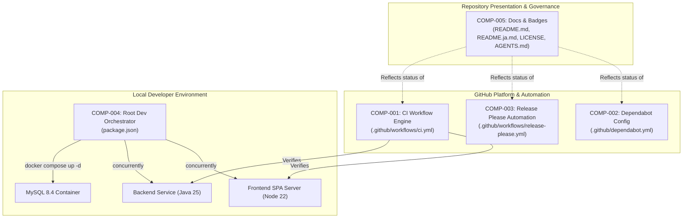
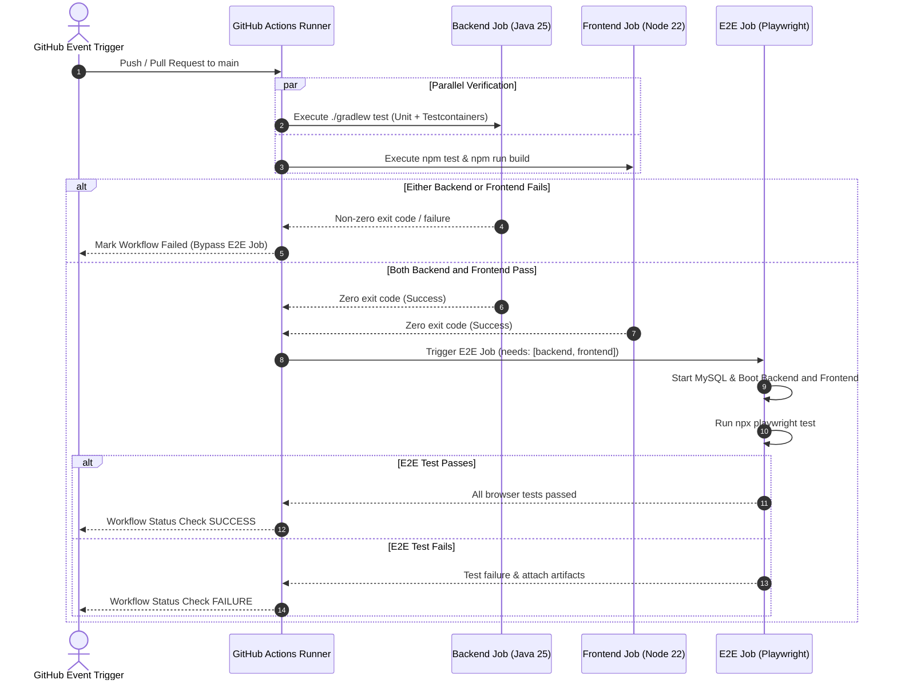
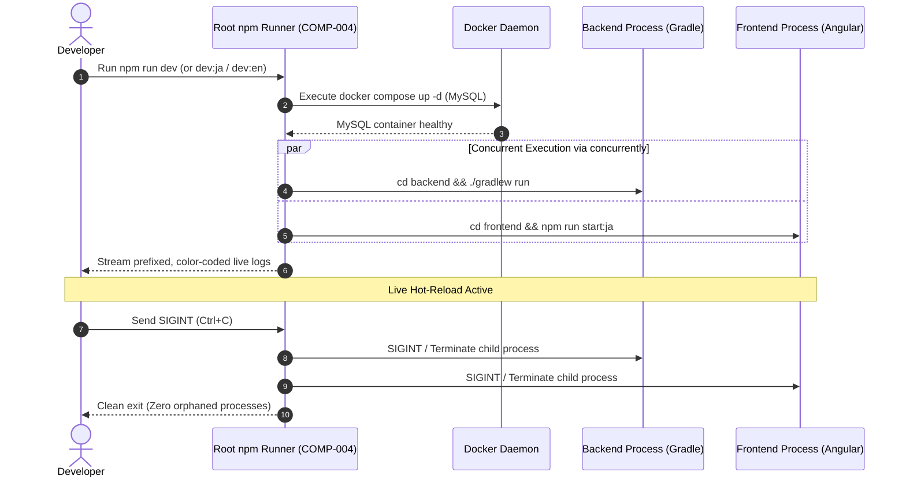

# Architecture & Component Design: CI & Repository Automation

## 1. Component Boundaries & Scope Overview

### 1.1 Architecture & Component Map
The CI & Repository Automation feature introduces five major operational and infrastructure components that govern continuous integration, automated dependency hygiene, semantic release lifecycle, consolidated local development, and repository documentation integrity.

### 1.2 Component Inventory
| Component ID | Component / File Boundary | Scope / Boundary | Linked Requirements |
| :--- | :--- | :--- | :--- |
| **COMP-001** | `.github/workflows/ci.yml` | GitHub Actions CI Workflow | `REQ-001`, `REQ-002`, `REQ-003` |
| **COMP-002** | `.github/dependabot.yml` | Dependabot Automation Manifest | `REQ-004` |
| **COMP-003** | `.github/workflows/release-please.yml`, `.github/release-please-config.json`, `.release-please-manifest.json` | Semantic Release Engine | `REQ-005`, `REQ-006` |
| **COMP-004** | `package.json` (Repository Root) | Local Development Orchestrator | `REQ-007`, `REQ-008`, `REQ-009` |
| **COMP-005** | `README.md`, `README.ja.md`, `LICENSE`, `AGENTS.md` | Repository Documentation & Badges | `REQ-010`, `REQ-011` |

---

## 2. Interaction Modeling

### 2.1 Continuous Integration Workflow Pipeline

### 2.2 Consolidated Local Development Lifecycle

---

## 3. Data Models & Schema Constraints

### 3.1 `CIWorkflowModel` (`.github/workflows/ci.yml`)
- **Format**: GitHub Actions Workflow YAML Schema

| Field Name | Type | Required / Optional | Constraints | Description |
| :--- | :--- | :--- | :--- | :--- |
| `name` | `string` | Required | Value: `"CI"` | Workflow display name |
| `on` | `object` | Required | Defines `push` and `pull_request` | Trigger specifications |
| `on.push.branches` | `array<string>` | Required | `minItems: 1, non-nullable, cannot be omitted; exact elements: ["main"]` | Monitored push branches |
| `on.pull_request.branches` | `array<string>` | Required | `minItems: 1, non-nullable, cannot be omitted; exact elements: ["main"]` | Monitored PR target branches |
| `concurrency` | `object` | Required | Group by workflow and ref/PR, `cancel-in-progress: true` | Redundant run cancellation |
| `jobs` | `object` | Required | Keys: `backend`, `frontend`, `e2e` | Distinct pipeline execution jobs |
| `jobs.backend.runs-on` | `string` | Required | `"ubuntu-latest"` | Backend execution environment |
| `jobs.frontend.runs-on` | `string` | Required | `"ubuntu-latest"` | Frontend execution environment |
| `jobs.e2e.runs-on` | `string` | Required | `"ubuntu-latest"` | E2E execution environment |
| `jobs.e2e.needs` | `array<string>` | Required | `minItems: 2, maxItems: 2, non-nullable; exact elements: ["backend", "frontend"]` | Strict upstream job dependencies |

### 3.2 `DependabotConfigModel` (`.github/dependabot.yml`)
- **Format**: Dependabot Configuration v2 Schema

| Field Name | Type | Required / Optional | Constraints | Description |
| :--- | :--- | :--- | :--- | :--- |
| `version` | `integer` | Required | Value: `2` | Dependabot schema version |
| `updates` | `array<object>` | Required | `minItems: 4, maxItems: 4, non-nullable (exactly 4 configured ecosystems; cannot be omitted or empty)` | Monitored package ecosystems |
| `updates[].package-ecosystem` | `string` (enum) | Required | `enum: ["gradle", "npm", "github-actions", "docker"]` | Target package manager |
| `updates[].directory` | `string` | Required | `pattern: "^/.*"` | Path within repository |
| `updates[].schedule.interval` | `string` (enum) | Required | `enum: ["weekly"]` | Checking cadence |
| `updates[].schedule.day` | `string` (enum) | Required | `enum: ["monday"]` | Execution weekday |

### 3.3 Release Please Models & Schema Constraints

#### 3.3.1 `ReleasePleaseWorkflowSchema` (`.github/workflows/release-please.yml`)
- **Format**: GitHub Actions Workflow Schema

| Field Name | Type | Required / Optional | Constraints | Description |
| :--- | :--- | :--- | :--- | :--- |
| `name` | `string` | Required | `const: "release-please"` | Workflow identifier |
| `on.push.branches` | `array<string>` | Required | `minItems: 1, non-nullable; exact elements: ["main"]` | Monitored trigger branch |
| `permissions.contents` | `string` | Required | `const: "write"` | Scope required for tagging and release assets |
| `permissions.pull-requests` | `string` | Required | `const: "write"` | Scope required for release PR management |
| `jobs.release-please.runs-on` | `string` | Required | `const: "ubuntu-latest"` | Runner environment |
| `jobs.release-please.steps[].uses` | `string` | Required | `const: "googleapis/release-please-action@v4"` | Google release-please action reference |

#### 3.3.2 `ReleasePleaseConfigSchema` (`.github/release-please-config.json`)
- **Format**: Release Please Configuration JSON Schema

| Field Name | Type | Required / Optional | Constraints | Description |
| :--- | :--- | :--- | :--- | :--- |
| `release-type` | `string` | Required | `const: "simple"` | Generic semantic versioning engine |
| `packages` | `object` | Required | Contains root package key `"."` | Managed package mapping |

#### 3.3.3 `ReleasePleaseManifestSchema` (`.release-please-manifest.json`)
- **Format**: Release Please Manifest JSON Schema

| Field Name | Type | Required / Optional | Constraints | Description |
| :--- | :--- | :--- | :--- | :--- |
| `.` | `string` | Required | SemVer pattern `^[0-9]+\.[0-9]+\.[0-9]+$` | Current repository version milestone |

### 3.4 `RootDevPackageModel` (`package.json`)
- **Format**: Standard npm `package.json` Schema

| Field Name | Type | Required / Optional | Constraints | Description |
| :--- | :--- | :--- | :--- | :--- |
| `name` | `string` | Required | Value: `"swe-workflow-playground"` | Root package identifier |
| `private` | `boolean` | Required | Value: `true` | Prevents accidental npm registry publication |
| `scripts` | `object` | Required | Contains dev and test task commands | Task execution scripts |
| `scripts.dev` | `string` | Required | Launches MySQL, backend, and frontend (`ja` default) | Primary developer start command |
| `scripts.dev:ja` | `string` | Required | Explicit Japanese development start | Japanese dev server target |
| `scripts.dev:en` | `string` | Required | Explicit English development start | English dev server target |
| `scripts.db:up` | `string` | Required | Value: `"docker compose up -d"` | Database container startup |
| `scripts.db:down` | `string` | Required | Value: `"docker compose down"` | Database container teardown |
| `devDependencies` | `object` | Required | Includes `concurrently` and `wait-on` | Tooling dependencies |

### 3.5 Badges Presentation Models (`README.md` & `README.ja.md`)

#### 3.5.1 `BadgesBlockModel`
- **Format**: Markdown Header Badge Group

| Field Name | Type | Required / Optional | Constraints | Description |
| :--- | :--- | :--- | :--- | :--- |
| `badges` | `array<BadgeItemModel>` | Required | `minItems: 5, maxItems: 5, non-nullable (strict sequential order 1 through 5)` | Ordered list of repository presentation badges |

#### 3.5.2 `BadgeItemModel` (Sub-model)
- **Format**: Markdown Badge Element

| Field Name | Type | Required / Optional | Constraints | Description |
| :--- | :--- | :--- | :--- | :--- |
| `position` | `integer` | Required | `minimum: 1`, `maximum: 5`, unique | Sequential display order index |
| `badge_type` | `string` (enum) | Required | `enum: ["release", "ci", "release-please", "dependabot", "license"]` | Identifier of badge |
| `badge_url` | `string` | Required | `format: "uri"` | Image rendering source URL |
| `target_url` | `string` | Required | `format: "uri"` or relative filepath | Click destination URL or relative link |

---

## 4. Input / Output Protocols & Execution Contracts

### 4.1 CLI Protocol (Local Dev Orchestration - COMP-004)
- **Standard Streams**:
  - `stdout`: Prefixed, color-coded stream interleaved by `concurrently` (e.g. `[backend]` in blue, `[frontend]` in green).
  - `stderr`: Interleaved error output from child processes without buffering suppression.
- **Exit Codes**:
  - `0`: Clean shutdown upon receiving termination signal (`SIGINT`) or user command termination.
  - `1`: Failure in child process execution (e.g. Docker startup failure or compilation failure).
- **Signal Handling**:
  - Upon receiving `SIGINT` (Ctrl+C), `concurrently` MUST issue `SIGINT` to both `backend` and `frontend` child processes and wait for exit within 5 seconds before escalating to `SIGKILL`.

### 4.2 GitHub Actions Execution Protocol (COMP-001 & COMP-003)
- **Environment & Caching**:
  - Backend runner MUST use `actions/setup-java@v4` with `distribution: 'corretto'` and `java-version: '25'`, utilizing Gradle build cache.
  - Frontend runner MUST use `actions/setup-node@v4` with `node-version: 22` and `cache: 'npm'` rooted at `frontend/`.
  - E2E runner MUST launch MySQL via `docker compose up -d`, start backend and frontend distributions in the background, poll readiness endpoints via `curl` retry loops, install Playwright Chromium dependencies via `npx playwright install --with-deps chromium`, and execute `npx playwright test`.
- **Artifact Preservation**:
  - On E2E test failure, the workflow MUST upload Playwright traces and failure screenshots as GitHub Actions workflow artifacts with a 14-day retention limit.

---

## 5. Component Contracts (Design by Contract - RFC 2119 / RFC 8174)

### 5.1 COMP-001: CI Workflow Engine (`.github/workflows/ci.yml`)
- **Role**: Automated pull request and main branch quality verification gate.
- **Public Signature**: GitHub Actions Workflow Event Handler (`push`, `pull_request`).
- **Preconditions (Caller Obligations)**:
  - Caller MUST trigger workflow with valid Git refs targeting `main` or pull requests targeting `main`.
  - Repository runner MUST have Docker virtualization enabled (default in `ubuntu-latest`).
- **Postconditions (Callee Guarantees)**:
  - The workflow MUST execute `backend` and `frontend` jobs concurrently.
  - If both `backend` and `frontend` jobs succeed, the workflow MUST execute the `e2e` job.
  - If either `backend` or `frontend` job fails, the workflow MUST NOT execute the `e2e` job and MUST fail the workflow run.
  - If any job fails, the workflow MUST return a non-zero exit status and report a failure status check to GitHub.
- **Invariants (State Consistency)**:
  - Redundant in-progress workflow runs for the same branch or pull request MUST be cancelled via concurrency groups.

### 5.2 COMP-002: Dependabot Configuration (`.github/dependabot.yml`)
- **Role**: Automated multi-ecosystem dependency monitoring and upgrade submission.
- **Public Signature**: Dependabot v2 Configuration Parser.
- **Preconditions (Caller Obligations)**:
  - Manifest directories (`/backend`, `/frontend`, `/`) MUST contain valid ecosystem lock/build files (`build.gradle.kts`, `package.json`, workflow YAMLs, `docker-compose.yml`).
- **Postconditions (Callee Guarantees)**:
  - The engine MUST evaluate dependency states weekly on Monday.
  - For any detected outdated or insecure package, the engine MUST open an isolated pull request with standard Conventional Commits prefixing.
  - When zero (0) outdated or vulnerable packages are detected, the engine MUST NOT open any pull requests and SHALL complete the scheduled evaluation with a clean status.
- **Invariants (State Consistency)**:
  - Dependabot MUST NOT update packages outside configured directories.

### 5.3 COMP-003: Release Please Automation (`.github/workflows/release-please.yml`)
- **Role**: Automated changelog compilation, semantic versioning, and GitHub release publication.
- **Public Signature**: GitHub Actions Workflow Event Handler (`push` on `main`).
- **Preconditions (Caller Obligations)**:
  - Target branch MUST be `main`.
  - Merged commits MUST adhere to Conventional Commits 1.0.0 format (`feat`, `fix`, etc.).
- **Postconditions (Callee Guarantees)**:
  - On push to `main`, the workflow MUST evaluate commit history against `.release-please-manifest.json`.
  - When version-triggering commits exist, the workflow MUST maintain an open release pull request containing version updates and changelog entries.
  - When the release pull request is merged, the workflow MUST tag the commit with the new SemVer tag and publish a GitHub Release asset.
  - When zero (0) version-triggering Conventional Commits are detected on `main`, the workflow MUST NOT create or modify any release pull request and SHALL exit cleanly without error.
- **Invariants (State Consistency)**:
  - The version number in `.release-please-manifest.json` MUST remain monotonic and strictly follow SemVer.

### 5.4 COMP-004: Root Development Orchestrator (`package.json`)
- **Role**: Consolidated developer CLI for local full-stack execution and lifecycle management.
- **Public Signature**: `npm run dev` / `npm run dev:ja` / `npm run dev:en`.
- **Preconditions (Caller Obligations)**:
  - Developer host MUST have Docker Engine running, Java 25 installed, and Node.js 22 installed.
- **Postconditions (Callee Guarantees)**:
  - Execution MUST ensure MySQL container is started via `docker compose up -d`.
  - Execution MUST concurrently start backend on port `8080` and frontend on port `4200`.
  - Execution MUST forward stdout/stderr from both processes to the terminal with distinguishable prefixes.
  - On `SIGINT`, execution MUST terminate all spawned child processes within 5 seconds without leaving orphaned Java or Node processes.
- **Invariants (State Consistency)**:
  - The host port bindings (`3306`, `8080`, `4200`) MUST not conflict across concurrent script invocations.

### 5.5 COMP-005: Documentation & Badges Presentation (`README.md`, `README.ja.md`, `LICENSE`, `AGENTS.md`)
- **Role**: Public project governance, build health visibility, licensing disclosure, and unified developer guide maintenance.
- **Public Signature**: Markdown Documentation Presentation.
- **Preconditions (Caller Obligations)**:
  - Upstream repositories and workflows MUST be public or have accessible status badges.
- **Postconditions (Callee Guarantees)**:
  - `README.md` and `README.ja.md` MUST display badges in the exact specified order:
    1. Latest Release: ``
    2. CI Status: ``
    3. release-please Status: ``
    4. Dependabot Status: ``
    5. License Badge: ``
  - `LICENSE` file MUST contain standard MIT License text dated 2026.
  - `AGENTS.md` Quick Start section MUST be updated to document the consolidated `npm run dev` workflow as the primary local launch mechanism while preserving all existing technical guidelines and unidirectional references.
- **Invariants (State Consistency)**:
  - Both English and Japanese README documents MUST maintain identical badge configurations and link destinations.

---

## 6. Error & Exception Handling

### 6.1 CI Workflow Failure Modes (COMP-001)
- **Compilation or Unit Test Failure**:
  - The affected job (`backend` or `frontend`) immediately halts with non-zero exit code.
  - Downstream `e2e` job status is marked as `skipped` (due to unmet `needs: [backend, frontend]` condition).
  - GitHub status check for pull request is reported as `failure`.
- **E2E Readiness Timeout**:
  - In `e2e` job, backend readiness check (`curl --fail --retry 30 --retry-delay 2 http://localhost:8080/api/posts`) and frontend readiness check (`curl --fail --retry 30 --retry-delay 2 http://localhost:4200/`) fail-closed after 60 seconds of unresponsiveness.
  - Workflow dumps backend stdout/stderr logs to runner console, terminates services, and exits with code `1`.
- **Playwright Test Assertion Failure**:
  - Playwright automatically captures failure screenshots and execution trace (`trace: 'on-first-retry'`).
  - GitHub Actions step uploads `./frontend/test-results` and `./frontend/playwright-report` via `actions/upload-artifact@v4`.

### 6.2 Local Dev Orchestrator Error Modes (COMP-004)
- **Docker Daemon Inactive**:
  - `npm run db:up` fails with exit code `1` and emits explicit diagnostic: `Cannot connect to the Docker daemon`.
  - Root command halts immediately before launching backend or frontend processes.
- **Port Conflict (3306, 8080, or 4200 already in use)**:
  - Micronaut backend or Angular dev-server emits `EADDRINUSE` / `BindException`.
  - `concurrently --kill-others` detects child process exit with code `1` and immediately terminates the remaining child process.

### 6.3 Dependabot Failure Modes (COMP-002)
- **Ecosystem Manifest Syntax or Lockfile Parse Error**:
  - If a package ecosystem manifest or lockfile contains invalid syntax, Dependabot logs the parsing error in the repository's GitHub Security / Dependabot updates tab.
  - Dependabot halts evaluation solely for the affected ecosystem without crashing or preventing evaluation of remaining ecosystems.
- **Upstream Registry Rate Limiting or Network Interruption**:
  - In the event of network timeouts or package registry 429/503 responses, Dependabot fails-closed and retries on the next scheduled interval.
  - Zero partial or corrupt pull requests are created.

### 6.4 Release Please Automation Failure Modes (COMP-003)
- **Insufficient GITHUB_TOKEN Permissions**:
  - If the workflow execution lacks `contents: write` or `pull-requests: write`, release-please fails with exit code `1` and emits `Resource not accessible by integration`.
  - The workflow fails-closed and alerts maintainers via GitHub Actions failure notification.
- **SemVer Tag Collision**:
  - If a Git tag matching the calculated next semantic version already exists on remote, release-please halts without overwriting the existing tag and emits a collision warning.
- **Non-Standard or Malformed Commit Messages**:
  - Commits that fail to match Conventional Commits format (`feat:`, `fix:`, etc.) are ignored by the version parser without causing workflow crashes, ensuring normal non-release commits do not break automation.

### 6.5 Documentation & Badges Presentation Failure Modes (COMP-005)
- **External Badge Service Outage**:
  - In the event of upstream network disruption with Shields.io or GitHub Actions badge endpoints, Markdown renderers fall back to displaying the badge alt-text without altering document layout or breaking links.
- **Documentation Drift or Broken Anchor References**:
  - If `AGENTS.md` section anchors are renamed without updating human entry point links in `README.md` and `README.ja.md`, link checker audits fail-closed in automated checks, alerting contributors before merge.

---

## 7. Key Design Decisions & Architectural Trade-offs

- **CI Pipeline Execution Topology & Downstream Gating**:
  - **Selected Approach**: Fork continuous integration into two concurrent independent runner jobs for backend verification (Java 25 LTS, Gradle compilation, unit tests, and Testcontainers MySQL integration tests) and frontend verification (Node.js 22 LTS, Vitest unit tests, and production AOT build), gating a downstream browser end-to-end job via `needs: [backend, frontend]` so that E2E tests execute only when both upstream suites succeed cleanly (`COMP-001`, `REQ-001`, `REQ-002`, `REQ-003`).
  - **Alternative Considered**: A single sequential monolithic pipeline job executing backend, frontend, and E2E in series on one runner, or an un-gated parallel matrix executing all three jobs concurrently.
  - **Rationale & Trade-off**: Maximizes runner parallelism to minimize wall-clock execution time and deliver fast feedback to contributors (`NFR-PERF-001`). Gating the resource-heavy E2E suite behind upstream verification enforces a fail-closed quality gate (`NFR-REL-001`) that prevents provisioning MySQL containers, launching application distributions, and executing browser automation when unit or compilation checks fail. The accepted trade-off is managing inter-job dependencies in GitHub Actions YAML and incurring runner provisioning startup latency across multiple runner virtual machines.

- **Local Development Orchestration & Process Lifecycle**:
  - **Selected Approach**: Root npm orchestrator using `concurrently` and `wait-on` to manage a hybrid execution topology: containerized database persistence (MySQL 8.4 via `docker compose up -d`) combined with native host-executed processes for backend (`./gradlew run`) and frontend (`npm run start:ja` / `start:en`) with live hot-reloading (HMR / continuous compilation) and unified `SIGINT` signal propagation to cleanly terminate child processes without orphaned processes (`COMP-004`, `REQ-007`, `REQ-008`, `REQ-009`).
  - **Alternative Considered**: A fully containerized multi-container Docker Compose stack containing MySQL, Micronaut backend, and Angular frontend services running exclusively inside Docker containers.
  - **Rationale & Trade-off**: Running application servers directly on the developer host ensures instantaneous Hot Module Replacement (HMR) in Angular, rapid Micronaut re-compilation/restart cycles, zero Docker volume/bind-mount I/O performance penalties (particularly on macOS file systems), and direct IDE debugger / profiler attachment. The accepted trade-off is requiring developers to install host runtimes (Java 25 LTS and Node.js 22 LTS) on their local machines rather than relying solely on a container runtime.

- **Monorepo Semantic Release & Versioning Strategy**:
  - **Selected Approach**: Unified repository-wide semantic versioning configured with `release-type: simple` via Google `release-please-action` (managed via `.github/release-please-config.json` and `.release-please-manifest.json` rooted at `.`), where all Conventional Commits on `main` increment a single canonical repository version and compile into a centralized `CHANGELOG.md` (`COMP-003`, `REQ-005`, `REQ-006`).
  - **Alternative Considered**: Independent multi-package release configuration tracking separate version numbers, Git tags (e.g. `backend-v1.0.0`, `frontend-v1.0.0`), and split changelogs for backend and frontend subdirectories.
  - **Rationale & Trade-off**: The repository functions as an integrated full-stack application where backend REST contracts (`RFC 9457`, `GET/POST /api/posts`) and the frontend client are authored, tested, and deployed as a cohesive unit. A unified SemVer milestone provides unambiguous release governance and transparency for consumers, avoiding combinatorial version incompatibilities. The accepted trade-off is that commits affecting only one sub-system (e.g., frontend CSS or backend logging) bump the global repository version, regardless of cross-boundary impact.

- **Multi-Ecosystem Dependency Automation & Cadence**:
  - **Selected Approach**: Consolidated weekly schedule targeting Mondays (`schedule: interval: weekly, day: monday`) across all 4 package ecosystems (`gradle` for backend, `npm` for frontend, `github-actions` for CI workflows, `docker` for container bases) in `.github/dependabot.yml` (`COMP-002`, `REQ-004`).
  - **Alternative Considered**: Daily update checks or uncoordinated, per-ecosystem schedules (e.g., daily for frontend, bi-weekly for backend, monthly for actions).
  - **Rationale & Trade-off**: Synchronizing all package managers to a single Monday cadence batches dependency PRs into a predictable review window, preventing review fatigue and reducing redundant CI workflow runs throughout active development sprints. The accepted trade-off is that non-critical minor or patch releases published mid-week wait until the following Monday to be audited (critical CVEs and security alerts remain handled proactively by GitHub Security Advisories).

- **Documentation Architecture & Visual Status Badge Hierarchy**:
  - **Selected Approach**: A strict 5-badge visual hierarchy ordered by operational criticality: (1) Latest Release, (2) CI Status, (3) release-please Status, (4) Dependabot Status, and (5) Software License (MIT) across both `README.md` and `README.ja.md`, paired with establishing `AGENTS.md` as the authoritative Single Source of Truth (SSOT) for all CLI commands (documenting `npm run dev`) while strictly maintaining the Unidirectional Reference Rule (human entry points link into `AGENTS.md`, but `AGENTS.md` never links back to human entry points) (`COMP-005`, `REQ-010`, `REQ-011`, `NFR-MAINT-001`).
  - **Alternative Considered**: Ad-hoc or alphabetical badge ordering with duplicated command instructions across `README.md`, `README.ja.md`, and `AGENTS.md`, and permissive bidirectional cross-links.
  - **Rationale & Trade-off**: Eliminates documentation drift across multi-language documentation files by maintaining a single authoritative reference for operational instructions, while providing visitors and evaluators with a consistent, instantly scannable overview of release stability, automated pipeline health, security posture, and legal licensing terms. The accepted trade-off is requiring strict contributor discipline to prevent duplicating CLI snippets in human entry points and ensuring anchor link stability when modifying `AGENTS.md`.
