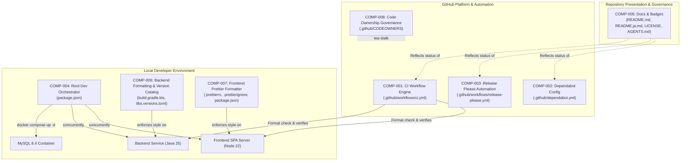
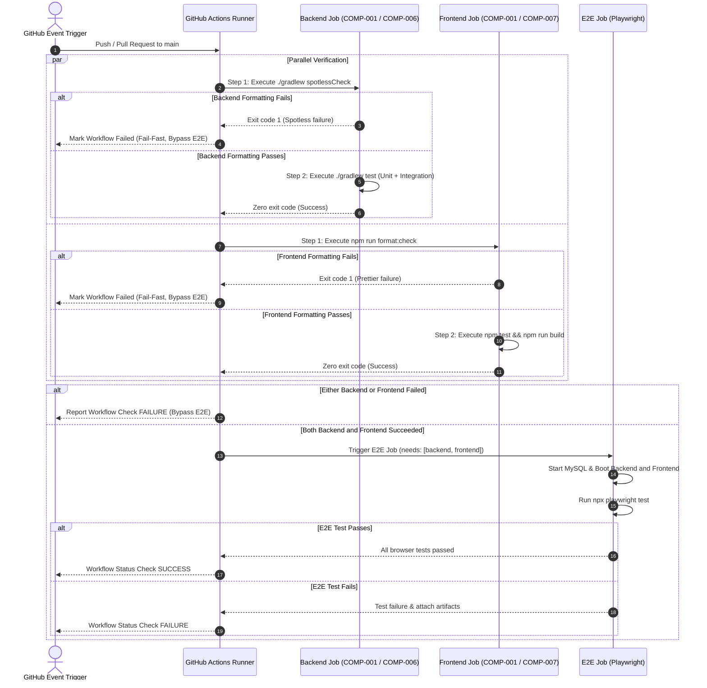
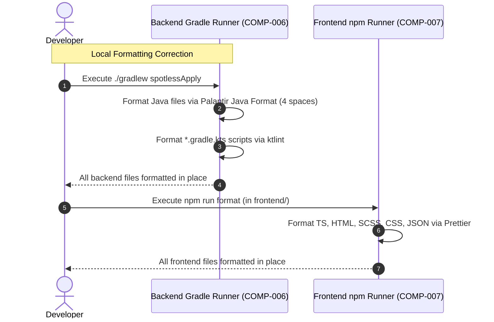

# Architecture & Component Design: CI & Repository Automation

## 1. Component Boundaries & Scope Overview

### 1.1 Architecture & Component Map
The CI & Repository Automation feature governs continuous integration, automated code style enforcement, automated dependency hygiene, semantic release lifecycle, centralized Gradle dependency management, consolidated local development, repository governance, and documentation integrity across eight discrete architectural components.

### 1.2 Component Inventory
| Component ID | Component / File Boundary | Scope / Boundary | Linked Requirements |
| :--- | :--- | :--- | :--- |
| **COMP-001** | `.github/workflows/ci.yml` | GitHub Actions CI Workflow | `REQ-001`, `REQ-002`, `REQ-003`, `REQ-016` |
| **COMP-002** | `.github/dependabot.yml` | Dependabot Automation Manifest | `REQ-004` |
| **COMP-003** | `.github/workflows/release-please.yml`, `.github/release-please-config.json`, `.release-please-manifest.json` | Semantic Release Engine | `REQ-005`, `REQ-006` |
| **COMP-004** | `package.json` (Repository Root) | Local Development Orchestrator | `REQ-007`, `REQ-008`, `REQ-009` |
| **COMP-005** | `README.md`, `README.ja.md`, `LICENSE`, `AGENTS.md` | Repository Documentation & Badges | `REQ-010`, `REQ-011` |
| **COMP-006** | `backend/build.gradle.kts`, `backend/gradle/libs.versions.toml` | Backend Code Formatter & Version Catalog | `REQ-012`, `REQ-015`, `REQ-016` |
| **COMP-007** | `frontend/.prettierrc`, `frontend/.prettierignore`, `frontend/package.json` | Frontend Code Formatter & Scripts | `REQ-013`, `REQ-016` |
| **COMP-008** | `.github/CODEOWNERS` | Repository Code Ownership Governance | `REQ-014` |

---

## 2. Interaction Modeling

### 2.1 Continuous Integration Workflow Pipeline with Formatting Quality Gate

### 2.2 Local Code Formatting Execution Flow

---

## 3. Data Models & Schema Constraints

All configuration structures, workflow definitions, version catalogs, and manifests are defined using structured Markdown tables conforming to standard constraint vocabulary.

### 3.1 CI Workflow Models (`.github/workflows/ci.yml`)

#### 3.1.1 `CiWorkflowSchema`
- **Format**: GitHub Actions Workflow Schema

| Field Name | Type | Required / Optional | Constraints | Description |
| :--- | :--- | :--- | :--- | :--- |
| `name` | `string` | Required | `const: "CI"` | Name of workflow |
| `on.push.branches` | `array<string>` | Required | `minItems: 1, non-nullable; exact elements: ["main"]` | Monitored branch for pushes |
| `on.pull_request.types` | `array<string>` | Required | `exact elements: ["opened", "synchronize"]` | Lifecycle activity triggers for PR verification |
| `on.pull_request.branches` | `array<string>` | Optional | Omitted to ensure verification triggers across all target branches | Monitored target branches for PRs |
| `permissions.contents` | `string` | Required | `const: "read"` | Least-privilege checkout permission |
| `concurrency.group` | `string` | Required | Format: `${{ github.workflow }}-${{ github.ref }}` | Concurrency lock key |
| `concurrency.cancel-in-progress` | `boolean` | Required | Value: `true` | Aborts redundant active runs |
| `jobs.backend` | `object` | Required | - | Backend parallel verification job |
| `jobs.backend.steps` | `array<object>` | Required | `minItems: 5, non-nullable` | Step sequence: checkout, java setup, mysql start, spotless check, test |
| `jobs.frontend` | `object` | Required | - | Frontend parallel verification job |
| `jobs.frontend.steps` | `array<object>` | Required | `minItems: 6, non-nullable` | Step sequence: checkout, node setup, npm ci, format check, unit test, build |
| `jobs.e2e` | `object` | Required | `needs: ["backend", "frontend"]` | Downstream browser test gate |

### 3.2 Dependabot Models & Schema Constraints (`.github/dependabot.yml`)

#### 3.2.1 `DependabotConfigSchema`
- **Format**: Dependabot v2 Configuration Schema

| Field Name | Type | Required / Optional | Constraints | Description |
| :--- | :--- | :--- | :--- | :--- |
| `version` | `integer` | Required | Value: `2` | Dependabot schema version |
| `updates` | `array<DependabotUpdateRule>` | Required | `minItems: 4, maxItems: 4, non-nullable (guaranteed [] on empty)` | Package ecosystem update configurations |

#### 3.2.2 `DependabotUpdateRule` (Sub-model)
| Field Name | Type | Required / Optional | Constraints | Description |
| :--- | :--- | :--- | :--- | :--- |
| `package-ecosystem` | `string` (enum) | Required | `enum: ["gradle", "npm", "github-actions", "docker"]` | Target package manager |
| `directory` | `string` | Required | `enum: ["/backend", "/frontend", "/"]` | Target filesystem directory |
| `schedule.interval` | `string` (enum) | Required | `enum: ["weekly"]` | Checking cadence |
| `schedule.day` | `string` (enum) | Required | `enum: ["monday"]` | Execution weekday |

### 3.3 Release Please Models (`.github/workflows/release-please.yml`, `.github/release-please-config.json`, `.release-please-manifest.json`)

#### 3.3.1 `ReleasePleaseWorkflowSchema` (`.github/workflows/release-please.yml`)
- **Format**: GitHub Actions Workflow Schema

| Field Name | Type | Required / Optional | Constraints | Description |
| :--- | :--- | :--- | :--- | :--- |
| `name` | `string` | Required | `const: "release-please"` | Workflow identifier |
| `on.push.branches` | `array<string>` | Required | `minItems: 1, maxItems: 1, non-nullable; exact elements: ["main"]` | Monitored trigger branch |
| `permissions.contents` | `string` | Required | `const: "write"` | Required for tagging and release assets |
| `permissions.pull-requests` | `string` | Required | `const: "write"` | Required for release PR management |
| `jobs.release-please.runs-on` | `string` | Required | `const: "ubuntu-latest"` | Runner environment |
| `jobs.release-please.steps[].uses` | `string` | Required | `const: "googleapis/release-please-action@v4"` | Google release-please action reference |

#### 3.3.2 `ReleasePleaseConfigSchema` (`.github/release-please-config.json`)
- **Format**: Release Please Configuration JSON Schema

| Field Name | Type | Required / Optional | Constraints | Description |
| :--- | :--- | :--- | :--- | :--- |
| `release-type` | `string` | Required | `const: "simple"` | Generic semantic versioning engine |
| `packages` | `object` | Required | Contains root package key `"."` | Managed package mapping |

#### 3.3.3 `ReleasePleaseManifestSchema` (`.release-please-manifest.json`)
- **Format**: Release Please Manifest JSON Schema

| Field Name | Type | Required / Optional | Constraints | Description |
| :--- | :--- | :--- | :--- | :--- |
| `.` | `string` | Required | SemVer pattern `^[0-9]+\.[0-9]+\.[0-9]+$` | Current repository version milestone |

### 3.4 Root Development Package Model (`package.json`)
- **Format**: Standard npm `package.json` Schema

| Field Name | Type | Required / Optional | Constraints | Description |
| :--- | :--- | :--- | :--- | :--- |
| `name` | `string` | Required | Value: `"swe-workflow-playground"` | Root package identifier |
| `private` | `boolean` | Required | Value: `true` | Prevents accidental npm registry publication |
| `scripts` | `object` | Required | Contains dev and test task commands | Task execution scripts |
| `scripts.dev` | `string` | Required | Launches MySQL, backend, and frontend (`ja` default) | Primary developer start command |
| `scripts.dev:ja` | `string` | Required | Explicit Japanese development start | Japanese dev server target |
| `scripts.dev:en` | `string` | Required | Explicit English development start | English dev server target |
| `scripts.db:up` | `string` | Required | Value: `"docker compose up -d"` | Database container startup |
| `scripts.db:down` | `string` | Required | Value: `"docker compose down"` | Database container teardown |
| `devDependencies` | `object` | Required | Includes `concurrently`, `wait-on`, `yaml` | Tooling dependencies |

### 3.5 Badges Presentation Models (`README.md` & `README.ja.md`)

#### 3.5.1 `BadgesBlockModel`
- **Format**: Markdown Header Badge Group

| Field Name | Type | Required / Optional | Constraints | Description |
| :--- | :--- | :--- | :--- | :--- |
| `badges` | `array<BadgeItemModel>` | Required | `minItems: 5, maxItems: 5, non-nullable (strict sequential order 1 through 5)` | Ordered list of repository presentation badges |

#### 3.5.2 `BadgeItemModel` (Sub-model)
- **Format**: Markdown Badge Element

| Field Name | Type | Required / Optional | Constraints | Description |
| :--- | :--- | :--- | :--- | :--- |
| `position` | `integer` | Required | `minimum: 1`, `maximum: 5`, unique | Sequential display order index |
| `badge_type` | `string` (enum) | Required | `enum: ["release", "ci", "release-please", "dependabot", "license"]` | Identifier of badge |
| `badge_url` | `string` | Required | `format: "uri"` | Image rendering source URL |
| `target_url` | `string` | Required | `format: "uri"` or relative filepath | Click destination URL or relative link |

### 3.6 Gradle Version Catalog Model (`backend/gradle/libs.versions.toml`)
- **Format**: TOML Schema conforming to Gradle 9.x Version Catalog

| Field Name | Type | Required / Optional | Constraints | Description |
| :--- | :--- | :--- | :--- | :--- |
| `versions` | `table` | Required | Contains string keys and SemVer string values | Shared version variables |
| `versions.micronaut` | `string` | Required | `pattern: "^[0-9]+\.[0-9]+\.[0-9]+$"` | Micronaut framework version |
| `versions.shadow` | `string` | Required | `pattern: "^[0-9]+\.[0-9]+\.[0-9]+$"` | Shadow plugin version |
| `versions.spotless` | `string` | Required | `pattern: "^[0-9]+\.[0-9]+\.[0-9]+$"` | Spotless formatting plugin version |
| `libraries` | `table` | Required | Key format `lowercase-kebab-case` | External library definitions |
| `libraries.*.module` | `string` | Required | Format: `"group:artifact"` | Maven group and artifact ID |
| `libraries.*.version.ref` | `string` | Optional | References key in `[versions]` | Version reference |
| `libraries.*.version` | `string` | Optional | Fixed version string | Fixed version specification |
| `plugins` | `table` | Required | Key format `lowercase-kebab-case` | Gradle plugin definitions |
| `plugins.*.id` | `string` | Required | Valid Gradle plugin ID | Plugin coordinate |
| `plugins.*.version.ref` | `string` | Required | References key in `[versions]` | Version reference |

### 3.7 Frontend Prettier Configuration Models (`frontend/.prettierrc`, `frontend/package.json`)

#### 3.7.1 `PrettierConfigModel` (`frontend/.prettierrc`)
- **Format**: JSON Schema / Prettier Configuration

| Field Name | Type | Required / Optional | Constraints | Description |
| :--- | :--- | :--- | :--- | :--- |
| `tabWidth` | `integer` | Required | Value: `2` | Number of spaces per indentation level |
| `useTabs` | `boolean` | Required | Value: `false` | Indent with spaces rather than tabs |
| `singleQuote` | `boolean` | Required | Value: `true` | Use single quotes for JS/TS strings |
| `semi` | `boolean` | Required | Value: `true` | Print semicolons at ends of statements |
| `trailingComma` | `string` (enum) | Required | Value: `"all"` | Print trailing commas wherever possible in multi-line |
| `printWidth` | `integer` | Required | Value: `100` | Specify the line length that the printer will wrap on |
| `bracketSpacing` | `boolean` | Required | Value: `true` | Print spaces between brackets in object literals |
| `arrowParens` | `string` (enum) | Required | Value: `"always"` | Include parentheses around a sole arrow function parameter |

#### 3.7.2 `PrettierScriptsModel` (`frontend/package.json`)
- **Format**: Standard npm `package.json` Schema (Scripts Block)

| Field Name | Type | Required / Optional | Constraints | Description |
| :--- | :--- | :--- | :--- | :--- |
| `scripts.format:check` | `string` | Required | `Value: "prettier --check ."` | Verifies formatting across files; exits with code 1 on mismatch |
| `scripts.format` | `string` | Required | `Value: "prettier --write ."` | Formats all matching files in-place |

### 3.8 Codeowners Governance Model (`.github/CODEOWNERS`)
- **Format**: Standard GitHub CODEOWNERS Pattern Syntax

| Pattern | Owner / Assignee | Description |
| :--- | :--- | :--- |
| `*` | `@green-tea-stalk` | Assigns repository-wide review responsibility to lead maintainer |

---

## 4. Input / Output Protocols & Execution Contracts

### 4.1 CLI Protocol (Local Formatting & Dev Orchestration - COMP-004, COMP-006, COMP-007)
- **Formatting Verification Commands**:
  - Backend: `cd backend && ./gradlew spotlessCheck` (exits `0` on match, `1` on style violation).
  - Frontend: `cd frontend && npm run format:check` (exits `0` on match, `1` on style violation).
- **In-Place Formatting Fix Commands**:
  - Backend: `cd backend && ./gradlew spotlessApply` (formats Java sources and Kotlin Gradle scripts).
  - Frontend: `cd frontend && npm run format` (formats TS, HTML, SCSS, CSS, JSON).
- **Exit Codes**:
  - `0`: Formatting conforms to rules or successfully corrected.
  - `1`: Formatting violations detected in check mode, or execution syntax error.

### 4.2 GitHub Actions Execution Protocol (COMP-001 & COMP-003)
- **Fail-Fast Order in Backend Job**:
  1. `actions/checkout@v7`
  2. `actions/setup-java@v6` (Corretto 25, Gradle cache)
  3. Start MySQL container via `docker compose up -d --wait`
  4. Spotless format check: `cd backend && ./gradlew spotlessCheck`
  5. Gradle tests: `cd backend && ./gradlew test`
- **Fail-Fast Order in Frontend Job**:
  1. `actions/checkout@v7`
  2. `actions/setup-node@v7` (Node 22, npm cache)
  3. `cd frontend && npm ci`
  4. Prettier format check: `cd frontend && npm run format:check`
  5. Unit tests: `cd frontend && npm test -- --watch=false`
  6. Production build: `cd frontend && npm run build`
- **Artifact Preservation**:
  - On E2E test failure, the workflow MUST upload Playwright traces and failure screenshots as GitHub Actions workflow artifacts with a 14-day retention limit.

---

## 5. Component Contracts (Design by Contract - RFC 2119 / RFC 8174)

### 5.1 COMP-001: CI Workflow Engine (`.github/workflows/ci.yml`)
- **Role**: Automated pull request and main branch quality verification gate.
- **Public Signature**: GitHub Actions Workflow Event Handler (`push`, `pull_request`).
- **Preconditions (Caller Obligations)**:
  - Caller MUST trigger workflow with valid Git refs targeting `main` or pull requests targeting `main`.
  - Repository runner MUST have Docker virtualization enabled.
- **Postconditions (Callee Guarantees)**:
  - The workflow MUST execute `backend` and `frontend` jobs concurrently.
  - In `backend` job, the workflow MUST execute `./gradlew spotlessCheck` prior to `./gradlew test`.
  - In `frontend` job, the workflow MUST execute `npm run format:check` prior to unit tests and build.
  - If any format check fails in either job, the workflow MUST immediately terminate the job with failure and MUST NOT permit downstream E2E execution.
  - If both `backend` and `frontend` jobs succeed, the workflow MUST execute the `e2e` job.
  - If any job fails, the workflow MUST return a non-zero exit status and report a failure status check to GitHub.
- **Invariants (State Consistency)**:
  - Redundant in-progress workflow runs for the same branch or pull request MUST be cancelled via concurrency groups.

### 5.2 COMP-002: Dependabot Configuration (`.github/dependabot.yml`)
- **Role**: Automated multi-ecosystem dependency monitoring and upgrade submission.
- **Public Signature**: Dependabot v2 Configuration Parser.
- **Preconditions (Caller Obligations)**:
  - Manifest directories (`/backend`, `/frontend`, `/`) MUST contain valid ecosystem lock/build files (`build.gradle.kts`, `gradle/libs.versions.toml`, `package.json`, workflow YAMLs, `docker-compose.yml`).
- **Postconditions (Callee Guarantees)**:
  - The engine MUST evaluate dependency states weekly on Monday.
  - For any detected outdated or insecure package, the engine MUST open an isolated pull request with standard Conventional Commits prefixing.
  - When zero (0) outdated or vulnerable packages are detected, the engine MUST NOT open any pull requests and SHALL complete the scheduled evaluation with a clean status.
- **Invariants (State Consistency)**:
  - Dependabot MUST NOT update packages outside configured directories.

### 5.3 COMP-003: Release Please Automation (`.github/workflows/release-please.yml`)
- **Role**: Automated changelog compilation, semantic versioning, and GitHub release publication.
- **Public Signature**: GitHub Actions Workflow Event Handler (`push` on `main`).
- **Preconditions (Caller Obligations)**:
  - Target branch MUST be `main`.
  - Merged commits MUST adhere to Conventional Commits 1.0.0 format (`feat`, `fix`, etc.).
- **Postconditions (Callee Guarantees)**:
  - On push to `main`, the workflow MUST evaluate commit history against `.release-please-manifest.json`.
  - When version-triggering commits exist, the workflow MUST maintain an open release pull request containing version updates and changelog entries.
  - When the release pull request is merged, the workflow MUST tag the commit with the new SemVer tag and publish a GitHub Release asset.
  - When zero (0) version-triggering Conventional Commits are detected on `main`, the workflow MUST NOT create or modify any release pull request and SHALL exit cleanly without error.
- **Invariants (State Consistency)**:
  - The version number in `.release-please-manifest.json` MUST remain monotonic and strictly follow SemVer.

### 5.4 COMP-004: Root Development Orchestrator (`package.json`)
- **Role**: Consolidated developer CLI for local full-stack execution and lifecycle management.
- **Public Signature**: `npm run dev` / `npm run dev:ja` / `npm run dev:en`.
- **Preconditions (Caller Obligations)**:
  - Developer host MUST have Docker Engine running, Java 25 installed, and Node.js 22 installed.
- **Postconditions (Callee Guarantees)**:
  - Execution MUST ensure MySQL container is started via `docker compose up -d`.
  - Execution MUST concurrently start backend on port `8080` and frontend on port `4200`.
  - Execution MUST forward stdout/stderr from both processes to the terminal with distinguishable prefixes.
  - On `SIGINT`, execution MUST terminate all spawned child processes within 5 seconds without leaving orphaned Java or Node processes.
- **Invariants (State Consistency)**:
  - The host port bindings (`3306`, `8080`, `4200`) MUST not conflict across concurrent script invocations.

### 5.5 COMP-005: Documentation & Badges Presentation (`README.md`, `README.ja.md`, `LICENSE`, `AGENTS.md`)
- **Role**: Public project governance, build health visibility, licensing disclosure, and unified developer guide maintenance.
- **Public Signature**: Markdown Documentation Presentation.
- **Preconditions (Caller Obligations)**:
  - Upstream repositories and workflows MUST be public or have accessible status badges.
- **Postconditions (Callee Guarantees)**:
  - `README.md` and `README.ja.md` MUST display badges in the exact specified order: (1) Latest Release, (2) CI Status, (3) release-please Status, (4) Dependabot Status, (5) License Badge.
  - `LICENSE` file MUST contain standard MIT License text dated 2026.
  - `AGENTS.md` MUST document the consolidated `npm run dev` workflow and formatting commands while strictly preserving single-source technical guidelines and unidirectional reference integrity.
- **Invariants (State Consistency)**:
  - Both English and Japanese README documents MUST maintain identical badge configurations and link destinations.

### 5.6 COMP-006: Backend Code Formatter & Version Catalog (`backend/build.gradle.kts`, `backend/gradle/libs.versions.toml`)
- **Role**: Backend code style formatting governance (Java & Kotlin DSL) and centralized dependency management.
- **Public Signature**: Gradle tasks `./gradlew spotlessCheck`, `./gradlew spotlessApply`, and Version Catalog accessor `libs.*`.
- **Preconditions (Caller Obligations)**:
  - Java source files MUST reside under `backend/src/` and Kotlin DSL build scripts MUST end in `.gradle.kts`.
  - Version catalog at `backend/gradle/libs.versions.toml` MUST be well-formed TOML syntax.
- **Postconditions (Callee Guarantees)**:
  - When zero (0) formatting violations exist across Java and Kotlin build files, `./gradlew spotlessCheck` MUST complete with exit code `0`.
  - `spotlessCheck` MUST fail with exit code `1` if any Java file diverges from Palantir Java Format (4 spaces) or if any Kotlin Gradle script diverges from ktlint standards.
  - `spotlessApply` MUST reformat non-compliant files in place to achieve compliance.
  - `backend/build.gradle.kts` MUST reference dependencies and plugins via type-safe `libs` accessors rather than inline version coordinates.
- **Invariants (State Consistency)**:
  - Version catalog MUST NOT contain platform environment versions (Java 25, MySQL 8.4, Docker).

### 5.7 COMP-007: Frontend Prettier Formatter & Scripts (`frontend/.prettierrc`, `frontend/.prettierignore`, `frontend/package.json`)
- **Role**: Frontend code style formatting governance across TypeScript, HTML, styles, and configuration.
- **Public Signature**: npm scripts `npm run format:check` and `npm run format`.
- **Preconditions (Caller Obligations)**:
  - Node.js 22 LTS runtime and npm dependencies MUST be installed in `frontend/`.
- **Postconditions (Callee Guarantees)**:
  - `npm run format:check` MUST exit with code `0` when all target files (`.ts`, `.html`, `.scss`, `.css`, `.json`) conform to `.prettierrc` rules, and exit with code `1` when any file requires formatting.
  - `npm run format` MUST write formatted content in-place across all un-ignored files.
  - Ignore patterns in `.prettierignore` (`dist/`, `.angular/`, `node_modules/`, `coverage/`) MUST be respected.
- **Invariants (State Consistency)**:
  - Formatting results MUST be deterministic across developer workstations and CI runners.

### 5.8 COMP-008: Repository Code Ownership Governance (`.github/CODEOWNERS`)
- **Role**: Automated code review assignment and governance routing on GitHub.
- **Public Signature**: GitHub CODEOWNERS Syntax Engine.
- **Preconditions (Caller Obligations)**:
  - File MUST be placed at `.github/CODEOWNERS` in the default branch.
  - Declared owner `@green-tea-stalk` MUST be a valid GitHub user with repository access.
- **Postconditions (Callee Guarantees)**:
  - GitHub MUST automatically assign `@green-tea-stalk` as a required reviewer for all incoming pull requests touching any file in the repository (`*`).
- **Invariants (State Consistency)**:
  - Wildcard pattern `*` guarantees zero un-owned orphan paths in the repository.

---

## 6. Error & Exception Handling

### 6.1 CI Workflow Failure Modes (COMP-001)
- **Compilation or Unit Test Failure**:
  - The affected job (`backend` or `frontend`) immediately halts with non-zero exit code.
  - Downstream `e2e` job status is marked as `skipped` (due to unmet `needs: [backend, frontend]` condition).
  - GitHub status check for pull request is reported as `failure`.
- **E2E Readiness Timeout**:
  - In `e2e` job, backend readiness check (`curl --fail --retry 30 --retry-delay 2 http://localhost:8080/api/posts`) and frontend readiness check (`curl --fail --retry 30 --retry-delay 2 http://localhost:4200/`) fail-closed after 60 seconds of unresponsiveness.
  - Workflow dumps backend stdout/stderr logs to runner console, terminates services, and exits with code `1`.
- **Playwright Test Assertion Failure**:
  - Playwright automatically captures failure screenshots and execution trace (`trace: 'on-first-retry'`).
  - GitHub Actions step uploads `./frontend/test-results` and `./frontend/playwright-report` via `actions/upload-artifact@v4`.

### 6.2 Local Dev Orchestrator Error Modes (COMP-004)
- **Docker Daemon Inactive**:
  - `npm run db:up` fails with exit code `1` and emits explicit diagnostic: `Cannot connect to the Docker daemon`.
  - Root command halts immediately before launching backend or frontend processes.
- **Port Conflict (3306, 8080, or 4200 already in use)**:
  - Micronaut backend or Angular dev-server emits `EADDRINUSE` / `BindException`.
  - `concurrently --kill-others` detects child process exit with code `1` and immediately terminates the remaining child process.

### 6.3 Dependabot Failure Modes (COMP-002)
- **Ecosystem Manifest Syntax or Lockfile Parse Error**:
  - If a package ecosystem manifest or lockfile contains invalid syntax, Dependabot logs the parsing error in the repository's GitHub Security / Dependabot updates tab.
  - Dependabot halts evaluation solely for the affected ecosystem without crashing or preventing evaluation of remaining ecosystems.
- **Upstream Registry Rate Limiting or Network Interruption**:
  - In the event of network timeouts or package registry 429/503 responses, Dependabot fails-closed and retries on the next scheduled interval.
  - Zero partial or corrupt pull requests are created.

### 6.4 Release Please Automation Failure Modes (COMP-003)
- **Insufficient GITHUB_TOKEN Permissions**:
  - If the workflow execution lacks `contents: write` or `pull-requests: write`, release-please fails with exit code `1` and emits `Resource not accessible by integration`.
  - The workflow fails-closed and alerts maintainers via GitHub Actions failure notification.
- **SemVer Tag Collision**:
  - If a Git tag matching the calculated next semantic version already exists on remote, release-please halts without overwriting the existing tag and emits a collision warning.
- **Non-Standard or Malformed Commit Messages**:
  - Commits that fail to match Conventional Commits format (`feat:`, `fix:`, etc.) are ignored by the version parser without causing workflow crashes.

### 6.5 Documentation & Badges Presentation Failure Modes (COMP-005)
- **External Badge Service Outage**:
  - In the event of upstream network disruption with Shields.io or GitHub Actions badge endpoints, Markdown renderers fall back to displaying the badge alt-text without altering document layout or breaking links.
- **Documentation Drift or Broken Anchor References**:
  - If `AGENTS.md` section anchors are renamed without updating human entry point links in `README.md` and `README.ja.md`, link checker audits fail-closed in automated checks, alerting contributors before merge.

### 6.6 Backend Formatting Failure (COMP-006)
- **Spotless Verification Mismatch**:
  - If any Java file or `.gradle.kts` file diverges from Palantir Java Format or ktlint rules, `./gradlew spotlessCheck` halts execution, prints a diff of violations to stderr, and exits with code `1`.
  - In CI, this immediately fails the `backend` job before executing Gradle tests or starting Testcontainers.
  - Remediation: Contributor runs `./gradlew spotlessApply` locally and commits the resulting formatting changes.

### 6.7 Frontend Formatting Failure (COMP-007)
- **Prettier Verification Mismatch**:
  - If any frontend file (`.ts`, `.html`, `.scss`, `.css`, `.json`) diverges from `.prettierrc` rules, `npm run format:check` prints the non-compliant filenames to stderr and exits with code `1`.
  - In CI, this immediately fails the `frontend` job before running Vitest tests or building the production bundle.
  - Remediation: Contributor runs `npm run format` in `frontend/` and commits the resulting formatting changes.

### 6.8 Version Catalog Parse or Resolution Failure (COMP-006)
- **Malformed TOML or Missing Accessor**:
  - If `backend/gradle/libs.versions.toml` contains syntax errors or an invalid version reference, Gradle build initialization fails immediately during configuration time with a descriptive parse error.
  - Remediation: Fix TOML syntax error in `libs.versions.toml` and re-run `./gradlew buildEnvironment`.

### 6.9 CODEOWNERS Syntax & Mention Resolution Failure (COMP-008)
- **Invalid Handle or Pattern Syntax**:
  - If `.github/CODEOWNERS` references a non-existent GitHub handle or malformed path pattern, GitHub silently falls back to omitting review requests or flags syntax errors in the repository settings view.
  - Verification: Inspected statically via automated check confirming pattern `* @green-tea-stalk`.

---

## 7. Key Design Decisions & Architectural Trade-offs

- **CI Pipeline Execution Topology & Downstream Gating**:
  - **Selected Approach**: Fork continuous integration into two concurrent independent runner jobs for backend verification (Java 25 LTS, Gradle compilation, unit tests, and Testcontainers MySQL integration tests) and frontend verification (Node.js 22 LTS, Vitest unit tests, and production AOT build), gating a downstream browser end-to-end job via `needs: [backend, frontend]` so that E2E tests execute only when both upstream suites succeed cleanly (`COMP-001`, `REQ-001`, `REQ-002`, `REQ-003`).
  - **Alternative Considered**: A single sequential monolithic pipeline job executing backend, frontend, and E2E in series on one runner, or an un-gated parallel matrix executing all three jobs concurrently.
  - **Rationale & Trade-off**: Maximizes runner parallelism to minimize wall-clock execution time and deliver fast feedback to contributors (`NFR-PERF-001`). Gating the resource-heavy E2E suite behind upstream verification enforces a fail-closed quality gate (`NFR-REL-001`) that prevents provisioning MySQL containers, launching application distributions, and executing browser automation when unit or compilation checks fail. The accepted trade-off is managing inter-job dependencies in GitHub Actions YAML and incurring runner provisioning startup latency across multiple runner virtual machines.

- **Local Development Orchestration & Process Lifecycle**:
  - **Selected Approach**: Root npm orchestrator using `concurrently` and `wait-on` to manage a hybrid execution topology: containerized database persistence (MySQL 8.4 via `docker compose up -d`) combined with native host-executed processes for backend (`./gradlew run`) and frontend (`npm run start:ja` / `start:en`) with live hot-reloading (HMR / continuous compilation) and unified `SIGINT` signal propagation to cleanly terminate child processes without orphaned processes (`COMP-004`, `REQ-007`, `REQ-008`, `REQ-009`).
  - **Alternative Considered**: A fully containerized multi-container Docker Compose stack containing MySQL, Micronaut backend, and Angular frontend services running exclusively inside Docker containers.
  - **Rationale & Trade-off**: Running application servers directly on the developer host ensures instantaneous Hot Module Replacement (HMR) in Angular, rapid Micronaut re-compilation/restart cycles, zero Docker volume/bind-mount I/O performance penalties (particularly on macOS file systems), and direct IDE debugger / profiler attachment. The accepted trade-off is requiring developers to install host runtimes (Java 25 LTS and Node.js 22 LTS) on their local machines rather than relying solely on a container runtime.

- **Monorepo Semantic Release & Versioning Strategy**:
  - **Selected Approach**: Unified repository-wide semantic versioning configured with `release-type: simple` via Google `release-please-action` (managed via `.github/release-please-config.json` and `.release-please-manifest.json` rooted at `.`), where all Conventional Commits on `main` increment a single canonical repository version and compile into a centralized `CHANGELOG.md` (`COMP-003`, `REQ-005`, `REQ-006`).
  - **Alternative Considered**: Independent multi-package release configuration tracking separate version numbers, Git tags (e.g. `backend-v1.0.0`, `frontend-v1.0.0`), and split changelogs for backend and frontend subdirectories.
  - **Rationale & Trade-off**: The repository functions as an integrated full-stack application where backend REST contracts (`RFC 9457`, `GET/POST /api/posts`) and the frontend client are authored, tested, and deployed as a cohesive unit. A unified SemVer milestone provides unambiguous release governance and transparency for consumers, avoiding combinatorial version incompatibilities. The accepted trade-off is that commits affecting only one sub-system (e.g., frontend CSS or backend logging) bump the global repository version, regardless of cross-boundary impact.

- **Multi-Ecosystem Dependency Automation & Cadence**:
  - **Selected Approach**: Consolidated weekly schedule targeting Mondays (`schedule: interval: weekly, day: monday`) across all 4 package ecosystems (`gradle` for backend, `npm` for frontend, `github-actions` for CI workflows, `docker` for container bases) in `.github/dependabot.yml` (`COMP-002`, `REQ-004`).
  - **Alternative Considered**: Daily update checks or uncoordinated, per-ecosystem schedules (e.g., daily for frontend, bi-weekly for backend, monthly for actions).
  - **Rationale & Trade-off**: Synchronizing all package managers to a single Monday cadence batches dependency PRs into a predictable review window, preventing review fatigue and reducing redundant CI workflow runs throughout active development sprints. The accepted trade-off is that non-critical minor or patch releases published mid-week wait until the following Monday to be audited (critical CVEs and security alerts remain handled proactively by GitHub Security Advisories).

- **Documentation Architecture & Visual Status Badge Hierarchy**:
  - **Selected Approach**: A strict 5-badge visual hierarchy ordered by operational criticality: (1) Latest Release, (2) CI Status, (3) release-please Status, (4) Dependabot Status, and (5) Software License (MIT) across both `README.md` and `README.ja.md`, paired with establishing `AGENTS.md` as the authoritative Single Source of Truth (SSOT) for all CLI commands (documenting `npm run dev`) while strictly maintaining the Unidirectional Reference Rule (human entry points link into `AGENTS.md`, but `AGENTS.md` never links back to human entry points) (`COMP-005`, `REQ-010`, `REQ-011`, `NFR-MAINT-001`).
  - **Alternative Considered**: Ad-hoc or alphabetical badge ordering with duplicated command instructions across `README.md`, `README.ja.md`, and `AGENTS.md`, and permissive bidirectional cross-links.
  - **Rationale & Trade-off**: Eliminates documentation drift across multi-language documentation files by maintaining a single authoritative reference for operational instructions, while providing visitors and evaluators with a consistent, instantly scannable overview of release stability, automated pipeline health, security posture, and legal licensing terms. The accepted trade-off is requiring strict contributor discipline to prevent duplicating CLI snippets in human entry points and ensuring anchor link stability when modifying `AGENTS.md`.

- **Backend Code Style Enforcement & Formatting Engine (Java & Kotlin DSL)**:
  - **Selected Approach**: Spotless Gradle plugin (`com.diffplug.spotless`) integrating Palantir Java Format (`palantirJavaFormat()`) configured for 4-space indentation across all Java source files (`src/**/*.java`), combined with `ktlint()` for Kotlin Gradle DSL build scripts (`*.gradle.kts`), exposing automated verification (`./gradlew spotlessCheck`) and in-place correction (`./gradlew spotlessApply`) tasks (`COMP-006`, `REQ-012`, `REQ-016`, `NFR-STYLE-001`).
  - **Alternative Considered**: Google Java Format (`googleJavaFormat()`, which enforces 2-space indentation by default), AOSP format (which uses 4-space indentation but introduces unconventional lambda expression and builder chain line breaks), or relying on manual IDE code formatting without automated build-level enforcement.
  - **Rationale & Trade-off**: Palantir Java Format provides deterministic, zero-configuration formatting that strictly adheres to standard 4-space indentation conventions widely established in enterprise Java and Micronaut codebases, eliminating all subjective style debates in code reviews. Pairing it with ktlint extends automated formatting governance to Kotlin Gradle build scripts. The accepted trade-off is adopting an unbending, opinionated formatter that may refactor bespoke multi-line alignments or custom method chaining, and requiring contributors to run `./gradlew spotlessApply` prior to pushing commits.

- **Frontend Code Formatter & Tooling Separation (TypeScript, HTML, Styles, JSON)**:
  - **Selected Approach**: Prettier code formatter configured via root `.prettierrc` and `.prettierignore`, integrated with npm lifecycle scripts (`npm run format:check` and `npm run format`), enforcing deterministic formatting across TypeScript (`.ts`), HTML templates (`.html`), styles (`.scss`/`.css`), and configuration (`.json`) files (`COMP-007`, `REQ-013`, `REQ-016`, `NFR-STYLE-001`).
  - **Alternative Considered**: Relying solely on ESLint formatting rules (e.g. `@typescript-eslint` styling rules or stylistic plugins) or standalone Angular CLI formatters without Prettier.
  - **Rationale & Trade-off**: Prettier is an industry-standard, AST-aware formatter that provides comprehensive, uniform formatting across the entire frontend multi-language stack (TypeScript, Angular HTML templates, SCSS, JSON) with minimal configuration overhead and fast execution. Decoupling formatting (Prettier) from static semantic analysis and linting (ESLint) prevents rule collisions, avoids circular fixer conflicts, and preserves single-responsibility tool boundaries. The accepted trade-off is adding explicit Prettier configuration files and formatting scripts to the frontend workspace and accepting Prettier's strict line-wrapping and quote conventions.

- **CI Formatting Quality Gate Integration & Execution Topology**:
  - **Selected Approach**: Embedding formatting verification checks (`./gradlew spotlessCheck` and `npm run format:check`) as the initial fail-fast execution steps directly inside the existing concurrent `backend` and `frontend` CI jobs in `.github/workflows/ci.yml`, prior to executing compilation, unit tests, or integration tests (`COMP-001`, `REQ-001`, `REQ-016`, `NFR-PERF-001`, `NFR-REL-001`).
  - **Alternative Considered**: Creating dedicated standalone CI runner jobs (e.g. separate `backend-lint` and `frontend-lint` jobs) or executing a global formatting check job at the repository root prior to launching backend and frontend jobs.
  - **Rationale & Trade-off**: Executing formatting checks inside the existing concurrent runner jobs reuses already checked-out workspaces and initialized runtime environments (Java 25 LTS, Gradle daemon/cache, Node.js 22 LTS, npm cache) with zero additional runner virtualization overhead and zero billable runner spin-up latency. Positioning format verification before compilation and tests ensures immediate fail-fast termination within seconds on style violations, saving compute resources and preventing downstream test suites or Docker containers from booting when formatting fails. The accepted trade-off is that a formatting violation halts subsequent test execution within that specific job, requiring contributors to fix formatting before observing test outcomes.

- **Repository Code Ownership Governance & Review Routing**:
  - **Selected Approach**: Establishing a canonical `.github/CODEOWNERS` configuration with a repository-wide wildcard ownership rule (`* @green-tea-stalk`), designating the lead maintainer as the mandatory default reviewer for all file paths and pull requests across the repository (`COMP-008`, `REQ-014`).
  - **Alternative Considered**: Defining granular, directory-level ownership patterns (e.g. separate path entries for `/backend/`, `/frontend/`, `/.github/`, and `/docs/`), or relying solely on GitHub branch protection reviewer rules without a version-controlled `CODEOWNERS` manifest.
  - **Rationale & Trade-off**: As a cohesive full-stack application overseen by a lead maintainer, repository-wide wildcard routing guarantees complete review coverage with zero orphan paths, eliminates path drift when new modules or documentation files are added, and provides clear, version-controlled governance transparency for external contributors. The accepted trade-off is that all pull requests—regardless of whether they touch docs, backend, frontend, or CI workflows—route review requests to `@green-tea-stalk`, which will require decomposition into granular path mappings if code ownership is later delegated across multiple specialized teams.

- **Centralized Dependency Management via Gradle Version Catalog**:
  - **Selected Approach**: Implementing a standard Gradle Version Catalog at `backend/gradle/libs.versions.toml` to centralize all Gradle build plugin IDs, versions, and external library dependency coordinates for the backend, while strictly scoping the catalog to build dependencies and deliberately excluding platform runtime environment versions (Java 25 LTS, MySQL 8.4 LTS, Docker) (`COMP-006`, `REQ-015`).
  - **Alternative Considered**: Retaining hardcoded inline string literals in `backend/build.gradle.kts`, establishing a multi-project root catalog at `/gradle/libs.versions.toml` encompassing non-Gradle tooling, or attempting to track host/container runtime versions (JDK, MySQL, Node.js) inside the Gradle catalog.
  - **Rationale & Trade-off**: The standard `backend/gradle/libs.versions.toml` catalog leverages native Gradle mechanisms to generate type-safe dependency accessors in Kotlin DSL (`libs.micronaut...`), centralizes version bumps into a single editable manifest, and integrates seamlessly with Dependabot's Gradle ecosystem parser for automated weekly updates. Deliberately excluding host/container runtime environment versions respects architectural separation of concerns: platform runtimes are governed by CI setup actions, Docker Compose definitions, and container base images, rather than the Java build tool. The accepted trade-off is the initial migration overhead of replacing inline dependency coordinates with catalog accessors in `build.gradle.kts` and managing the catalog file in addition to the build script.
