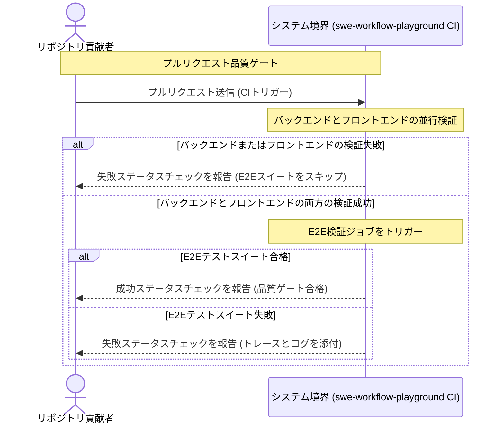
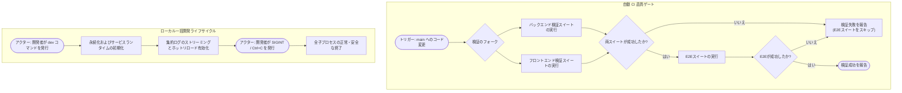

# 要件定義書: CI およびリポジトリ自動化（CI & Repository Automation）

## 1. 背景と動機（Context & Motivation）

### 1.1 課題の説明（Problem Statement）
現在の掲示板アプリケーションには、継続的インテグレーション（CI: Continuous Integration）ワークフロー、自動化された依存関係脆弱性検査、およびセマンティックリリースの自動公開機能が存在しません。貢献者はローカルマシン上で手動でテストを実行する必要があり、回帰不具合が `main` ブランチに混入するリスクが高くなっています。さらに、フルスタックアプリケーションをローカルで起動するには、データベース、バックエンド、フロントエンドの各ディレクトリに個別に移動し、統一されたオーケストレーション機構なしにバラバラのコマンドを実行する必要があります。また、リポジトリのステータスやライセンス情報がプロジェクトドキュメント上で目立つ形で表示されていません。

### 1.2 ビジネス目標および技術目標（Business & Technical Goals）
- **自動化された品質ゲート**: プルリクエスト（PR: Pull Request）および正規ブランチへのプッシュにおいて、単体テスト、契約テスト、本番ビルド、およびブラウザによるエンドツーエンド（E2E: End-to-End）テストがマージ前に自動的に合格することを保証する。
- **効率的なリソース利用**: バックエンドとフロントエンドの検証を並列実行し、両方の先行検証スイートが正常に合格した場合にのみ E2E ブラウザテストを実行する。
- **自動化されたライフサイクル保守**: サポートされているすべてのエコシステム（Gradle、npm、GitHub Actions、Docker）にわたる依存関係の更新と脆弱性を週次ペースで継続的に追跡・更新する。
- **摩擦のない開発者体験**: データベースの永続化コンテナを起動し、ライブホットリロード（HMR: Hot Module Replacement）およびクリーンなプロセス終了機能を備えたバックエンドとフロントエンドを並行実行する単一の一括開発起動コマンドを提供する。
- **透明性の高いプロジェクトガバナンス**: リリース自動化によってセマンティックバージョニング（SemVer: Semantic Versioning）および変更履歴（Changelog）の公開を自動化し、正規の MIT ライセンスとともに標準化された順序でステータスバッジをドキュメントに表示する。

### 1.3 対象者・アクター（Target Personas & Stakeholders）
- **リポジトリ貢献者 / 開発者（Repository Contributor / Developer）**: プルリクエストを通じて変更を提出し、迅速な自動 CI フィードバックを期待し、単一コマンドでのローカル開発環境を必要とする。
- **メンテナー / リリースマネージャー（Maintainer / Release Manager）**: プロジェクトガバナンス、リリース作業、依存関係の健全性、およびリポジトリのセキュリティを統括する。
- **外部訪問者 / 利用者（External Visitor / Consumer）**: リポジトリドキュメントを通じて、プロジェクトの品質、リリースバージョン、CI の健全性、およびライセンス条項を評価する。
- **自動化サービス（GitHub Actions & Dependabot）**: リポジトリの Webhook および API と連携して、検証の実行、依存関係更新 PR の提出、およびリリースの公開を行う。

---

## 2. ユーザーシナリオとユースケース（User Scenarios & Use Cases）

### 2.1 ユースケース 1: 自動継続的インテグレーション検証（Automated Continuous Integration Verification）
- **アクター**: リポジトリ貢献者
- **事前条件**: 貢献者が `main` ブランチにコミットをプッシュするか、`main` を対象とするプルリクエストを開く。
- **トリガー**: GitHub の Webhook が `push` または `pull_request` イベントを配信する。
- **基本フロー（Basic Flow）**:
  1. システムは、バックエンド検証（コンパイル、単体テスト、および統合テスト）とフロントエンド検証（単体テストおよび本番ビルド）を並行して開始する。
  2. バックエンドとフロントエンドの両方の検証ジョブがエラーなし（正常終了）で完了する。
  3. システムは、エンドツーエンド（E2E）検証ジョブをトリガーする。
  4. E2E ジョブは、永続化サービスを初期化し、バックエンドおよびフロントエンドのアプリケーションサーバーを起動し、ブラウザによる E2E テストを実行する。
  5. すべての E2E シナリオが成功し、システムはプルリクエストに合格ステータスチェックを報告する。
- **代替フロー（Alternative Flows）**: なし。
- **例外フロー（Exception Flows）**:
  - *バックエンドまたはフロントエンドの失敗*: いずれかの検証が失敗した場合、システムは該当ジョブを即座に失敗とマークし、E2E 検証ジョブをスキップ（バイパス）して、プルリクエスト全体のチェックを失敗とマークする。
  - *E2E テストの失敗*: いずれかの E2E シナリオが失敗した場合、システムは診断トレースと失敗スクリーンショットを取得し、E2E チェックを失敗とマークして、プルリクエストに失敗を報告する。
- **事後条件**: プルリクエストに明確な成功（緑）または失敗（赤）の検証ステータスが表示される。

### 2.2 ユースケース 2: ローカル一括開発起動（Consolidated Local Development Startup）
- **アクター**: 開発者
- **事前条件**: ローカルホストにコンテナランタイムおよび開発ランタイムがインストールされていること。
- **トリガー**: 開発者がリポジトリルートから一括開発起動コマンドを実行する。
- **基本フロー（Basic Flow）**:
  1. 開発者がルート開発実行コマンドを発行する。
  2. システムは、データベース永続化サービスがまだ稼働していない場合、バックグラウンドで起動する。
  3. システムは、ホスト上でバックエンドおよびフロントエンドのアプリケーションサーバーを並行して起動する。
  4. システムは、両サービスからの色分けされたプレフィックス付きログ出力をターミナルに集約ストリーミングする。
  5. フロントエンドおよびバックエンドは、ライブホットリロードによってソースコードの編集内容を即座に反映する。
- **代替フロー（Alternative Flows）**:
  - *ロケール選択*: 開発者がコマンドバリエーションを実行して、日本語または英語のフロントエンド開発構成を明示的に指定する。
- **例外フロー（Exception Flows）**:
  - *割り込みシグナル*: 開発者が割り込みシグナル（`SIGINT` / Ctrl+C）を送信した場合、システムは孤立した子プロセスを残すことなく、並行稼働中のすべてのサービスプロセスを安全に終了する。
- **事後条件**: 開発環境がライブホットリロード有効で完全に稼働するか、または終了時に安全に停止する。

### 2.3 ユースケース 3: 自動依存関係保守（Automated Dependency Maintenance）
- **アクター**: メンテナー / 自動化サービス
- **事前条件**: サポートされているすべてのエコシステムにわたって構成された依存関係マニフェストファイルがリポジトリに含まれていること。
- **トリガー**: 毎週月曜日にスケジュールされた定期タイマーが作動する。
- **基本フロー（Basic Flow）**:
  1. システムは、バックエンド、フロントエンド、ワークフロー、およびコンテナのエコシステム全体の依存関係を検査する。
  2. システムは、利用可能なバージョン更新またはセキュリティ脆弱性を検出する。
  3. システムは、古くなった依存関係ごとに、リリースノートと自動アップグレードコミットを含む個別のプルリクエストを開く。
- **代替フロー（Alternative Flows）**:
  - *更新なし*: すべての依存関係が最新である場合、プルリクエストは開かれない。
- **例外フロー（Exception Flows）**: なし。
- **事後条件**: 古い依存関係に対して、メンテナーのレビューを待つ実用的なプルリクエストが作成されている。

### 2.4 ユースケース 4: 自動セマンティックリリース公開（Automated Semantic Release Publishing）
- **アクター**: メンテナー / リポジトリ貢献者
- **事前条件**: Conventional Commits 1.0.0 形式に準拠したコミットが `main` ブランチにマージされていること。
- **トリガー**: `main` ブランチへの Git プッシュ。
- **基本フロー（Basic Flow）**:
  1. システムは、前回のリリース以降に `main` にマージされたコミット履歴を検査する。
  2. システムは、コミットタイプ（例: `feat`, `fix`, `feat!` 等）に基づいて次のセマンティックバージョン番号を計算する。
  3. システムは、更新されたバージョン番号と集約された変更履歴を含むリリースプルリクエストを作成または更新する。
  4. メンテナーがリリースプルリクエストをマージすると、システムはリリースにタグを付け、公式の GitHub Release アセットを公開する。
- **代替フロー（Alternative Flows）**:
  - *非バージョン対象コミット*: 入力コミットがバージョン繰り上げをトリガーしない場合、システムはリリースタグを作成することなく変更履歴ノートを同期する。
- **例外フロー（Exception Flows）**: なし。
- **事後条件**: 公式リリースとリリースノートがコードベースと完全に同期して系統的に公開される。

---

## 3. ビジュアルモデリング（Visual Modeling）

### 3.1 相互作用シーケンス: CI 品質ゲート（Continuous Integration Quality Gate）

### 3.2 アクティビティフロー: CI 品質ゲートおよびローカル開発ライフサイクル

---

## 4. 機能要件（Functional Requirements）

すべての機能要件は、標準の EARS パターンと大文字の RFC 2119 / RFC 8174 キーワードの日本語対応表現を使用して定義されます。

| 要件 ID | EARS パターン種別 | 仕様ステートメント（RFC 2119 / 8174 準拠） | 検証方法 |
| :--- | :--- | :--- | :--- |
| **REQ-001** | Event-driven（イベント駆動） | コードが `main` ブランチにプッシュされた時、または `main` を対象とするプルリクエストが作成・更新された時、システムはバックエンドおよびフロントエンドの自動検証スイートを**並行して実行しなければならない（MUST）**。 | CI 自動テスト |
| **REQ-002** | Complex（複合） | 継続的インテグレーションワークフローの実行が進行中である間、バックエンドおよびフロントエンドの両方の検証スイートが正常に完了した時、システムは実稼働アプリケーションサービスに対してブラウザ E2E 検証スイートを**実行しなければならない（MUST）**。 | CI 自動テスト |
| **REQ-003** | Unwanted Behavior（異常系振る舞い） | バックエンド検証スイートまたはフロントエンド検証スイートのいずれかが失敗した場合、システムはブラウザ E2E 検証スイートの実行を**バイパス（スキップ）しなければならず（MUST）**、E2E テストのために実行リソースを**消費してはならない（MUST NOT）**。 | CI 自動テスト |
| **REQ-004** | Event-driven（イベント駆動） | 毎週月曜日にスケジュールされた定期保守タイマーが作動した時、システムはバックエンド（Gradle）、フロントエンド（npm）、ワークフロー（GitHub Actions）、およびコンテナ（Docker）のエコシステム全体の依存関係を検査し、古いまたは脆弱なパッケージに対する更新プルリクエストを**生成しなければならない（MUST）**。 | 自動ワークフローテスト |
| **REQ-005** | Event-driven（イベント駆動） | Conventional Commits 形式に準拠したコミットが `main` ブランチにマージされた時、システムはセマンティックバージョン増分を計算し、集約されたリリースドキュメントを含む未処理のリリースプルリクエストを**維持しなければならない（MUST）**。 | 自動ワークフローテスト |
| **REQ-006** | Event-driven（イベント駆動） | リリースプルリクエストが `main` ブランチにマージされた時、システムは Git リリースタグを作成し、公式の GitHub Release アセットを**公開しなければならない（MUST）**。 | 自動ワークフローテスト |
| **REQ-007** | Ubiquitous（ユビキタス） | システムは、データベース永続化を起動し、ライブホットリロードが有効なバックエンドおよびフロントエンドのアプリケーションサーバーを並行して実行する一括ルート開発コマンドを**提供しなければならない（MUST）**。 | 手動およびスクリプト検証 |
| **REQ-008** | Optional Feature（オプション機能） | 開発者がロケール固有のローカル開発を要求した場合、システムは日本語または英語のフロントエンド開発構成を対象とする明示的なコマンドバリエーションを**サポートしてもよい（MAY）**。 | 手動およびスクリプト検証 |
| **REQ-009** | Unwanted Behavior（異常系振る舞い） | ローカル一括開発の実行中に割り込みシグナル（`SIGINT`）を受信した場合、システムはすべての子プロセスを並行して**終了しなければならず（MUST）**、孤立したバックグラウンドプロセスを**残してはならない（MUST NOT）**。 | 自動プロセステスト |
| **REQ-010** | Ubiquitous（ユビキタス） | システムは、プロジェクトドキュメントにおいて、指定された正確な順序で検証済みステータスバッジを**表示しなければならない（MUST）**: (1) 最新リリース、(2) CI ステータス、(3) release-please ステータス、(4) Dependabot ステータス、(5) ソフトウェアライセンス。 | ドキュメント検査 |
| **REQ-011** | Ubiquitous（ユビキタス） | システムは、リポジトリのルートに配置された正規の MIT ソフトウェアライセンスファイルを**提供しなければならない（MUST）**。 | ファイル存在検査 |

---

## 5. 非機能要件（Non-Functional Requirements）

- **NFR-PERF-001 (並行性・パフォーマンス)**: CI ワークフローは、全体のパイプライン経過時間を最小化するために、バックエンドとフロントエンドの検証タスクを独立した並行ランナージョブにフォークしなければならない（MUST）。
- **NFR-SEC-001 (最小権限の原則)**: 自動化ワークフローは最小権限の原則の下で動作し、リリースを生成するかプルリクエストの状態を更新するジョブにのみ書き込み権限を限定して付与しなければならない（MUST）。
- **NFR-REL-001 (フェイルクローズド品質ゲート)**: CI パイプラインはフェイルクローズ（安全側に倒す）でなければならない（MUST）。コンパイル、単体テスト、統合テスト、または E2E テストのいずれかの失敗は、非ゼロの終了ステータスとなり、プルリクエストのマージ承認をブロックしなければならない。
- **NFR-COMP-001 (クロスプラットフォーム開発)**: ローカル一括開発スクリプトは、Node.js 22 LTS および Docker を実行しているサポート対象の開発者プラットフォーム（macOS、Linux）間で同一に機能しなければならない（MUST）。
- **NFR-MAINT-001 (ドキュメント整合性)**: ステータスバッジおよびローカル実行手順は、英語版（`README.md`）と日本語版（`README.ja.md`）のドキュメントファイル間で一貫して維持されなければならない（MUST）。

---

## 6. スコープ外事項（Out of Scope）

以下の項目は、本仕様の対象から明示的に除外されます:
- 外部の本番クラウドプラットフォーム（AWS、GCP、Azure、Kubernetes 等）への継続的デプロイ（CD: Continuous Deployment）パイプライン。
- スタンドアロンのネイティブデスクトップまたはモバイルアプリケーションのパッケージング。
- 本番用のマルチコンテナデプロイオーケストレーション（本番用 Docker Compose スタックや Helm チャート等）。
