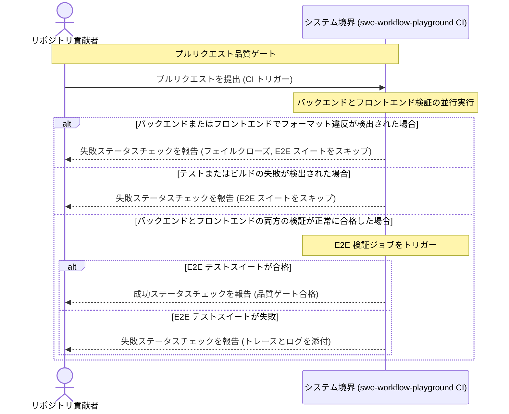
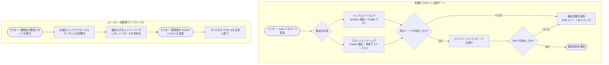

# 要件定義書: CI およびリポジトリ自動化（CI & Repository Automation）

## 1. 背景と動機（Context & Motivation）

### 1.1 課題の説明（Problem Statement）
現在の掲示板アプリケーションには、継続的インテグレーション（CI: Continuous Integration）ワークフロー、自動化された依存関係脆弱性検査、およびセマンティックリリースの自動公開機能が存在しません。貢献者はローカルマシン上で手動でテストを実行する必要があり、回帰不具合が `main` ブランチに混入するリスクが高くなっています。さらに、フルスタックアプリケーションをローカルで起動するには、データベース、バックエンド、フロントエンドの各ディレクトリに個別に移動し、統一されたオーケストレーション機構なしにバラバラのコマンドを実行する必要があります。また、リポジトリのステータスやライセンス情報がプロジェクトドキュメント上で目立つ形で表示されていません。

加えて、バックエンド（Java、Kotlin DSL）およびフロントエンド（TypeScript、HTML、SCSS、JSON）のコードベース全体で自動化されたコードスタイル強制およびフォーマット品質ゲートが導入されていないため、コードフォーマットの不一致やレビュー時のスタイル議論による摩擦が発生しています。さらに、バックエンドの依存関係の座標やバージョンがビルドスクリプト全体にハードコードされて集中管理されておらず、プルリクエストに対する明確なリポジトリオーナーシップ設定に基づくデフォルトレビュアー割り当てルールも欠如しています。

### 1.2 ビジネス目標および技術目標（Business & Technical Goals）
- **自動化された品質ゲート**: プルリクエスト（PR: Pull Request）および正規ブランチへのプッシュにおいて、単体テスト、契約テスト、本番ビルド、およびブラウザによるエンドツーエンド（E2E: End-to-End）テストがマージ前に自動的に合格することを保証する。
- **自動化されたコードスタイル強制**: バックエンドの Java ソース（Palantir Java Format、4スペースインデント）、Kotlin Gradle スクリプト（ktlint）、およびフロントエンドコードベース（Prettier）全体で一貫したフォーマットを保証し、フォーマット違反時には直ちに CI を失敗させる。
- **中央集権的な依存関係管理**: 標準の Gradle Version Catalog（`libs.versions.toml`）を使用して、バックエンドのビルドプラグインおよび外部ライブラリ依存関係を一元化する。
- **明示的なリポジトリガバナンスとレビュー責任**: リポジトリ全体を網羅する正規の `CODEOWNERS` マッピングを確立し、`@green-tea-stalk` に割り当てることでコードレビューの責任体制を強制する。
- **効率的なリソース利用**: バックエンドとフロントエンドの検証を並列実行し、両方の先行検証スイートが正常に合格した場合にのみ E2E ブラウザテストを実行する。
- **自動化されたライフサイクル保守**: サポートされているすべてのエコシステム（Gradle、npm、GitHub Actions、Docker）にわたる依存関係の更新と脆弱性を週次ペースで継続的に追跡・更新する。
- **摩擦のない開発者体験**: データベースの永続化コンテナを起動し、ライブホットリロード（HMR: Hot Module Replacement）およびクリーンなプロセス終了機能を備えたバックエンドとフロントエンドを並行実行する単一の一括開発起動コマンドと、ワンコマンドのフォーマット自動修正コマンドを提供する。
- **透明性の高いプロジェクトガバナンス**: リリース自動化によってセマンティックバージョニング（SemVer: Semantic Versioning）および変更履歴（Changelog）の公開を自動化し、正規の MIT ライセンスとともに標準化された順序でステータスバッジをドキュメントに表示する。

### 1.3 対象者・アクター（Target Personas & Stakeholders）
- **リポジトリ貢献者 / 開発者（Repository Contributor / Developer）**: プルリクエストを通じて変更を提出し、迅速な自動 CI フィードバック（フォーマット検証およびテスト検証を含む）を期待し、単一コマンドでのローカル開発およびフォーマットツールを必要とする。
- **メンテナー / リリースマネージャー（@green-tea-stalk）**: プロジェクトガバナンス、リリース作業、依存関係の健全性、およびリポジトリのセキュリティを統括し、リポジトリへのすべての貢献に対する指定デフォルトレビュアーを務める。
- **外部訪問者 / 利用者（External Visitor / Consumer）**: リポジトリドキュメントを通じて、プロジェクトの品質、リリースバージョン、CI の健全性、およびライセンス条項を評価する。
- **自動化サービス（GitHub Actions & Dependabot）**: リポジトリの Webhook および API と連携して、検証の実行、依存関係更新 PR の提出、およびリリースの公開を行う。

---

## 2. ユーザーシナリオとユースケース（User Scenarios & Use Cases）

### 2.1 ユースケース 1: 自動継続的インテグレーション検証（Automated Continuous Integration Verification）
- **アクター**: リポジトリ貢献者
- **事前条件**: 貢献者が `main` ブランチにコミットをプッシュするか、`main` を対象とするプルリクエストを開く。
- **トリガー**: GitHub の Webhook が `push` または `pull_request` イベントを配信する。
- **基本フロー（Basic Flow）**:
  1. システムは、バックエンド検証（フォーマット検証、コンパイル、単体テスト、および結合テスト）とフロントエンド検証（フォーマット検証、単体テスト、および本番ビルド）を並行して開始する。
  2. バックエンドとフロントエンドの両方の検証ジョブがエラーなし（正常終了）で完了する。
  3. システムは、エンドツーエンド（E2E）検証ジョブをトリガーする。
  4. E2E ジョブは、永続化サービスを初期化し、バックエンドおよびフロントエンドのアプリケーションサーバーを起動し、ブラウザによる E2E テストを実行する。
  5. すべての E2E シナリオが成功し、システムはプルリクエストに合格ステータスチェックを報告する。
- **代替フロー（Alternative Flows）**: なし。
- **例外フロー（Exception Flows）**:
  - *バックエンドまたはフロントエンドの失敗*: いずれかの検証（フォーマットチェック、テスト、またはビルドを含む）が失敗した場合、システムは該当ジョブを即座に失敗とマークし、E2E 検証ジョブをスキップ（バイパス）して、プルリクエスト全体のチェックを失敗とマークする。
  - *E2E テストの失敗*: いずれかの E2E シナリオが失敗した場合、システムは診断トレースと失敗スクリーンショットを取得し、E2E チェックを失敗とマークして、プルリクエストに失敗を報告する。
- **事後条件**: プルリクエストに明確な成功（緑）または失敗（赤）の検証ステータスが表示される。

### 2.2 ユースケース 2: ローカル一括開発起動（Consolidated Local Development Startup）
- **アクター**: 開発者
- **事前条件**: ローカルホストにコンテナランタイムおよび開発ランタイムがインストールされていること。
- **トリガー**: 開発者がリポジトリルートから一括開発起動コマンドを実行する。
- **基本フロー（Basic Flow）**:
  1. 開発者がルート開発実行コマンドを発行する。
  2. システムは、データベース永続化サービスがまだ稼働していない場合、バックグラウンドで起動する。
  3. システムは、ホスト上でバックエンドおよびフロントエンドのアプリケーションサーバーを並行して起動する。
  4. システムは、両サービスからの色分けされたプレフィックス付きログ出力をターミナルに集約ストリーミングする。
  5. フロントエンドおよびバックエンドは、ライブホットリロードによってソースコードの編集内容を即座に反映する。
- **代替フロー（Alternative Flows）**:
  - *ロケール選択*: 開発者がコマンドバリエーションを実行して、日本語または英語のフロントエンド開発構成を明示的に指定する。
- **例外フロー（Exception Flows）**:
  - *中断シグナル*: 開発者が中断シグナル（`SIGINT` / Ctrl+C）を送信した場合、システムは孤立した子プロセスを残すことなく、並行して実行されているすべてのサービスプロセスを正常に終了する。
- **事後条件**: 開発環境がアクティブなホットリロードとともに完全に稼働するか、または終了時に正常に停止する。

### 2.3 ユースケース 3: 自動依存関係保守（Automated Dependency Maintenance）
- **アクター**: メンテナー / 自動化サービス
- **事前条件**: リポジトリにサポートされているすべてのエコシステムの構成済み依存関係マニフェストファイルが存在すること。
- **トリガー**: 毎週月曜日の定期スケジュールタイマーが作動する。
- **基本フロー（Basic Flow）**:
  1. システムは、バックエンド、フロントエンド、ワークフロー、およびコンテナのエコシステム全体の依存関係を検査する。
  2. システムは、利用可能なバージョンアップデートまたはセキュリティ脆弱性を検出する。
  3. システムは、古くなった依存関係ごとに、リリースノートと自動アップグレードコミットを含む個別のプルリクエストを作成する。
- **代替フロー（Alternative Flows）**:
  - *更新なし*: すべての依存関係が最新である場合、プルリクエストは作成されない。
- **例外フロー（Exception Flows）**: なし。
- **事後条件**: 古くなった依存関係に対して、メンテナーのレビューを待つ実用的なプルリクエストが存在する。

### 2.4 ユースケース 4: 自動セマンティックリリース公開（Automated Semantic Release Publishing）
- **アクター**: メンテナー / リポジトリ貢献者
- **事前条件**: Conventional Commits 1.0.0 形式に準拠したコミットが `main` ブランチにマージされること。
- **トリガー**: `main` ブランチへの Git プッシュ。
- **基本フロー（Basic Flow）**:
  1. システムは、前回のリリース以降の `main` 上のコミット履歴を検査する。
  2. システムは、コミットタイプ（例: `feat`、`fix`、`feat!`）に基づいて次のセマンティックバージョン番号を計算する。
  3. システムは、更新されたバージョン番号と集約された変更履歴を含むリリースプルリクエストを作成または更新する。
  4. メンテナーがリリースプルリクエストをマージすると、システムはリリースにタグを付け、公式の GitHub Release アセットを公開する。
- **代替フロー（Alternative Flows）**:
  - *バージョン非対象コミット*: 受信したコミットがバージョンインクリメントをトリガーしない場合、システムはリリースタグを作成せずに変更履歴ノートを同期する。
- **例外フロー（Exception Flows）**: なし。
- **事後条件**: 公式リリースとリリースノートがコードベースと足並みを揃えて体系的に公開される。

### 2.5 ユースケース 5: ローカルコードフォーマットの強制（Local Code Formatting Enforcement）
- **アクター**: 開発者
- **事前条件**: 開発者がバックエンドまたはフロントエンドのモジュールでコードを作成または変更したこと。
- **トリガー**: 開発者がコミット前にローカルフォーマットコマンドを実行する。
- **基本フロー（Basic Flow）**:
  1. 開発者がバックエンドのフォーマット修正コマンドをトリガーする。システムは Java コードを Palantir Java Format（4スペース）で整形し、Gradle Kotlin スクリプトを ktlint で整形する。
  2. 開発者がフロントエンドのフォーマット修正コマンドをトリガーする。システムは Prettier を介して TypeScript、HTML、SCSS、CSS、および JSON ファイルを整形する。
  3. すべてのソースコードがその場で均一にフォーマットされる。
- **代替フロー（Alternative Flows）**:
  - *フォーマット検証チェック*: 開発者がフォーマット検証コマンドを実行する。システムはスタイルの不一致を出力し、違反が存在する場合は非ゼロのステータスで終了する。
- **例外フロー（Exception Flows）**: なし。
- **事後条件**: 変更されたソースファイルがプロジェクトのスタイルガイドラインに完全に準拠する。

### 2.6 ユースケース 6: リポジトリオーナーシップによるレビュー自動割り当て（Repository Ownership Review Routing）
- **アクター**: リポジトリ貢献者
- **事前条件**: リポジトリ内の任意のブランチを対象とするプルリクエストが作成されること。
- **トリガー**: GitHub 上のプルリクエスト作成イベント。
- **基本フロー（Basic Flow）**:
  1. 貢献者が GitHub 上でプルリクエストを開く。
  2. システムは、正規のリポジトリオーナーシップ定義を読み取る。
  3. システムは、`@green-tea-stalk` に自動的にレビューをリクエストする。
- **代替フロー（Alternative Flows）**: なし。
- **例外フロー（Exception Flows）**: なし。
- **事後条件**: プルリクエストのコードレビュー担当者として `@green-tea-stalk` が割り当てられる。

---

## 3. 視覚的モデリング（Visual Modeling）

### 3.1 インタラクションシーケンス: フォーマット検証を含む継続的インテグレーション品質ゲート

### 3.2 アクティビティフロー: CI 品質ゲートと開発者ワークフロー

---

## 4. 機能要件（Functional Requirements）

すべての機能要件は、標準の EARS パターンと大文字の RFC 2119 / RFC 8174 キーワード（MUST, MUST NOT, SHOULD, MAY）の日本語対訳を用いて定義されています。

| 要件 ID | EARS パターン種別 | 仕様ステートメント（RFC 2119 / 8174 対訳） | 検証方法 |
| :--- | :--- | :--- | :--- |
| **REQ-001** | Event-driven | コードが `main` ブランチにプッシュされた時、または `main` を対象とするプルリクエストが作成・更新された時、システムはバックエンドおよびフロントエンドの自動検証スイートを並行して実行しなければならない（MUST）。 | CI 自動テスト |
| **REQ-002** | Complex | 継続的インテグレーションワークフローの実行中において、バックエンドおよびフロントエンドの両方の検証スイートが正常に完了した時、システムは稼働中のアプリケーションサービスに対してブラウザによるエンドツーエンド検証スイートを実行しなければならない（MUST）。 | CI 自動テスト |
| **REQ-003** | Unwanted Behavior | バックエンド検証スイートまたはフロントエンド検証スイートのいずれかが失敗した場合、システムはブラウザによるエンドツーエンド検証スイートの実行をスキップ（バイパス）しなければならず（MUST）、エンドツーエンドテストのために実行リソースを消費してはならない（MUST NOT）。 | CI 自動テスト |
| **REQ-004** | Event-driven | 毎週月曜日の定期メンテナンスタイマーが作動した時、システムはバックエンド（Gradle）、フロントエンド（npm）、ワークフロー（GitHub Actions）、およびコンテナ（Docker）のエコシステム全体の依存関係を検査し、古くなったパッケージや脆弱性のあるパッケージに対する更新プルリクエストを生成しなければならない（MUST）。 | ワークフロー自動テスト |
| **REQ-005** | Event-driven | Conventional Commits 形式に準拠したコミットが `main` ブランチにマージされた時、システムはセマンティックバージョンの増分を計算し、集約されたリリースドキュメントを含むオープンなリリースプルリクエストを維持しなければならない（MUST）。 | ワークフロー自動テスト |
| **REQ-006** | Event-driven | リリースプルリクエストが `main` ブランチにマージされた時、システムは Git リリースタグを作成し、公式の GitHub Release アセットを公開しなければならない（MUST）。 | ワークフロー自動テスト |
| **REQ-007** | Ubiquitous | システムは、データベースの永続化コンテナを起動し、ライブホットリロードを有効にした状態でバックエンドおよびフロントエンドのアプリケーションサーバーを並行して実行する、一括ルート開発コマンドを提供しなければならない（MUST）。 | 手動およびスクリプト検証 |
| **REQ-008** | Optional Feature | 開発者がロケール固有のローカル開発を要求する場合、システムは日本語または英語のフロントエンド開発構成を対象とする明示的なコマンドバリアントをサポートしてもよい（MAY）。 | 手動およびスクリプト検証 |
| **REQ-009** | Unwanted Behavior | 一括ローカル開発の実行中に中断シグナル（`SIGINT`）を受信した場合、システムはすべての子プロセスを同時に終了しなければならず（MUST）、孤立したバックグラウンドプロセスを実行したまま残してはならない（MUST NOT）。 | プロセス自動テスト |
| **REQ-010** | Ubiquitous | システムは、プロジェクトドキュメントにおいて、（1）最新リリース、（2）CI ステータス、（3）release-please ステータス、（4）Dependabot ステータス、（5）ソフトウェアライセンス、という厳密に指定された順序で検証済みステータスバッジを表示しなければならない（MUST）。 | ドキュメント検査 |
| **REQ-011** | Ubiquitous | システムは、リポジトリルートに配置された正規の MIT ソフトウェアライセンスファイルを提供しなければならない（MUST）。 | ファイル存在検査 |
| **REQ-012** | Ubiquitous | システムは、Spotless を用いて、Java ソースファイルには Palantir Java Format（4スペースインデント）、Kotlin Gradle ビルドスクリプトファイルには ktlint を適用し、バックエンドのコードスタイルフォーマットを強制しなければならない（MUST）。 | 自動リンターテスト |
| **REQ-013** | Ubiquitous | システムは、TypeScript、HTML、CSS/SCSS、および JSON ファイルを対象に設定された Prettier を用いて、フロントエンドのコードスタイルフォーマットを強制しなければならない（MUST）。 | 自動リンターテスト |
| **REQ-014** | Ubiquitous | システムは、リポジトリの全パス（`*`）に対するデフォルトのコードレビュー責任を `@green-tea-stalk` に割り当てる正規のコードオーナーシップ設定を `.github/CODEOWNERS` に保持しなければならない（MUST）。 | 設定ファイル検査 |
| **REQ-015** | Ubiquitous | システムは、バックエンドのビルドプラグインおよび外部ライブラリ依存関係の座標とバージョンを定義する中央集権的な Gradle Version Catalog を `backend/gradle/libs.versions.toml` に保持しなければならない（MUST）。 | ビルドスクリプト検査 |
| **REQ-016** | Unwanted Behavior | 自動 CI 検証中にいずれかのバックエンドまたはフロントエンドのソースファイルがコードフォーマット制約を満たさない場合、システムは該当する検証ジョブを非ゼロの終了コードで失敗させなければならず（MUST）、プルリクエストのチェック合格を許可してはならない（MUST NOT）。 | CI 自動テスト |

---

## 5. 非機能要件（Non-Functional Requirements）

- **NFR-PERF-001 (並行性)**: CI ワークフローは、パイプライン全体の所要時間を最小化するために、バックエンドとフロントエンドの検証タスクを個別の並行ランナージョブに分岐しなければならない（MUST）。
- **NFR-SEC-001 (最小権限の原則)**: 自動化されたワークフローは最小権限の原則の下で動作しなければならず（MUST）、リリースを生成するかプルリクエストの状態を更新するジョブにのみ書き込み権限を付与しなければならない。
- **NFR-REL-001 (フェイルクローズ品質ゲート)**: CI パイプラインはフェイルクローズでなければならない（MUST）。コンパイル、フォーマット検証、リント、単体テスト、結合テスト、または E2E テストのいずれかで失敗した場合、非ゼロの終了ステータスとなり、プルリクエストのマージ承認をブロックしなければならない。
- **NFR-COMP-001 (クロスプラットフォーム開発)**: 一括ローカル開発スクリプトは、Node.js 22 LTS および Docker を実行するサポート対象の開発者プラットフォーム（macOS、Linux）間で同一に機能しなければならない（MUST）。
- **NFR-MAINT-001 (ドキュメントの一貫性)**: ステータスバッジおよびローカル実行手順は、英語版（`README.md`）および日本語版（`README.ja.md`）のドキュメントファイル間で一貫して維持されなければならない（MUST）。
- **NFR-STYLE-001 (決定論的フォーマット)**: フォーマットツール（Palantir Java Format を適用した Spotless および Prettier）は、環境間で再現不可能なスタイルのばらつきを一切生じさせることなく、決定論的なコードレイアウトを生成しなければならない（MUST）。

---

## 6. スコープ外（Out of Scope）

以下の項目は、本仕様の範囲から明示的に除外されています：
- 外部の本番クラウドプラットフォーム（AWS、GCP、Azure、Kubernetes など）への継続的デプロイ（CD: Continuous Deployment）パイプライン。
- スタンドアロンのネイティブデスクトップまたはモバイルアプリケーションのパッケージング。
- マルチコンテナ本番デプロイメントのオーケストレーション（本番用 Docker Compose スタックや Helm チャートなど）。
- 実行プラットフォーム環境のランタイムバージョン（Java 25 LTS、MySQL 8.4 LTS、Node.js 22 LTS）の Gradle Version Catalog による管理（バージョンカタログの責務は Gradle ビルドプラグインおよびライブラリ依存関係に厳格に限定される）。
- ディレクトリごとまたはパスごとの細分化された CODEOWNERS ルーティング（コードレビューの責任はリポジトリ全体で管理される）。
