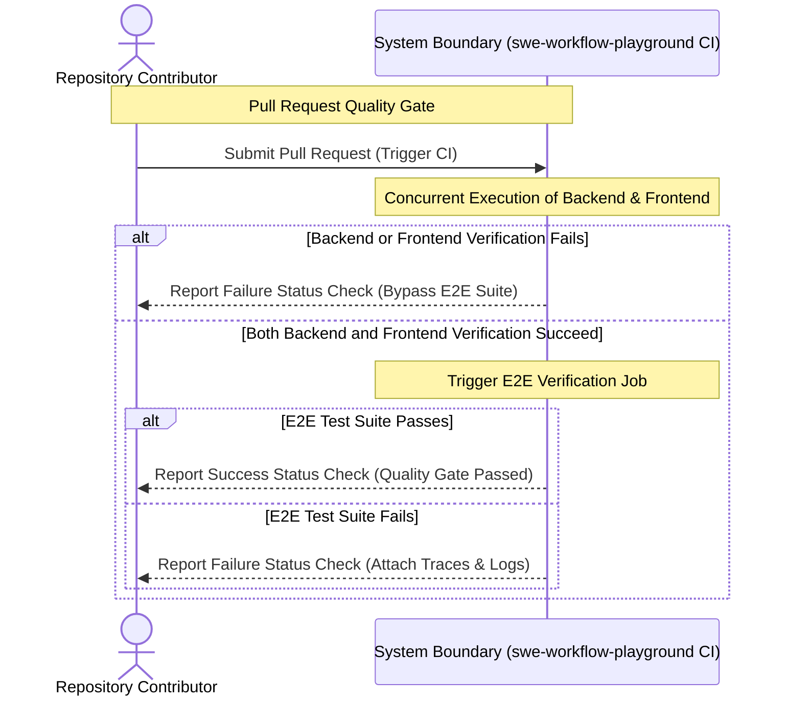

# Requirements Specification: CI & Repository Automation

## 1. Context & Motivation

### 1.1 Problem Statement
The bulletin board application currently lacks continuous integration workflows, automated dependency vulnerability checking, and semantic release publishing. Contributors must execute tests manually on local machines, increasing the risk of regressions entering the main branch. Furthermore, running the full-stack application locally requires navigating into separate directories and executing disjoint commands across database, backend, and frontend environments without a unified orchestration mechanism. In addition, repository status and licensing are not prominently visible in project documentation.

### 1.2 Business & Technical Goals
- **Automated Quality Gates**: Ensure every pull request and push to the canonical branch passes unit tests, contract tests, production builds, and end-to-end browser tests automatically before merge.
- **Efficient Resource Usage**: Execute backend and frontend verification in parallel, and run end-to-end browser tests only when both upstream verification suites pass cleanly.
- **Automated Lifecycle Maintenance**: Continuously track and update dependencies across all supported ecosystems (Gradle, npm, GitHub Actions, Docker) on a weekly cadence.
- **Frictionless Developer Experience**: Provide a single, consolidated root development command that boots database persistence and runs backend and frontend services with live hot-reloading and clean termination.
- **Transparent Project Governance**: Automate semantic versioning and changelog publishing via release automation, and display status badges in documentation in a standardized order alongside a canonical MIT license.

### 1.3 Target Personas & Stakeholders
- **Repository Contributor / Developer**: Submits changes via pull requests, expects prompt automated CI feedback, and requires a single-command local development setup.
- **Maintainer / Release Manager**: Oversees project governance, releases, dependency hygiene, and repository security.
- **External Visitor / Consumer**: Evaluates project quality, release version, CI health, and licensing terms via repository documentation.
- **Automation Service (GitHub Actions & Dependabot)**: Interacts with repository webhooks and APIs to execute verification, submit dependency updates, and publish releases.

---

## 2. User Scenarios & Use Cases

### 2.1 Use Case 1: Automated Continuous Integration Verification
- **Actor**: Repository Contributor
- **Preconditions**: Contributor pushes commits to the `main` branch or opens a pull request targeting `main`.
- **Trigger**: GitHub webhook delivers `push` or `pull_request` event.
- **Basic Flow**:
  1. System initiates backend verification (compilation, unit tests, and integration tests) and frontend verification (unit tests and production build) concurrently.
  2. Both backend and frontend verification jobs complete with zero errors.
  3. System triggers the end-to-end (E2E) verification job.
  4. E2E job initializes persistence services, launches backend and frontend application servers, and executes browser-driven end-to-end tests.
  5. All E2E scenarios succeed, and the system reports a passing status check to the pull request.
- **Alternative Flows**: None.
- **Exception Flows**:
  - *Backend or Frontend Failure*: If either backend or frontend verification fails, the system immediately marks the respective job as failed, bypasses the E2E verification job, and marks the overall pull request check as failed.
  - *E2E Test Failure*: If any end-to-end scenario fails, the system captures diagnostic traces and failure screenshots, marks the E2E check as failed, and reports failure to the pull request.
- **Postconditions**: Pull request displays an unambiguous green or red verification status indicator.

### 2.2 Use Case 2: Consolidated Local Development Startup
- **Actor**: Developer
- **Preconditions**: Container runtime and development runtimes are installed on the local host.
- **Trigger**: Developer executes the consolidated development startup command from the repository root.
- **Basic Flow**:
  1. Developer issues the root development execution command.
  2. System launches database persistence services in the background if not already active.
  3. System launches backend and frontend application servers concurrently on the host.
  4. System streams consolidated, color-coded log output from both services to the terminal.
  5. Frontend and backend reflect source code edits immediately via live hot-reloading.
- **Alternative Flows**:
  - *Locale Selection*: Developer executes command variations to specify either Japanese or English frontend development configurations.
- **Exception Flows**:
  - *Interruption Signal*: When the developer sends an interrupt signal (`SIGINT` / Ctrl+C), the system cleanly terminates all concurrently running service processes without leaving orphaned child processes.
- **Postconditions**: Development environment is fully operational with active hot-reload or cleanly halted upon exit.

### 2.3 Use Case 3: Automated Dependency Maintenance
- **Actor**: Maintainer / Automation Service
- **Preconditions**: Repository contains configured dependency manifest files across all supported ecosystems.
- **Trigger**: Scheduled weekly timer fires on Monday.
- **Basic Flow**:
  1. System inspects dependencies across backend, frontend, workflow, and container ecosystems.
  2. System detects any available version updates or security vulnerabilities.
  3. System opens individual pull requests containing release notes and automated upgrade commits for each outdated dependency.
- **Alternative Flows**:
  - *No Updates*: If all dependencies are up to date, no pull requests are opened.
- **Exception Flows**: None.
- **Postconditions**: Outdated dependencies have actionable pull requests awaiting maintainer review.

### 2.4 Use Case 4: Automated Semantic Release Publishing
- **Actor**: Maintainer / Repository Contributor
- **Preconditions**: Commits adhering to Conventional Commits 1.0.0 format are merged into the `main` branch.
- **Trigger**: Git push to `main` branch.
- **Basic Flow**:
  1. System inspects commit history on `main` since the previous release.
  2. System computes the next semantic version number based on commit types (e.g. `feat`, `fix`, `feat!`).
  3. System creates or updates a release pull request containing updated version numbers and an aggregated changelog.
  4. When a maintainer merges the release pull request, the system tags the release and publishes an official GitHub Release asset.
- **Alternative Flows**:
  - *Non-versioned commits*: If incoming commits do not trigger a version increment, system synchronizes changelog notes without creating a release tag.
- **Exception Flows**: None.
- **Postconditions**: Official releases and release notes are systematically published in lockstep with the codebase.

---

## 3. Visual Modeling

### 3.1 Interaction Sequence: Continuous Integration Quality Gate

### 3.2 Activity Flow: CI Quality Gate & Local Development Lifecycle

```mermaid
flowchart TD
    subgraph CI_Pipeline["Automated CI Quality Gate"]
        TriggerCI([Trigger: Code Change on main]) --> ForkCI{Fork Verification}
        ForkCI --> VerifyBackend["Execute Backend Verification Suite"]
        ForkCI --> VerifyFrontend["Execute Frontend Verification Suite"]
        VerifyBackend --> JoinCI{Both Suites Succeeded?}
        VerifyFrontend --> JoinCI
        JoinCI -- No --> FailCI["Report Verification Failure<br>(Bypass E2E Suite)"]
        JoinCI -- Yes --> RunE2E["Execute End-to-End Suite"]
        RunE2E --> CheckE2E{E2E Succeeded?}
        CheckE2E -- Yes --> PassCI([Report Verification Success])
        CheckE2E -- No --> FailCI
    end

    subgraph Dev_Lifecycle["Consolidated Local Development Lifecycle"]
        DevStart([Actor: Developer Issues Dev Command]) --> InitEnv["Initialize Persistence & Service Runtime"]
        InitEnv --> StreamLogs["Stream Consolidated Logs & Enable Hot-Reload"]
        StreamLogs --> DevInterrupt([Actor: Developer Issues SIGINT / Ctrl+C])
        DevInterrupt --> TerminateClean["Terminate All Child Processes Gracefully"]
    end
```

---

## 4. Functional Requirements

All functional requirements are defined using standard EARS patterns and uppercase RFC 2119 / RFC 8174 keywords.

| Requirement ID | EARS Pattern Type | Specification Statement (RFC 2119 / 8174) | Verification Method |
| :--- | :--- | :--- | :--- |
| **REQ-001** | Event-driven | When code is pushed to the `main` branch or a pull request targeting `main` is created or updated, the system MUST execute backend and frontend automated verification suites concurrently. | CI Automated Test |
| **REQ-002** | Complex | While a continuous integration workflow run is in progress, when both backend and frontend verification suites complete successfully, the system MUST execute the end-to-end browser verification suite against live application services. | CI Automated Test |
| **REQ-003** | Unwanted Behavior | If either the backend verification suite or the frontend verification suite fails, then the system MUST bypass execution of the end-to-end browser verification suite and MUST NOT consume execution resources for end-to-end testing. | CI Automated Test |
| **REQ-004** | Event-driven | When a scheduled weekly maintenance timer triggers on Monday, the system MUST inspect dependencies across backend (Gradle), frontend (npm), workflow (GitHub Actions), and container (Docker) ecosystems, and generate update pull requests for outdated or vulnerable packages. | Automated Workflow Test |
| **REQ-005** | Event-driven | When commits adhering to Conventional Commits format are merged into the `main` branch, the system MUST calculate semantic version increments and maintain an open release pull request with aggregated release documentation. | Automated Workflow Test |
| **REQ-006** | Event-driven | When a release pull request is merged into the `main` branch, the system MUST create a Git release tag and publish an official GitHub Release asset. | Automated Workflow Test |
| **REQ-007** | Ubiquitous | The system MUST provide a consolidated root development command that starts database persistence and concurrently runs backend and frontend application servers with live hot-reloading enabled. | Manual & Script Verification |
| **REQ-008** | Optional Feature | Where a developer requests locale-specific local development, the system MAY support explicit command variants targeting Japanese or English frontend development configurations. | Manual & Script Verification |
| **REQ-009** | Unwanted Behavior | If an interruption signal (`SIGINT`) is received during consolidated local development execution, then the system MUST terminate all child processes concurrently and MUST NOT leave orphaned background processes running. | Automated Process Test |
| **REQ-010** | Ubiquitous | The system MUST display verified status badges in project documentation in the exact specified order: (1) Latest Release, (2) CI Status, (3) release-please Status, (4) Dependabot Status, and (5) Software License. | Documentation Inspection |
| **REQ-011** | Ubiquitous | The system MUST provide a canonical MIT software license file located at the repository root. | File Existence Inspection |

---

## 5. Non-Functional Requirements

- **NFR-PERF-001 (Concurrency)**: The CI workflow MUST fork backend and frontend verification tasks into distinct concurrent runner jobs to minimize overall pipeline wall-clock execution time.
- **NFR-SEC-001 (Least Privilege)**: Automated workflows MUST operate under the principle of least privilege, granting write permissions exclusively to jobs that generate releases or update pull request state.
- **NFR-REL-001 (Fail-Closed Quality Gate)**: The CI pipeline MUST fail-closed: any failure in compilation, linting, unit tests, integration tests, or end-to-end tests MUST result in a non-zero exit status and block pull request merge approval.
- **NFR-COMP-001 (Cross-Platform Development)**: The consolidated local development scripts MUST function identically across supported developer platforms (macOS, Linux) running Node.js 22 LTS and Docker.
- **NFR-MAINT-001 (Documentation Consistency)**: Status badges and local execution instructions MUST be maintained consistently across English (`README.md`) and Japanese (`README.ja.md`) documentation files.

---

## 6. Out of Scope

The following items are explicitly excluded from this specification:
- Continuous deployment (CD) pipelines to external production cloud platforms (e.g. AWS, GCP, Azure, or Kubernetes).
- Standalone native desktop or mobile application packaging.
- Multi-container production deployment orchestration (e.g. production Docker Compose stack or Helm charts).
