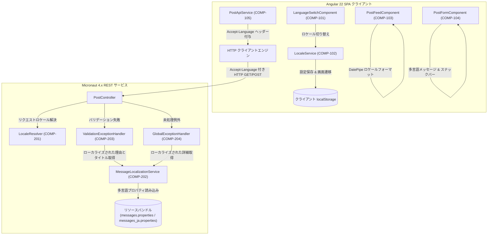
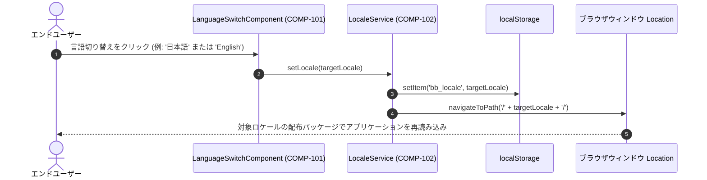
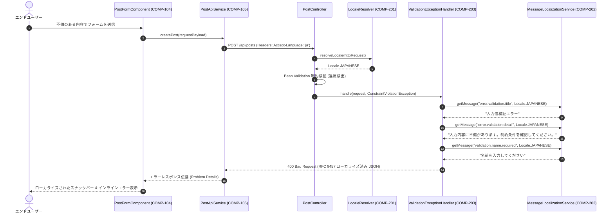

# アーキテクチャおよびコンポーネント設計書: 国際化対応（i18n）

本文書は、掲示板アプリケーションの Angular フロントエンドおよび Micronaut バックエンドにおける国際化（i18n: Internationalization）対応のソフトウェアアーキテクチャ、コンポーネント契約（DbC: Design by Contract）、データモデル、およびプロトコルを規定します。

---

## 1. コンポーネント境界とスコープ概要（Component Boundaries & Scope Overview）

### 1.1 アーキテクチャおよびコンポーネントマップ（Architecture & Component Map）
国際化アーキテクチャは、クライアント側のロケール検出および UI バンドルナビゲーションと、サーバー側の `Accept-Language` HTTP コンテンツネゴシエーションを連携させます。フロントエンドは Angular 公式の `@angular/localize` による事前（AOT: Ahead-of-Time）コンパイル済み配布パッケージ（`/en/` および `/ja/`）を利用し、バックエンドはクライアントの言語設定をローカライズされたリソースバンドルに対して動的に評価して RFC 9457 Problem Details エンベロープを生成します。



### 1.2 コンポーネント一覧（Component Inventory）

| コンポーネント ID | コンポーネント / モジュール | スコープ / 境界 | 関連要件 | 説明 |
| :--- | :--- | :--- | :--- | :--- |
| **COMP-101** | `LanguageSwitchComponent` | フロントエンド ツールバー UI | `REQ-001`, `REQ-003` | プライマリツールバー内にボタン切り替えまたはメニューを表示し、ユーザーが英語（`EN`）または日本語（`JA`）を明示的に選択できるようにする。 |
| **COMP-102** | `LocaleService` | フロントエンド コアサービス | `REQ-002`, `REQ-004`, `REQ-005`, `REQ-006` | アクティブなロケール状態を管理し、`localStorage` または `navigator.language` から初期ロケールを解決し、`/en/` または `/ja/` への URL 画面遷移を処理する。 |
| **COMP-103** | `PostFeedComponent` | フロントエンド フィードビュー | `REQ-001`, `REQ-006`, `REQ-007`, `REQ-011` | ローカライズされた空フィード表示、ローカライズされた再試行エラーバナー、およびロケール対応の `DatePipe` 投稿日時（`yyyy/MM/dd HH:mm:ss` vs `MMM d, y, h:mm:ss a`）を含むフィードリストを表示する。 |
| **COMP-104** | `PostFormComponent` | フロントエンド フォームビュー | `REQ-001`, `REQ-008`, `REQ-011` | ローカライズされた翻訳 ID を使用して、フォームコントロール、インラインバリデーションエラー、アクションボタン、および操作スナックバーを描画する。 |
| **COMP-105** | `PostApiService` | フロントエンド データアダプター | `REQ-009` | 送信するすべての REST API リクエストに、アクティブなロケールを `Accept-Language` HTTP ヘッダーとして付与する。 |
| **COMP-201** | `LocaleResolver` | バックエンド コアアダプター | `REQ-002`, `REQ-009`, `REQ-010` | 受信した HTTP リクエストから `Accept-Language` ヘッダーを解析し、`ja` に一致させるか、デフォルトの英語（`Locale.ENGLISH`）に設定する。 |
| **COMP-202** | `MessageLocalizationService` | バックエンド ドメインコア | `REQ-001`, `REQ-009`, `REQ-010` | Micronaut の `MessageSource` をラップし、指定された `Locale` に応じたローカライズ済みバリデーションメッセージ、問題タイトル、および詳細を解決する。 |
| **COMP-203** | `ValidationExceptionHandler` | バックエンド エラーアダプター | `REQ-008`, `REQ-009`, `REQ-010` | `ConstraintViolationException` をインターセプトし、ローカライズされたタイトル、詳細、およびパラメータ理由を含む RFC 9457 Problem Details を生成する。 |
| **COMP-204** | `GlobalExceptionHandler` | バックエンド エラーアダプター | `REQ-008`, `REQ-009`, `REQ-010` | 未処理の `Throwable` をインターセプトし、ローカライズされた 500 Internal Server Error の Problem Details エンベロープを生成する。 |

---

## 2. 相互作用モデリング（Interaction Modeling）

### 2.1 ロケール選択および画面遷移フロー（Locale Selection & Navigation Flow）



### 2.2 多言語投稿送信およびバリデーションエラーフロー（Localized Post Submission & Validation Error Flow）



---

## 3. データモデルおよびスキーマ制約（Data Models & Schema Constraints）

### 3.1 `LocalePreferenceModel`（クライアントストレージペイロード）
- **対象**: ブラウザ `localStorage` キー `bb_locale`
- **形式**: プレーン文字列トークン

| フィールド名 | 型 | 必須 / 任意 | 制約条件 | 説明 |
| :--- | :--- | :--- | :--- | :--- |
| `bb_locale` | `string` | 任意 | `enum: ["en", "ja"]` | 永続化されたクライアント言語選択値。 |

### 3.2 `ProblemDetailsModel`（RFC 9457 HTTP エラーレスポンス）
- **形式**: JSON Schema / `application/problem+json`

| フィールド名 | 型 | 必須 / 任意 | 制約条件 | 説明 |
| :--- | :--- | :--- | :--- | :--- |
| `type` | `string` | 必須 | `format: "uri"` | 問題タイプを識別する絶対 URI。 |
| `title` | `string` | 必須 | `minLength: 1` | 対象ロケールでローカライズされた簡潔な概要説明。 |
| `status` | `integer` | 必須 | `minimum: 400`, `maximum: 599` | HTTP ステータスコード。 |
| `detail` | `string` | 必須 | `minLength: 1` | 対象ロケールでローカライズされた詳細な説明文。 |
| `instance` | `string` | 必須 | `minLength: 1` | 対象リソースエンドポイントの URI 参照。 |
| `invalid_params` | `array<object>` | 必須 | `minItems: 0（空時は厳密に [] を保証）` | 不正なパラメータのリスト（省略または null は不可）。 |
| `invalid_params[].name` | `string` | 必須 | `minLength: 1` | 制約に違反したフィールド名またはプロパティパス。 |
| `invalid_params[].reason`| `string` | 必須 | `minLength: 1` | ローカライズされた制約違反の理由説明。 |

### 3.3 メッセージリソースバンドルのキー階層（Message Resource Bundle Key Hierarchy）
バックエンドおよびフロントエンドは、英語と日本語のリソースファイル間で同一の意味的プロパティキーを標準化します。

| メッセージキー | 英語テキスト（`messages.properties` / XLIFF） | 日本語テキスト（`messages_ja.properties` / XLIFF） |
| :--- | :--- | :--- |
| `error.validation.title` | Validation Failed | 入力値検証エラー |
| `error.validation.detail` | Input payload failed validation constraints. | 入力内容に不備があります。制約条件を確認してください。 |
| `error.internal.title` | Internal Server Error | サーバー内部エラー |
| `error.internal.detail` | An unexpected error occurred while processing the request. | リクエストの処理中に予期せぬエラーが発生しました。 |
| `error.invalid_arg.title`| Invalid Argument | 不正な引数 |
| `validation.name.required` | Name must not be blank | 名前を入力してください |
| `validation.name.size` | Name must be between 1 and 50 characters | 名前は1〜50文字以内で入力してください |
| `validation.email.format` | Email must be a well-formed email address | 有効なメールアドレス形式で入力してください |
| `validation.email.size` | Email must not exceed 254 characters | メールアドレスは254文字以内で入力してください |
| `validation.title.required`| Title must not be blank | タイトルを入力してください |
| `validation.title.size` | Title must be between 1 and 100 characters | タイトルは1〜100文字以内で入力してください |
| `validation.message.required`| Message must not be blank | メッセージ本文を入力してください |
| `validation.message.size` | Message must be between 1 and 4000 characters | メッセージ本文は1〜4,000文字以内で入力してください |

---

## 4. 入力 / 出力プロトコル（Input / Output Protocols）

### 4.1 HTTP コンテンツネゴシエーションプロトコル（HTTP Content Negotiation Protocol）
- **リクエストヘッダー（`Accept-Language`）**:
  - `PostApiService`（COMP-105）により、すべての HTTP 操作（`GET /api/posts`, `POST /api/posts`）で送信される。
  - 例: `Accept-Language: ja`, `Accept-Language: en`, `Accept-Language: ja,en-US;q=0.9,en;q=0.8`。
- **レスポンスヘッダー（`Content-Language`）**:
  - 解決されたロケールに一致する多言語レスポンスにおいて返却される（`Content-Language: ja` または `Content-Language: en`）。
- **ロケール解決戦略（Resolution Strategy）**:
  1. `Accept-Language` ヘッダー内のプライマリタグを検査する。
  2. タグが `ja` で始まる場合、`Locale.JAPANESE` に解決する。
  3. タグが `en` で始まる場合、`Locale.ENGLISH` に解決する。
  4. ヘッダーが存在しない場合、ワイルドカード（`*`）、またはサポート外の言語の場合、正規のデフォルトである `Locale.ENGLISH` に解決する。

### 4.2 フロントエンド配布パッケージおよび Base Href プロトコル（Frontend Distribution & Base Href Protocol）
- **ビルド出力構成**:
  - 英語版配布パッケージ: `/dist/frontend/browser/en/`（Base Href: `/en/` またはリライト付き `/`）。
  - 日本語版配布パッケージ: `/dist/frontend/browser/ja/`（Base Href: `/ja/`）。
- **初期ブートストラップルーティングロジック**:
  - ルート `/` へのアクセス時、軽量ブートストラップルーターが動作する:
    - `localStorage.getItem('bb_locale') === 'ja'` の場合、`/ja/` へリダイレクトする。
    - `localStorage.getItem('bb_locale') === 'en'` の場合、`/en/` へリダイレクトする。
    - 設定が存在せず、`navigator.language.startsWith('ja')` の場合、`/ja/` へリダイレクトする。
    - それ以外の場合、`/en/` へリダイレクトする。

---

## 5. コンポーネント契約（DbC: Design by Contract - RFC 2119 / RFC 8174）

### 5.1 COMP-101: `LanguageSwitchComponent`
- **役割**: 言語選択 UI の描画および切り替えのトリガー。
- **公開シグネチャ**:
  ```typescript
  export class LanguageSwitchComponent {
    readonly currentLocale = signal<'en' | 'ja'>('en');
    switchLocale(target: 'en' | 'ja'): void;
  }
  ```
- **事前条件（Preconditions）**:
  - `target` は `'en'` または `'ja'` のいずれかでなければならない（MUST）。
- **事後条件（Postconditions）**:
  - コンポーネントは `LocaleService.setLocale(target)` を呼び出さなければならない（MUST）。
  - コンポーネントは直接 `localStorage` を変更したり、`LocaleService` を経由せずにウィンドウをリロードしてはならない（MUST NOT）。
- **不変条件（Invariants）**:
  - `currentLocale()` はアクティブなアプリケーション配布ロケールを厳格に反映しなければならない（MUST）。

### 5.2 COMP-102: `LocaleService`
- **役割**: アプリケーションロケール状態の管理、永続化、および画面遷移。
- **公開シグネチャ**:
  ```typescript
  @Injectable({ providedIn: 'root' })
  export class LocaleService {
    getActiveLocale(): 'en' | 'ja';
    getStoredLocale(): 'en' | 'ja' | null;
    resolveInitialLocale(): 'en' | 'ja';
    setLocale(locale: 'en' | 'ja'): void;
  }
  ```
- **事前条件（Preconditions）**:
  - `setLocale` の引数は `^[a-z]{2}$` に一致し、サポート対象（`'en'` または `'ja'`）でなければならない（MUST）。
- **事後条件（Postconditions）**:
  - `setLocale` は `locale` をキー `bb_locale` で `localStorage` に永続化しなければならない（MUST）。
  - `locale` が `getActiveLocale()` と異なる場合、`setLocale` はブラウザのロケーションを `'/' + locale + '/'` へ遷移させなければならない（MUST）。
  - ストレージが空または読み取り不可の場合、`resolveInitialLocale` は `navigator.language` を評価し、`ja` で始まる場合は `'ja'` を返し、それ以外は `'en'` を返さなければならない（MUST）。
- **不変条件（Invariants）**:
  - 返却されるすべてのロケールコードは非 null であり、`['en', 'ja']` に属さなければならない（MUST）。

### 5.3 COMP-103: `PostFeedComponent`
- **役割**: ロケール固有のフォーマットおよびテキストを使用して投稿カードのフィードを描画する。
- **公開シグネチャ**:
  ```typescript
  export class PostFeedComponent implements OnInit {
    readonly posts = signal<PostResponse[]>([]);
    readonly totalItems = signal<number>(0);
    readonly pageIndex = signal<number>(0);
    readonly isLoading = signal<boolean>(false);
    readonly errorMessage = signal<string | null>(null);
    loadPage(page: number): void;
    refresh(): void;
  }
  ```
- **事前条件（Preconditions）**:
  - `loadPage` の引数は非負の整数（`page >= 0`）でなければならない（MUST）。
- **事後条件（Postconditions）**:
  - 投稿日時は、日本語ロケールでは `yyyy/MM/dd HH:mm:ss`、英語ロケールでは `MMM d, y, h:mm:ss a` を使用して `DatePipe` でフォーマットされなければならない（MUST）。
  - 投稿が0件の場合、実行時エラーなしにローカライズされた空フィードプレースホルダーを描画しなければならない（MUST）。
- **不変条件（Invariants）**:
  - ユーザーの投稿内容（`name`, `title`, `message`）を変更または機械翻訳してはならない（MUST NOT）。

### 5.4 COMP-104: `PostFormComponent`
- **役割**: ローカライズされた項目ラベル、エラー、および通知を使用してユーザーの投稿入力を受け付ける。
- **公開シグネチャ**:
  ```typescript
  export class PostFormComponent {
    readonly postForm: FormGroup;
    readonly isSubmitting = signal<boolean>(false);
    readonly postCreated = new EventEmitter<PostResponse>();
    onSubmit(): void;
    resetForm(): void;
  }
  ```
- **事前条件（Preconditions）**:
  - フォームコントロールは文字長制約を遵守しなければならない（MUST）: `name`（1〜50）、`email`（254以下）、`title`（1〜100）、`message`（1〜4,000）。
- **事後条件（Postconditions）**:
  - クライアントバリデーション失敗時、タッチされた各コントロールの下にアクティブな UI ロケールでエラーテキストを表示しなければならない（MUST）。
  - RFC 9457 エラー詳細を伴う API 送信失敗時、スナックバー通知はローカライズされた `detail` メッセージを表示しなければならない（MUST）。
- **不変条件（Invariants）**:
  - `isSubmitting()` が `true` である間、フォーム送信処理は冪等性を保たなければならない（MUST）。

### 5.5 COMP-105: `PostApiService`
- **役割**: 言語設定ヘッダーを付与してバックエンドとの HTTP 通信を行う。
- **公開シグネチャ**:
  ```typescript
  @Injectable({ providedIn: 'root' })
  export class PostApiService {
    getPosts(page?: number, size?: number): Observable<PagedPostResponse>;
    createPost(request: CreatePostRequest): Observable<PostResponse>;
  }
  ```
- **事前条件（Preconditions）**:
  - リクエストの引数は既存の DTO 契約に従って有効でなければならない（MUST）。
- **事後条件（Postconditions）**:
  - すべての HTTP リクエストには、`LocaleService.getActiveLocale()` に一致する `Accept-Language: {locale}` ヘッダーを含めなければならない（MUST）。
  - RFC 9457 Problem Details エラーレスポンスを受信した場合、構造化された `HttpErrorResponse` を安全に再スローしなければならない（MUST）。
- **不変条件（Invariants）**:
  - 送信される HTTP 通信は、マルチバイト UTF-8 文字を欠落または破損させてはならない（MUST NOT）。

### 5.6 COMP-201: `LocaleResolver`
- **役割**: 受信した HTTP の `Accept-Language` ヘッダーを解析し、対象の `Locale` を解決する。
- **公開シグネチャ**:
  ```java
  public interface LocaleResolver {
      Locale resolveLocale(HttpRequest<?> request);
  }
  ```
- **事前条件（Preconditions）**:
  - `request` は null であってはならない（MUST NOT）。
- **事後条件（Postconditions）**:
  - `Accept-Language` ヘッダーが大文字小文字を区別せず `ja*` に一致する場合、`Locale.JAPANESE` を返さなければならない（MUST）。
  - `Accept-Language` ヘッダーが大文字小文字を区別せず `en*` に一致する場合、`Locale.ENGLISH` を返さなければならない（MUST）。
  - ヘッダーが存在しない、空である、または解決不能な場合、デフォルトの `Locale.ENGLISH` を返さなければならない（MUST）。
- **不変条件（Invariants）**:
  - 戻り値は決して null であってはならない（MUST NEVER）。

### 5.7 COMP-202: `MessageLocalizationService`
- **役割**: リソースバンドルからローカライズされたメッセージ文字列を取得する。
- **公開シグネチャ**:
  ```java
  public interface MessageLocalizationService {
      String getMessage(String code, Locale locale);
      String getMessage(String code, Locale locale, Object... args);
      String getMessageOrDefault(String code, Locale locale, String defaultMessage, Object... args);
  }
  ```
- **事前条件（Preconditions）**:
  - `code` は null または空白であってはならない（MUST NOT）。
  - `locale` は null であってはならない（MUST NOT）。
- **事後条件（Postconditions）**:
  - 指定された `locale` のバンドルに `code` が存在する場合、パラメータ展開済みの文字列を返さなければならない（MUST）。
  - 対象ロケールで `code` が見つからない場合、英語バンドル（`messages.properties`）へのフォールバックを試みなければならない（MUST）。
  - すべてのバンドルで `code` が完全に欠落している場合、`defaultMessage` または `{code}` を返さなければならない（MUST）。
- **不変条件（Invariants）**:
  - メソッド実行は、未定義のキーに対して未処理の例外をスローしてはならない（MUST NOT）。

### 5.8 COMP-203: `ValidationExceptionHandler`
- **役割**: バリデーション例外をローカライズされた RFC 9457 レスポンスに変換する。
- **公開シグネチャ**:
  ```java
  public class ValidationExceptionHandler implements ExceptionHandler<ConstraintViolationException, HttpResponse<ProblemDetails>> {
      public HttpResponse<ProblemDetails> handle(HttpRequest request, ConstraintViolationException exception);
  }
  ```
- **事前条件（Preconditions）**:
  - `request` および `exception` は null であってはならない（MUST NOT）。
- **事後条件（Postconditions）**:
  - 返却される HTTP ステータスは `400 Bad Request` でなければならない（MUST）。
  - 返却される本文の `ProblemDetails.title()` および `detail()` は、`LocaleResolver.resolveLocale(request)` に従ってローカライズされなければならない（MUST）。
  - `ProblemDetails.invalidParams()` は、違反が存在しない場合は厳密に空配列 `[]` を保証した非 null であり、違反がある場合はローカライズされた `reason` 文字列を設定しなければならない（MUST）。
- **不変条件（Invariants）**:
  - コンポーネントは、内部クラス名、スタックトレース、または SQL クエリを漏洩させてはならない（MUST NOT）。

### 5.9 COMP-204: `GlobalExceptionHandler`
- **役割**: 予期せぬ例外をローカライズされた 500 レスポンスに変換する。
- **公開シグネチャ**:
  ```java
  public class GlobalExceptionHandler implements ExceptionHandler<Throwable, HttpResponse<ProblemDetails>> {
      public HttpResponse<ProblemDetails> handle(HttpRequest request, Throwable exception);
  }
  ```
- **事前条件（Preconditions）**:
  - `request` および `exception` は null であってはならない（MUST NOT）。
- **事後条件（Postconditions）**:
  - 返却される HTTP ステータスは `500 Internal Server Error` でなければならない（MUST）。
  - `ProblemDetails.title()` および `detail()` は、解決されたリクエストロケールに従ってローカライズされなければならない（MUST）。
  - `ProblemDetails.invalidParams()` は、厳密に非 null の空配列 `[]` を保証しなければならない（MUST）。
- **不変条件（Invariants）**:
  - システムスタックトレースをエラーエンベロープ内に漏洩させてはならない（MUST NOT）。

---

## 6. エラーおよび例外処理（RFC 9457 エンベロープ）

### 6.1 英語ローカライズ済み RFC 9457 バリデーションエンベロープ（`Accept-Language: en`）
```json
{
  "type": "https://example.com/errors/validation-failed",
  "title": "Validation Failed",
  "status": 400,
  "detail": "Input payload failed validation constraints.",
  "instance": "/api/posts",
  "invalid_params": [
    {
      "name": "name",
      "reason": "Name must not be blank"
    }
  ]
}
```

### 6.2 日本語ローカライズ済み RFC 9457 バリデーションエンベロープ（`Accept-Language: ja`）
```json
{
  "type": "https://example.com/errors/validation-failed",
  "title": "入力値検証エラー",
  "status": 400,
  "detail": "入力内容に不備があります。制約条件を確認してください。",
  "instance": "/api/posts",
  "invalid_params": [
    {
      "name": "name",
      "reason": "名前を入力してください"
    }
  ]
}
```

---

## 7. 主な設計判断とアーキテクチャトレードオフ（Key Design Decisions & Architectural Trade-offs）

- **フロントエンド国際化（i18n）アーキテクチャおよびコンパイル戦略**:
  - **選択したアプローチ**: ロケールプレフィックス付きルーティングおよび配布ディレクトリ（`/en/` および `/ja/`）を伴う、ビルド時 XLIFF（`messages.ja.xlf`）インライン化を活用した Angular 公式の `@angular/localize`。
  - **検討した代替案**: HTTP 経由で動的に読み込まれるサードパーティライブラリ（Transloco や `@ngx-translate/core` など）による実行時動的 JSON 辞書翻訳。
  - **根拠とトレードオフ**: 事前（AOT）コンパイル時の翻訳インライン化により、クライアント側での翻訳オーバーヘッドをゼロに抑え、翻訳 JSON ファイル取得に伴うネットワークウォーターフォールを排除し、未翻訳コンテンツの一瞬のチラつき（FOUC: Flash of Untranslated Content）を防ぎ、公式ロケールデータ（`@angular/common/locales/ja`）を備えた Angular のローカライズ済みパイプ（`DatePipe`, `CurrencyPipe`, `DecimalPipe`）をネイティブに活用できます。受け入れたトレードオフとして、ロケール変更時にインメモリでの文字列置換ではなく、静的バンドル配布パッケージの切り替え（`/en/` vs `/ja/`）のためにページ全体の再読み込み/遷移が必要となります。しかし、言語変更は頻度の低い操作イベントであり、静的バンドルはブラウザによって積極的にキャッシュされるため、300ミリ秒未満の遷移要件（NFR-PERF-001）を容易に達成でき、安定性、型安全性、および公式エコシステムサポートを優先する判断が優れたトレードオフとなります。

- **バックエンドエラーメッセージの多言語化および RFC 9457 コンテンツネゴシエーション**:
  - **選択したアプローチ**: Micronaut 組み込みの `MessageSource` / `ResourceBundleMessageSource` を活用し、正規の英語（`Locale.ENGLISH`）フォールバックを備えたローカライズ済み RFC 9457 Problem Details（`application/problem+json`）を生成するサーバー側 `Accept-Language` HTTP ヘッダーネゴシエーション。
  - **検討した代替案**: 言語非依存のエラーコード（例: `{ "code": "POST_TITLE_REQUIRED" }`）を返却し、クライアント側で翻訳辞書の検索とエラーメッセージのマッピングを行う方式。
  - **根拠とトレードオフ**: エラー翻訳ロジック、ビジネスバリデーション制約、およびメッセージパラメータの補間処理をバックエンドに集約できます。これにより、クライアントプラットフォーム間でメッセージ辞書を重複管理することなく、現在および将来のすべての API コンシューマー（Angular Web アプリ、自動統合テスト、curl、サードパーティ CLI ツール）にわたって均一でローカライズされたエラーフィードバックを保証できます。また、HTTP 標準（`Accept-Language` および RFC 9457）に厳格に準拠します。受け入れたトレードオフとして、バックエンドで多言語リソースバンドル（`messages_ja.properties`, `messages_en.properties`）を維持し、リクエストごとにロケール解決を実行する必要がある点、およびフロントエンドがエラーメッセージの表現に関して UI レベルでの自由な裁量権を持つのではなくバックエンド主導の詳細テキストを受け入れる点があります。

- **ロケール永続化および初期検出戦略**:
  - **選択したアプローチ**: 初回検出用のブラウザ言語判定（`navigator.language` / `navigator.languages`）と組み合わせたクライアント側 `localStorage`（`bb_locale`）。サポート外ロケールに対しては厳格に英語（`en`）へフォールバック。
  - **検討した代替案**: 言語設定を保持するためのサーバー側セッション状態、HTTP クッキー、またはユーザープロファイルデータベースレコード。
  - **根拠とトレードオフ**: 掲示板アプリケーションは、ユーザーアカウント、データベースプロファイルエンティティ、またはサーバー側 HTTP セッションを持たない、認証不要でステートレスな公開アプリケーションとして動作します（仕様のスコープ外境界で定義）。クライアント側の `localStorage` は、アプリケーション初期化時にゼロレイテンシで同期的な取得を可能にし、データベースやサーバーメモリのオーバーヘッドを発生させず、追跡クッキーや同意要件を回避することでプライバシーを尊重します。ブラウザ判定は、初回訪問者を好みの言語でシームレスに誘導します（REQ-006 を充足）。受け入れたトレードオフとして、設定はクライアントのブラウザインスタンスに紐づき、異なる端末間での同期やローカルストレージ消去後の引き継ぎは行われません。
