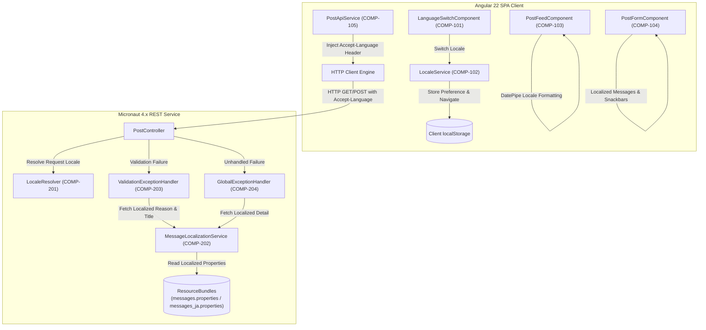
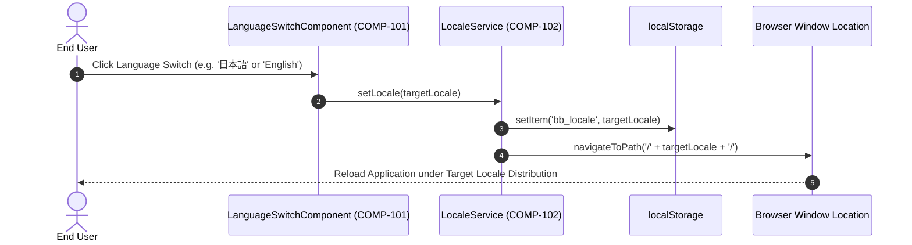
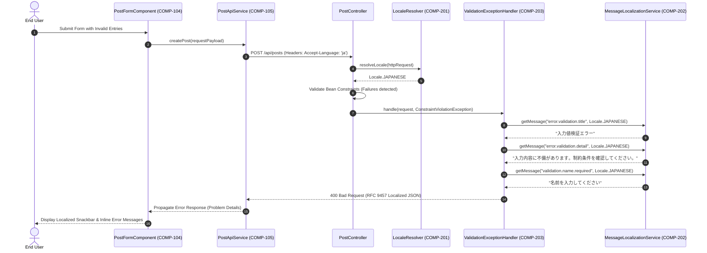

# Architecture & Component Design: Internationalization Support (i18n)

This document specifies the software architecture, component contracts (Design by Contract), data models, and protocols for internationalization (i18n) support across the Angular frontend and Micronaut backend of the bulletin board application.

---

## 1. Component Boundaries & Scope Overview

### 1.1 Architecture & Component Map
The internationalization architecture coordinates client-side locale detection and UI bundle navigation with server-side `Accept-Language` HTTP content negotiation. The frontend utilizes Angular official `@angular/localize` AOT-compiled distribution packages (`/en/` and `/ja/`), while the backend dynamically evaluates client language preferences against localized resource bundles to produce RFC 9457 Problem Details envelopes.



### 1.2 Component Inventory

| Component ID | Component / Module | Scope / Boundary | Linked Requirements | Description |
| :--- | :--- | :--- | :--- | :--- |
| **COMP-101** | `LanguageSwitchComponent` | Frontend Toolbar UI | `REQ-001`, `REQ-003` | Renders a button toggle or menu in the primary toolbar allowing users to explicitly select English (`EN`) or Japanese (`JA`). |
| **COMP-102** | `LocaleService` | Frontend Core Service | `REQ-002`, `REQ-004`, `REQ-005`, `REQ-006` | Manages active locale state, resolves initial locale from `localStorage` or `navigator.language`, and handles URL navigation to `/en/` or `/ja/`. |
| **COMP-103** | `PostFeedComponent` | Frontend Feed View | `REQ-001`, `REQ-006`, `REQ-007`, `REQ-011` | Presents feed list with localized empty-feed states, localized error retry banners, and locale-formatted `DatePipe` timestamps (`yyyy/MM/dd HH:mm:ss` vs `MMM d, y, h:mm:ss a`). |
| **COMP-104** | `PostFormComponent` | Frontend Form View | `REQ-001`, `REQ-008`, `REQ-011` | Renders form controls, inline validation errors, action buttons, and operation snackbars using localized translation IDs. |
| **COMP-105** | `PostApiService` | Frontend Data Adapter | `REQ-009` | Injects the active locale as the `Accept-Language` HTTP header into all outgoing REST API requests. |
| **COMP-201** | `LocaleResolver` | Backend Core Adapter | `REQ-002`, `REQ-009`, `REQ-010` | Parses the `Accept-Language` header from incoming HTTP requests, matching `ja` or defaulting to English (`Locale.ENGLISH`). |
| **COMP-202** | `MessageLocalizationService` | Backend Domain Core | `REQ-001`, `REQ-009`, `REQ-010` | Wraps Micronaut `MessageSource` to resolve localized validation messages, problem titles, and details for a given `Locale`. |
| **COMP-203** | `ValidationExceptionHandler` | Backend Error Adapter | `REQ-008`, `REQ-009`, `REQ-010` | Intercepts `ConstraintViolationException` and generates RFC 9457 Problem Details with localized titles, details, and parameter reasons. |
| **COMP-204** | `GlobalExceptionHandler` | Backend Error Adapter | `REQ-008`, `REQ-009`, `REQ-010` | Intercepts unhandled `Throwable` instances and produces localized 500 Internal Server Error Problem Details envelopes. |

---

## 2. Interaction Modeling

### 2.1 Locale Selection & Navigation Flow



### 2.2 Localized Post Submission & Validation Error Flow



---

## 3. Data Models & Schema Constraints

### 3.1 `LocalePreferenceModel` (Client Storage Payload)
- **Target**: Browser `localStorage` key `bb_locale`
- **Format**: Plain string token

| Field Name | Type | Required / Optional | Constraints | Description |
| :--- | :--- | :--- | :--- | :--- |
| `bb_locale` | `string` | Optional | `enum: ["en", "ja"]` | Persisted client language choice. |

### 3.2 `ProblemDetailsModel` (RFC 9457 HTTP Error Response)
- **Format**: JSON Schema / `application/problem+json`

| Field Name | Type | Required / Optional | Constraints | Description |
| :--- | :--- | :--- | :--- | :--- |
| `type` | `string` | Required | `format: "uri"` | Absolute URI identifying problem type. |
| `title` | `string` | Required | `minLength: 1` | Short, human-readable summary localized in target locale. |
| `status` | `integer` | Required | `minimum: 400`, `maximum: 599` | HTTP status code. |
| `detail` | `string` | Required | `minLength: 1` | Human-readable explanation localized in target locale. |
| `instance` | `string` | Required | `minLength: 1` | URI reference of the target resource endpoint. |
| `invalid_params` | `array<object>` | Required | `minItems: 0 (guaranteed [] on empty)` | List of invalid parameters (never omitted or null). |
| `invalid_params[].name` | `string` | Required | `minLength: 1` | Field or property path violating constraint. |
| `invalid_params[].reason`| `string` | Required | `minLength: 1` | Localized explanation of the constraint failure. |

### 3.3 Message Resource Bundle Key Hierarchy
The backend and frontend standardize on identical semantic property keys across English and Japanese resource files:

| Message Key | English Text (`messages.properties` / XLIFF) | Japanese Text (`messages_ja.properties` / XLIFF) |
| :--- | :--- | :--- |
| `error.validation.title` | Validation Failed | 入力値検証エラー |
| `error.validation.detail` | Input payload failed validation constraints. | 入力内容に不備があります。制約条件を確認してください。 |
| `error.internal.title` | Internal Server Error | サーバー内部エラー |
| `error.internal.detail` | An unexpected error occurred while processing the request. | リクエストの処理中に予期せぬエラーが発生しました。 |
| `error.invalid_arg.title`| Invalid Argument | 不正な引数 |
| `validation.name.required` | Name must not be blank | 名前を入力してください |
| `validation.name.size` | Name must be between 1 and 50 characters | 名前は1〜50文字以内で入力してください |
| `validation.email.format` | Email must be a well-formed email address | 有効なメールアドレス形式で入力してください |
| `validation.email.size` | Email must not exceed 254 characters | メールアドレスは254文字以内で入力してください |
| `validation.title.required`| Title must not be blank | タイトルを入力してください |
| `validation.title.size` | Title must be between 1 and 100 characters | タイトルは1〜100文字以内で入力してください |
| `validation.message.required`| Message must not be blank | メッセージ本文を入力してください |
| `validation.message.size` | Message must be between 1 and 4000 characters | メッセージ本文は1〜4,000文字以内で入力してください |

---

## 4. Input / Output Protocols

### 4.1 HTTP Content Negotiation Protocol
- **Request Header (`Accept-Language`)**:
  - Sent by `PostApiService` (COMP-105) on all HTTP operations (`GET /api/posts`, `POST /api/posts`).
  - Examples: `Accept-Language: ja`, `Accept-Language: en`, `Accept-Language: ja,en-US;q=0.9,en;q=0.8`.
- **Response Header (`Content-Language`)**:
  - Returned on localized responses matching the resolved locale (`Content-Language: ja` or `Content-Language: en`).
- **Resolution Strategy**:
  1. Inspect primary tag in `Accept-Language` header.
  2. If tag starts with `ja`, resolve to `Locale.JAPANESE`.
  3. If tag starts with `en`, resolve to `Locale.ENGLISH`.
  4. For any missing header, wildcard (`*`), or unsupported language, resolve to canonical default `Locale.ENGLISH`.

### 4.2 Frontend Distribution & Base Href Protocol
- **Build Output Structure**:
  - English distribution: `/dist/frontend/browser/en/` (Base Href: `/en/` or `/` with rewrite).
  - Japanese distribution: `/dist/frontend/browser/ja/` (Base Href: `/ja/`).
- **Initial Bootstrap Routing Logic**:
  - Accessing root `/` invokes lightweight bootstrap router:
    - If `localStorage.getItem('bb_locale') === 'ja'`, redirect to `/ja/`.
    - If `localStorage.getItem('bb_locale') === 'en'`, redirect to `/en/`.
    - If no preference exists and `navigator.language.startsWith('ja')`, redirect to `/ja/`.
    - Otherwise, redirect to `/en/`.

---

## 5. Component Contracts (Design by Contract - RFC 2119 / RFC 8174)

### 5.1 COMP-101: `LanguageSwitchComponent`
- **Role**: Presentation and trigger of language selection.
- **Public Signature**:
  ```typescript
  export class LanguageSwitchComponent {
    readonly currentLocale = signal<'en' | 'ja'>('en');
    switchLocale(target: 'en' | 'ja'): void;
  }
  ```
- **Preconditions**:
  - `target` MUST be either `'en'` or `'ja'`.
- **Postconditions**:
  - The component MUST invoke `LocaleService.setLocale(target)`.
  - The component MUST NOT directly modify `localStorage` or trigger window reloads bypassing `LocaleService`.
- **Invariants**:
  - `currentLocale()` MUST strictly reflect the active application distribution locale.

### 5.2 COMP-102: `LocaleService`
- **Role**: Management and persistence of application locale state and navigation.
- **Public Signature**:
  ```typescript
  @Injectable({ providedIn: 'root' })
  export class LocaleService {
    getActiveLocale(): 'en' | 'ja';
    getStoredLocale(): 'en' | 'ja' | null;
    resolveInitialLocale(): 'en' | 'ja';
    setLocale(locale: 'en' | 'ja'): void;
  }
  ```
- **Preconditions**:
  - `setLocale` parameter MUST match `^[a-z]{2}$` and be supported (`'en'` or `'ja'`).
- **Postconditions**:
  - `setLocale` MUST persist `locale` into `localStorage` under key `bb_locale`.
  - If `locale` differs from `getActiveLocale()`, `setLocale` MUST navigate browser location to `'/' + locale + '/'`.
  - On empty or unreadable storage, `resolveInitialLocale` MUST evaluate `navigator.language` and return `'ja'` if prefixed with `'ja'`, otherwise return `'en'`.
- **Invariants**:
  - All returned locale codes MUST be non-null and belong to `['en', 'ja']`.

### 5.3 COMP-103: `PostFeedComponent`
- **Role**: Render feed of post cards with locale-specific formatting and text.
- **Public Signature**:
  ```typescript
  export class PostFeedComponent implements OnInit {
    readonly posts = signal<PostResponse[]>([]);
    readonly totalItems = signal<number>(0);
    readonly pageIndex = signal<number>(0);
    readonly isLoading = signal<boolean>(false);
    readonly errorMessage = signal<string | null>(null);
    loadPage(page: number): void;
    refresh(): void;
  }
  ```
- **Preconditions**:
  - `loadPage` parameter MUST be a non-negative integer (`page >= 0`).
- **Postconditions**:
  - Creation timestamp MUST be formatted with `DatePipe` using `yyyy/MM/dd HH:mm:ss` under Japanese locale and `MMM d, y, h:mm:ss a` under English locale.
  - On 0 posts, it MUST render the localized empty-feed placeholder without runtime errors.
- **Invariants**:
  - User post contents (`name`, `title`, `message`) MUST NOT be altered or machine-translated.

### 5.4 COMP-104: `PostFormComponent`
- **Role**: Collect user post input with localized field labels, errors, and notifications.
- **Public Signature**:
  ```typescript
  export class PostFormComponent {
    readonly postForm: FormGroup;
    readonly isSubmitting = signal<boolean>(false);
    readonly postCreated = new EventEmitter<PostResponse>();
    onSubmit(): void;
    resetForm(): void;
  }
  ```
- **Preconditions**:
  - Form controls MUST adhere to length constraints: `name` (1-50), `email` (<=254), `title` (1-100), `message` (1-4000).
- **Postconditions**:
  - On client validation failure, error text under each touched control MUST display in the active UI locale.
  - On API submission failure with RFC 9457 error details, snackbar notification MUST display the localized `detail` message.
- **Invariants**:
  - Form submission MUST remain idempotent while `isSubmitting()` is `true`.

### 5.5 COMP-105: `PostApiService`
- **Role**: HTTP communication with backend attaching language preference.
- **Public Signature**:
  ```typescript
  @Injectable({ providedIn: 'root' })
  export class PostApiService {
    getPosts(page?: number, size?: number): Observable<PagedPostResponse>;
    createPost(request: CreatePostRequest): Observable<PostResponse>;
  }
  ```
- **Preconditions**:
  - Request arguments MUST be valid per existing DTO contracts.
- **Postconditions**:
  - All HTTP requests MUST include the header `Accept-Language: {locale}` matching `LocaleService.getActiveLocale()`.
  - On receiving RFC 9457 Problem Details error responses, it MUST safely re-throw structured `HttpErrorResponse`.
- **Invariants**:
  - Outgoing HTTP calls MUST NOT drop or corrupt multi-byte UTF-8 characters.

### 5.6 COMP-201: `LocaleResolver`
- **Role**: Parse incoming HTTP `Accept-Language` headers and resolve target `Locale`.
- **Public Signature**:
  ```java
  public interface LocaleResolver {
      Locale resolveLocale(HttpRequest<?> request);
  }
  ```
- **Preconditions**:
  - `request` MUST NOT be null.
- **Postconditions**:
  - If `Accept-Language` header matches `ja*` (case-insensitive), it MUST return `Locale.JAPANESE`.
  - If `Accept-Language` header matches `en*` (case-insensitive), it MUST return `Locale.ENGLISH`.
  - If header is absent, empty, or unresolvable, it MUST return default `Locale.ENGLISH`.
- **Invariants**:
  - Return value MUST NEVER be null.

### 5.7 COMP-202: `MessageLocalizationService`
- **Role**: Fetch localized message strings from resource bundles.
- **Public Signature**:
  ```java
  public interface MessageLocalizationService {
      String getMessage(String code, Locale locale);
      String getMessage(String code, Locale locale, Object... args);
      String getMessageOrDefault(String code, Locale locale, String defaultMessage, Object... args);
  }
  ```
- **Preconditions**:
  - `code` MUST NOT be null or blank.
  - `locale` MUST NOT be null.
- **Postconditions**:
  - If `code` exists in bundle for `locale`, it MUST return interpolated string.
  - If `code` is missing from target locale, it MUST attempt fallback to English bundle (`messages.properties`).
  - If `code` is completely missing from all bundles, it MUST return `defaultMessage` or `{code}`.
- **Invariants**:
  - Method execution MUST NOT throw unhandled exceptions on missing keys.

### 5.8 COMP-203: `ValidationExceptionHandler`
- **Role**: Translate validation exceptions to localized RFC 9457 responses.
- **Public Signature**:
  ```java
  public class ValidationExceptionHandler implements ExceptionHandler<ConstraintViolationException, HttpResponse<ProblemDetails>> {
      public HttpResponse<ProblemDetails> handle(HttpRequest request, ConstraintViolationException exception);
  }
  ```
- **Preconditions**:
  - `request` and `exception` MUST NOT be null.
- **Postconditions**:
  - Returned HTTP status MUST be `400 Bad Request`.
  - Returned body `ProblemDetails.title()` and `detail()` MUST be localized per `LocaleResolver.resolveLocale(request)`.
  - `ProblemDetails.invalidParams()` MUST be a non-null, guaranteed empty array `[]` if no violations, or populated with localized `reason` strings.
- **Invariants**:
  - The component MUST NOT leak internal class names, stack traces, or SQL queries.

### 5.9 COMP-204: `GlobalExceptionHandler`
- **Role**: Translate unexpected exceptions to localized 500 responses.
- **Public Signature**:
  ```java
  public class GlobalExceptionHandler implements ExceptionHandler<Throwable, HttpResponse<ProblemDetails>> {
      public HttpResponse<ProblemDetails> handle(HttpRequest request, Throwable exception);
  }
  ```
- **Preconditions**:
  - `request` and `exception` MUST NOT be null.
- **Postconditions**:
  - Returned HTTP status MUST be `500 Internal Server Error`.
  - `ProblemDetails.title()` and `detail()` MUST be localized per resolved request locale.
  - `ProblemDetails.invalidParams()` MUST be guaranteed non-null empty array `[]`.
- **Invariants**:
  - System stack trace MUST NOT be leaked in the error envelope.

---

## 6. Error & Exception Handling (RFC 9457 Envelopes)

### 6.1 English Localized RFC 9457 Validation Envelope (`Accept-Language: en`)
```json
{
  "type": "https://example.com/errors/validation-failed",
  "title": "Validation Failed",
  "status": 400,
  "detail": "Input payload failed validation constraints.",
  "instance": "/api/posts",
  "invalid_params": [
    {
      "name": "name",
      "reason": "Name must not be blank"
    }
  ]
}
```

### 6.2 Japanese Localized RFC 9457 Validation Envelope (`Accept-Language: ja`)
```json
{
  "type": "https://example.com/errors/validation-failed",
  "title": "入力値検証エラー",
  "status": 400,
  "detail": "入力内容に不備があります。制約条件を確認してください。",
  "instance": "/api/posts",
  "invalid_params": [
    {
      "name": "name",
      "reason": "名前を入力してください"
    }
  ]
}
```

---

## 7. Key Design Decisions & Architectural Trade-offs

- **Frontend Internationalization (i18n) Architecture & Compilation Strategy**:
  - **Selected Approach**: Angular official `@angular/localize` utilizing build-time XLIFF (`messages.ja.xlf`) inlining with locale-prefixed routing and distribution directories (`/en/` and `/ja/`).
  - **Alternative Considered**: Runtime dynamic JSON dictionary translation via third-party libraries (e.g. Transloco or `@ngx-translate/core`) loaded dynamically over HTTP.
  - **Rationale & Trade-off**: Ahead-of-time (AOT) compile-time translation inlining guarantees zero client-side translation overhead, eliminates network waterfall requests for translation JSON files, prevents Flash of Untranslated Content (FOUC), and natively leverages Angular's localized pipes (`DatePipe`, `CurrencyPipe`, `DecimalPipe`) with official locale data (`@angular/common/locales/ja`). The accepted trade-off is that changing locales requires a full page navigation/reload to swap the static bundle distribution (`/en/` vs. `/ja/`) rather than an in-memory string replacement. However, because language changes are infrequent operational events and static bundles are aggressively cached by browsers, the sub-300ms transition requirement (NFR-PERF-001) is easily met, making stability, type safety, and official ecosystem support the superior trade-off.

- **Backend Error Localization & RFC 9457 Content Negotiation**:
  - **Selected Approach**: Server-side `Accept-Language` HTTP header negotiation utilizing Micronaut's built-in `MessageSource` / `ResourceBundleMessageSource` to produce localized RFC 9457 Problem Details (`application/problem+json`) with canonical English (`Locale.ENGLISH`) fallback.
  - **Alternative Considered**: Language-agnostic error codes (e.g. `{ "code": "POST_TITLE_REQUIRED" }`) with client-side translation dictionary lookup and error message mapping.
  - **Rationale & Trade-off**: Centralizes error translation logic, business validation constraints, and message parameter interpolation within the backend. This guarantees uniform, localized error feedback across all current and future API consumers (Angular web app, automated integration tests, curl, third-party CLI tools) without duplicating message dictionaries across client platforms. It strictly adheres to HTTP standards (`Accept-Language` and RFC 9457). The accepted trade-off is that the backend must maintain localized resource bundles (`messages_ja.properties`, `messages_en.properties`) and execute locale resolution per request, and the frontend accepts backend-authored detail text rather than exercising full UI-level formatting discretion over error copy.

- **Locale Persistence & Initial Discovery Strategy**:
  - **Selected Approach**: Client-side `localStorage` (`bb_locale`) paired with browser language sniffing (`navigator.language` / `navigator.languages`) for initial detection, strictly defaulting to English (`en`) for unsupported locales.
  - **Alternative Considered**: Server-side session state, HTTP cookies, or user profile database records for storing language preferences.
  - **Rationale & Trade-off**: The bulletin board application operates as an unauthenticated, stateless public application with no user accounts, database profile entities, or server-side HTTP sessions (as defined in the specification out-of-scope boundaries). Client-side `localStorage` provides zero-latency, synchronous retrieval on application initialization, introduces zero database or server memory overhead, and respects privacy by avoiding tracking cookies and consent requirements. Browser sniffing seamlessly onboards first-time visitors in their preferred language (satisfying REQ-006). The accepted trade-off is that preferences are tied to the client browser instance and do not synchronize across different devices or survive local storage clearance.
