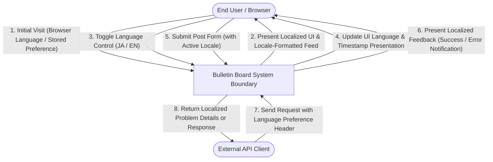

# Requirements Specification: Internationalization Support (i18n)

This document defines the functional and non-functional requirements for the internationalization (i18n) of the bulletin board application, enabling seamless bilingual support for both Japanese (`ja`) and English (`en`) users across all user-facing interfaces and system messages.

---

## 1. Context & Motivation

### 1.1 Problem Statement
The current bulletin board application displays all static user interface (UI) elements, form labels, and operational messages exclusively in Japanese, rendering the application inaccessible to non-Japanese-speaking users. Furthermore, backend API validation and problem details responses are presented with fixed messages that do not adapt to client language preferences. To expand usability and establish a cohesive, internationalized experience, the application requires comprehensive bilingual support spanning UI presentation, client error feedback, and locale-sensitive formatting.

### 1.2 Business & Technical Goals
- **Bilingual Accessibility**: Enable full application usability in both Japanese (`ja`) and English (`en`), with English established as the authoritative default locale.
- **Client-Driven Locale Adaptation**: Support dynamic user language selection from the UI as well as automatic locale negotiation via client request preferences.
- **Locale-Aware Data Presentation**: Present temporal metadata (e.g. post creation timestamps) conforming to the selected locale's cultural formatting conventions.
- **Defensive Error Localization**: Provide validation error details and operational notifications translated into the client's requested language, with graceful fallback to the default locale for unsupported languages.
- **Content Authenticity Preservation**: Ensure user-generated post content (author names, titles, message bodies) remains strictly authentic in its original input form without automated alteration or machine translation.

### 1.3 Target Personas & Stakeholders
- **English-Speaking End User**: Navigates the feed, reads timestamps in Western format, submits posts, and receives validation feedback entirely in English.
- **Japanese-Speaking End User**: Navigates the feed, reads timestamps in Japanese standard format, submits posts, and receives validation feedback entirely in Japanese.
- **API Client / External Consumer**: Submits HTTP requests with language preference indicators and receives structured error feedback localized accordingly.

---

## 2. User Scenarios & Use Cases

### 2.1 Use Case 1: Manual Language Selection & Switching
- **Actor**: End User (English or Japanese speaker)
- **Preconditions**: The bulletin board application is loaded in the browser.
- **Trigger**: The user activates the language selection control in the application toolbar.
- **Basic Flow**:
  1. The user selects an alternate language (`English` or `日本語`) from the toolbar control.
  2. The system persists the newly chosen language preference in local storage.
  3. The system immediately updates the interface, rendering all navigation titles, form labels, placeholders, buttons, empty-feed placeholders, and paginator controls in the selected language.
  4. The system updates all displayed post timestamps to match the formatting conventions of the selected locale.
- **Alternative Flows**:
  - The user selects the language that is already active: The system makes no alterations and maintains current state.
- **Postconditions**: The UI displays in the selected language, and the preference remains saved across subsequent visits.

### 2.2 Use Case 2: Initial Access & Automatic Language Detection
- **Actor**: First-time End User
- **Preconditions**: The user has never set a language preference on this device/browser (no local storage preference exists).
- **Trigger**: The user accesses the application for the first time.
- **Basic Flow**:
  1. The system inspects the user's browser language preferences.
  2. If the user's primary browser language indicates Japanese (`ja`), the system initializes the UI in Japanese.
  3. If the user's primary browser language indicates English or any other language, the system initializes the UI in the default language (English).
  4. The system renders the UI and post timestamps according to the resolved locale.
- **Postconditions**: The resolved locale is active and ready for user interaction.

### 2.3 Use Case 3: Multilingual Form Submission & Validation Feedback
- **Actor**: End User submitting a post
- **Preconditions**: The application is displayed in the user's active locale.
- **Trigger**: The user attempts to submit a post form containing invalid or incomplete entries.
- **Basic Flow**:
  1. The user fills in form fields with invalid data (e.g. blank required fields or exceeding maximum length) and attempts submission.
  2. The system detects the invalid entries and displays inline validation error messages in the active locale.
  3. When an operation-level error or API problem occurs, the system displays a feedback notification (toast / snackbar) in the active locale.
- **Alternative Flows**:
  - The user fills in valid data and submits successfully: The system displays a success confirmation notification in the active locale and resets the form.
- **Postconditions**: The user receives actionable feedback entirely in their active language without unlocalized system error leakage.

---

## 3. Visual Modeling

The following diagram illustrates external actor interactions across the system boundary for locale selection, post viewing, and submission feedback:

---

## 4. Functional Requirements

All functional requirements are defined using standard EARS patterns and uppercase RFC 2119 / RFC 8174 keywords.

| Requirement ID | EARS Pattern Type | Specification Statement (RFC 2119 / 8174) | Verification Method |
| :--- | :--- | :--- | :--- |
| **REQ-001** | Ubiquitous | The system MUST support both English (`en`) and Japanese (`ja`) languages across all static user interface elements, operational messages, and system notifications. | Automated Test |
| **REQ-002** | Ubiquitous | The system MUST designate English (`en`) as the canonical default language across all application interfaces and error feedback mechanisms. | Automated Test |
| **REQ-003** | Event-driven | When a user changes the active language via the toolbar language control, the system MUST immediately present all static interface text, labels, hints, error texts, and buttons in the selected language. | Scenario Test |
| **REQ-004** | Event-driven | When a user selects a language preference via the toolbar language control, the system MUST persist the selected locale in browser client storage. | Automated Test |
| **REQ-005** | Complex | While an explicit language preference exists in client storage, when a user accesses the application, the system MUST restore and initialize the UI in the stored language preference. | Automated Test |
| **REQ-006** | Complex | While no explicit language preference exists in client storage, when a user accesses the application, the system MUST detect the primary browser language, initializing the UI in Japanese (`ja`) when the primary browser language tag begins with `ja`, and initializing the UI in English (`en`) when the primary browser language tag does not begin with `ja`. | Automated Test |
| **REQ-007** | Complex | While displaying posts in the feed, when presenting creation timestamps, the system MUST format the date and time using the pattern `yyyy/MM/dd HH:mm:ss` for the Japanese locale (`ja`) and using the pattern `MMM d, y, h:mm:ss a` for the English locale (`en`). | Integration Test |
| **REQ-008** | Event-driven | When an input validation failure occurs during post submission, the system MUST present inline validation error messages and toast notifications localized in the active language. | Integration Test |
| **REQ-009** | Event-driven | When an API client submits a request with a language preference indicator, the system MUST evaluate the requested locale and return error responses (titles, details, and parameter reasons) localized in that language. | Automated Test |
| **REQ-010** | Unwanted Behavior | If an API client requests an unsupported language or omits the language preference indicator, then the system MUST fallback to English for error responses and MUST NOT return missing or unformatted message strings. | Automated Test |
| **REQ-011** | Ubiquitous | The system MUST present user-contributed post content (contributor name, message title, and message body) strictly in its original input form and MUST NOT apply automated translation or text alteration. | Automated Test |

---

## 5. Non-Functional Requirements

- **NFR-PERF-001 (Language Switch Responsiveness)**: The system MUST complete language switching operations within 300 milliseconds without degrading UI responsiveness.
- **NFR-USAB-001 (Visibility & Ergonomics)**: The language selection control MUST remain persistently accessible within the primary application header across all viewports.
- **NFR-ACC-001 (Accessibility Standards)**: All localized interface elements, form controls, and error banners MUST include appropriate accessible labels (`aria-label`, `aria-live`, `role="alert"`) localized in the corresponding language.
- **NFR-COMP-001 (Cross-Browser Date Formatting)**: Timestamp formatting MUST function consistently across all supported modern browsers (Chromium, Firefox, WebKit) without client runtime exceptions.
- **NFR-REL-001 (Fail-Safe Locale Fallback)**: If a localization resource is missing or encounters a parsing error, the system MUST fail safely (Fail-Closed) by displaying the canonical English default text rather than throwing an unhandled exception or displaying an empty string.

---

## 6. Out of Scope

The following items are explicitly excluded from this specification:
- **User Content Machine Translation**: Automated machine translation (e.g. Google Translate or AI translation) of user-contributed message titles, names, and body text is out of scope; user posts remain in the original author language.
- **Third-Language Expansion**: Supporting languages beyond Japanese (`ja`) and English (`en`) (e.g. Chinese, Spanish, French, German) is deferred to future milestones.
- **User Account Language Profiling**: Persisting language preferences in a remote database user profile (as the application does not have user authentication or account management) is out of scope; client-side storage is used exclusively.
